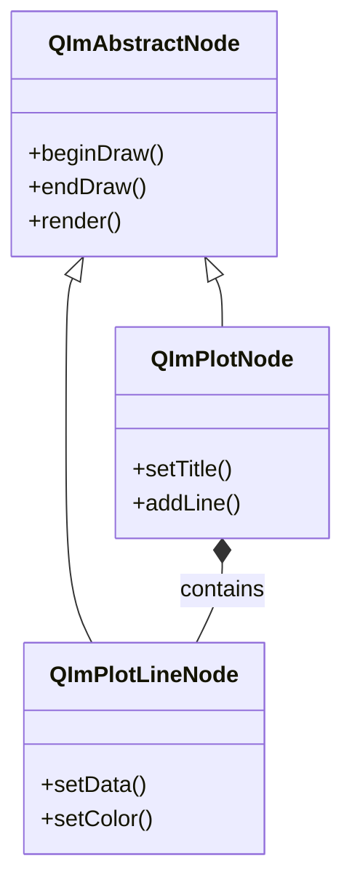
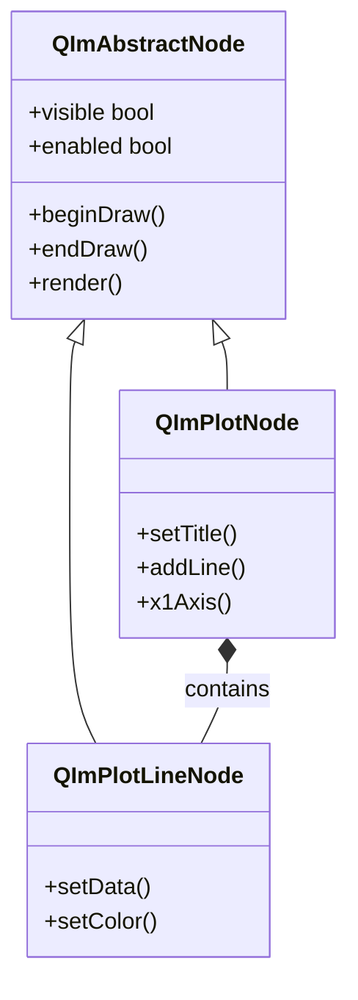
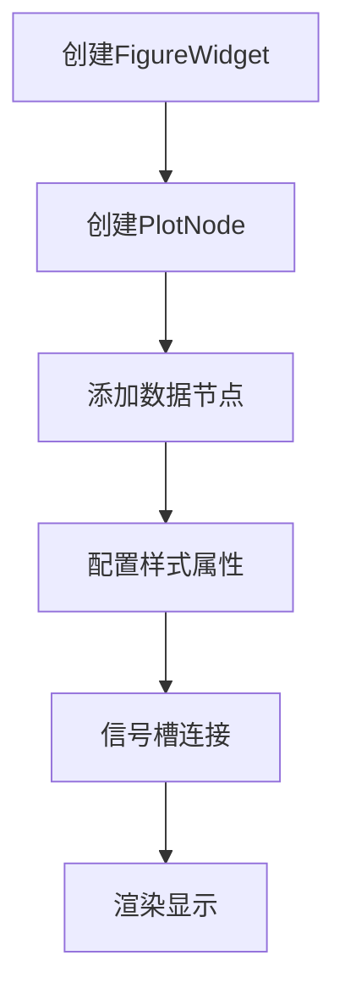
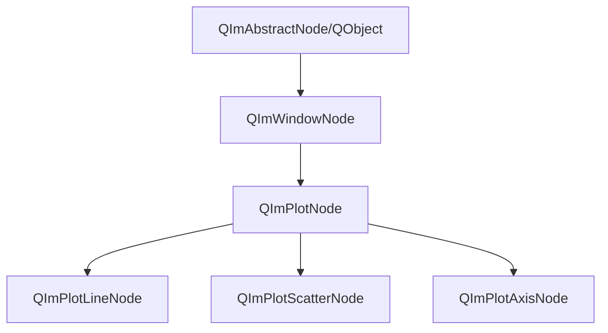
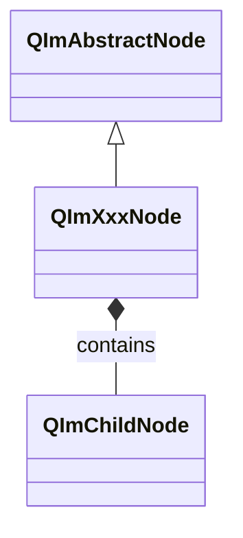
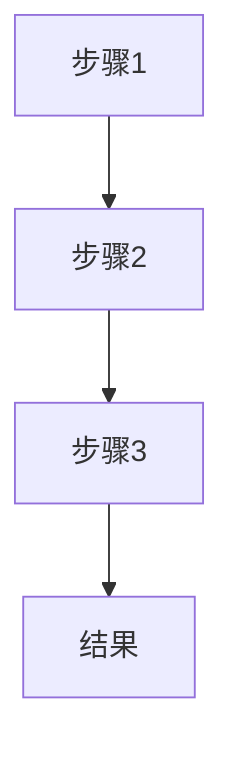
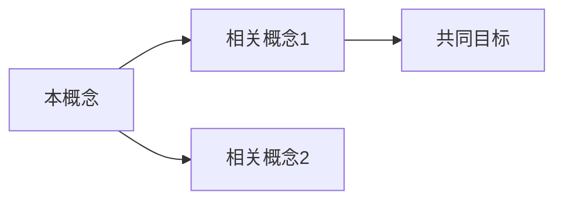

# QIm 中文文档撰写规范

本规范用于指导 QIm 中文文档的撰写，确保文档风格统一、内容完整、易于理解。

本项目文档由mkdocs组织，使用[mkdocs-material](https://squidfunk.github.io/mkdocs-material/)主题，
支持中英双语（通过i18n插件）。撰写过程中可使用material相关语法。

项目文档绘图优先使用`mermaid`。

## 文档结构

### 1. 标题层级

```markdown
# 类名/功能名称
## 主要功能特性
## 使用方法
### 子功能模块
#### 具体功能点
## 注意事项
## 参考资料
```

### 2. 必备章节

每个功能文档必须包含以下章节：

| 章节 | 必备程度 | 说明 |
|------|----------|------|
| 功能概述 | 必备 | 开头一句话说明类的用途和特点 |
| 主要功能特性 | 必备 | 列举核心功能，使用 ✅ 标记 |
| 使用方法 | 必备 | 详细的使用步骤和代码示例 |
| 注意事项 | 推荐 | 使用 !!! 格式标注重要信息 |
| 参考资料 | 可选 | 相关文档、示例路径链接 |

## 内容撰写原则

### 1. 文字说明要求

- **每个代码块前后必须有文字说明**：解释代码的作用、关键步骤、输出效果
- **避免纯代码堆砌**：代码不应占据文档主体，文字说明应占 60% 以上
- **逐步引导**：按照"是什么 → 为什么 → 怎么用"的逻辑顺序组织
- **QIm特有**：对于涉及对象树的代码，必须说明父子节点关系

### 2. 功能介绍格式

使用功能列表形式，每项功能前加 ✅ 标记：

```markdown
**特性**

- ✅ **功能名称**：简要说明
- ✅ **另一功能**：简要说明
```

### 3. 代码示例规范

代码示例必须包含：

1. **注释说明**：关键行必须有注释
2. **完整可运行**：示例代码应可直接运行（必要头文件包含）
3. **效果说明**：代码后说明运行效果，配合截图或示意图
4. **对象树说明**：涉及节点创建的代码需说明父节点关系

```cpp
// 创建绘图窗口作为根节点
QIM::QImFigureWidget* figure = new QIM::QImFigureWidget(this);
setCentralWidget(figure);  // figure作为MainWindow的子对象

// 创建绘图节点，以figure为父节点
QIM::QImPlotNode* plot = figure->createPlotNode();  // plot自动成为figure的子节点

// 添加曲线，以plot为父节点
auto line = plot->addLine(x, y, "曲线");  // line自动成为plot的子节点

// 效果：显示一条曲线，节点树结构为 MainWindow → figure → plot → line
```

### 4. 概念解释要求

对于复杂概念，使用以下方式辅助说明：

- **mermaid UML图**：展示类关系、继承结构
- **mermaid 流程图**：展示工作流程
- **mermaid 对象树图**：展示节点父子关系（QIm特有）
- **ASCII艺术图**：展示结构示意图
- **配图**：实际效果截图

示例（类关系图）：



### 5. 注意事项格式

使用 markdown 扩展语法标注重要信息：

```markdown
!!! warning "重要警告"
    可能导致严重问题的注意事项

!!! info "说明"
    补充说明信息

!!! tip "技巧"
    使用技巧和建议

!!! example "示例"
    示例代码路径：`examples/xxx`

!!! bug "已知问题"
    已知缺陷和规避方法
```

### 6. 属性/方法说明格式

表格形式展示核心属性和方法：

```markdown
### 核心方法

| 方法 | 参数 | 说明 |
|------|------|------|
| `addLine(x, y, label)` | x/y数据数组, 标签字符串 | 添加折线图数据系列 |
| `setTitle(title)` | QString | 设置图表标题 |
```

## 图表使用规范

### 1. mermaid 类图

用于展示类的继承关系、组合关系，**QIm文档必须展示节点类的继承结构**：



### 2. mermaid 流程图

用于展示使用流程、工作流程：



### 3. 对象树结构图

**QIm特有**：使用mermaid展示节点树结构：



或使用文本示意：

```text
QImFigureWidget (根节点)
├── QImPlotNode (子图1)
│   ├── QImPlotLineNode (曲线A)
│   ├── QImPlotLineNode (曲线B)
│   └── QImPlotAxisNode (Y轴)
└── QImPlotNode (子图2)
    └── QImPlotBarNode (柱状图)
```

### 4. 结构示意图

使用文本或 ASCII 艺术绘制结构示意：

```text
    │         ┌──┬──┐
    │         │  │  │ ← Q3
    │         │  ┼  │ ← 中位数
    │         │  │  │ ← Q1
    │    ─────┴──┴──┴─────
```

### 5. 效果截图

实际运行效果图片放在 `docs/assets/` 目录：

```markdown

```

对于效果截图的部分，应在前面文字描述见某个example中，例如：

```markdown
折线图的示例位于:`examples/plot/line`，示例截图如下：


```

## 文档风格统一

### 1. 语言风格

- 使用**中文为主**，技术术语可保留英文
- 避免口语化表达，使用正式书面语言
- 减少被动语态，多用主动语态："你可以设置..."而不是"可以设置..."

### 2. 术语规范

| 英文术语 | 中文翻译 | 说明 |
|----------|----------|------|
| Immediate Mode | 即时模式 | ImGui原生编程模型，每帧重建UI |
| Retained Mode | 保留模式 | QIm封装后的面向对象模型 |
| Node | 节点 | QIm中的UI组件基类 |
| Object Tree | 对象树 | Qt风格的父子节点管理机制 |
| Render Node | 渲染节点 | 可参与渲染的节点类型 |
| Plot | 绘图/图表 | ImPlot封装模块 |
| Subplot | 子图 | 多图布局中的单个图表 |
| Axis | 坐标轴 | X/Y轴配置 |
| Line Series | 线条/曲线 | 折线图数据系列 |
| Bar Series | 柱状图 | 条形图数据系列 |
| Scatter Series | 散点图 | 点状数据系列 |
| Downsampler | 降采样器 | LTTB算法数据压缩组件 |
| Figure | 绘图窗口 | QImFigureWidget的简称 |
| Signal/Slot | 信号/槽 | Qt事件通讯机制 |
| PIMPL | PIMPL模式 | Private Implementation模式 |

### 3. 代码风格

- 类名使用完整命名空间：`QIM::QImPlotNode`
- 方法名使用代码格式：`addLine()`
- 属性名使用代码格式：`visible`
- 枚举值使用完整路径：`QImWidget::RenderAdaptive`
- 节点创建代码需标注父节点关系注释

## 撰写流程建议

### 1. 单语文档（仅中文）撰写流程

1. **收集信息**：阅读类头文件、示例代码、相关文档
2. **确定结构**：按照必备章节规划文档框架
3. **编写内容**：
   - 先写功能概述和特性列表
   - 再写使用方法，每个代码块配合文字说明
   - 补充注意事项和参考资料
4. **添加图表**：绘制类图、流程图、对象树结构图
5. **审阅修订**：检查代码可运行性、文字通顺度、格式一致性

### 2. 双语文档撰写流程

QIm文档需同时提供中文（`docs/zh/`）和英文（`docs/en/`）版本，撰写流程如下：

**推荐流程：先中文后英文**

1. **完成中文版**：按单语文档流程完成中文文档
2. **翻译为英文**：
   - 保持相同的文档结构和章节顺序
   - 技术术语保持一致（Node、Plot、Axis等）
   - 代码示例完全相同，仅翻译注释和说明文字
3. **同步更新mkdocs.yml**：在i18n插件的nav配置中添加英文导航条目

**双语同步原则：**

| 内容 | 中文版 | 英文版 |
|------|--------|--------|
| 文档结构 | 完全一致 | 完全一致 |
| 代码示例 | 相同代码，中文注释 | 相同代码，英文注释 |
| 图片路径 | `../assets/...` | `../assets/...`（共享） |
| mermaid图 | 相同，中文标签 | 相同，英文标签 |
| 术语 | 中文翻译为主，关键术语可附英文 | 英文为主 |

**双语文档示例对比：**

中文版（`docs/zh/render-node.md`）：
```markdown
# 渲染节点

`QImAbstractNode` 是一个为 Dear ImGui 设计的 Qt 风格树形节点基类...
```

英文版（`docs/en/render-node.md`）：
```markdown
# Render Node

`QImAbstractNode` is a Qt-style tree node base class designed for Dear ImGui...
```

### 3. 文档命名规范

| 文档类型 | 中文路径 | 英文路径 |
|----------|----------|----------|
| 功能指南 | `docs/zh/feature-name.md` | `docs/en/feature-name.md` |
| 核心概念 | `docs/zh/concept-name.md` | `docs/en/concept-name.md` |
| 元文档 | `docs/doc-writing-guide.md` | （无，规范本身不翻译） |

!!! tip "建议"
    使用英文文件名便于双语对应，如`render-node.md`而非`渲染节点.md`

## 文档模板

### 1. 功能组件文档模板

```markdown
# 功能名称使用指南

一句话概述该组件的用途和特点。

## 主要功能特性

**特性**

- ✅ **功能1**：说明
- ✅ **功能2**：说明

## 基本概念

### 组件定位

[说明该组件在对象树中的位置和作用]

### 类继承关系



## 使用方法

[如果有对应的示例，可加入此内容]该组件的示例位于:`examples/xxx`，示例截图如下：


### 1. 基本使用

[文字说明用途和场景]

```cpp
// 创建父节点
QIM::QImPlotNode* plot = ...;  // 父节点

// 创建当前组件，指定父节点
QIM::QImXxxNode* node = new QIM::QImXxxNode(plot);  // 自动成为plot的子节点
node->setSomeProperty(value);

// 效果说明
```

### 2. 进阶配置

[文字说明配置选项的作用]

| 属性/方法 | 参数类型 | 说明 |
|-----------|----------|------|
| `setXxx()` | 类型 | 设置说明 |
| `xxx()` | - | 获取说明 |

```cpp
[配置代码示例]
```

!!! warning "注意事项"
    重要提示信息

## 信号槽连接

[说明该组件提供的信号及典型连接方式]

| 信号 | 参数 | 触发时机 |
|------|------|----------|
| `xxxChanged()` | 类型 | 属性变更时 |

```cpp
// 典型信号槽连接示例
connect(node, &QIM::QImXxxNode::xxxChanged, 
        this, &MyClass::onXxxChanged);
```

## 参考

- 相关文档：[链接]
- 示例代码：`examples/xxx`
```

### 2. 核心概念文档模板

```markdown
# 概念名称

一句话概述该概念的核心含义。

## 为什么需要这个概念

[解释问题背景和设计动机]

## 核心原理

### 设计思想

[阐述设计理念和实现思路]

### 工作流程



## 如何应用

### 在QIm中的应用

[说明该概念在QIm中的具体体现]

```cpp
[代码示例]
```

### 与相关概念的关系



!!! tip "最佳实践"
    使用建议

## 扩展阅读

- [相关文档链接]
```

## 文档审查清单

在提交文档前，请对照以下清单检查：

### 内容完整性
- [ ] 功能概述：一句话说明组件用途
- [ ] 特性列表：使用 ✅ 标记列举核心功能
- [ ] 类继承关系图：mermaid展示继承结构
- [ ] 对象树结构图：说明节点父子关系（如适用）
- [ ] 使用方法：包含完整可运行的代码示例
- [ ] 信号槽说明：列出关键信号和典型连接方式（如适用）
- [ ] 注意事项：标注重要提示和已知限制

### 代码规范
- [ ] 头文件包含完整
- [ ] 关键行有注释说明
- [ ] 父节点关系有注释标注
- [ ] 代码可直接运行

### 图表规范
- [ ] mermaid类图展示继承关系
- [ ] 流程图展示使用流程（如适用）
- [ ] 截图路径正确，图片存在于assets目录

### 双语同步（如提供英文版）
- [ ] 文档结构一致
- [ ] 代码示例相同，注释翻译
- [ ] mkdocs.yml英文导航已更新

---

本规范适用于 QIm 所有中文及双语文档的撰写。