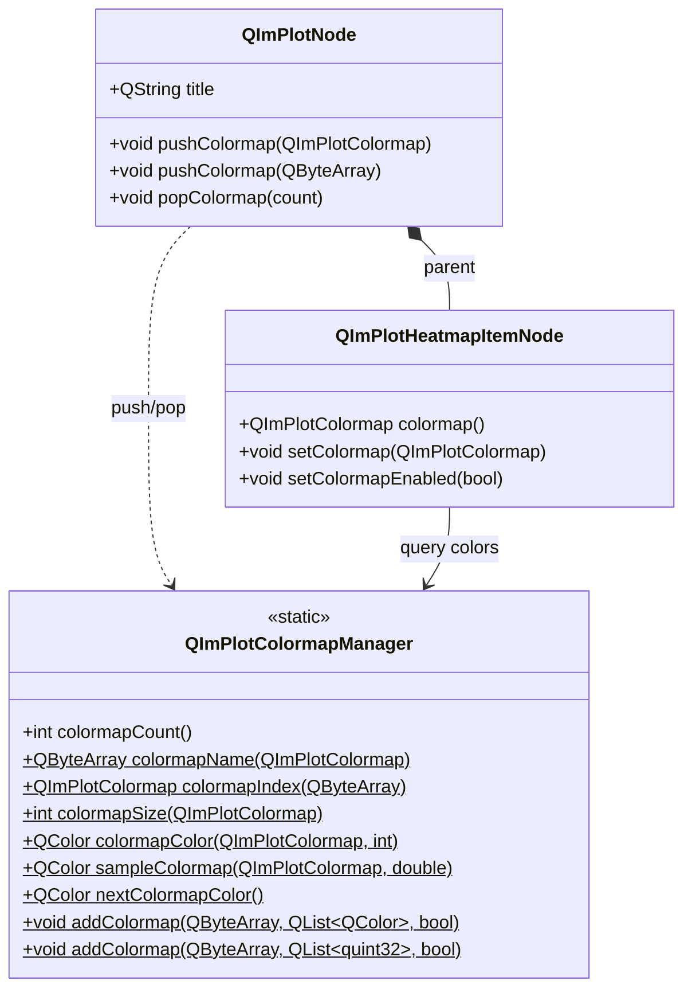

# 2D Colormap System

QIm's 2D colormap system consists of `QImPlotColormap` (enum) and `QImPlotColormapManager` (static utility class), combined with `QImPlotNode`'s push/pop stack operations for colormap switching. Colormaps are primarily used in 2D data visualization scenarios such as Heatmap and Histogram2D, mapping colors based on data values. The system provides 16 built-in colormaps covering continuous, qualitative, and divergent colormaps commonly used in scientific visualization, while also supporting custom colormap registration.

## Key Features

**Features**

- ✅ **16 Built-in Colormaps**: Deep, Dark, Pastel, Viridis, Plasma, Hot, Cool, Pink, Jet, Twilight, RdBu, BrBG, PiYG, Spectral, Greys, Paired
- ✅ **Three Colormap Categories**: Continuous (numerical gradient mapping), Divergent (bidirectional comparison), Qualitative (discrete category distinction)
- ✅ **Colormap Stack Management**: push/pop stack-based colormap switching for multiple plots sharing different colormaps
- ✅ **Colormap Querying**: look up enum by name, get name from enum, get colormap color count, get color by index
- ✅ **Colormap Sampling**: `sampleColormap()` continuously samples colormap colors in the 0.0~1.0 range
- ✅ **Auto Color Assignment**: `nextColormapColor()` gets the next auto-assigned colormap color
- ✅ **Custom Registration**: register custom colormaps via `addColormap()` (supports both QColor and quint32 formats)
- ✅ **Namespace Isolation**: 2D and 3D colormap systems use independent enums and managers, non-interfering

## Basic Concepts

### Component Relationship Overview



### Colormap Categories

QIm classifies the 16 built-in colormaps into three categories suitable for different data visualization scenarios:

| Category | Typical Colormaps | Suitable Scenarios | Characteristics |
|----------|-------------------|-------------------|-----------------|
| **Continuous** | Deep, Dark, Pastel, Viridis, Plasma, Hot, Cool, Pink, Jet, Greys | Numerical gradient mapping (Heatmap, Histogram2D) | Colors change continuously with value |
| **Divergent** | RdBu, BrBG, PiYG, Spectral | Bidirectional comparison (positive/negative differences, deviation from baseline) | Neutral color at midpoint, contrasting colors at both ends |
| **Qualitative** | Paired, Twilight | Discrete category distinction (multi-series auto coloring) | High contrast between adjacent colors, no strict value ordering |

### Relationship Between 2D and 3D Colormap Systems

The 2D colormap system (`QImPlotColormap` / `QImPlotColormapManager`) and the 3D colormap system (`QImPlot3DColormap` / `QImPlot3DColormapManager`) use **completely independent enums and managers**. Both share the same 16 colormap names and semantics, but the underlying implementations are separate — 2D colormap operations map to the ImPlot API, while 3D colormap operations map to the ImPlot3D API. When using them, select the enum and manager from the corresponding namespace.

!!! info "3D Colormap Reference"
    For 3D colormap system usage, please refer to [3D Configuration Guide — Colormap Section](plot3d/configuration.md#_10). The API design of both is highly consistent; once you learn 2D, you can seamlessly transition to 3D.

## Built-in Colormaps (QImPlotColormap)

### Colormap Enum and Description

| Enum Value | ImPlot Equivalent | Category | Color Characteristics | Suitable Scenarios |
|------------|-------------------|----------|----------------------|-------------------|
| `Deep` | `ImPlotColormap_Deep` | Continuous | Deep blue → light blue → yellow (default colormap) | General numerical mapping, clear visual hierarchy |
| `Dark` | `ImPlotColormap_Dark` | Continuous | Deep blue → purple → orange-yellow | Data visualization on dark backgrounds |
| `Pastel` | `ImPlotColormap_Pastel` | Continuous | Overall soft pastel gradient | Print-friendly, report illustrations |
| `Paired` | `ImPlotColormap_Paired` | Qualitative | 12 distinct paired colors | Multi-category data distinction, no order meaning |
| `Viridis` | `ImPlotColormap_Viridis` | Continuous | Blue-purple → green → yellow (perceptually uniform) | Recommended for scientific visualization, colorblind-friendly |
| `Plasma` | `ImPlotColormap_Plasma` | Continuous | Deep purple → pink → yellow (perceptually uniform) | High-contrast continuous data, colorblind-friendly |
| `Hot` | `ImPlotColormap_Hot` | Continuous | Black → red → orange → yellow → white | Heatmaps, temperature distribution, intensity display |
| `Cool` | `ImPlotColormap_Cool` | Continuous | Cyan → blue → purple cool gradient | Low temperature distribution, underwater data |
| `Pink` | `ImPlotColormap_Pink` | Continuous | Black → pink → white | Medical imaging, specific domains |
| `Jet` | `ImPlotColormap_Jet` | Continuous | Blue → cyan → green → yellow → red (rainbow) | Classic rainbow colormap, but perceptually non-uniform |
| `Twilight` | `ImPlotColormap_Twilight` | Qualitative/Cyclic | Blue → pink → orange → green (cyclic colormap) | Periodic data, angular data |
| `RdBu` | `ImPlotColormap_RdBu` | Divergent | Red → white → blue | Positive/negative differences, political maps, deviation analysis |
| `BrBG` | `ImPlotColormap_BrBG` | Divergent | Brown → white → blue-green | Geological data, income/expense comparison |
| `PiYG` | `ImPlotColormap_PiYG` | Divergent | Pink → white → yellow-green | Category comparison, gene expression |
| `Spectral` | `ImPlotColormap_Spectral` | Divergent | Red → orange → yellow → green → blue | Multi-level categorical data, spectral analysis |
| `Greys` | `ImPlotColormap_Greys` | Continuous | Black → gray → white | Grayscale printing, monochrome output |

!!! tip "Colormap Selection Advice"
    - **Scientific visualization**: Prefer `Viridis` or `Plasma` — they are perceptually uniform colormaps, colorblind-friendly, and won't lose information when printed in grayscale.
    - **Heatmaps/temperature maps**: Use `Hot` or `Cool`, which intuitively match people's perception of temperature.
    - **Comparative analysis**: Use `RdBu` (red-blue divergent), intuitively expressing positive/negative deviations.
    - **Avoid**: The `Jet` colormap, while colorful, has been widely criticized in scientific visualization — its non-uniform perceptual brightness can distort data interpretation.

### Colormap Category Comparison Table

| Property | Continuous | Divergent | Qualitative |
|----------|-----------|-----------|-------------|
| Color Transition | Smooth gradient | Midpoint → contrasting ends | No smooth transition |
| Numerical Meaning | Ordered (low → high) | Ordered (negative → zero → positive) | Unordered |
| Typical Length | Arbitrarily sampleable | Arbitrarily sampleable | Fixed color count |
| Color Vision Deficiency Friendly | Viridis/Plasma excellent | RdBu distinguishable via grayscale | Relies on brightness differences |
| Grayscale Printing | Preserves information (except Jet) | Midpoint distinguishable | May lose distinction |

## Usage

### 1. Basic Colormap Setup

Set a colormap for the current plot area via `QImPlotNode::pushColormap()`:

```cpp
#include "QImFigureWidget.h"
#include "plot/QImPlotNode.h"
#include "plot/QImPlotHeatmapItemNode.h"
#include "plot/QImPlot.h"

// Create plotting window
QIM::QImFigureWidget* figure = new QIM::QImFigureWidget(this);

// Create plot node
QIM::QImPlotNode* plot = figure->createPlotNode();
plot->setTitle("Heatmap - Viridis Colormap");

// Push Viridis colormap
plot->pushColormap(QIM::QImPlotColormap::Viridis);

// Create Heatmap plot item (uses current colormap)
auto* heatmap = new QIM::QImPlotHeatmapItemNode(plot);
heatmap->setData(data, rows, cols);
heatmap->setColormap(QIM::QImPlotColormap::Viridis);

// Pop colormap (restore default)
plot->popColormap(1);
```

### 2. Colormap Stack Management: push/pop

The push/pop stack mechanism allows multiple plot items to use different colormaps within the same ImPlot context:

```cpp
// Method 1: Push colormap by enum value
plot->pushColormap(QIM::QImPlotColormap::Hot);
// ... draw items using Hot colormap ...
plot->popColormap(1);  // Pop 1 layer

// Method 2: Push colormap by name
plot->pushColormap(QByteArray("Viridis"));
// ... draw items using Viridis colormap ...
plot->popColormap(1);  // Pop 1 layer

// Batch pop multiple layers
plot->pushColormap(QIM::QImPlotColormap::Hot);
plot->pushColormap(QIM::QImPlotColormap::Cool);
plot->pushColormap(QIM::QImPlotColormap::Viridis);
// ... top layer uses Viridis, middle uses Cool, bottom uses Hot ...
plot->popColormap(3);  // Pop 3 layers at once, restore to initial colormap
```

!!! warning "push/pop Must Be Paired"
    `pushColormap()` and `popColormap()` must be strictly paired. An unbalanced stack will cause subsequent renders to use the wrong colormap. Pushes take effect in `beginDraw()`, pops take effect in `endDraw()`.

### 3. Colormap Querying and Sampling

Query colormap information via `QImPlotColormapManager` static methods:

```cpp
#include "plot/QImPlotColormapManager.h"

// Get total available colormap count
int count = QIM::QImPlotColormapManager::colormapCount();

// Get colormap name (enum → name)
QByteArray name = QIM::QImPlotColormapManager::colormapName(
    QIM::QImPlotColormap::Viridis);  // Returns "Viridis"

// Look up colormap enum value by name (name → enum)
QIM::QImPlotColormap cmap = QIM::QImPlotColormapManager::colormapIndex(
    QByteArray("Viridis"));  // Returns QImPlotColormap::Viridis

// Get the number of colors in a colormap
int size = QIM::QImPlotColormapManager::colormapSize(
    QIM::QImPlotColormap::Viridis);

// Get colormap color by index (index starts from 0)
QColor firstColor = QIM::QImPlotColormapManager::colormapColor(
    QIM::QImPlotColormap::Viridis, 0);   // First color of Viridis
QColor midColor = QIM::QImPlotColormapManager::colormapColor(
    QIM::QImPlotColormap::Viridis, size / 2);  // Middle color of Viridis

// Continuously sample in the 0.0~1.0 range (t = 0.0 is start color, t = 1.0 is end color)
QColor sampled = QIM::QImPlotColormapManager::sampleColormap(
    QIM::QImPlotColormap::RdBu, 0.5);  // Middle color of RdBu (white)
QColor low = QIM::QImPlotColormapManager::sampleColormap(
    QIM::QImPlotColormap::RdBu, 0.0);  // Red (negative end)
QColor high = QIM::QImPlotColormapManager::sampleColormap(
    QIM::QImPlotColormap::RdBu, 1.0);  // Blue (positive end)
```

### 4. Auto Color Assignment

`nextColormapColor()` provides automatic color allocation for multi-series plotting:

```cpp
// Create multiple curves, each using a different auto-assigned color
for (int i = 0; i < numSeries; ++i) {
    QColor autoColor = QIM::QImPlotColormapManager::nextColormapColor();

    auto* line = new QIM::QImPlotLineItemNode(plot);
    line->setData(xSeries[i], ySeries[i]);
    line->setColor(autoColor);  // Auto-assigned colormap color
    line->setLabel(QString("Series %1").arg(i));
}
```

`nextColormapColor()` cycles through colors based on the default `Paired` qualitative colormap, ensuring high distinction between adjacent series colors.

### 5. Registering Custom Colormaps

Register custom colormaps via `addColormap()`, supporting two color input formats:

```cpp
// Method 1: Register via QColor list
QList<QColor> colors = {
    QColor(  0,   0,   0),   // Black (minimum value)
    QColor(  0,   0, 255),   // Blue
    QColor(  0, 255,   0),   // Green
    QColor(255, 255,   0),   // Yellow
    QColor(255,   0,   0),   // Red (maximum value)
};
QIM::QImPlotColormapManager::addColormap(
    QByteArray("CustomRainbow"), colors, false);  // qualitative = false: continuous colormap

// Method 2: Register via quint32 list (RGBA packed format)
QList<quint32> packedColors = {
    0xFF000000,   // Black (A=255,R=0,G=0,B=0)
    0xFF0000FF,   // Blue
    0xFF00FF00,   // Green
    0xFFFFFF00,   // Yellow
    0xFFFF0000,   // Red
};
QIM::QImPlotColormapManager::addColormap(
    QByteArray("CustomRainbowPacked"), packedColors, false);

// Register qualitative colormap (for category distinction)
QList<QColor> qualColors = {
    QColor(230,  25,  75),   // Red
    QColor( 60, 180,  75),   // Green
    QColor(255, 225,  25),   // Yellow
    QColor(  0, 130, 200),   // Blue
    QColor(245, 130,  48),   // Orange
    QColor(145,  30, 180),   // Purple
};
QIM::QImPlotColormapManager::addColormap(
    QByteArray("SixCategories"), qualColors, true);  // qualitative = true: qualitative colormap
```

!!! info "qualitative Parameter"
    The `qualitative` parameter of `addColormap()` defaults to `false`:
    - `qualitative = false`: **Continuous colormap**, with smooth interpolation between colors, suitable for numerical gradient mapping.
    - `qualitative = true`: **Qualitative colormap**, without smooth transitions between colors, high distinction between adjacent colors, suitable for discrete category distinction.

### 6. Comprehensive Usage Example

The following example demonstrates combined usage of colormap querying, stack management, and sampling operations:

```cpp
#include "QImFigureWidget.h"
#include "plot/QImPlotNode.h"
#include "plot/QImPlotHeatmapItemNode.h"
#include "plot/QImPlotHistogram2DItemNode.h"
#include "plot/QImPlotColormapManager.h"

// Create plotting window
QIM::QImFigureWidget* figure = new QIM::QImFigureWidget(this);
figure->setSubplotGrid(1, 2);

// === Subplot 1: Hot colormap Heatmap ===
if (QIM::QImPlotNode* plot = figure->createPlotNode()) {
    plot->setTitle("Temperature Distribution");

    // Query colormap information
    QByteArray cmapName = QIM::QImPlotColormapManager::colormapName(
        QIM::QImPlotColormap::Hot);
    int cmapSize = QIM::QImPlotColormapManager::colormapSize(
        QIM::QImPlotColormap::Hot);

    // Push Hot colormap
    plot->pushColormap(QIM::QImPlotColormap::Hot);

    auto* heatmap = new QIM::QImPlotHeatmapItemNode(plot);
    heatmap->setLabel("Sensor Data");
    heatmap->setData(temperatureData, rows, cols);
    heatmap->setColormap(QIM::QImPlotColormap::Hot);

    plot->popColormap(1);
}

// === Subplot 2: RdBu colormap Histogram2D ===
if (QIM::QImPlotNode* plot = figure->createPlotNode()) {
    plot->setTitle("Correlation Analysis");

    // Sample RdBu colormap middle color for custom annotation
    QColor midColor = QIM::QImPlotColormapManager::sampleColormap(
        QIM::QImPlotColormap::RdBu, 0.5);

    plot->pushColormap(QIM::QImPlotColormap::RdBu);

    auto* hist2D = new QIM::QImPlotHistogram2DItemNode(plot);
    hist2D->setLabel("2D Distribution");
    hist2D->setData(xData, yData, xBins, yBins);
    hist2D->setColormap(QIM::QImPlotColormap::RdBu);

    plot->popColormap(1);
}
```

## Colormap Manager Method Reference

`QImPlotColormapManager` is a pure static utility class (non-QObject), with its constructor deleted and non-instantiable. All methods are static and can be called directly via the class name.

| Method | Return Type | Description |
|--------|-------------|-------------|
| `colormapCount()` | `int` | Returns total available colormap count (including 16 built-in colormaps and all registered custom colormaps) |
| `colormapName(QImPlotColormap)` | `QByteArray` | Returns the name of a specified colormap (e.g. `Viridis` → `"Viridis"`) |
| `colormapIndex(const QByteArray&)` | `QImPlotColormap` | Look up colormap enum value by name (e.g. `"Viridis"` → `QImPlotColormap::Viridis`) |
| `colormapSize(QImPlotColormap)` | `int` | Returns the number of colors in a specified colormap |
| `colormapColor(QImPlotColormap, int)` | `QColor` | Returns the `QColor` color value at a specified index in the colormap |
| `sampleColormap(QImPlotColormap, double)` | `QColor` | Linearly interpolates and samples colormap colors in the 0.0~1.0 range |
| `nextColormapColor()` | `QColor` | Cycles through the default qualitative colormap to return the next auto-assigned color |
| `addColormap(QByteArray, QList<QColor>, bool)` | `void` | Register a custom colormap via QColor list |
| `addColormap(QByteArray, QList<quint32>, bool)` | `void` | Register a custom colormap via quint32 list (RGBA packed format) |

## Notes

!!! warning "push/pop Pairing"
    `pushColormap()` and `popColormap()` must be strictly paired; every pushed colormap must be popped. An unbalanced stack will cause subsequent renders to use the wrong colormap without generating an error.

!!! warning "Colormap Namespace Isolation"
    The 2D colormap enum (`QIM::QImPlotColormap`) and 3D colormap enum (`QIM::QImPlot3DColormap`) are two completely independent types and cannot be mixed. The 2D colormap manager can only operate on 2D colormap enums, and the same applies to 3D. Passing a 2D colormap enum to the 3D colormap manager will result in a compilation error.

!!! warning "Custom Colormap Name Uniqueness"
    Custom colormap names registered via `addColormap()` must be globally unique. If a registered name duplicates an existing colormap (built-in or previously registered), the existing colormap will be overwritten.

!!! info "Colormap Effect Timing"
    Colormaps set by `pushColormap()` are stored in the internal stack of QImPlotNode and actually take effect when `beginDraw()` applies the top-of-stack colormap to the ImPlot context. `popColormap()` executes in `endDraw()`. Therefore, colormap settings should be completed before creating plot items.

!!! info "Static Utility Class Lifecycle"
    `QImPlotColormapManager` is a pure static class, has no constructor, and does not need to be instantiated. All methods are static and available throughout the process lifecycle. Custom registered colormaps remain valid until the process ends.

!!! info "Sampling Range"
    The `t` parameter of `sampleColormap()` ranges from 0.0 to 1.0. Color values outside this range are determined by the underlying ImPlot interpolation behavior and are not guaranteed to be predictable. It is recommended to always sample within the [0.0, 1.0] range.

!!! info "Qualitative Colormap Sampling Behavior"
    When using `sampleColormap()` for continuous sampling on qualitative colormaps (such as `Paired`), the behavior depends on the underlying ImPlot implementation. Qualitative colormaps are essentially discrete color sets, and continuous sampling will not produce smooth gradients. It is recommended to only use `colormapColor()` for index-based color fetching on qualitative colormaps.

## References

- 3D Colormap System: [3D Configuration Guide — Colormap Section](plot3d/configuration.md#_10)
- 2D Plot Container: [QImPlotNode Usage Guide](plot2d/plot-node.md)
- Heatmap Charts: [2D Special Charts](plot2d/plot-special-charts.md)
- Render Node Concept: [Render Node](render-node.md)
- Example Code: `examples/qimfigure-test`
- API Reference: `src/core/plot/QImPlot.h`, `src/core/plot/QImPlotColormapManager.h`, `src/core/plot/QImPlotNode.h`
- ImPlot Official Documentation: <https://github.com/epezent/implot>