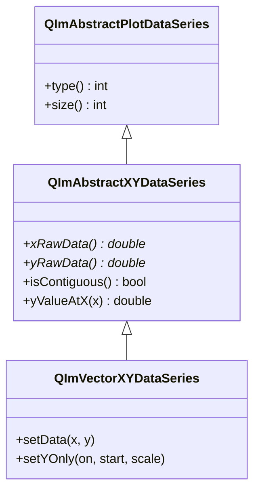

# Data Series Usage Guide

QIm encapsulates XY data through `QImAbstractXYDataSeries` abstract class, enabling zero-copy data transfer.

## Main Features

**Features**

- ✅ **Zero-Copy Rendering**: Direct use of raw data pointers, no data copying
- ✅ **Multi-Container Support**: std::vector, QVector and other contiguous memory containers
- ✅ **Y-only Mode**: Provide only Y data, X calculated by formula
- ✅ **Binary Search**: Efficient X value lookup interface

## Basic Concepts

### Class Inheritance



## Usage

### 1. Direct Container Usage

```cpp
// Use std::vector - addLine creates data series automatically
std::vector<double> x = {0, 1, 2, 3, 4};
std::vector<double> y = {0, 1, 4, 9, 16};
plot->addLine(x, y, "Curve");
```

### 2. Y-only Mode

Provide only Y data, X = index * scale + start:

```cpp
std::vector<double> y(1000);
for (int i = 0; i < 1000; ++i) {
    y[i] = std::sin(i * 0.01);
}

// Create data series and set Y-only
auto* series = new QIM::QImVectorXYDataSeries<std::vector<double>, std::vector<double>>({}, y);
series->setYOnly(true, 0.0, 0.01);  // xStart=0, xScale=0.01

auto* line = new QIM::QImPlotLineItemNode();
line->setData(series);
plot->addPlotItem(line);
```

### 3. Data Access

```cpp
// Get data series
auto* series = line->data();

// Data size
int count = series->size();

// Get value at specific index
double x = series->xValue(10);
double y = series->yValue(10);

// Binary search: find Y for given X
double yVal = series->yValueAtX(2.5, &index, &exact);
```

## API Reference

| Method | Description |
|--------|-------------|
| `size()` | Data point count |
| `xRawData()` | X data pointer (Y-only returns nullptr) |
| `yRawData()` | Y data pointer |
| `xValue(index)` | Get X value at index |
| `yValue(index)` | Get Y value at index |
| `yValueAtX(x, index, exact)` | Find Y for given X |
| `setYOnly(on, start, scale)` | Set Y-only mode |

!!! warning "Notes"
    - Data containers must store `double` type
    - Y-only mode suits time-series data
    - `yValueAtX` requires monotonically increasing X data

## References

- Related docs: [Line Plot](plot-line.md), [Downsampling](downsampling.md)
- API Reference: `src/core/plot/QImPlotDataSeries.h`