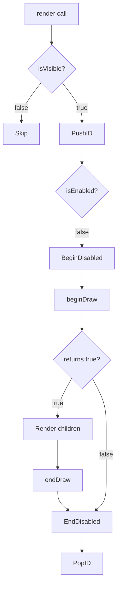

# Custom Node Development Guide

QIm allows inheriting `QImAbstractNode` to create custom rendering nodes, encapsulating arbitrary ImGui/ImPlot rendering logic.

## Main Features

**Features**

- ✅ **Flexible Inheritance**: Inherit QImAbstractNode to implement any ImGui region
- ✅ **Object Tree Integration**: Automatically integrates with object tree management
- ✅ **Signal/Slot Support**: Can define custom signals for event response
- ✅ **Auto ID Management**: Automatically pushes/pops ID stack during rendering

## Core Mechanism

### Rendering Flow



### Required Methods

| Method | Description |
|--------|-------------|
| `beginDraw()` | Corresponds to ImGui Begin calls, returns whether region is open |
| `endDraw()` | Corresponds to ImGui End calls |

## Development Examples

### 1. Custom Window Node

```cpp
// CustomWindowNode.h
#include <QImAbstractNode.h>

class CustomWindowNode : public QIM::QImAbstractNode
{
    Q_OBJECT
public:
    explicit CustomWindowNode(QObject* parent = nullptr);
    
    void setTitle(const QString& title);
    
protected:
    bool beginDraw() override;
    void endDraw() override;
    
private:
    QString m_title;
};

// CustomWindowNode.cpp
#include <imgui.h>

bool CustomWindowNode::beginDraw() {
    return ImGui::Begin(m_title.toUtf8().constData(), nullptr, m_flags);
}

void CustomWindowNode::endDraw() {
    ImGui::End();
}
```

### 2. Custom Plot Node

```cpp
class CustomPlotNode : public QIM::QImAbstractNode
{
protected:
    bool beginDraw() override {
        return ImPlot::BeginPlot("CustomPlot");
    }
    
    void endDraw() override {
        ImPlot::EndPlot();
    }
};
```

### 3. Using PIMPL Pattern

```cpp
class AdvancedNode : public QIM::QImAbstractNode
{
    Q_OBJECT
    QIM_DECLARE_PRIVATE(AdvancedNode)
    
public:
    explicit AdvancedNode(QObject* parent = nullptr);
    
protected:
    bool beginDraw() override;
};

// cpp
class AdvancedNode::PrivateData {
    QIM_DECLARE_PUBLIC(AdvancedNode)
public:
    QString m_title;
    ImGuiWindowFlags m_flags = 0;
};
```

!!! warning "Notes"
    - When `beginDraw` returns false, child nodes won't be rendered
    - Don't modify object tree structure in beginDraw/endDraw
    - Use PIMPL pattern for state member variables

!!! tip "Best Practices"
    - Use PIMPL pattern to encapsulate state storage
    - Split complex nodes into multiple child nodes
    - Provide signals to notify external state changes

## References

- Related docs: [Render Node](../render-node.md), [PIMPL Pattern](../pimpl-pattern.md)
- ImGui Docs: https://github.com/ocornut/imgui