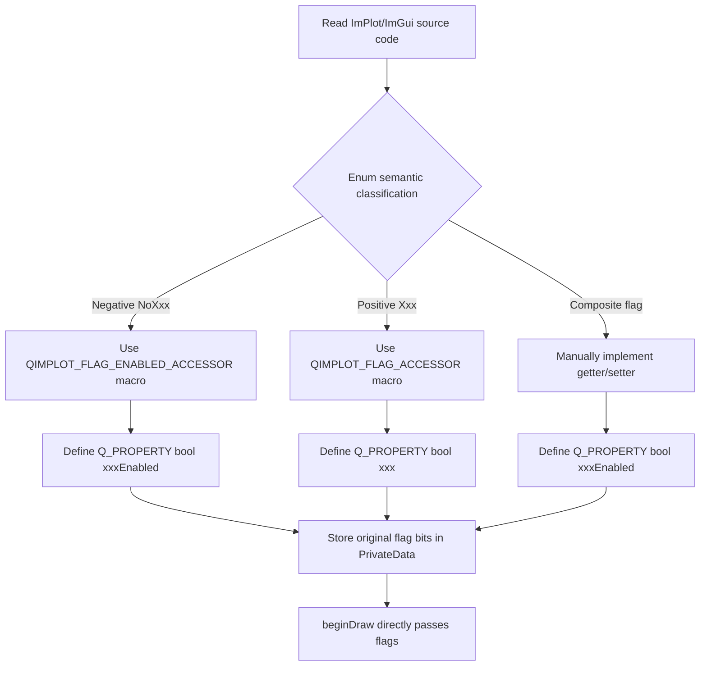

# Flag Mapping Standards

QIm's core goal is to enable Qt developers to use ImPlot/ImGui without knowing their APIs and enums. This standard details how to convert ImPlot/ImGui bit flag enums into Qt-style Q_PROPERTY properties, including negative→positive semantic conversion rules and implementation macro usage.

## Why This Standard Is Needed

ImPlot/ImGui controls features through bit flags, heavily using **negative semantics** (e.g., `NoTitle` means "disable title"). This is unnatural in Qt's property system — Qt developers expect `setTitleEnabled(true)` to enable the title, not `setNoTitle(false)` to "not disable the title". A unified semantic conversion standard is therefore required.

## Key Features

**Features**

- ✅ **No Native Type Exposure in Headers**: Users only see Qt-style properties and methods
- ✅ **Negative→Positive Semantic Conversion**: NoXxx → xxxEnabled, following Qt conventions
- ✅ **Positive Semantic Direct Mapping**: Xxx → xxx, logic unchanged
- ✅ **Composite Flag Conversion**: Multi-flag combination → single positive property
- ✅ **Implementation Macros Simplify Development**: QIMPLOT_FLAG_ACCESSOR and QIMPLOT_FLAG_ENABLED_ACCESSOR
- ✅ **Original Flag Interface Preserved**: Advanced users can directly manipulate underlying flag bits

## Design Principles & Motivation

1. **Headers don't expose ImPlot/ImGui types**: Users only see Qt-style properties and methods; `ImPlotFlags`, `ImAxis` etc. should not appear
2. **Enums converted to Qt properties**: ImPlot/ImGui controls features via bit flags; QIm decomposes these into independent `Q_PROPERTY` boolean properties, each corresponding to a feature toggle
3. **Preserve original flag access interface**: Provide `imPlotFlags()`/`setImPlotFlags()` methods for advanced users to directly manipulate underlying flag bits, but regular users don't need to care

## Negative→Positive Semantic Conversion

### Conversion Rules

ImPlot/ImGui enums heavily use **negative semantics** (`NoXxx`). QIm converts them to Qt **positive semantics** properties:

| ImPlot Negative Enum | QIm Positive Property | Logic |
| --- | --- | --- |
| `ImPlotFlags_NoTitle` | `titleEnabled` | `enabled = (flags & NoTitle) == 0` |
| `ImPlotFlags_NoLegend` | `legendEnabled` | `enabled = (flags & NoLegend) == 0` |
| `ImPlotFlags_NoMouseText` | `mouseTextEnabled` | `enabled = (flags & NoMouseText) == 0` |
| `ImPlotFlags_NoInputs` | `inputsEnabled` | `enabled = (flags & NoInputs) == 0` |
| `ImPlotFlags_NoMenus` | `menusEnabled` | `enabled = (flags & NoMenus) == 0` |
| `ImPlotFlags_NoBoxSelect` | `boxSelectEnabled` | `enabled = (flags & NoBoxSelect) == 0` |
| `ImPlotFlags_NoFrame` | `frameEnabled` | `enabled = (flags & NoFrame) == 0` |

!!! info "Semantic Conversion Logic"
    The core logic of negative→positive conversion is **inverted judgment**:
    - getter: `enabled = (flags & NoXxx) == 0` — flag not set = feature enabled
    - setter: `enabled ? flags &= ~NoXxx : flags |= NoXxx` — clear flag when enabled, set flag when disabled

## Positive Semantic Direct Mapping

For ImPlot enums that are inherently **positive semantics**, direct mapping applies:

| ImPlot Positive Enum | QIm Positive Property | Logic |
| --- | --- | --- |
| `ImPlotFlags_Equal` | `equal` | `on = (flags & Equal) != 0` |
| `ImPlotFlags_Crosshairs` | `crosshairs` | `on = (flags & Crosshairs) != 0` |

## Composite Flag Conversion

For **composite flags** (combinations of multiple negative flags), also convert to positive semantics:

| ImPlot Composite Enum | QIm Positive Property | Logic |
| --- | --- | --- |
| `ImPlotFlags_CanvasOnly` (= NoTitle\|NoLegend\|NoMenus\|NoBoxSelect\|NoMouseText) | `canvasEnabled` | `enabled = (flags & CanvasOnly) == 0` |

Composite flags cannot use macros and require manual getter/setter implementation, because the setter needs to simultaneously set/clear multiple sub-flags.

## Q_PROPERTY Encapsulation Pattern

Each flag corresponds to a Qt property, exposed using `Q_PROPERTY`:

```cpp
// Properties converted from negative semantics (most common)
Q_PROPERTY(bool titleEnabled READ isTitleEnabled WRITE setTitleEnabled NOTIFY plotFlagChanged)
Q_PROPERTY(bool legendEnabled READ isLegendEnabled WRITE setLegendEnabled NOTIFY plotFlagChanged)
Q_PROPERTY(bool menusEnabled READ isMenusEnabled WRITE setMenusEnabled NOTIFY plotFlagChanged)

// Properties directly mapped from positive semantics
Q_PROPERTY(bool equal READ isEqual WRITE setEqual NOTIFY plotFlagChanged)
Q_PROPERTY(bool crosshairs READ isCrosshairs WRITE setCrosshairs NOTIFY plotFlagChanged)
```

### Naming Conventions

- **getter**: `isXxxEnabled()` or `isXxx()` (positive semantics)
- **setter**: `setXxxEnabled(bool enabled)` or `setXxx(bool on)` (positive semantics)
- **signal**: Multiple flag properties on the same node can share one signal (e.g., `plotFlagChanged()`), because flags are stored in a unified variable, and any flag change affects the same `ImPlotFlags` value

## Implementation Macros

QIm provides two helper macros to simplify flag property getter/setter implementation, defined in `src/core/plot/QImPlot.h`.

### QIMPLOT_FLAG_ACCESSOR — Positive Semantic Flags (Direct Mapping)

Used for flags that are inherently positive semantics in ImPlot:

```cpp
// Macro usage: QIMPLOT_FLAG_ACCESSOR(ClassName, FlagName, FlagEnum, emitFunName)
// Generates isFlagName() and setFlagName(bool on)
//
// getter logic: return (flags & FlagEnum) != 0
// setter logic: on ? flags |= FlagEnum : flags &= ~FlagEnum

QIMPLOT_FLAG_ACCESSOR(QImPlotNode, Equal, ImPlotFlags_Equal, plotFlagChanged)
QIMPLOT_FLAG_ACCESSOR(QImPlotNode, Crosshairs, ImPlotFlags_Crosshairs, plotFlagChanged)
```

### QIMPLOT_FLAG_ENABLED_ACCESSOR — Negative→Positive Semantic Conversion (Inverted Mapping)

Used for ImPlot negative semantic flags, converting to Qt positive semantic properties:

```cpp
// Macro usage: QIMPLOT_FLAG_ENABLED_ACCESSOR(ClassName, PropName, FlagEnum, emitFunName)
// Generates isPropName() and setPropName(bool enabled)
//
// getter logic: return (flags & FlagEnum) == 0   ← Key: inverted judgment
// setter logic: enabled ? flags &= ~FlagEnum : flags |= FlagEnum  ← Key: inverted setting

QIMPLOT_FLAG_ENABLED_ACCESSOR(QImPlotNode, TitleEnabled, ImPlotFlags_NoTitle, plotFlagChanged)
QIMPLOT_FLAG_ENABLED_ACCESSOR(QImPlotNode, LegendEnabled, ImPlotFlags_NoLegend, plotFlagChanged)
QIMPLOT_FLAG_ENABLED_ACCESSOR(QImPlotNode, MenusEnabled, ImPlotFlags_NoMenus, plotFlagChanged)
```

### Composite Flag Special Handling

Composite flags cannot use macros and require manual implementation:

```cpp
// getter — still negative→positive inversion
bool QImPlotNode::isCanvasEnabled() const
{
    QIM_DC(d);
    return (d->plotFlags & ImPlotFlags_CanvasOnly) == 0;
}

// setter — clear all sub-flags when enabled, set all sub-flags when disabled
void QImPlotNode::setCanvasEnabled(bool enabled)
{
    QIM_D(d);
    const ImPlotFlags oldFlags = d->plotFlags;
    if (enabled) {
        d->plotFlags &= ~ImPlotFlags_CanvasOnly;  // Clear all 5 No sub-flags
    } else {
        d->plotFlags |= ImPlotFlags_CanvasOnly;   // Set all 5 No sub-flags
    }
    if (d->plotFlags != oldFlags) {
        Q_EMIT plotFlagChanged();
    }
}
```

## Flag Usage in beginDraw()

In `beginDraw()`, flag bits have already been assembled through property setters, just pass them directly to ImPlot API:

```cpp
bool QImPlotNode::beginDraw()
{
    QIM_D(d);
    // d->plotFlags is already maintained by property setters, no need to re-assemble
    d->beginPlotSuccess = ImPlot::BeginPlot(title, d->size, d->plotFlags);
    // ...
}
```

!!! warning "Key Point"
    Do not assemble flag bit logic in `beginDraw()`. All assembly work is done in setters. `d->plotFlags` is a unified `ImPlotFlags` integer variable. Each property's setter modifies this variable through bit operations (`|=`, `&= ~`). `beginDraw()` only needs to pass it directly.

## Property Default Values

Property default values should be consistent with ImPlot's default behavior. ImPlot's `ImPlotFlags_None = 0` means all negative flags are not set (i.e., all features are enabled by default), therefore:

```cpp
// Initialize in PrivateData
ImPlotFlags plotFlags { ImPlotFlags_None };  // Default 0, all No* flags not set

// Corresponding QIm property default values:
// titleEnabled   → true  (because NoTitle is not set)
// legendEnabled  → true  (because NoLegend is not set)
// menusEnabled   → true  (because NoMenus is not set)
// equal          → false (because Equal is not set)
// crosshairs     → false (because Crosshairs is not set)
```

## Flag Conversion Decision Flow



## References

- Related Standards: [Qt Integration Standards](qt-integration.md), [New Node Development Guide](new-node-guide.md)
- Core Concepts: [Property System](../property-system.md)