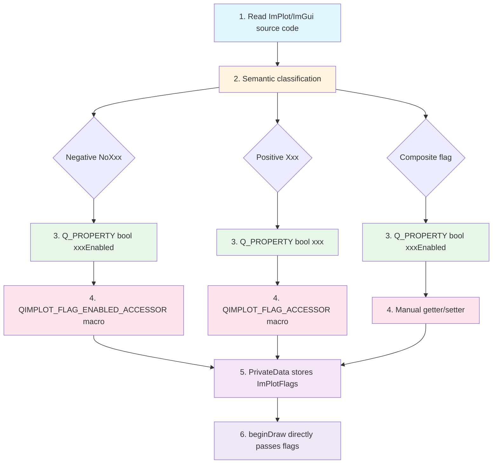

# New Node Development Guide

When developing a new node whose render function involves ImPlot/ImGui enum flags, follow these steps. This guide provides the complete workflow to ensure new nodes follow QIm's design standards.

## Key Features

**Features**

- ✅ **5-Step Development Flow**: Standardized steps from reading source code to completing implementation
- ✅ **Semantic Classification First**: Classify enum flags before choosing implementation method
- ✅ **Q_PROPERTY Standard Definition**: Each flag corresponds to a boolean property
- ✅ **Unified Flag Storage**: PrivateData maintains the original flag variable
- ✅ **beginDraw Direct Pass**: Render function does no extra assembly logic

## Development Flow

### Step 1: Read ImPlot/ImGui Source Code

Understand all related enum meanings, default values, and composite relationships. This is the foundation for all subsequent steps.

!!! tip "Tip"
    Focus on:
    - Default values of enum values (usually `None = 0`)
    - Meaning of negative semantic flags (`NoXxx`)
    - Composition of composite flags (combination of multiple flags)
    - Dependencies between flags

### Step 2: Semantic Classification

Classify enums into three categories:

| Type | Characteristic | Example |
|------|------|------|
| **Negative semantics** | `NoXxx` prefix, meaning "disable/turn off" | `ImPlotFlags_NoTitle`, `ImPlotFlags_NoMenus` |
| **Positive semantics** | No negative prefix, meaning "enable/turn on" | `ImPlotFlags_Equal`, `ImPlotFlags_Crosshairs` |
| **Composite flags** | Combination of multiple flags | `ImPlotFlags_CanvasOnly` |

### Step 3: Define Q_PROPERTY

Create a `Q_PROPERTY` boolean property for each flag, using positive semantic naming:

```cpp
// Negative semantics → xxxEnabled naming
Q_PROPERTY(bool titleEnabled READ isTitleEnabled WRITE setTitleEnabled NOTIFY plotFlagChanged)
Q_PROPERTY(bool legendEnabled READ isLegendEnabled WRITE setLegendEnabled NOTIFY plotFlagChanged)

// Positive semantics → xxx naming
Q_PROPERTY(bool equal READ isEqual WRITE setEqual NOTIFY plotFlagChanged)
Q_PROPERTY(bool crosshairs READ isCrosshairs WRITE setCrosshairs NOTIFY plotFlagChanged)

// Composite flag → xxxEnabled naming
Q_PROPERTY(bool canvasEnabled READ isCanvasEnabled WRITE setCanvasEnabled NOTIFY plotFlagChanged)
```

### Step 4: Choose Implementation Method

Select the corresponding implementation method based on semantic classification:

| Semantic Type | Implementation Method | Description |
|----------|----------|------|
| Negative→Positive | `QIMPLOT_FLAG_ENABLED_ACCESSOR` macro | Inverted judgment and setting logic |
| Positive→Positive | `QIMPLOT_FLAG_ACCESSOR` macro | Direct mapping logic |
| Composite flag | Manual getter/setter implementation | Need to simultaneously set/clear multiple sub-flags |

For detailed macro usage, refer to [Flag Mapping Standards](flag-mapping.md).

### Step 5: Store Original Flag Bits in PrivateData

Use `ImPlotFlags`/`ImGuiFlags` etc. original types for storage. Each property setter maintains through bit operations:

```cpp
class QImPlotNode::PrivateData
{
    QIM_DECLARE_PUBLIC(QImPlotNode)
    
public:
    ImPlotFlags plotFlags { ImPlotFlags_None };  // Unified storage of all flag bits
    // Each property setter modifies this variable through |= and &= ~ operations
};
```

### Step 6: Directly Pass in beginDraw()

Pass `d->flags` directly to ImPlot/ImGui API, no extra assembly logic:

```cpp
bool QImPlotNode::beginDraw()
{
    QIM_D(d);
    // d->plotFlags is already maintained by property setters, no need to re-assemble
    d->beginPlotSuccess = ImPlot::BeginPlot(d->titleUtf8.constData(), d->size, d->plotFlags);
    return d->beginPlotSuccess;
}
```

## Complete Development Flowchart



## New Node Development Checklist

After completing new node development, check against this list:

- [ ] All enum flags have been classified by semantics
- [ ] Each flag corresponds to a `Q_PROPERTY` boolean property
- [ ] Getter/setter uses the correct implementation method (macro or manual)
- [ ] `PrivateData` uses original types to store flag bits
- [ ] Property default values are consistent with ImPlot/ImGui default behavior
- [ ] `beginDraw()` directly passes flag bits, no extra assembly
- [ ] Header files don't expose ImPlot/ImGui native types
- [ ] String properties follow UTF8-only storage standard
- [ ] Signals use `Q_SIGNALS` and `Q_EMIT` uppercase macros

!!! warning "Common Mistakes"
    - ❌ Assembling flag bit logic in `beginDraw()`
    - ❌ Storing both QString and QByteArray
    - ❌ Exposing `ImPlotFlags` type in header files
    - ❌ Using lowercase `emit`/`signals`/`slots` macros

## References

- Related Standards: [Flag Mapping Standards](flag-mapping.md), [Render Performance Guidelines](render-guidelines.md), [PIMPL Development Guide](pimpl-dev-guide.md)
- Usage Guide: [Custom Node](custom-node.md)