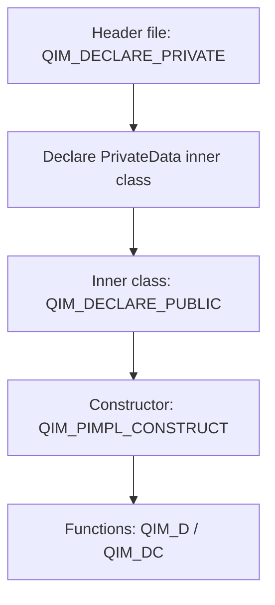

# PIMPL Development Guide

QIm uses the PIMPL (Private Implementation) pattern, encapsulating implementation details in `private` members while providing interfaces through `public` members. This document details QIm's PIMPL macro usage and coding standards.

## Why This Standard Is Needed

The PIMPL pattern is a common practice in Qt projects, providing:

- **Hide implementation details**: Reduce header file compilation dependencies, speed up compilation
- **Maintain ABI stability**: Modifying private members doesn't affect binary compatibility
- **Encapsulate internal data**: Clean public interfaces, flexible private implementation changes

## Key Features

**Features**

- ✅ **QIM_DECLARE_PRIVATE**: Declare PIMPL private members and inner class in the class
- ✅ **QIM_DECLARE_PUBLIC**: Declare reverse pointer in the inner class
- ✅ **QIM_PIMPL_CONSTRUCT**: Constructor initialization shortcut macro
- ✅ **QIM_D / QIM_DC**: Convenient d_ptr pointer access

## PIMPL Macro Descriptions

QIm's PIMPL pattern macros are located in `src/QImAPI.h`, primarily involving the following macros:

### QIM_DECLARE_PRIVATE

Declares PIMPL private members in the class, generating:

- `private` member variable `d_ptr`
- Inner class `PrivateData` declaration framework
- Mutual friend declarations

```cpp
class QImPlotNode : public QImAbstractNode
{
    QIM_DECLARE_PRIVATE(QImPlotNode)  // Generates d_ptr and PrivateData inner class
    // ...
};
```

### QIM_DECLARE_PUBLIC

Declares PIMPL public members in the inner class `PrivateData`, generating:

- `public` member variable `q_ptr`, pointing to the owner class
- Mutual friend declarations

```cpp
class QImPlotNode::PrivateData
{
    QIM_DECLARE_PUBLIC(QImPlotNode)  // Generates q_ptr reverse pointer
    // Private implementation data...
};
```

### QIM_PIMPL_CONSTRUCT

Shortcut macro for initializing PIMPL private member variables in the constructor:

```cpp
QImPlotNode::QImPlotNode(QObject* parent)
    : QImAbstractNode(parent)
    , QIM_PIMPL_CONSTRUCT  // Initialize d_ptr
{
}
```

### QIM_D and QIM_DC

Convenient macros for accessing the `d_ptr` pointer:

- **QIM_D**: Get `PrivateData*` in non-const functions
- **QIM_DC**: Get `const PrivateData*` in const functions

```cpp
void MyClass::foo1() {
    QIM_D(d);  // Expands to PrivateData* d = d_func()
    d->xx();   // Directly access private members
}

void MyClass::foo2() const {
    QIM_DC(d);  // Expands to const PrivateData* d = d_func()
    d->xxc();   // Read-only access to private members
}
```

## Usage

### Complete PIMPL Class Structure

Here is a complete class structure example using the PIMPL pattern in QIm:

**Header file (.h):**

```cpp
class QImPlotNode : public QImAbstractNode
{
    Q_OBJECT
    QIM_DECLARE_PRIVATE(QImPlotNode)  // PIMPL declaration
    
    // Q_PROPERTY declarations...
    
public:
    // Constructor for QImPlotNode
    QImPlotNode(QObject* parent = nullptr);
    
    // Get the plot title
    QString title() const;
    
    // Set the plot title
    void setTitle(const QString& title);
    
Q_SIGNALS:
    void titleChanged(const QString& title);
};

// PrivateData inner class declaration
class QImPlotNode::PrivateData
{
    QIM_DECLARE_PUBLIC(QImPlotNode)  // Reverse pointer declaration
    
public:
    QByteArray titleUtf8;  // UTF8 format storage
    ImPlotFlags plotFlags { ImPlotFlags_None };
};
```

**Source file (.cpp):**

```cpp
QImPlotNode::QImPlotNode(QObject* parent)
    : QImAbstractNode(parent)
    , QIM_PIMPL_CONSTRUCT  // PIMPL initialization
{
}

QString QImPlotNode::title() const
{
    QIM_DC(d);  // const function uses QIM_DC
    return QString::fromUtf8(d->titleUtf8);
}

void QImPlotNode::setTitle(const QString& title)
{
    QIM_D(d);  // non-const function uses QIM_D
    QByteArray utf8 = title.toUtf8();
    if (d->titleUtf8 != utf8) {
        d->titleUtf8 = utf8;
        Q_EMIT titleChanged(title);
    }
}
```

### PIMPL Usage Flow



!!! warning "Important Notes"
    - `QIM_D` is for non-const functions, `QIM_DC` is for const functions — do not mix them
    - `PrivateData` class should not expose `ImPlot`/`ImGui` native types in header files; all native types are only used in `.cpp` files
    - Using `d` as the variable name is convention — do not use other names

## References

- Core Concepts: [PIMPL Pattern](../pimpl-pattern.md) (user perspective document)
- Related Standards: [Qt Integration Standards](qt-integration.md), [Render Performance Guidelines](render-guidelines.md)