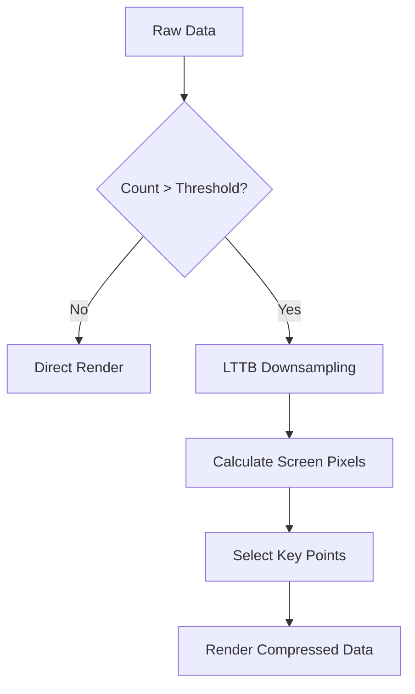

# Downsampler Usage Guide

QIm has built-in LTTB (Largest-Triangle-Three-Buckets) downsampling algorithm for maintaining visual quality while improving performance during large dataset rendering.

## Main Features

**Features**

- ✅ **LTTB Algorithm**: Data compression algorithm preserving visual characteristics
- ✅ **Adaptive Sampling**: Automatically calculates sample point count based on screen pixels
- ✅ **Real-time Processing**: Dynamic downsampling during rendering, no preprocessing needed
- ✅ **Configurable Threshold**: Set data count threshold for triggering downsampling

## Basic Concepts

### Why Downsampling

When rendering million-level data points:
- GPU rendering pressure is extreme, frame rate drops
- Screen pixels are limited, many data points overlap visually
- Users cannot distinguish dense data details

LTTB algorithm intelligently preserves visual key points, significantly reducing rendering data while maintaining curve shape.

### Working Principle



## Usage

### 1. Default Configuration (Enabled)

`QImPlotLineItemNode` has adaptive downsampling enabled by default:

```cpp
// Default enabled, no configuration needed
auto* line = plot->addLine(x, y, "Curve");
// line->isAdaptiveSampling() == true
```

### 2. Disable Downsampling

For small datasets or when precise rendering is needed:

```cpp
line->setAdaptivesSampling(false);
```

## Performance Comparison

| Data Count | No Downsampling FPS | With Downsampling FPS |
|------------|---------------------|----------------------|
| 100K | ~60 | ~60 |
| 1M | ~10 | ~25 |
| 5M | ~2 | ~4 |

!!! info "Note"
    - Downsampled point count ≈ screen pixel width × 3
    - Preserves curve peaks, valleys and other key features
    - Does not affect data interaction (mouse hover still shows original values)

!!! tip "Best Practices"
    - <100K points: Can disable downsampling for precise rendering
    - 100K-1M points: Keep enabled, balance performance and precision
    - >1M points: Must enable, otherwise frame rate too low

## References

- Related docs: [Performance](performance.md)
- API Reference: `src/core/plot/QImLTTBDownsampler.h`