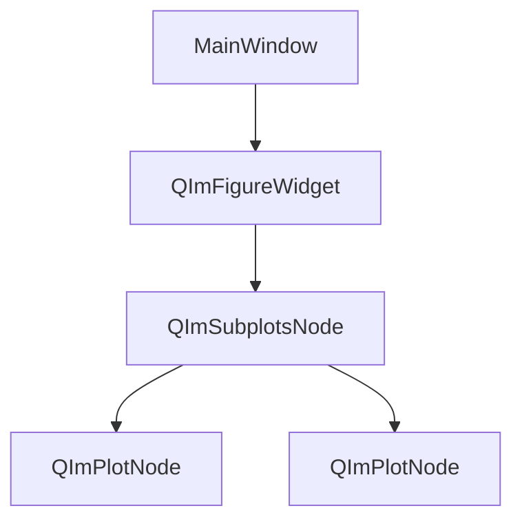
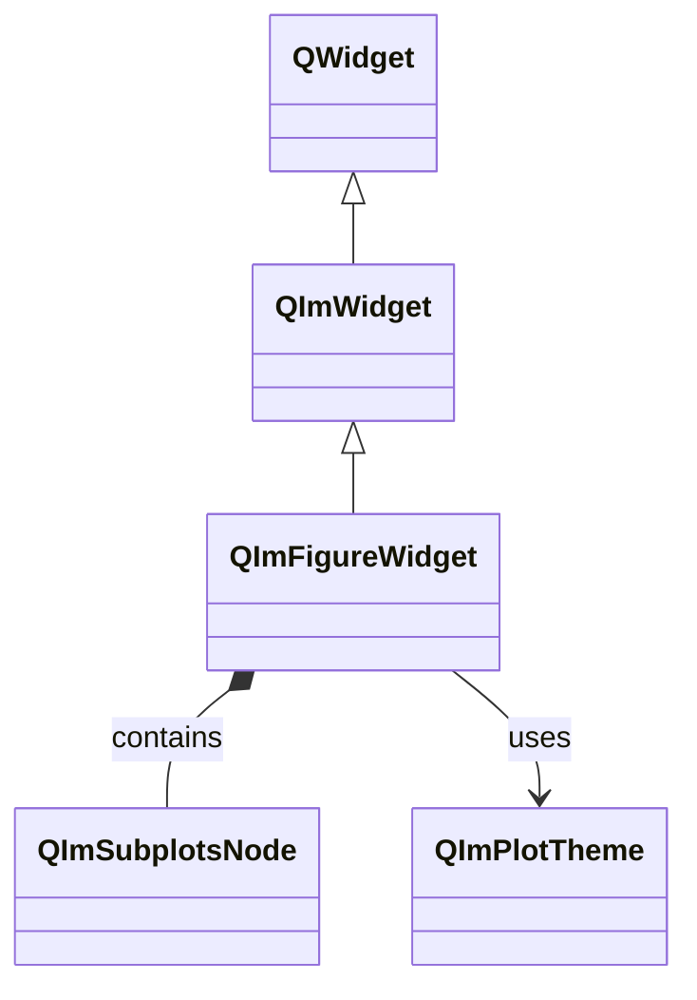

# QImFigureWidget Usage Guide

`QImFigureWidget` is QIm's core plotting window widget, inheriting from `QWidget`,
with ImGui rendering context and subplot layout manager encapsulated internally.

## Main Features

**Features**

- ✅ **Subplot Layout**: Multi-row multi-column subplot grid layout with customizable ratios
- ✅ **Auto Node Management**: Automatically create and manage plot nodes via `createPlotNode()`
- ✅ **Theme Configuration**: Plot style configuration via `QImPlotTheme`
- ✅ **Qt Integration**: Standard QWidget for embedding in Qt window system
- ✅ **Signal Notification**: Plot node add/remove signals

## Basic Concepts

### Component Position

QImFigureWidget position in object tree:



### Class Inheritance



## Usage

Example code located at:`examples/qimfigure-test`, screenshot below:


### 1. Basic Usage

Create single plot window:

```cpp
#include <QImFigureWidget.h>

// Create plot window in MainWindow
QIM::QImFigureWidget* figure = new QIM::QImFigureWidget(this);
setCentralWidget(figure);  // As central widget

// Create single plot (default 1x1 layout)
QIM::QImPlotNode* plot = figure->createPlotNode();
plot->setTitle("Example Chart");

// Add curve
QVector<double> x = {0, 1, 2, 3, 4};
QVector<double> y = {0, 1, 4, 9, 16};
plot->addLine(x, y, "Quadratic Curve");
```

Result: A plot window with a single curve displayed.

### 2. Multi-Subplot Layout

Configure multi-row multi-column subplot grid:

```cpp
// Create plot window
QIM::QImFigureWidget* figure = new QIM::QImFigureWidget(this);

// Configure 2 rows 1 column subplot layout
figure->setSubplotGrid(2, 1);

// Create first subplot
QIM::QImPlotNode* plot1 = figure->createPlotNode();
plot1->setTitle("Time Domain Waveform");
plot1->x1Axis()->setLabel("Time (s)");
plot1->y1Axis()->setLabel("Amplitude");

// Create second subplot
QIM::QImPlotNode* plot2 = figure->createPlotNode();
plot2->setTitle("Frequency Domain Analysis");
plot2->x1Axis()->setLabel("Frequency (Hz)");
plot2->y1Axis()->setLabel("Power");

// Note: createPlotNode fills subplot cells in order
```

### 3. Custom Subplot Ratio

Set different row/column display ratios:

```cpp
// Configure 2x2 grid, first row takes 70% height
figure->setSubplotGrid(2, 2, 
    std::vector<float>{0.7f, 0.3f},  // Row ratios
    std::vector<float>{0.5f, 0.5f}   // Column ratios
);
```

### 4. Plot Node Management

Manually manage plot node addition and removal:

```cpp
// Get all plot nodes
QList<QIM::QImPlotNode*> plots = figure->plotNodes();

// Plot count
int count = figure->plotCount();

// Insert plot at specified position
QIM::QImPlotNode* newPlot = new QIM::QImPlotNode();
figure->insertPlotNode(0, newPlot);  // Insert at front

// Remove plot (keep ownership)
figure->takePlotNode(plot);  // plot not deleted

// Remove plot (destroy)
figure->removePlotNode(plot);  // plot deleted
```

### 5. Theme Configuration

Configure plot style via QImPlotTheme:

```cpp
QIM::QImPlotTheme theme;
theme.backgroundColor = QColor(30, 30, 30);
theme.axisColor = QColor(200, 200, 200);
theme.gridColor = QColor(100, 100, 100);

figure->setPlotTheme(theme);
```

## API Reference

| Property/Method | Parameter Type | Description |
|------------------|----------------|-------------|
| `setSubplotGrid(rows, cols)` | int, int | Set subplot grid |
| `setSubplotGrid(rows, cols, rowRatios, colRatios)` | int, int, vector, vector | Grid with ratios |
| `subplotGridRows()` | - | Get subplot row count |
| `subplotGridColumns()` | - | Get subplot column count |
| `createPlotNode()` | - | Create plot node |
| `plotNodes()` | - | Get all plot nodes |
| `plotCount()` | - | Get plot count |
| `addPlotNode(plot)` | QImPlotNode* | Add plot node |
| `insertPlotNode(index, plot)` | int, QImPlotNode* | Insert plot node |
| `takePlotNode(plot)` | QImPlotNode* | Take plot node (keep ownership) |
| `removePlotNode(plot)` | QImPlotNode* | Remove plot node (destroy) |
| `setPlotTheme(theme)` | QImPlotTheme | Set plot theme |
| `plotTheme()` | - | Get current theme |
| `subplotNode()` | - | Get subplot layout node |

!!! warning "Notes"
    - `createPlotNode()` returns nullptr when subplot grid is full
    - Plot node deletion triggers `plotNodeAttached(false)` signal
    - New plots invisible when subplot count exceeds grid capacity

## Signal/Slot Connection

| Signal | Parameters | Trigger |
|--------|------------|---------|
| `plotNodeAttached(plot, attach)` | QImPlotNode*, bool | Plot node added or removed |

```cpp
// Monitor plot node addition
connect(figure, &QIM::QImFigureWidget::plotNodeAttached,
        this, &MyClass::onPlotChanged);

void MyClass::onPlotChanged(QIM::QImPlotNode* plot, bool attach) {
    if (attach) {
        qDebug() << "New plot added";
    } else {
        qDebug() << "Plot removed";
    }
}
```

## References

- Related docs: [QImPlotNode](plot-node.md), [Render Node](render-node.md)
- Example code: `examples/qimfigure-test`
- API Reference: `src/widgets/QImFigureWidget.h`