# QIm Introduction

`QIm` is an open-source library that integrates `Dear ImGui`, `ImPlot`, `ImPlot3D` and other ImGui ecosystem components into the Qt framework. Through retained mode encapsulation, it enables Qt developers to build high-performance real-time data visualization applications using familiar Qt programming paradigms (signals/slots, property system, object tree).

With `QIm`, you don't need to learn `ImGui` - you can directly use familiar Qt signals/slots, property system, and object tree management to build high-performance applications for real-time data monitoring, scientific 2D/3D plotting, and engineering simulation visualization.

`QIm` plans to encapsulate mature libraries from the ImGui ecosystem. Currently, `ImPlot` and `ImPlot3D` encapsulation is in progress, aiming to provide an out-of-the-box data visualization library for Qt development environments.

## Screenshots

Through `QIm`'s `Plot` module, you can achieve the following data visualization effects:

### 2D Plotting

|  |  |  |
|:---:|:---:|:---:|
| 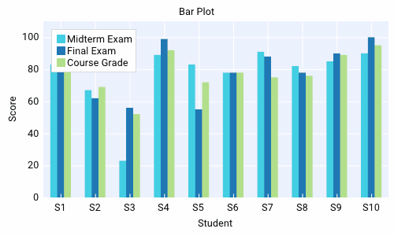 | 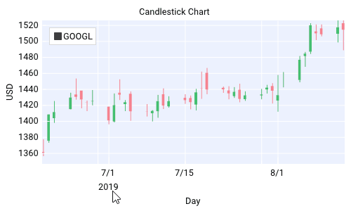 | 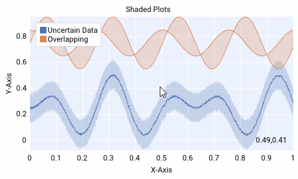 |
| 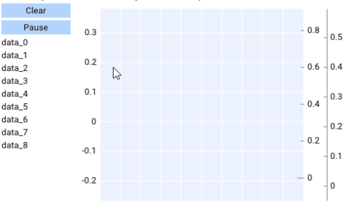 | 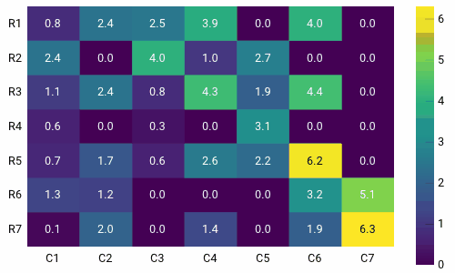 | 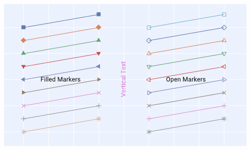 |
| 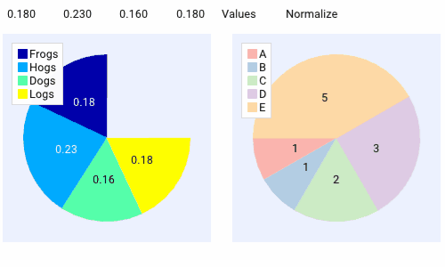 | 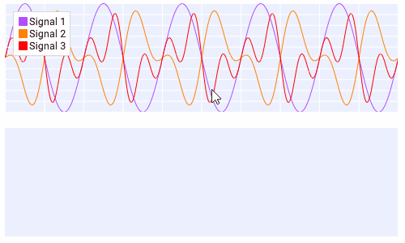 |  |
| 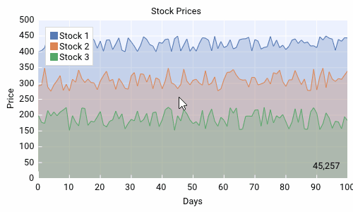 | 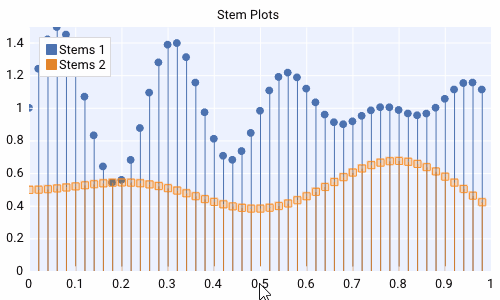 | 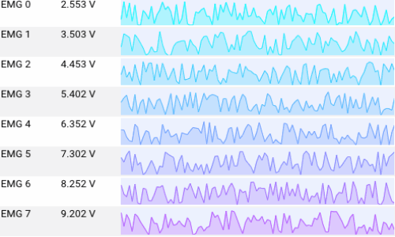 |

### 3D Plotting

|  |  |  |
|:---:|:---:|:---:|
| 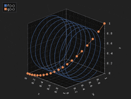 | 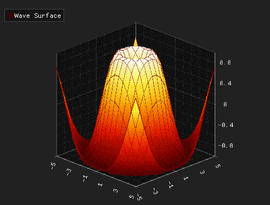 | 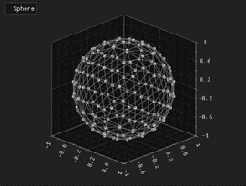 |
| 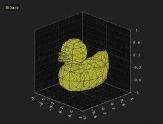 | 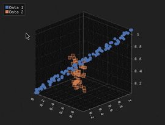 | 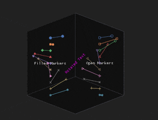 |

## Core Design

`ImGui` uses immediate mode natively: UI structure is rebuilt every render frame, which differs significantly from Qt programming habits:

```cpp
// Traditional ImGui immediate mode - this code runs every frame
if (ImGui::Begin("Window")) {
    if (ImPlot::BeginPlot("Plot")) {
        ImPlot::PlotLine(...);
        ImPlot::EndPlot();
    }
    ImGui::End();
}
```

`QIm` converts this to retained mode familiar to Qt developers, managing UI components through object-oriented + object tree approach, with properties and interactions fully aligned with Qt ecosystem:

```cpp
// QIm way - object-oriented, more Qt-friendly
auto window = new QImWindowNode(root);
window->setTitle("Window");

auto plot = new QImPlotNode(window);  // Auto nesting
plot->setTitle("Plot");

auto line = new QImPlotLineNode(plot); // Auto becomes Plot's child node
line->setData(...);
```

`QIm`'s core is mapping ImGui ecosystem components to Qt node objects, mapping ImGui properties to Qt property system, while preserving signal/slot mechanism.

## Quick Start

### Build and Install

Project uses `cmake` for building. Recommended to install after build:

```cmake
# Create build directory
mkdir build && cd build
# Configure (specify Qt path, or ensure Qt in environment)
cmake .. -G "Visual Studio 17 2022" -A x64 ^
         -DCMAKE_PREFIX_PATH="C:/Qt/6.5.0/msvc2019_64" ^
         -DCMAKE_BUILD_TYPE=Release
# Build
cmake --build . --config Release
# Install (optional, default to build/install directory)
cmake --install .
```

### Project Integration

Import `QIm` in your Qt project's `CMakeLists.txt`:

```cmake
# Basic Qt dependencies
set(MIN_QT_VERSION 5.14)
find_package(QT NAMES Qt6 Qt5 COMPONENTS Core REQUIRED)
find_package(Qt${QT_VERSION_MAJOR} ${MIN_QT_VERSION} COMPONENTS
    Core
    Gui
    Widgets
    OpenGL
    REQUIRED
)

# Qt6 requires additional OpenGLWidgets
if(${QT_VERSION_MAJOR} EQUAL 6)
    find_package(Qt${QT_VERSION_MAJOR} ${MIN_QT_VERSION} COMPONENTS
        OpenGLWidgets
        REQUIRED
    )
    target_link_libraries(<your_target> PRIVATE
        Qt${QT_VERSION_MAJOR}::OpenGLWidgets
    )
endif()

# Import QIm
find_package(QIm REQUIRED)

# Link dependencies
target_link_libraries(<your_target> PRIVATE 
    Qt${QT_VERSION_MAJOR}::Core
    Qt${QT_VERSION_MAJOR}::Gui
    Qt${QT_VERSION_MAJOR}::Widgets
    Qt${QT_VERSION_MAJOR}::OpenGL
    QIm::Core 
    QIm::Widgets
)
```

## Known Limitations

Current `QIm` `Plot` module has the following **limitations** - please evaluate before adoption:

- Cannot add arbitrary fonts - you need to load font files first
- No line style support - you cannot specify dashed, dotted lines etc.

## Performance Comparison

See [Performance](performance.md) for detailed comparison with QCustomPlot and Qwt.