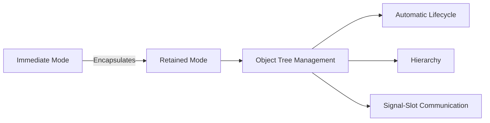
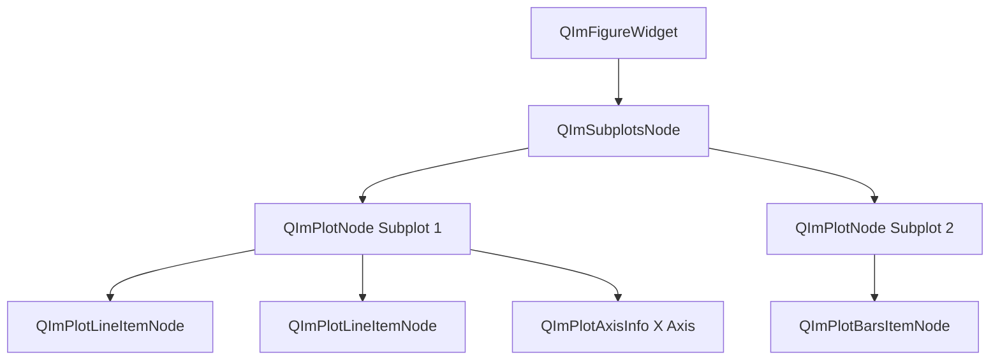
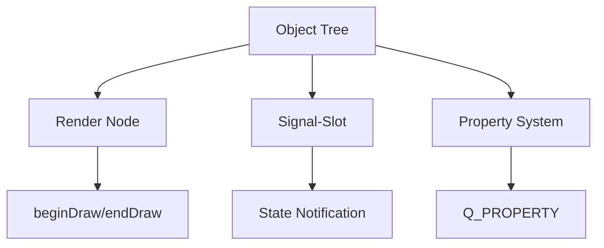

# Object Tree Management

QIm adopts Qt-style **Object Tree** mechanism to manage the lifecycle and hierarchy of UI components,
allowing developers familiar with Qt to get started quickly without learning a new management paradigm.

## Why Object Tree is Needed

ImGui natively uses immediate mode, where UI structures are rebuilt every frame during rendering, and no persistent component objects exist.
This design leads to several problems:

1. **Code Structure Chaos**: Nested Begin/End calls create "indentation hell"
2. **State Management Difficulty**: Window positions, collapse states, etc. need to be manually saved
3. **Poor Code Reusability**: Repetitive template code is difficult to abstract

QIm solves these problems through object tree encapsulation:



## Core Principles

### Design Philosophy

QIm maps each ImGui UI region (Window, Plot, Child, etc.) to a **Node Object**:
- Each node corresponds to a `QObject` derived class instance
- Parent-child relationships are automatically managed through Qt's object tree
- Nodes automatically clean up all child nodes when destroyed

### Object Tree Structure

A typical QIm plotting object tree structure is as follows:



Text representation:

```text
QImFigureWidget (Root Node - QWidget)
├── QImSubplotsNode (Subplot Layout Manager)
│   ├── QImPlotNode (Subplot 1)
│   │   ├── QImPlotLineItemNode (Curve A)
│   │   ├── QImPlotLineItemNode (Curve B)
│   │   ├── QImPlotAxisInfo (X1 Axis)
│   │   └── QImPlotAxisInfo (Y1 Axis)
│   └── QImPlotNode (Subplot 2)
│       ├── QImPlotBarsItemNode (Bar Chart)
│       └── QImPlotLegendNode (Legend)
└── [Other Top-Level Nodes...]
```

### Establishing Parent-Child Relationships

Parent-child relationships are automatically established through the `parent` parameter in the constructor when creating nodes:

```cpp
// Create plotting window as root node
QIM::QImFigureWidget* figure = new QIM::QImFigureWidget(this);  // figure as child object of MainWindow

// Create subplot node with figure as parent
QIM::QImPlotNode* plot = figure->createPlotNode();  // plot automatically becomes child of figure->subplotNode()

// Create curve node with plot as parent
QIM::QImPlotLineItemNode* line = new QIM::QImPlotLineItemNode(plot);  // line automatically becomes child of plot
```

!!! info "Note"
    QImAbstractNode maintains two sets of parent-child relationships:
    - **QObject Parent-Child Relationship**: Standard Qt object tree, controls memory lifecycle
    - **Logical Parent-Child Relationship**: Hierarchy during rendering, controls drawing order

## How to Apply

### Node Lifecycle Management

Thanks to Qt's object tree, destroying a node automatically cleans up all its child nodes:

```cpp
// When destroying a plot node, all its child nodes such as curves and axes are automatically destroyed
QIM::QImPlotNode* plot = figure->createPlotNode();
// ... add multiple child nodes ...
delete plot;  // All child nodes are automatically destroyed, no manual cleanup needed
```

### Manual Child Node Management

QImAbstractNode provides child node management API:

| Method | Description |
|--------|-------------|
| `addChildNode(child)` | Add child node |
| `removeChildNode(child)` | Remove child node (destroy) |
| `takeChildNode(child)` | Take child node (retain ownership) |
| `clearChildrenNodes()` | Clear all child nodes |
| `childrenNodes()` | Get child node list |
| `parentNode()` | Get parent node |

### Z-Order Control

Child nodes are sorted and rendered by Z-Order value, allowing control of drawing order:

```cpp
// Set Z-Order value, larger values are drawn later (overlay on top)
backgroundNode->setZOrder(0);
foregroundNode->setZOrder(100);
```

## Relationship with Related Concepts



!!! tip "Best Practices"
    - Always create nodes through the parent parameter, letting the object tree manage lifecycle
    - Avoid manually deleting child nodes unless early destruction is needed
    - Use takeChildNode() instead of removeChildNode() to retain node ownership

## References

- Related Documentation: [Render Node](render-node.md)
- API Reference: `QImAbstractNode` class documentation (generated by Doxygen)
