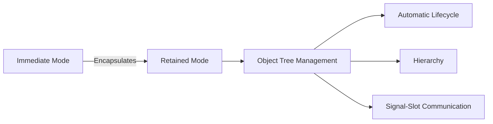
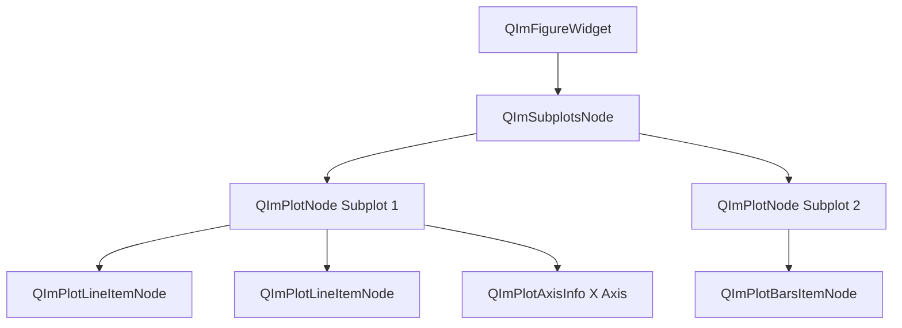
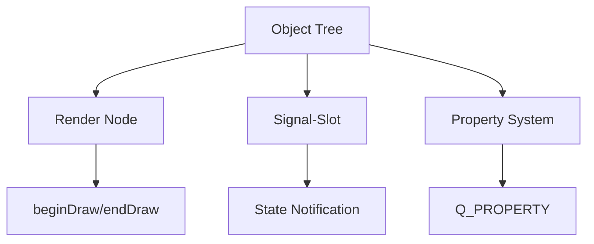

# Object Tree Management

QIm adopts Qt-style **Object Tree** mechanism to manage the lifecycle and hierarchy of UI components,
allowing developers familiar with Qt to get started quickly without learning a new management paradigm.

## Why Object Tree is Needed

ImGui natively uses immediate mode, where UI structures are rebuilt every frame during rendering, and no persistent component objects exist.
This design leads to several problems:

1. **Code Structure Chaos**: Nested Begin/End calls create "indentation hell"
2. **State Management Difficulty**: Window positions, collapse states, etc. need to be manually saved
3. **Poor Code Reusability**: Repetitive template code is difficult to abstract

QIm solves these problems through object tree encapsulation:


```mermaid
graph LR
    A[Immediate Mode] -->|Encapsulates | B[Retained Mode]
    B --> C[Object Tree Management]
    C --> D[Automatic Lifecycle]
    C --> E[Hierarchy]
    C --> F[Signal-Slot Communication]
```

## Core Principles

### Design Philosophy

QIm maps each ImGui UI region (Window, Plot, Child, etc.) to a **Node Object**:
- Each node corresponds to a `QObject` derived class instance
- Parent-child relationships are automatically managed through Qt's object tree
- Nodes automatically clean up all child nodes when destroyed

### Object Tree Structure

A typical QIm plotting object tree structure is as follows:


```mermaid
graph TD
    Root[QImFigureWidget] --> Subplot[QImSubplotsNode]
    Subplot --> Plot1[QImPlotNode Subplot 1]
    Subplot --> Plot2[QImPlotNode Subplot 2]
    Plot1 --> Line1[QImPlotLineItemNode]
    Plot1 --> Line2[QImPlotLineItemNode]
    Plot1 --> Axis1[QImPlotAxisInfo X Axis]
    Plot2 --> Bar1[QImPlotBarsItemNode]
```

Text representation:

```text
QImFigureWidget (Root Node - QWidget)
├── QImSubplotsNode (Subplot Layout Manager)
│   ├── QImPlotNode (Subplot 1)
│   │   ├── QImPlotLineItemNode (Curve A)
│   │   ├── QImPlotLineItemNode (Curve B)
│   │   ├── QImPlotAxisInfo (X1 Axis)
│   │   └── QImPlotAxisInfo (Y1 Axis)
│   └── QImPlotNode (Subplot 2)
│       ├── QImPlotBarsItemNode (Bar Chart)
│       └── QImPlotLegendNode (Legend)
└── [Other Top-Level Nodes...]
```

### Establishing Parent-Child Relationships

Parent-child relationships are automatically established through the `parent` parameter in the constructor when creating nodes:

```cpp
// Create plotting window as root node
QIM::QImFigureWidget* figure = new QIM::QImFigureWidget(this);  // figure as child object of MainWindow

// Create subplot node with figure as parent
QIM::QImPlotNode* plot = figure->createPlotNode();  // plot automatically becomes child of figure->subplotNode()

// Create curve node with plot as parent
QIM::QImPlotLineItemNode* line = new QIM::QImPlotLineItemNode(plot);  // line automatically becomes child of plot
```

!!! info "Note"
    QImAbstractNode maintains two sets of parent-child relationships:
    - **QObject Parent-Child Relationship**: Standard Qt object tree, controls memory lifecycle
    - **Logical Parent-Child Relationship**: Hierarchy during rendering, controls drawing order

## Complete Class Hierarchy

This section lists the complete inheritance relationships of all node classes in the QIm project, including 2D/3D plot items, interaction tools, container nodes, and helper classes.

### Node Inheritance Tree

```text
QImAbstractNode (Abstract Base Class ─ QObject-derived)
├── QImWidgetNode (ImGui Window Wrapper)
│
├── QImGridNode (General Grid Layout ─ can mix 2D/3D subplots)
│   ├── QImGridNode::CellNode (Inline Cell Node)
│   └── QImSubplots3DNode (3D Plot Grid)
│
├── QImSubplotsNode (2D Subplot Grid Layout)
│
├── QImPlotNode (2D Plot Area ─ BeginPlot/EndPlot scope)
│
├── QImPlotItemNode (2D Plot Item Base ─ type() base: 10)
│   │
│   │  ═══ 2D Plot Items ═══
│   ├── QImPlotLineItemNode       (type=11  Line Chart)
│   ├── QImPlotScatterItemNode    (type=12  Scatter Plot)
│   ├── QImPlotStairsItemNode     (type=13  Stairs Chart)
│   ├── QImPlotBarsItemNode       (type=14  Bar Chart)
│   ├── QImPlotShadedItemNode     (type=15  Shaded Fill Area)
│   ├── QImPlotErrorBarsItemNode  (type=16  Error Bars)
│   ├── QImPlotStemsItemNode      (type=17  Stem Plot)
│   ├── QImPlotInfLinesItemNode   (type=18  Infinite Horizontal/Vertical Lines)
│   ├── QImPlotDigitalItemNode    (type=18  Digital Signal)
│   ├── QImPlotTextItemNode       (type=19  Text Annotation)
│   ├── QImPlotDummyItemNode      (type=19  Placeholder/Colored Rectangle)
│   ├── QImPlotBarGroupsItemNode  (type=19  Grouped Bar Chart)
│   ├── QImPlotPieChartItemNode   (type=20  Pie Chart)
│   ├── QImPlotHeatmapItemNode    (type=20  Heatmap)
│   ├── QImPlotHistogramItemNode  (type=21  Histogram)
│   ├── QImPlotHistogram2DItemNode(type=22  2D Histogram)
│   ├── QImPlotImageItemNode      (type=23  Image)
│   │
│   │  ═══ 2D Interaction Tools ═══
│   ├── QImPlotDragPointNode      (type=30  Draggable Point)
│   ├── QImPlotDragLineXNode      (type=31  Draggable Vertical Line)
│   ├── QImPlotDragLineYNode      (type=32  Draggable Horizontal Line)
│   ├── QImPlotDragRectNode       (type=33  Draggable Rectangle Region)
│   ├── QImPlotAnnotationNode     (type=34  Floating Annotation)
│   ├── QImPlotTagXNode           (type=35  X-Axis Tag)
│   └── QImPlotTagYNode           (type=36  Y-Axis Tag)
│
├── QImPlotValueTrackerNode (Value Tracker ─ directly inherits QImAbstractNode, not QImPlotItemNode)
│
├── QImPlotLegendNode (Legend Node)
│
├── QImPlot3DNode (3D Plot Area ─ BeginPlot/EndPlot scope)
│
└── QImPlot3DItemNode (3D Plot Item Base ─ type() base: 1000)
    ├── QImPlot3DScatterItemNode   (type=1001  3D Scatter Plot)
    ├── QImPlot3DLineItemNode      (type=1002  3D Line Chart)
    ├── QImPlot3DSurfaceItemNode   (type=1003  3D Surface Plot)
    ├── QImPlot3DMeshItemNode      (type=1004  3D Mesh)
    ├── QImPlot3DTriangleItemNode  (type=1005  3D Triangle)
    ├── QImPlot3DQuadItemNode      (type=1006  3D Quadrilateral)
    ├── QImPlot3DImageItemNode     (type=1007  3D Image)
    ├── QImPlot3DTextItemNode      (type=1008  3D Text)
    └── QImPlot3DDummyItemNode     (type=1009  3D Placeholder Primitive)
```

### Mermaid Class Inheritance Diagram


```mermaid
classDiagram
    QObject <|-- QImAbstractNode

    QImAbstractNode <|-- QImWidgetNode
    QImAbstractNode <|-- QImGridNode
    QImAbstractNode <|-- QImSubplotsNode
    QImAbstractNode <|-- QImPlotNode
    QImAbstractNode <|-- QImPlotItemNode
    QImAbstractNode <|-- QImPlotValueTrackerNode
    QImAbstractNode <|-- QImPlotLegendNode
    QImAbstractNode <|-- QImPlot3DNode
    QImAbstractNode <|-- QImPlot3DItemNode

    QImGridNode <|-- QImSubplots3DNode

    QImPlotItemNode <|-- QImPlotLineItemNode
    QImPlotItemNode <|-- QImPlotScatterItemNode
    QImPlotItemNode <|-- QImPlotStairsItemNode
    QImPlotItemNode <|-- QImPlotBarsItemNode
    QImPlotItemNode <|-- QImPlotShadedItemNode
    QImPlotItemNode <|-- QImPlotErrorBarsItemNode
    QImPlotItemNode <|-- QImPlotStemsItemNode
    QImPlotItemNode <|-- QImPlotInfLinesItemNode
    QImPlotItemNode <|-- QImPlotDigitalItemNode
    QImPlotItemNode <|-- QImPlotTextItemNode
    QImPlotItemNode <|-- QImPlotDummyItemNode
    QImPlotItemNode <|-- QImPlotBarGroupsItemNode
    QImPlotItemNode <|-- QImPlotPieChartItemNode
    QImPlotItemNode <|-- QImPlotHeatmapItemNode
    QImPlotItemNode <|-- QImPlotHistogramItemNode
    QImPlotItemNode <|-- QImPlotHistogram2DItemNode
    QImPlotItemNode <|-- QImPlotImageItemNode
    QImPlotItemNode <|-- QImPlotDragPointNode
    QImPlotItemNode <|-- QImPlotDragLineXNode
    QImPlotItemNode <|-- QImPlotDragLineYNode
    QImPlotItemNode <|-- QImPlotDragRectNode
    QImPlotItemNode <|-- QImPlotAnnotationNode
    QImPlotItemNode <|-- QImPlotTagXNode
    QImPlotItemNode <|-- QImPlotTagYNode

    QImPlot3DItemNode <|-- QImPlot3DLineItemNode
    QImPlot3DItemNode <|-- QImPlot3DScatterItemNode
    QImPlot3DItemNode <|-- QImPlot3DSurfaceItemNode
    QImPlot3DItemNode <|-- QImPlot3DMeshItemNode
    QImPlot3DItemNode <|-- QImPlot3DTriangleItemNode
    QImPlot3DItemNode <|-- QImPlot3DQuadItemNode
    QImPlot3DItemNode <|-- QImPlot3DImageItemNode
    QImPlot3DItemNode <|-- QImPlot3DTextItemNode
    QImPlot3DItemNode <|-- QImPlot3DDummyItemNode
```

### Non-Node Helper Classes

The following classes do not inherit from `QImAbstractNode` and do not participate in the render tree traversal. They support the node system in different ways:

```text
QObject-Derived Helper Classes:
├── QImPlotAxisInfo             (2D Axis Properties ─ axis label, range, flags, scale type, etc.)
├── QImPlot3DAxisInfo           (3D Axis Properties ─ X/Y/Z three axes)
├── QImPlot3DStyleNode          (3D Style Properties ─ colors, line width, marker size, etc. ImPlot3DStyle fields)
└── QImPlotValueTrackerNodeGroup (Value Tracker Group ─ multi-subplot linked tracking)

Non-QObject Utility Classes:
├── QImPlotColormapManager      (2D Colormap Query and Registration ─ static methods, no inheritance)
├── QImPlot3DColormapManager    (3D Colormap Query and Registration ─ static methods, no inheritance)
└── QImPlotTheme                (2D Theme Manager ─ regular C++ class, uses PIMPL pattern)
```

!!! info "Meaning of type() Values"
    - **2D Plot Items** have `type()` starting from `QImPlotItemNode::InnerType = 10`, with each subclass offsetting from this base.
    - **2D Interaction Tools** start from `type = 30` to distinguish from regular plot items.
    - **3D Plot Items** have `type()` starting from `QImPlot3DItemNode::InnerType3D = 1000` to avoid conflicts with 2D types.
    - The `type()` method is used for fast runtime type identification, avoiding the overhead of `qobject_cast`/`dynamic_cast`.

## How to Apply

### Node Lifecycle Management

Thanks to Qt's object tree, destroying a node automatically cleans up all its child nodes:

```cpp
// When destroying a plot node, all its child nodes such as curves and axes are automatically destroyed
QIM::QImPlotNode* plot = figure->createPlotNode();
// ... add multiple child nodes ...
delete plot;  // All child nodes are automatically destroyed, no manual cleanup needed
```

### Manual Child Node Management

QImAbstractNode provides child node management API:

| Method | Description |
|--------|-------------|
| `addChildNode(child)` | Add child node |
| `removeChildNode(child)` | Remove child node (destroy) |
| `takeChildNode(child)` | Take child node (retain ownership) |
| `clearChildrenNodes()` | Clear all child nodes |
| `childrenNodes()` | Get child node list |
| `parentNode()` | Get parent node |

### Z-Order Control

Child nodes are sorted and rendered by Z-Order value, allowing control of drawing order:

```cpp
// Set Z-Order value, larger values are drawn later (overlay on top)
backgroundNode->setZOrder(0);
foregroundNode->setZOrder(100);
```

## Relationship with Related Concepts


```mermaid
graph TD
    A[Object Tree] --> B[Render Node]
    A --> C[Signal-Slot]
    A --> D[Property System]
    B --> E[beginDraw/endDraw]
    C --> F[State Notification]
    D --> G[Q_PROPERTY]
```

!!! tip "Best Practices"
    - Always create nodes through the parent parameter, letting the object tree manage lifecycle
    - Avoid manually deleting child nodes unless early destruction is needed
    - Use takeChildNode() instead of removeChildNode() to retain node ownership

## References

- Related Documentation: [Render Node](render-node.md)
- API Reference: `QImAbstractNode` class documentation (generated by Doxygen)
