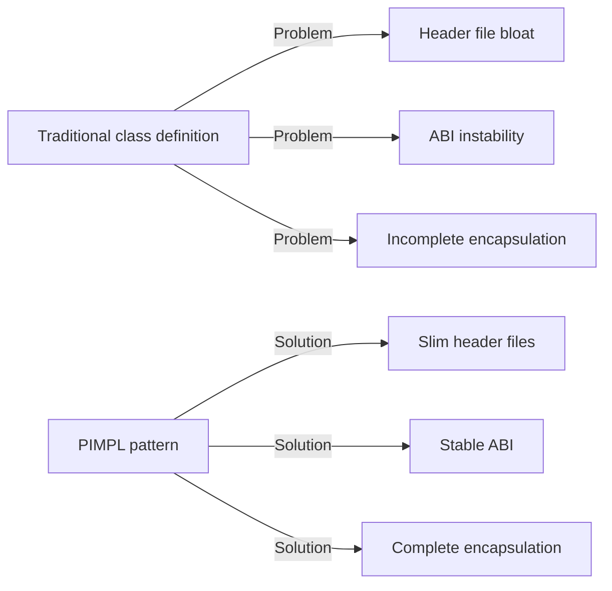
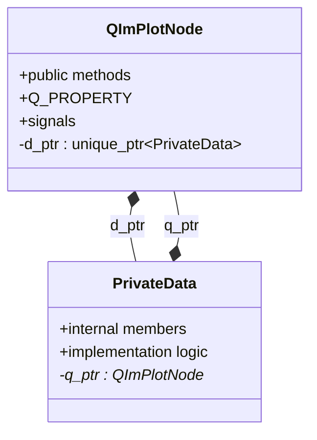

# PIMPL Pattern

QIm uses the **PIMPL (Pointer to Implementation)** pattern to encapsulate internal implementation details of classes, which is a widely used design pattern in the Qt framework that separates public interfaces from private implementations.

## Why PIMPL Is Needed

Traditional C++ class definitions have several problems:

1. **Header file bloat**: Private members are exposed in header files, increasing compilation dependencies
2. **ABI instability**: Private member changes break binary compatibility
3. **Incomplete encapsulation**: Users can see but shouldn't access certain members

PIMPL pattern solves these problems:



## Core Principles

### Design Philosophy

The PIMPL pattern splits a class into two parts:
- **Public class**: Declared in header file, provides user interface
- **Private implementation class**: Defined in cpp file, encapsulates implementation details



### QIm PIMPL Macros

QIm provides convenience macros to simplify PIMPL pattern implementation (defined in `QImAPI.h`):

| Macro | Purpose | Description |
|-------|---------|-------------|
| `QIM_DECLARE_PRIVATE(Class)` | Header file declaration | Declares PrivateData inner class and d_ptr member |
| `QIM_DECLARE_PUBLIC(Class)` | cpp file declaration | Declares q_ptr member in PrivateData |
| `QIM_PIMPL_CONSTRUCT` | Constructor usage | Initializes d_ptr |
| `QIM_D(name)` | Method usage | Gets PrivateData pointer |
| `QIM_DC(name)` | const method usage | Gets const PrivateData pointer |

### Usage Example

Header file declaration:

```cpp
class QImPlotNode : public QImAbstractNode
{
    Q_OBJECT
    QIM_DECLARE_PRIVATE(QImPlotNode)  // Declare PIMPL structure
    
    Q_PROPERTY(QString title READ title WRITE setTitle NOTIFY titleChanged)
public:
    QString title() const;
    void setTitle(const QString& title);
    // ...
};
```

cpp file implementation:

```cpp
// Private implementation class definition
class QImPlotNode::PrivateData
{
    QIM_DECLARE_PUBLIC(QImPlotNode)  // Declare q_ptr
    
public:
    PrivateData(QImPlotNode* p) : q_ptr(p) {}
    
    QString m_title;  // Private member
    QSizeF m_size;
    // Other implementation details...
};

// Constructor
QImPlotNode::QImPlotNode(QObject* parent) 
    : QImAbstractNode(parent)
    , QIM_PIMPL_CONSTRUCT  // Initialize d_ptr
{
}

// Use QIM_D to access private members in method implementation
QString QImPlotNode::title() const
{
    QIM_DC(d);  // Get const PrivateData pointer
    return d->m_title;
}

void QImPlotNode::setTitle(const QString& title)
{
    QIM_D(d);  // Get PrivateData pointer
    if (d->m_title != title) {
        d->m_title = title;
        Q_EMIT titleChanged(title);
    }
}
```

## How to Apply

### Using PIMPL in Custom Nodes

When inheriting QImAbstractNode to create custom nodes, it's recommended to use the PIMPL pattern:

```cpp
// CustomNode.h
class CustomNode : public QImAbstractNode
{
    Q_OBJECT
    QIM_DECLARE_PRIVATE(CustomNode)
    
public:
    explicit CustomNode(QObject* parent = nullptr);
    
    void setCustomProperty(int value);
    int customProperty() const;
    
protected:
    bool beginDraw() override;
    void endDraw() override;
};

// CustomNode.cpp
class CustomNode::PrivateData
{
    QIM_DECLARE_PUBLIC(CustomNode)
public:
    PrivateData(CustomNode* p) : q_ptr(p) {}
    
    int m_customValue = 0;
    ImGuiWindowFlags m_flags = 0;
};

CustomNode::CustomNode(QObject* parent)
    : QImAbstractNode(parent)
    , QIM_PIMPL_CONSTRUCT
{
}

bool CustomNode::beginDraw()
{
    QIM_D(d);
    return ImGui::Begin("CustomWindow", nullptr, d->m_flags);
}

void CustomNode::endDraw()
{
    ImGui::End();
}
```

!!! tip "Best Practices"
    - Put all state-storing member variables in the PrivateData class
    - Access private members through QIM_D/QIM_DC in public methods
    - Signal emission is handled in public methods; PrivateData should not directly emit

## References

- Related docs: [Render Node](render-node.md)
- API reference: Macro definitions in `QImAPI.h`