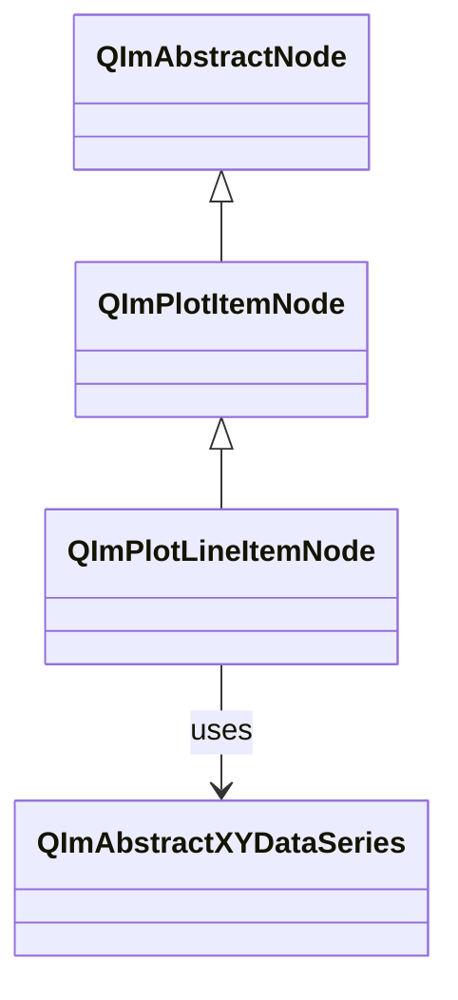

# Line Plot Usage Guide

`QImPlotLineItemNode` is the most commonly used plotting component in QIm for drawing line charts and curves.

## Main Features

**Features**

- ✅ **Efficient Rendering**: High-performance rendering for large datasets (million-level points)
- ✅ **Adaptive Sampling**: Built-in LTTB downsampling algorithm for automatic performance optimization
- ✅ **Style Configuration**: Color, line width, fill and other style settings
- ✅ **Qt Property Integration**: All configurable properties exposed via Q_PROPERTY

## Basic Concepts

### Class Inheritance



## Usage

### 1. Basic Usage

Quick creation via `QImPlotNode::addLine()`:

```cpp
// Create plot node
QIM::QImPlotNode* plot = figure->createPlotNode();
plot->setTitle("Example Chart");

// Method 1: Pass data arrays directly
QVector<double> x = {0, 1, 2, 3, 4};
QVector<double> y = {0, 1, 4, 9, 16};
plot->addLine(x, y, "Quadratic Curve");

// Method 2: Use std::vector
std::vector<double> x2 = {0, 1, 2, 3, 4};
std::vector<double> y2 = {0, 2, 4, 6, 8};
plot->addLine(x2, y2, "Linear Curve");
```

### 2. Manual Node Creation

More flexible control:

```cpp
// Manually create line node
QIM::QImPlotLineItemNode* line = new QIM::QImPlotLineItemNode(plot);
line->setLabel("Custom Curve");
line->setData(x, y);
line->setColor(QColor(255, 0, 0));  // Red

// Add to plot
plot->addPlotItem(line);
```

### 3. Style Settings

```cpp
// Set color
line->setColor(QColor(0, 100, 200));

// Enable shaded fill
line->setShaded(true);

// Enable loop mode (connect first and last points)
line->setLoop(true);

// Skip NaN values
line->setSkipNaN(true);
```

## Properties

| Property | Type | Getter | Setter | Description |
|----------|------|--------|--------|-------------|
| label | QString | `label()` | `setLabel()` | Legend label |
| segments | bool | `isSegments()` | `setSegments()` | Segment drawing |
| loop | bool | `isLoop()` | `setLoop()` | Loop mode |
| skipNaN | bool | `isSkipNaN()` | `setSkipNaN()` | Skip NaN |
| shaded | bool | `isShaded()` | `setShaded()` | Shaded fill |
| adaptiveSampling | bool | `isAdaptiveSampling()` | `setAdaptivesSampling()` | Adaptive sampling |
| color | QColor | `color()` | `setColor()` | Line color |

!!! tip "Adaptive Sampling"
    LTTB adaptive sampling is enabled by default, automatically downsampling large datasets for smooth rendering.
    For small datasets (<100K points), disable for precise rendering: `line->setAdaptivesSampling(false)`

## References

- Related docs: [Data Series](data-series.md), [Downsampling](downsampling.md)
- API Reference: `src/core/plot/QImPlotLineItemNode.h`