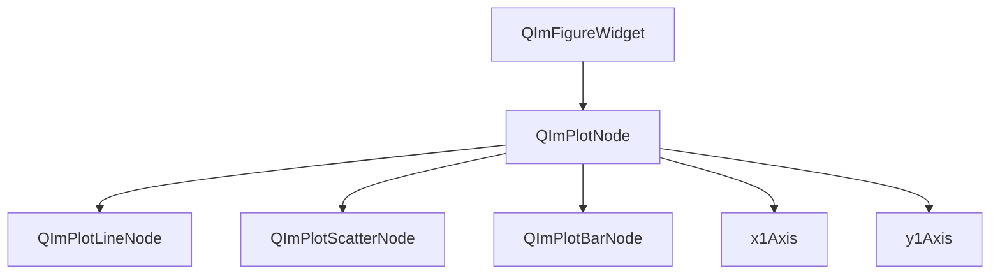

# 2D Plot Module

QIm's 2D plot module is based on `ImPlot`, providing complete 2D data visualization capabilities including line charts, scatter plots, bar charts, heatmaps, and other common chart types. All plot components are presented as Qt node objects, supporting signal-slot interaction and property system configuration.

## Key Features

**Features**

- ✅ **Figure Widget**: Qt Widget-style plot window that can be directly embedded into Qt applications
- ✅ **Line Charts**: Support for multiple overlapping curves with custom styles and labels
- ✅ **Data Series**: Flexible data input interface supporting multiple data types
- ✅ **Downsampling**: Built-in LTTB algorithm for efficient rendering of million-level data
- ✅ **Subplot Layout**: Support for multi-row multi-column subplot arrangement
- ✅ **Axis Configuration**: Independent X/Y axis property system
- ✅ **Interactive Operations**: Box selection, zoom, drag, and other mouse interactions

## Module Architecture

The object tree structure of the 2D plot module:



## Documentation Navigation

| Document | Description |
|----------|-------------|
| [Figure Widget](figure-widget.md) | Usage of the plot window component |
| [Line Plot](plot-line.md) | Detailed configuration of line chart data series |
| [Data Series](data-series.md) | Data input interface and type descriptions |
| [Downsampling](downsampling.md) | Large-scale data downsampling optimization strategies |

## Quick Example

```cpp
#include <QImFigureWidget.h>

// Create plot window
QIM::QImFigureWidget* figure = new QIM::QImFigureWidget(this);
setCentralWidget(figure);

// Configure 2x1 subplot grid
figure->setSubplotGrid(2, 1);

// Create first subplot and add curve
QIM::QImPlotNode* plot1 = figure->createPlotNode();
plot1->x1Axis()->setLabel("Time (s)");
plot1->y1Axis()->setLabel("Amplitude");

QVector<double> x = {0, 1, 2, 3, 4};
QVector<double> y = {0, 1, 4, 9, 16};
plot1->addLine(x, y, "Quadratic Curve");
```

## References

- Core Concepts: [Render Node](../render-node.md), [Object Tree](../object-tree.md)
- Example Code: `examples/qimfigure-test`