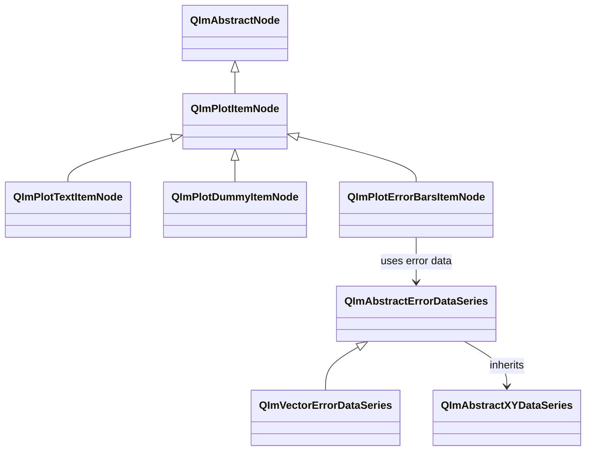
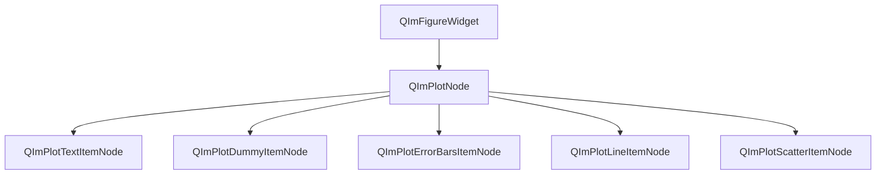
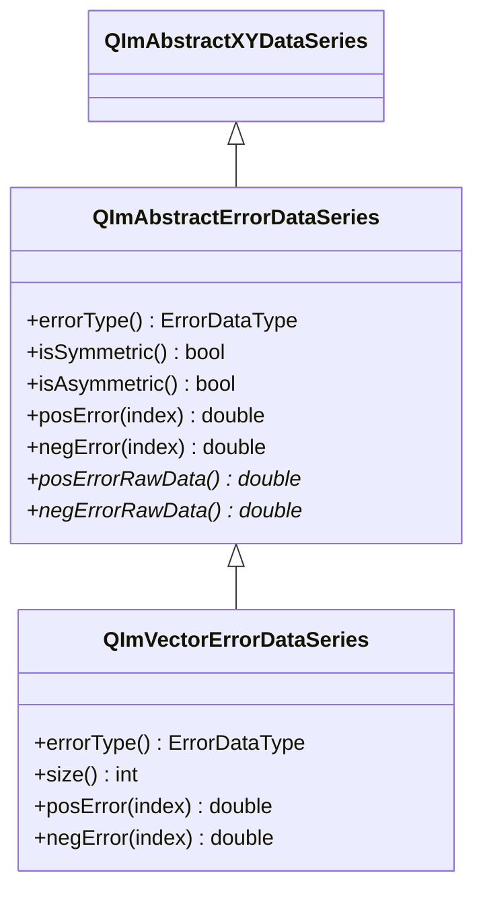

# 2D Annotations Usage Guide

QIm provides three types of 2D annotation nodes for adding text labels, legend placeholders, and error bars to plot areas,
corresponding to ImPlot's Text, Dummy, and ErrorBars plot items respectively.
These annotation nodes inherit from `QImPlotItemNode` and follow QIm's object tree management mechanism and PIMPL design pattern.

## Main Features

**Features**

- ✅ **Text Labels (Text)**: Render text at plot coordinates, support pixel offset fine positioning and vertical orientation
- ✅ **Dummy Items (Dummy)**: Only create placeholder entries in the legend, render no graphics — used for custom legend annotations
- ✅ **Error Bars (ErrorBars)**: Support symmetric and asymmetric error modes, switchable vertical/horizontal orientation, often paired with scatter or line charts
- ✅ **Property System**: All annotation properties exposed via Q_PROPERTY, supporting signal-slot reactive programming
- ✅ **Object Tree Management**: Annotation nodes created with `QImPlotNode` as parent automatically join the object tree

## Basic Concepts

### Class Inheritance



All three annotation nodes inherit from `QImPlotItemNode`, sharing base class common properties such as `label` and `visible`.
`QImPlotErrorBarsItemNode` uses `QImAbstractErrorDataSeries` to manage error data,
whose concrete implementation `QImVectorErrorDataSeries` supports both symmetric and asymmetric error modes.

### Object Tree Layout

The position of annotation nodes in the QIm object tree:



**Object tree notes:**

- Annotation nodes specify `QImPlotNode` as parent via the constructor, automatically joining the object tree
- `QImPlotErrorBarsItemNode` is typically placed alongside scatter or line charts, sharing the same parent node
- `QImPlotDummyItemNode` only affects the legend and does not affect rendering of other child nodes in the plot area

## QImPlotTextItemNode

`QImPlotTextItemNode` encapsulates ImPlot text labels, rendering centered text at specified plot coordinates,
with optional pixel offset and vertical orientation. Suitable for annotating data points, marking feature regions, or adding descriptive text.

### Basic Usage

This component's example is located in TextFunction within `examples/qimfigure-test`, with the following screenshot:


Create a text label and position it at plot coordinates:

```cpp
#include "QImFigureWidget.h"
#include "plot/QImPlotNode.h"
#include "plot/QImPlotTextItemNode.h"

// Create plot node as parent
QIM::QImPlotNode* plot = figure->createPlotNode();
plot->setTitle("Text Annotation Example");
plot->setLegendEnabled(false);

// Create text label, specifying plot as parent
QIM::QImPlotTextItemNode* textNode = new QIM::QImPlotTextItemNode(plot);
textNode->setLabel("Text Label");
textNode->setText("Key Data Point");          // Set text content
textNode->setPosition(5.0, 3.0);              // Set plot coordinate position
textNode->setColor(QColor(255, 0, 0));        // Set text color

// Effect: Red text "Key Data Point" displayed at plot coordinate (5.0, 3.0)
// Object tree structure: figure → plot → textNode
```

### Pixel Offset Positioning

`position` uses the plot coordinate system (same coordinate space as data points), while `pixelOffset` uses the screen pixel coordinate system.
The two combined achieve precise positioning: first anchor at plot coordinates, then fine-tune the display position with pixel offset.

```cpp
// Annotate near a data point, use pixel offset to avoid occlusion
textNode->setPosition(3.14, 1.0);       // Anchor at plot coordinate (3.14, 1.0)
textNode->setPixelOffset(10.0f, -5.0f);  // Offset 10 pixels right, 5 pixels up

// Effect: Text label displayed to the upper-right of (3.14, 1.0), avoiding overlap with data point
```

!!! info "Difference Between position and pixelOffset"
    - `position`: Plot coordinate system, changes with zoom and pan. Suitable for annotating specific data positions
    - `pixelOffset`: Screen pixel coordinate system, unaffected by zoom. Suitable for fine-tuning text-to-anchor relative distance

### Vertical Text

Set the `vertical` property to rotate text 90° for vertical display:

```cpp
// Horizontal text (default)
textNode->setVertical(false);  // Text displayed horizontally

// Vertical text
textNode->setVertical(true);   // Text rotated 90° for vertical display
```

### Property List

| Property | Type | Getter | Setter | Signal | Description |
|------|------|--------|--------|------|------|
| text | QString | `text()` | `setText()` | `textChanged` | Text content |
| position | QPointF | `position()` | `setPosition()` | `positionChanged` | Plot coordinate position |
| pixelOffset | QPointF | `pixelOffset()` | `setPixelOffset()` | `pixelOffsetChanged` | Screen pixel offset |
| vertical | bool | `isVertical()` | `setVertical()` | `verticalChanged` | Whether displayed vertically |
| color | QColor | `color()` | `setColor()` | `colorChanged` | Text color |

!!! info "Convenience Overloads"
    - `setPosition(double x, double y)`: Accepts double-precision coordinates instead of QPointF
    - `setPixelOffset(float dx, float dy)`: Accepts float offsets instead of QPointF

### Method List

| Method | Parameters | Description |
|------|------|------|
| `setText(text)` | QString | Set text content |
| `text()` | - | Get text content |
| `setPosition(pos)` | QPointF | Set plot coordinate position |
| `setPosition(x, y)` | double, double | Set plot coordinate position (convenience overload) |
| `position()` | - | Get plot coordinate position |
| `setPixelOffset(offset)` | QPointF | Set screen pixel offset |
| `setPixelOffset(dx, dy)` | float, float | Set screen pixel offset (convenience overload) |
| `pixelOffset()` | - | Get screen pixel offset |
| `setVertical(vertical)` | bool | Set vertical orientation |
| `isVertical()` | - | Check if vertical |
| `setColor(color)` | QColor | Set text color |
| `color()` | - | Get text color |
| `textFlags()` | - | Get raw ImPlotTextFlags |
| `setTextFlags(flags)` | int | Set raw ImPlotTextFlags |

### Signal List

| Signal | Parameters | Trigger Timing |
|------|------|----------|
| `textChanged(text)` | QString | When text content changes |
| `positionChanged(pos)` | QPointF | When plot coordinate position changes |
| `pixelOffsetChanged(offset)` | QPointF | When screen pixel offset changes |
| `verticalChanged(vertical)` | bool | When vertical orientation state changes |
| `colorChanged(color)` | QColor | When text color changes |
| `textFlagChanged()` | - | When any text flag property changes |

```cpp
// Monitor text position changes
connect(textNode, &QIM::QImPlotTextItemNode::positionChanged,
        this, [](const QPointF& newPos) {
    qDebug() << "Text position updated to:" << newPos;
});
```

!!! warning "textFlagChanged Signal"
    All text flag properties (vertical, etc.) share the `textFlagChanged()` signal.
    This signal does not indicate which specific flag changed. Connected slots must query the relevant properties to determine what changed.

### Example Code

Complete example from `examples/qimfigure-test/functions/other/TextFunction.cpp`:

```cpp
void TextFunction::createPlot(QIM::QImFigureWidget* figure)
{
    // Create plot node
    m_plotNode = figure->createPlotNode();
    
    // Configure axes and title
    m_plotNode->x1Axis()->setLabel(m_xLabel);
    m_plotNode->y1Axis()->setLabel(m_yLabel);
    m_plotNode->setTitle(m_title);
    m_plotNode->setLegendEnabled(false);
    
    // Set plot range
    m_plotNode->x1Axis()->setLimits(-10.0, 10.0);
    m_plotNode->y1Axis()->setLimits(-10.0, 10.0);
    
    // Create text label node
    m_textNode = new QIM::QImPlotTextItemNode(m_plotNode);  // Specify plot as parent
    m_textNode->setLabel("Text Label");
    m_textNode->setText(m_text);
    m_textNode->setPosition(m_textX, m_textY);              // Plot coordinate positioning
    m_textNode->setPixelOffset(m_pixelOffsetX, m_pixelOffsetY); // Pixel offset fine-tuning
    m_textNode->setVertical(m_vertical);                     // Vertical orientation control
    m_textNode->setColor(m_textColor);                       // Text color
}
```

## QImPlotDummyItemNode

`QImPlotDummyItemNode` is a special annotation node that only creates placeholder entries with color icons in the legend,
without rendering any visible graphics in the plot area.

### Design Purpose

The core purpose of dummy items is to add custom annotation entries to the legend without associating them with actual plot data:

- Adding legend descriptions for manual annotations
- Representing category identifiers for grouped data
- Serving as separator or hint entries in the legend

```text
Plot area: Only line data displayed (dummy items render nothing)
Legend area:
┌─────────────────────┐
│ ── Sine Wave        │ ← Line chart legend entry
│ ■ Reference         │ ← Dummy item legend entry (only icon + label)
└─────────────────────┘
```

!!! info "Dummy Items Render No Graphics"
    `QImPlotDummyItemNode` only creates an entry with a color icon and label in the legend.
    No corresponding graphical element appears in the plot area.

### Basic Usage

This component's example is located in DummyFunction within `examples/qimfigure-test`, with the following screenshot:


Create a dummy item as a legend placeholder:

```cpp
#include "QImFigureWidget.h"
#include "plot/QImPlotNode.h"
#include "plot/QImPlotLineItemNode.h"
#include "plot/QImPlotDummyItemNode.h"

// Create plot node
QIM::QImPlotNode* plot = figure->createPlotNode();
plot->setTitle("Dummy Item Example");
plot->setLegendEnabled(true);  // Must enable legend to see dummy items

// Create line chart data
std::vector<double> xData, yData;
for (int i = 0; i < 200; ++i) {
    xData.push_back(i * 0.05);
    yData.push_back(std::sin(xData[i]) * 5.0);
}

// Create line node
QIM::QImPlotLineItemNode* lineNode = new QIM::QImPlotLineItemNode(plot);
lineNode->setLabel("Sine Wave");
lineNode->setData(xData, yData);
lineNode->setColor(QColor(0, 114, 189));

// Create dummy node, only as legend placeholder
QIM::QImPlotDummyItemNode* dummyNode = new QIM::QImPlotDummyItemNode(plot);
dummyNode->setLabel("Reference");         // Label displayed in legend
dummyNode->setColor(QColor(255, 165, 0)); // Legend icon color

// Effect: Two entries in the legend — line "Sine Wave" and dummy "Reference"
// Plot area only shows line data; dummy renders no graphics
// Object tree structure: figure → plot → lineNode, dummyNode
```

!!! warning "Legend Must Be Enabled"
    Dummy items are only visible in the legend. If `QImPlotNode`'s `legendEnabled` is `false`,
    the dummy item will be completely invisible. Ensure the legend is enabled before creating dummy items:
    ```cpp
    plot->setLegendEnabled(true);  // Enable legend
    ```

### Property List

| Property | Type | Getter | Setter | Signal | Description |
|------|------|--------|--------|------|------|
| color | QColor | `color()` | `setColor()` | `colorChanged` | Legend icon color |

!!! info "label Property"
    The `label` property is inherited from the `QImPlotItemNode` base class. Use `setLabel()` to set the legend label text,
    and `label()` to get the label. This is the most important property of dummy items, determining the text displayed in the legend.

### Method List

| Method | Parameters | Description |
|------|------|------|
| `setColor(color)` | QColor | Set legend icon color |
| `color()` | - | Get legend icon color |
| `dummyFlags()` | - | Get raw ImPlotDummyFlags |
| `setDummyFlags(flags)` | int | Set raw ImPlotDummyFlags |

### Signal List

| Signal | Parameters | Trigger Timing |
|------|------|----------|
| `colorChanged(color)` | QColor | When legend icon color changes |
| `dummyFlagsChanged()` | - | When dummy item flags change |

```cpp
// Monitor dummy item color changes
connect(dummyNode, &QIM::QImPlotDummyItemNode::colorChanged,
        this, [](const QColor& newColor) {
    qDebug() << "Dummy item color updated to:" << newColor.name();
});
```

!!! warning "dummyFlagsChanged Signal"
    All dummy item flag properties share the `dummyFlagsChanged()` signal.
    This signal does not indicate which specific flag changed. Connected slots must query the relevant properties to determine what changed.

### Example Code

Complete example from `examples/qimfigure-test/functions/other/DummyFunction.cpp`:

```cpp
void DummyFunction::createPlot(QIM::QImFigureWidget* figure)
{
    // Create plot node
    m_plotNode = figure->createPlotNode();
    
    // Configure axes and title
    m_plotNode->x1Axis()->setLabel(m_xLabel);
    m_plotNode->y1Axis()->setLabel(m_yLabel);
    m_plotNode->setTitle(m_title);
    m_plotNode->setLegendEnabled(true);  // Enable legend to show dummy items
    
    // Generate 200-point sine wave data
    const int numPoints = 200;
    std::vector<double> xData(numPoints);
    std::vector<double> yData(numPoints);
    for (int i = 0; i < numPoints; ++i) {
        xData[i] = i * 0.05;
        yData[i] = std::sin(xData[i]) * 5.0;
    }
    
    // Create line node as background data
    m_lineNode = new QIM::QImPlotLineItemNode(m_plotNode);
    m_lineNode->setLabel("Sine Wave");
    m_lineNode->setData(xData, yData);
    m_lineNode->setColor(m_lineColor);
    
    // Create dummy node, only as legend placeholder
    m_dummyNode = new QIM::QImPlotDummyItemNode(m_plotNode);  // Specify plot as parent
    m_dummyNode->setLabel("Reference");       // Legend label
    m_dummyNode->setColor(m_dummyColor);      // Legend icon color
    
    // Create value tracker
    m_trackerNode = new QIM::QImPlotValueTrackerNode(m_plotNode);
    m_trackerNode->setGroup(nullptr);
    m_plotNode->addChildNode(m_trackerNode);
}
```

## QImPlotErrorBarsItemNode

`QImPlotErrorBarsItemNode` encapsulates ImPlot error bars, supporting both symmetric and asymmetric error modes,
as well as vertical and horizontal orientation. Error bars are typically paired with scatter or line charts
to visualize data uncertainty or measurement error.

### Error Mode

#### Symmetric Error Mode

In symmetric mode, the upper and lower (or left and right) error for each data point is the same,
set via `setData(x, y, errors)`:

```text
        │  ← upper error = errors[i]
    ●───┤
        │  ← lower error = errors[i]
```

```cpp
// Symmetric error: upper and lower error are the same
std::vector<double> x = {0, 1, 2, 3};
std::vector<double> y = {1.0, 2.5, 4.0, 6.5};
std::vector<double> errors = {0.2, 0.3, 0.4, 0.5};  // Upper and lower error are this value

QIM::QImPlotErrorBarsItemNode* errorBars = new QIM::QImPlotErrorBarsItemNode(plot);
errorBars->setLabel("Symmetric Error");
errorBars->setData(x, y, errors);  // 3 parameters: symmetric mode
// errorBars->isAsymmetricMode() returns false
```

#### Asymmetric Error Mode

In asymmetric mode, the upper and lower (or left and right) error for each data point differs,
set via `setData(x, y, negErrors, posErrors)`:

```text
        │  ← upper error = posErrors[i] (larger)
    ●───┤
        │  ← lower error = negErrors[i] (smaller)
```

```cpp
// Asymmetric error: upper and lower error differ
std::vector<double> x = {0, 1, 2, 3};
std::vector<double> y = {1.0, 2.5, 4.0, 6.5};
std::vector<double> negErrors = {0.1, 0.15, 0.2, 0.25};  // Lower error (smaller)
std::vector<double> posErrors = {0.3, 0.45, 0.6, 0.75};  // Upper error (larger)

QIM::QImPlotErrorBarsItemNode* errorBars = new QIM::QImPlotErrorBarsItemNode(plot);
errorBars->setLabel("Asymmetric Error");
errorBars->setData(x, y, negErrors, posErrors);  // 4 parameters: asymmetric mode
// errorBars->isAsymmetricMode() returns true
```

!!! warning "Asymmetric Error Array Size"
    In asymmetric error mode, the `negErrors` and `posErrors` array sizes must match the `x` and `y` arrays.
    Size mismatches will cause rendering errors or data truncation.

!!! info "isAsymmetricMode Property"
    `isAsymmetricMode()` returns `true` when using asymmetric error mode,
    and `false` when using symmetric error mode. This property is automatically determined by the `setData()` call
    and cannot be manually set.

### Direction Control

Error bars default to vertical display (along Y axis direction). Set the `horizontal` property to switch to horizontal direction (along X axis direction):

```text
Vertical error bars (default):     Horizontal error bars:
        │                           ───●───
    ●───┤                           ← left error   right error →
        │
```

```cpp
// Vertical error bars (default)
errorBars->setHorizontal(false);  // Error bars displayed along Y axis direction

// Horizontal error bars
errorBars->setHorizontal(true);   // Error bars displayed along X axis direction
```

### Basic Usage

This component's example is located in ErrorBarsFunction in `examples/qimfigure-test`, with the following screenshot:


Create error bars and pair with a scatter chart:

```cpp
#include "QImFigureWidget.h"
#include "plot/QImPlotNode.h"
#include "plot/QImPlotScatterItemNode.h"
#include "plot/QImPlotErrorBarsItemNode.h"

// Create plot node
QIM::QImPlotNode* plot = figure->createPlotNode();
plot->setTitle("Error Bars Example");
plot->setLegendEnabled(true);

// Generate data
const int numPoints = 10;
std::vector<double> xData(numPoints);
std::vector<double> yData(numPoints);
std::vector<double> errors(numPoints);
for (int i = 0; i < numPoints; ++i) {
    xData[i] = i;
    yData[i] = static_cast<double>(i * i) / 5.0 + 2.0;
    errors[i] = 0.5 + static_cast<double>(i) * 0.1;
}

// Create scatter chart node
QIM::QImPlotScatterItemNode* scatter = new QIM::QImPlotScatterItemNode(plot);
scatter->setLabel("Data Points");
scatter->setData(xData, yData);
scatter->setMarkerSize(6.0f);
scatter->setColor(Qt::blue);

// Create symmetric error bars node
QIM::QImPlotErrorBarsItemNode* errorBars = new QIM::QImPlotErrorBarsItemNode(plot);
errorBars->setLabel("Symmetric Error");
errorBars->setData(xData, yData, errors);  // 3 parameters: symmetric mode
errorBars->setColor(QColor(200, 50, 50));

// Effect: Vertical error bars displayed on scatter chart, each data point's upper and lower error is the same
// Object tree structure: figure → plot → scatter, errorBars
```

### Error Data Series

`QImPlotErrorBarsItemNode` uses `QImAbstractErrorDataSeries` to manage error data.
The `setData()` template method internally creates `QImVectorErrorDataSeries` objects:



**QImAbstractErrorDataSeries Key Interfaces:**

| Method | Description |
|------|------|
| `errorType()` | Returns `SymmetricError` or `AsymmetricError` |
| `isSymmetric()` | Returns `true` for symmetric error mode |
| `isAsymmetric()` | Returns `true` for asymmetric error mode |
| `posError(index)` | Get positive error value at specified index |
| `negError(index)` | Get negative error value at specified index (same as positive error in symmetric mode) |

!!! info "setData() Container Support"
    `setData()` is a template method that supports `std::vector<double>`, `QVector<double>`, and other container types.
    The container's `value_type` must be `double`. It internally creates a `QImVectorErrorDataSeries` and takes over the data lifecycle.

### Property List

| Property | Type | Getter | Setter | Signal | Description |
|------|------|--------|--------|------|------|
| horizontal | bool | `isHorizontal()` | `setHorizontal()` | `orientationChanged` | Horizontal orientation flag |
| color | QColor | `color()` | `setColor()` | `colorChanged` | Error bar color |
| isAsymmetricMode | bool | `isAsymmetricMode()` | - | - | Asymmetric error mode flag (read-only) |

!!! info "isAsymmetricMode Is Read-Only"
    `isAsymmetricMode()` is a read-only property and cannot be set via a setter.
    Its value is automatically determined by the `setData()` call: 3 parameters = symmetric mode (`false`), 4 parameters = asymmetric mode (`true`).

### Method List

| Method | Parameters | Description |
|------|------|------|
| `setData(errorDataSeries)` | `QImAbstractErrorDataSeries*` | Set error data series object |
| `setData(x, y, errors)` | Container, Container, Container | Symmetric error: 3-parameter template method |
| `setData(x, y, negErrors, posErrors)` | Container, Container, Container, Container | Asymmetric error: 4-parameter template method |
| `data()` | - | Get error data series object |
| `setHorizontal(horizontal)` | bool | Set horizontal orientation flag |
| `isHorizontal()` | - | Check if horizontal |
| `setColor(color)` | QColor | Set error bar color |
| `color()` | - | Get error bar color |
| `isAsymmetricMode()` | - | Check if asymmetric error mode |
| `errorBarsFlags()` | - | Get raw ImPlotErrorBarsFlags |
| `setErrorBarsFlags(flags)` | int | Set raw ImPlotErrorBarsFlags |

### Signal List

| Signal | Parameters | Trigger Timing |
|------|------|----------|
| `orientationChanged(horizontal)` | bool | When direction changes |
| `colorChanged(color)` | QColor | When error bar color changes |
| `dataChanged()` | - | When data series changes |
| `errorBarsFlagChanged()` | - | When any error bar flag changes |

```cpp
// Monitor direction changes
connect(errorBars, &QIM::QImPlotErrorBarsItemNode::orientationChanged,
        this, [](bool horizontal) {
    qDebug() << "Error bars direction switched to:" << (horizontal ? "Horizontal" : "Vertical");
});

// Monitor data changes
connect(errorBars, &QIM::QImPlotErrorBarsItemNode::dataChanged,
        this, [errorBars]() {
    qDebug() << "Error data updated, asymmetric mode:" << errorBars->isAsymmetricMode();
});
```

!!! warning "errorBarsFlagChanged Signal"
    All error bar flag properties (horizontal, etc.) share the `errorBarsFlagChanged()` signal.
    This signal does not indicate which specific flag changed. Connected slots must query the relevant properties to determine what changed.

### Example Code

Complete example from `examples/qimfigure-test/functions/error/ErrorBarsFunction.cpp`:

```cpp
void ErrorBarsFunction::createPlot(QIM::QImFigureWidget* figure)
{
    // Create plot node
    m_plotNode = figure->createPlotNode();
    
    // Configure axes and title
    m_plotNode->x1Axis()->setLabel(m_xLabel);
    m_plotNode->y1Axis()->setLabel(m_yLabel);
    m_plotNode->setTitle(m_title);
    m_plotNode->setLegendEnabled(true);
    
    // Generate data: 10 data points
    const int numPoints = 10;
    std::vector<double> xData(numPoints);
    std::vector<double> yData(numPoints);
    std::vector<double> errors(numPoints);       // Symmetric error
    std::vector<double> negErrors(numPoints);    // Asymmetric lower error
    std::vector<double> posErrors(numPoints);    // Asymmetric upper error
    
    for (int i = 0; i < numPoints; ++i) {
        xData[i] = i;
        yData[i] = static_cast<double>(i * i) / 5.0 + 2.0;
        errors[i] = 0.5 + static_cast<double>(i) * 0.1;           // Symmetric error
        negErrors[i] = 0.3 + static_cast<double>(i) * 0.05;       // Lower error (smaller)
        posErrors[i] = 0.7 + static_cast<double>(i) * 0.15;       // Upper error (larger)
    }
    
    // Add scatter chart 1 as base data
    m_scatterNode1 = new QIM::QImPlotScatterItemNode(m_plotNode);
    m_scatterNode1->setLabel("Data Points");
    m_scatterNode1->setData(xData, yData);
    m_scatterNode1->setMarkerSize(6.0f);
    m_scatterNode1->setMarkerShape(ImPlotMarker_Circle);
    m_scatterNode1->setColor(Qt::blue);
    
    // Add symmetric error bars (vertical direction, default)
    m_errorBarsNode1 = new QIM::QImPlotErrorBarsItemNode(m_plotNode);
    m_errorBarsNode1->setLabel("Symmetric Errors");
    m_errorBarsNode1->setData(xData, yData, errors);  // 3 parameters: symmetric mode
    m_errorBarsNode1->setColor(m_errorColor);
    
    // Generate X offset data to avoid overlap
    std::vector<double> xOffset(numPoints);
    for (int i = 0; i < numPoints; ++i) {
        xOffset[i] = xData[i] + 0.3;
    }
    
    // Add scatter chart 2 (X offset)
    m_scatterNode2 = new QIM::QImPlotScatterItemNode(m_plotNode);
    m_scatterNode2->setLabel("Data Points 2");
    m_scatterNode2->setData(xOffset, yData);
    m_scatterNode2->setMarkerSize(6.0f);
    m_scatterNode2->setMarkerShape(ImPlotMarker_Square);
    m_scatterNode2->setColor(Qt::green);
    
    // Add asymmetric horizontal error bars
    m_errorBarsNode2 = new QIM::QImPlotErrorBarsItemNode(m_plotNode);
    m_errorBarsNode2->setLabel("Asymmetric Horizontal");
    m_errorBarsNode2->setData(xOffset, yData, negErrors, posErrors);  // 4 parameters: asymmetric mode
    m_errorBarsNode2->setHorizontal(m_horizontalMode);  // Horizontal direction
    m_errorBarsNode2->setColor(Qt::darkGreen);
    
    // Add value tracker
    m_trackerNode = new QIM::QImPlotValueTrackerNode(m_plotNode);
    m_trackerNode->setGroup(nullptr);
    m_plotNode->addChildNode(m_trackerNode);
}
```

## Signal-Slot Connections

The three annotation node types use signals consistently, all following Qt's signal-slot mechanism:

```cpp
// Text signal connection
connect(textNode, &QIM::QImPlotTextItemNode::positionChanged,
        this, &MyClass::onTextPositionChanged);

// Dummy signal connection
connect(dummyNode, &QIM::QImPlotDummyItemNode::colorChanged,
        this, &MyClass::onDummyColorChanged);

// ErrorBars signal connection
connect(errorBars, &QIM::QImPlotErrorBarsItemNode::dataChanged,
        this, &MyClass::onErrorDataChanged);
connect(errorBars, &QIM::QImPlotErrorBarsItemNode::orientationChanged,
        this, [](bool horizontal) {
    qDebug() << "Error bars direction:" << (horizontal ? "Horizontal" : "Vertical");
});
```

!!! info "Signal Naming Convention"
    QIm signal names follow Qt conventions: property change signals are `propertyNameChanged`,
    flag change signals are `flagNameChanged` (e.g., `textFlagChanged`, `dummyFlagsChanged`).
    Note the use of `Q_SIGNALS` instead of the `signals` keyword.

## Notes

!!! warning "Object Tree Parent-Child Relationship"
    When creating annotation nodes, you must specify `QImPlotNode` as parent:
    ```cpp
    // Correct: Specify parent at construction (recommended)
    QIM::QImPlotTextItemNode* text = new QIM::QImPlotTextItemNode(plot);
    
    // Correct: Add via addPlotItem()
    QIM::QImPlotTextItemNode* text = new QIM::QImPlotTextItemNode();
    plot->addPlotItem(text);
    ```
    Both methods are equivalent. Method 1 is more aligned with Qt object tree conventions; node lifecycle is managed by the parent node.

!!! warning "Error Bars and Data Node Relationship"
    Error bar nodes' `setData()` requires independent X/Y data, not references to scatter or line chart data.
    This means error bars and data nodes use the same data arrays but each holds independent copies:
    ```cpp
    // Error bars and data node share the same x, y data source
    scatter->setData(xData, yData);
    errorBars->setData(xData, yData, errors);  // Holds independent x, y copies
    ```

!!! info "label and Legend Grouping"
    The `label` property of annotation nodes (inherited from `QImPlotItemNode`) determines the text displayed in the legend.
    ErrorBars' `label` should typically match the associated scatter or line chart for legend grouping.

!!! tip "Default Color Values"
    When the `color` property of annotation nodes is not set, ImPlot's default color sequence is used to auto-assign colors.
    For precise color control, call `setColor()` immediately after creating the node.

## References

- Related documentation: [QImPlotNode](plot-node.md), [Axis Configuration](plot-axis.md), [Render Node](../render-node.md)
- Example code: `examples/qimfigure-test/functions/other/TextFunction.cpp`, `examples/qimfigure-test/functions/other/DummyFunction.cpp`, `examples/qimfigure-test/functions/error/ErrorBarsFunction.cpp`
- API reference: `src/core/plot/QImPlotTextItemNode.h`, `src/core/plot/QImPlotDummyItemNode.h`, `src/core/plot/QImPlotErrorBarsItemNode.h`, `src/core/plot/QImPlotErrorDataSeries.h`