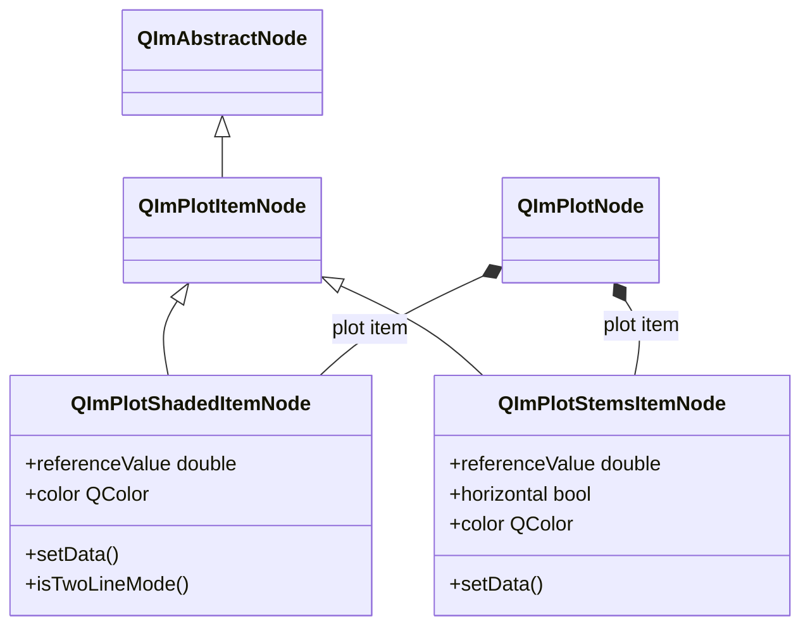
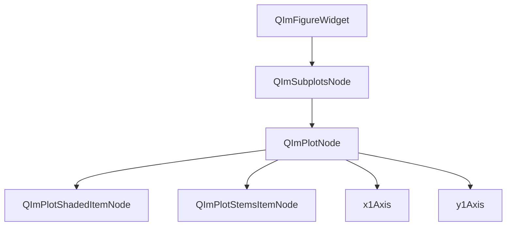

# Filled Area Charts Usage Guide

`QImPlotShadedItemNode` and `QImPlotStemsItemNode` are two core nodes in QIm for drawing filled areas and stem charts,
both inheriting from `QImPlotItemNode`, suitable for area charts, confidence interval visualization, and displaying relationships between discrete data points and a baseline.

## Main Features

**QImPlotShadedItemNode Features**

- ✅ **Single-Line Fill Mode**: Fills the area between a data curve and a horizontal reference value with color, suitable for area charts and baseline comparison
- ✅ **Dual-Line Fill Mode**: Fills the area between two data curves with color, suitable for confidence interval and upper/lower bound visualization
- ✅ **Reference Value Control**: Sets the fill reference line for single-line mode via the `referenceValue` property, supports ±∞ fill to infinity
- ✅ **Color Customization**: Sets fill area color via the `color` property; uses ImPlot default color sequence when not set

**QImPlotStemsItemNode Features**

- ✅ **Stem Line Drawing**: Draws vertical or horizontal lines from a reference value (baseline) to each data point
- ✅ **Direction Switching**: Supports vertical stems (default) and horizontal stems, switched via the `horizontal` property
- ✅ **Baseline Control**: Sets the starting baseline for stem lines via the `referenceValue` property
- ✅ **Color Customization**: Sets stem line color via the `color` property

## Basic Concepts

### Class Inheritance



`QImPlotShadedItemNode` and `QImPlotStemsItemNode` both inherit from `QImPlotItemNode`,
which inherits from `QImAbstractNode`. They join the object tree as children of `QImPlotNode`,
rendering within the parent node's `BeginPlot/EndPlot` rendering context.

### Object Tree Layout

The position of filled area chart nodes in the QIm object tree:



**Object tree notes:**

- `QImPlotShadedItemNode` and `QImPlotStemsItemNode` automatically join the object tree by specifying `QImPlotNode` as parent at construction
- They share the same parent node level with other plot item nodes such as `QImPlotLineItemNode`, `QImPlotScatterItemNode`, etc.
- Multiple filled area chart nodes can coexist under the same `QImPlotNode`

### Differences Between Shaded and Stems

| Feature | QImPlotShadedItemNode | QImPlotStemsItemNode |
|------|-----------------------|----------------------|
| Rendering | Fills area with color | Draws stem lines (vertical/horizontal lines) |
| Visual effect | Continuous semi-transparent filled area | Discrete lines from baseline to data points |
| Use case | Area charts, confidence intervals, error ranges | Discrete data display, baseline deviation visualization |
| Data mode | Single-line or dual-line | Single series |
| Direction | Vertical only | Vertical or horizontal |
| Reference value meaning | In single-line mode, fills to the reference value | Starting baseline for stem lines |

**Visual comparison:**

```text
Shaded (single-line mode):     Stems (vertical mode):
    ╱╲   ╱╲                    |   |   |
   ████ ████                   |   |   |
  ███████████    ← ref=0       ────|───|────  ← ref=0
  ███████████                   |   |   |
 ████  ████  ████              ─┘  ─┘  ─┘
────────────────              ────────────────
```

## Usage

Shaded examples are located in `examples/qimfigure-test/functions/shaded/ShadedFunction.cpp`,
Stems examples in `examples/qimfigure-test/functions/other/StemsFunction.cpp`.

### 1. Shaded Single-Line Fill Mode

In single-line fill mode, the area between the data curve and a horizontal reference value is filled with color.

```cpp
#include "QImFigureWidget.h"
#include "plot/QImPlotNode.h"
#include "plot/QImPlotShadedItemNode.h"

// Create plot window
QIM::QImFigureWidget* figure = new QIM::QImFigureWidget(this);

// Create plot node
QIM::QImPlotNode* plot = figure->createPlotNode();
plot->setTitle("Single-Line Fill Mode");
plot->setLegendEnabled(true);

// Generate sine wave data
const int numPoints = 100;
std::vector<double> xData(numPoints);
std::vector<double> yData(numPoints);
for (int i = 0; i < numPoints; ++i) {
    xData[i] = i * 0.1;
    yData[i] = std::sin(xData[i]) * 5.0 + 5.0;  // Range 0~10
}

// Create fill area node, with plot as parent
QIM::QImPlotShadedItemNode* shaded = new QIM::QImPlotShadedItemNode(plot);
shaded->setLabel("Shaded Area");
shaded->setData(xData, yData);       // Single-line mode: pass one set of data
shaded->setReferenceValue(0.0);      // Reference value is 0, fill from 0 to the data line
shaded->setColor(QColor(0, 114, 189));

// Effect: Area between the data line and y=0 filled with blue
```

**Single-line mode notes:**

- `setData(x, y)` passes one set of X/Y data; the node enters single-line fill mode
- `referenceValue` sets the horizontal reference line position; the area between the data line and the reference line is filled
- Default reference value is 0.0
- Use `-INFINITY` to extend fill to negative infinity, `+INFINITY` to extend to positive infinity

!!! tip "Reference Value Trick"
    `setReferenceValue(-INFINITY)` achieves full fill from negative infinity to the data line,
    suitable for scenarios focusing on the area above the data line. Similarly, `setReferenceValue(+INFINITY)` fills below the data line.

### 2. Shaded Dual-Line Fill Mode

In dual-line fill mode, the area between two data curves is filled with color, commonly used for confidence intervals and upper/lower bound range visualization.

```cpp
#include "QImFigureWidget.h"
#include "plot/QImPlotNode.h"
#include "plot/QImPlotShadedItemNode.h"
#include "plot/QImPlotDataSeries.h"

// Create plot window
QIM::QImFigureWidget* figure = new QIM::QImFigureWidget(this);
QIM::QImPlotNode* plot = figure->createPlotNode();
plot->setTitle("Dual-Line Fill Mode - Confidence Interval");

// Generate data
const int numPoints = 100;
std::vector<double> xData(numPoints);
std::vector<double> yData(numPoints);
for (int i = 0; i < numPoints; ++i) {
    xData[i] = i * 0.1;
    yData[i] = std::sin(xData[i]) * 5.0 + 5.0;
}

// Calculate upper and lower bounds (±2 offset)
std::vector<double> yUpper(numPoints);
std::vector<double> yLower(numPoints);
for (int i = 0; i < numPoints; ++i) {
    yUpper[i] = yData[i] + 2.0;   // Upper bound
    yLower[i] = yData[i] - 2.0;   // Lower bound
}

// Create fill area node, with plot as parent
QIM::QImPlotShadedItemNode* shaded = new QIM::QImPlotShadedItemNode(plot);
shaded->setLabel("Confidence Interval");

// Dual-line mode: pass two data series
QIM::QImAbstractXYDataSeries* lowerSeries = new QIM::QImVectorXYDataSeries(xData, yLower);
QIM::QImAbstractXYDataSeries* upperSeries = new QIM::QImVectorXYDataSeries(xData, yUpper);
shaded->setData(lowerSeries, upperSeries);  // Fill the area between the two lines

shaded->setColor(QColor(0, 114, 189, 80));  // Semi-transparent blue

// Effect: Area between the upper and lower bound lines filled with semi-transparent blue, creating a confidence interval visual effect
```

**Dual-line mode notes:**

- `setData(series1, series2)` passes two data series; the node automatically enters dual-line fill mode
- `isTwoLineMode()` returns `true` when in dual-line mode
- You can also use the template method `setData(x, y1, y2)` to pass container data directly

!!! warning "Dual-Line Mode Data Requirements"
    The two data series in dual-line fill mode must have **identical X coordinates**.
    Inconsistent X coordinates will cause incorrect fill area calculation.

!!! info "Mode Switching"
    Single-line mode and dual-line mode are automatically distinguished by the `setData()` call form:
    - `setData(series)` or `setData(x, y)` → single-line mode
    - `setData(series1, series2)` or `setData(x, y1, y2)` → dual-line mode
    Mode switching requires re-calling `setData()`; runtime dynamic switching is not supported.

### 3. Stems Stem Chart Basic Usage

Stem charts draw lines from a baseline to each data point, suitable for displaying deviation relationships between discrete data and a baseline.

```cpp
#include "QImFigureWidget.h"
#include "plot/QImPlotNode.h"
#include "plot/QImPlotStemsItemNode.h"

// Create plot window
QIM::QImFigureWidget* figure = new QIM::QImFigureWidget(this);
QIM::QImPlotNode* plot = figure->createPlotNode();
plot->setTitle("Stem Chart - Damped Sine Wave");
plot->setLegendEnabled(true);

// Generate damped sine wave data (20 discrete points)
const int numPoints = 20;
std::vector<double> xData(numPoints);
std::vector<double> yData(numPoints);
for (int i = 0; i < numPoints; ++i) {
    xData[i] = i;
    yData[i] = std::sin(i * 0.5) * std::exp(-i * 0.1) * 10.0;
}

// Create stem chart node, with plot as parent
QIM::QImPlotStemsItemNode* stems = new QIM::QImPlotStemsItemNode(plot);
stems->setLabel("Damped Signal");
stems->setData(xData, yData);           // Set data
stems->setReferenceValue(0.0);          // Baseline is 0
stems->setColor(QColor(0, 114, 189));   // Stem line color

// Effect: Vertical stem lines drawn from y=0 baseline to each data point, with data points at stem tips
```

**Stems notes:**

- `setData(x, y)` passes one set of X/Y data
- `referenceValue` sets the starting baseline for stem lines, default 0.0
- Default draws vertical stem lines (from baseline to data point along Y direction)

### 4. Stems Horizontal Stem Chart

In horizontal mode, stem lines are drawn along the X direction, suitable for displaying horizontal deviation between data points and the X-axis baseline.

```cpp
// Create plot node
QIM::QImPlotNode* plot = figure->createPlotNode();
plot->setTitle("Horizontal Stem Chart");

// Generate data
std::vector<double> xData = {1, 2, 3, 4, 5, 6, 7, 8};
std::vector<double> yData = {3.5, 2.8, 5.1, 4.0, 6.2, 3.7, 5.5, 4.3};

// Create horizontal stem chart node
QIM::QImPlotStemsItemNode* stems = new QIM::QImPlotStemsItemNode(plot);
stems->setLabel("Horizontal Stems");
stems->setData(xData, yData);
stems->setReferenceValue(0.0);         // Baseline is 0
stems->setHorizontal(true);            // Enable horizontal orientation
stems->setColor(QColor(217, 83, 25));  // Red stem lines

// Effect: Horizontal stem lines drawn from x=0 baseline to each data point
// Each stem line's Y coordinate is the data point's Y value, X direction extends from reference value to data point's X value
```

!!! info "Horizontal Direction Notes"
    Vertical stems: Drawn along Y axis direction, baseline is a horizontal line (y = referenceValue)
    Horizontal stems: Drawn along X axis direction, baseline is a vertical line (x = referenceValue)

### 5. Configuring Style Properties

Both Shaded and Stems support style configuration via the property system:

```cpp
// Shaded style configuration
QIM::QImPlotShadedItemNode* shaded = new QIM::QImPlotShadedItemNode(plot);

// Fill color (supports transparency)
shaded->setColor(QColor(0, 114, 189, 100));  // Semi-transparent blue

// Reference value
shaded->setReferenceValue(5.0);   // In single-line mode, fill to y=5

// Shaded flags (advanced usage)
shaded->setShadedFlags(0);  // Set ImPlotShadedFlags

// Stems style configuration
QIM::QImPlotStemsItemNode* stems = new QIM::QImPlotStemsItemNode(plot);

// Stem line color
stems->setColor(QColor(80, 170, 90));  // Green

// Baseline
stems->setReferenceValue(2.5);  // Stem lines start from y=2.5

// Direction
stems->setHorizontal(false);  // Vertical direction (default)
stems->setHorizontal(true);   // Horizontal direction

// Stems flags (advanced usage)
stems->setStemsFlags(0);  // Set ImPlotStemsFlags
```

!!! tip "Semi-Transparent Fill"
    Shaded's `setColor()` supports the QColor alpha channel. Semi-transparent colors allow
    overlapping multiple fill areas in the same chart without completely obscuring underlying data.

## API Reference

### QImPlotShadedItemNode Property List

| Property | Type | Getter | Setter | Signal | Description |
|------|------|--------|--------|------|------|
| referenceValue | double | `referenceValue()` | `setReferenceValue()` | `referenceValueChanged` | Reference value for single-line mode (Y axis), default 0.0 |
| color | QColor | `color()` | `setColor()` | `colorChanged` | Fill area color |

### QImPlotShadedItemNode Method List

| Method | Parameters | Description |
|------|------|------|
| `setData(series)` | `QImAbstractXYDataSeries*` | Single-line mode: set one data series |
| `setData(x, y)` | Container, Container | Single-line mode: set X/Y container data (template method) |
| `setData(series1, series2)` | `QImAbstractXYDataSeries*`, `QImAbstractXYDataSeries*` | Dual-line mode: set upper/lower bound data series |
| `setData(x, y1, y2)` | Container, Container, Container | Dual-line mode: set X/Y1/Y2 container data (template method) |
| `data()` | - | Get primary data series |
| `data2()` | - | Get secondary data series (dual-line mode) |
| `isTwoLineMode()` | - | Check if in dual-line fill mode |
| `shadedFlags()` | - | Get ImPlotShadedFlags |
| `setShadedFlags(flags)` | int | Set ImPlotShadedFlags |

!!! info "setData() Template Method"
    The template versions of `setData()` support `std::vector<double>`, `QVector<double>`, and other container types,
    internally auto-creating `QImVectorXYDataSeries`. The return value is the created data series pointer (single-line mode);
    the dual-line mode template version has no return value.

### QImPlotStemsItemNode Property List

| Property | Type | Getter | Setter | Signal | Description |
|------|------|--------|--------|------|------|
| referenceValue | double | `referenceValue()` | `setReferenceValue()` | `referenceValueChanged` | Baseline reference value, default 0.0 |
| horizontal | bool | `isHorizontal()` | `setHorizontal()` | `orientationChanged` | Horizontal orientation flag, default false |
| color | QColor | `color()` | `setColor()` | `colorChanged` | Stem line color |

### QImPlotStemsItemNode Method List

| Method | Parameters | Description |
|------|------|------|
| `setData(series)` | `QImAbstractXYDataSeries*` | Set data series |
| `setData(x, y)` | Container, Container | Set X/Y container data (template method) |
| `data()` | - | Get data series |
| `stemsFlags()` | - | Get ImPlotStemsFlags |
| `setStemsFlags(flags)` | int | Set ImPlotStemsFlags |

## Signal-Slot Connections

### QImPlotShadedItemNode Signals

| Signal | Parameters | Trigger Timing |
|------|------|----------|
| `referenceValueChanged(value)` | double | When reference value actually changes |
| `colorChanged(color)` | QColor | When fill color actually changes |
| `dataChanged()` | - | When data series changes (on setData call) |
| `shadedFlagChanged()` | - | When fill flags change |

```cpp
// Monitor reference value changes
connect(shaded, &QIM::QImPlotShadedItemNode::referenceValueChanged,
        this, [](double newValue) {
    qDebug() << "Fill reference value updated to:" << newValue;
});

// Monitor color changes
connect(shaded, &QIM::QImPlotShadedItemNode::colorChanged,
        this, [](const QColor& newColor) {
    qDebug() << "Fill color updated to:" << newColor.name();
});
```

### QImPlotStemsItemNode Signals

| Signal | Parameters | Trigger Timing |
|------|------|----------|
| `referenceValueChanged(value)` | double | When reference value actually changes |
| `orientationChanged(horizontal)` | bool | When direction changes |
| `colorChanged(color)` | QColor | When stem line color actually changes |
| `dataChanged()` | - | When data series changes (on setData call) |
| `stemsFlagChanged()` | - | When stem chart flags change |

```cpp
// Monitor direction changes
connect(stems, &QIM::QImPlotStemsItemNode::orientationChanged,
        this, [](bool isHorizontal) {
    qDebug() << "Stem chart direction switched to:" << (isHorizontal ? "Horizontal" : "Vertical");
});

// Monitor reference value changes
connect(stems, &QIM::QImPlotStemsItemNode::referenceValueChanged,
        this, [](double newValue) {
    qDebug() << "Stem chart baseline updated to:" << newValue;
});
```

!!! warning "Signal Trigger Conditions"
    The above signals are only triggered when the property value **actually changes** (different from the old value). Repeated setting of the same value does not trigger the signal.

## Notes

!!! warning "Dual-Line Mode X Coordinate Consistency"
    In Shaded dual-line fill mode, the two data series must share the same X coordinates.
    Inconsistent X coordinates will cause incorrect fill area calculation or rendering anomalies.

!!! warning "Object Tree Parent-Child Relationship"
    When creating Shaded or Stems nodes, you must specify `QImPlotNode` as parent,
    otherwise the node will not join the rendering object tree and cannot be displayed in the plot area:
    ```cpp
    // Correct: Specify parent node (recommended)
    QIM::QImPlotShadedItemNode* shaded = new QIM::QImPlotShadedItemNode(plot);

    // Incorrect: No parent node, will not render
    QIM::QImPlotShadedItemNode* shaded = new QIM::QImPlotShadedItemNode();
    ```

!!! info "Reference Value Semantics"
    Both Shaded and Stems have a `referenceValue` property, but with different semantics:
    - **Shaded**: The reference value defines the horizontal boundary for filling; the area between the data line and the reference line is filled
    - **Stems**: The reference value defines the starting baseline for stem lines; stem lines extend from the baseline to data points

!!! tip "Semi-Transparent Overlay"
    When using multiple Shaded nodes in the same chart, it is recommended to use semi-transparent colors (alpha < 255),
    so overlapping areas naturally blend without completely obscuring underlying data:
    ```cpp
    shaded1->setColor(QColor(0, 114, 189, 80));   // Semi-transparent blue
    shaded2->setColor(QColor(217, 83, 25, 80));    // Semi-transparent red
    ```

!!! info "More Usage from Example Code"
    For complete Shaded and Stems example code, see:
    - Shaded: `examples/qimfigure-test/functions/shaded/ShadedFunction.cpp`
    - Stems: `examples/qimfigure-test/functions/other/StemsFunction.cpp`

## References

- Related documentation: [QImPlotNode](plot-node.md), [Render Node](../render-node.md), [Flag Mapping](../dev/flag-mapping.md)
- Example code: `examples/qimfigure-test/functions/shaded/ShadedFunction.cpp`, `examples/qimfigure-test/functions/other/StemsFunction.cpp`
- API reference: `src/core/plot/QImPlotShadedItemNode.h`, `src/core/plot/QImPlotStemsItemNode.h`