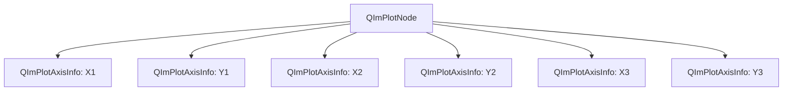
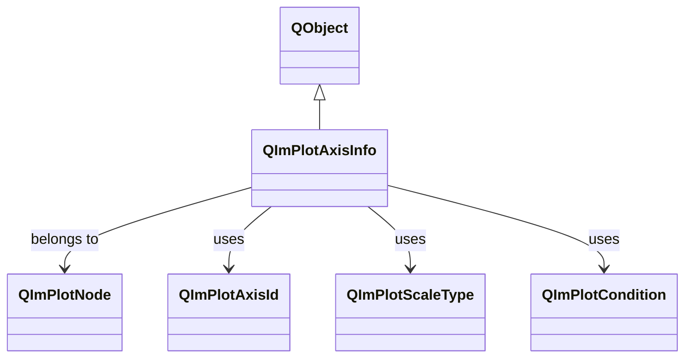

# QImPlotAxisInfo Axis Configuration Guide

`QImPlotAxisInfo` is QIm's Qt wrapper class for managing ImPlot axis configuration, providing a type-safe property interface to configure axes without directly manipulating the underlying ImPlotAxisFlags bitmask.

## Main Features

**Features**

- ✅ **Label Configuration**: Supports axis label text setting and visibility control
- ✅ **Range Limits**: Supports setting min/max value ranges and auto-fit behavior
- ✅ **Flag Properties**: All ImPlotAxisFlags_ options exposed as intuitive boolean properties
- ✅ **Scale Types**: Supports linear/log/time/symlog scale types
- ✅ **Type Conversion**: Provides bidirectional conversion between Qt enums (QImPlotAxisId) and ImPlot enums (ImAxis)
- ✅ **Signal Notifications**: Provides signals for label changes, range changes, flag changes, and scale type changes

## Basic Concepts

### Component Layout

QImPlotAxisInfo's position in the object tree:



Each `QImPlotNode` contains up to 6 axis objects (X1/X2/X3, Y1/Y2/Y3), accessible via corresponding methods:

```cpp
QIM::QImPlotNode* plot = figure->createPlotNode();
QIM::QImPlotAxisInfo* xAxis = plot->x1Axis();  // Get X1 axis
QIM::QImPlotAxisInfo* yAxis = plot->y1Axis();  // Get Y1 axis
```

### Class Inheritance



## Usage

This component's examples are located in `examples/qimfigure-test` and `examples/readme-2d-example`.

### 1. Basic Usage

Set axis labels and ranges:

```cpp
// Create plot node
QIM::QImPlotNode* plot = figure->createPlotNode();

// Set X axis label
plot->x1Axis()->setLabel("Time (s)");

// Set Y axis label
plot->y1Axis()->setLabel("Amplitude");

// Set axis ranges
plot->x1Axis()->setLimits(0.0, 10.0);  // X axis range 0~10
plot->y1Axis()->setLimits(-1.0, 1.0);  // Y axis range -1~1

// Enable grid lines
plot->x1Axis()->setGridLinesEnabled(true);
plot->y1Axis()->setGridLinesEnabled(true);
```

Effect: Displays axes with labels, ranges, and grid lines.

### 2. Hiding Axis Decorations (for Pie Charts and Special Charts)

In certain chart types (such as pie charts), you may need to hide all axis decorations:

```cpp
// Create pie chart
QIM::QImPlotNode* plot = figure->createPlotNode();
plot->setTitle("Pie Chart");
plot->setEqual(true);  // Equal aspect ratio

// Hide all X and Y axis decorations
plot->x1Axis()->setNoDecorations(true);
plot->y1Axis()->setNoDecorations(true);

// Fix axis ranges (ensure pie chart displays within a fixed area)
plot->x1Axis()->setLimits(0.0, 1.0, QIM::QImPlotCondition::Always);
plot->y1Axis()->setLimits(0.0, 1.0, QIM::QImPlotCondition::Always);
```

This example is from `examples/readme-2d-example/main.cpp`, used to create a pie chart without axis decorations.

### 3. Advanced Configuration: Log Scale and Auto-Fit

Configure log scale axes and enable auto-fit:

```cpp
// Set Y axis to log scale (suitable for large-range data)
plot->y1Axis()->setScaleType(QIM::QImPlotScaleType::Log10);

// Enable auto-fit (axis range automatically adapts to data)
plot->x1Axis()->setAutoFit(true);
plot->y1Axis()->setAutoFit(true);

// Enable initial fit (auto-fit only on first render)
plot->x1Axis()->setInitialFitEnabled(true);
plot->y1Axis()->setInitialFitEnabled(true);

// Lock axis ranges (prevent user interaction from modifying)
plot->x1Axis()->setLock(true);  // Lock both min and max
// Or lock separately
plot->y1Axis()->setLockMin(true);  // Lock min only
plot->y1Axis()->setLockMax(true);  // Lock max only
```

### 4. Interaction Control

Control axis interaction features:

```cpp
// Enable right-click menus
plot->x1Axis()->setMenusEnabled(true);
plot->y1Axis()->setMenusEnabled(true);

// Enable highlight (highlight axis on mouse hover)
plot->x1Axis()->setHighlightEnabled(true);
plot->y1Axis()->setHighlightEnabled(true);

// Enable side switch (allow axis to switch between left/right or top/bottom)
plot->x1Axis()->setSideSwitchEnabled(true);
plot->y1Axis()->setSideSwitchEnabled(true);

// Show axis in foreground of plot area
plot->x1Axis()->setForeground(true);
plot->y1Axis()->setForeground(true);
```

## Property Reference

| Property | Type | Default | Description |
|------|------|--------|------|
| `label` | `QString` | Empty string | Axis label text |
| `minLimits` | `double` | 0.0 | Minimum value of the visible axis range |
| `maxLimits` | `double` | 1.0 | Maximum value of the visible axis range |
| `autoFit` | `bool` | `false` | Enable auto-fit (corresponds to `ImPlotAxisFlags_AutoFit`) |
| `inverted` | `bool` | `false` | Invert axis direction (corresponds to `ImPlotAxisFlags_Invert`) |
| `labelEnabled` | `bool` | `true` | Label visibility (affirmative semantics of `ImPlotAxisFlags_NoLabel`) |
| `gridLinesEnabled` | `bool` | `true` | Grid line visibility (affirmative semantics of `ImPlotAxisFlags_NoGridLines`) |
| `tickMarksEnabled` | `bool` | `true` | Tick mark visibility (affirmative semantics of `ImPlotAxisFlags_NoTickMarks`) |
| `tickLabelsEnabled` | `bool` | `true` | Tick label visibility (affirmative semantics of `ImPlotAxisFlags_NoTickLabels`) |
| `initialFitEnabled` | `bool` | `true` | Enable initial fit (affirmative semantics of `ImPlotAxisFlags_NoInitialFit`) |
| `menusEnabled` | `bool` | `true` | Enable right-click menu (affirmative semantics of `ImPlotAxisFlags_NoMenus`) |
| `sideSwitchEnabled` | `bool` | `true` | Allow side switching (affirmative semantics of `ImPlotAxisFlags_NoSideSwitch`) |
| `highlightEnabled` | `bool` | `true` | Enable highlighting (affirmative semantics of `ImPlotAxisFlags_NoHighlight`) |
| `opposite` | `bool` | `false` | Display on opposite side (corresponds to `ImPlotAxisFlags_Opposite`) |
| `foreground` | `bool` | `false` | Display in front of plot area (corresponds to `ImPlotAxisFlags_Foreground`) |
| `rangeFit` | `bool` | `false` | Enable range fit (corresponds to `ImPlotAxisFlags_RangeFit`) |
| `panStretch` | `bool` | `false` | Enable pan stretch (corresponds to `ImPlotAxisFlags_PanStretch`) |
| `lockMin` | `bool` | `false` | Lock minimum value (corresponds to `ImPlotAxisFlags_LockMin`) |
| `lockMax` | `bool` | `false` | Lock maximum value (corresponds to `ImPlotAxisFlags_LockMax`) |
| `lock` | `bool` | `false` | Lock both min and max values (`lockMin && lockMax`) |
| `noDecorations` | `bool` | `false` | Hide all decorations (corresponds to `ImPlotAxisFlags_NoDecorations`) |
| `scaleType` | `QImPlotScaleType` | `Linear` | Scale type (linear/log/time/symlog) |
| `tickValues` | `QList<double>` | Empty list | Custom tick positions (value list) |
| `tickLabels` | `QList<QByteArray>` | Empty list | Custom tick labels (UTF8-encoded list) |
| `keepDefaultTicks` | `bool` | `false` | Keep default ticks (coexist with custom ticks) |

### Affirmative Semantic Conversion Notes

QIm follows an **affirmative semantics** design principle, converting ImPlot's negative flags (e.g., `NoXxx`) into affirmative `xxxEnabled` properties:

| ImPlot Flag | QIm Property | Description |
|------------|----------|------|
| `ImPlotAxisFlags_NoLabel` | `labelEnabled` | `true`=label visible, `false`=label hidden |
| `ImPlotAxisFlags_NoGridLines` | `gridLinesEnabled` | `true`=grid lines visible, `false`=grid lines hidden |
| `ImPlotAxisFlags_NoTickMarks` | `tickMarksEnabled` | `true`=tick marks visible, `false`=tick marks hidden |
| `ImPlotAxisFlags_NoTickLabels` | `tickLabelsEnabled` | `true`=tick labels visible, `false`=tick labels hidden |
| `ImPlotAxisFlags_NoInitialFit` | `initialFitEnabled` | `true`=enable initial fit, `false`=disable initial fit |
| `ImPlotAxisFlags_NoMenus` | `menusEnabled` | `true`=enable right-click menu, `false`=disable right-click menu |
| `ImPlotAxisFlags_NoSideSwitch` | `sideSwitchEnabled` | `true`=allow side switching, `false`=prohibit side switching |
| `ImPlotAxisFlags_NoHighlight` | `highlightEnabled` | `true`=enable highlighting, `false`=disable highlighting |
| `ImPlotAxisFlags_NoDecorations` | `noDecorations` | `true`=hide all decorations, `false`=show decorations |

This design makes the API more intuitive: `setLabelEnabled(true)` means "enable the label" rather than the double negative `setNoLabel(false)`.

## Enum Types

### QImPlotAxisId - Axis Identity

| Enum Value | ImPlot Equivalent | Description |
|--------|---------------|------|
| `X1` | `ImAxis_X1` | Primary X axis (bottom) |
| `X2` | `ImAxis_X2` | Secondary X axis (top) |
| `X3` | `ImAxis_X3` | Tertiary X axis (reserved) |
| `Y1` | `ImAxis_Y1` | Primary Y axis (left) |
| `Y2` | `ImAxis_Y2` | Secondary Y axis (right) |
| `Y3` | `ImAxis_Y3` | Tertiary Y axis (reserved) |
| `AxisCount` | `ImAxis_COUNT` | Total axis count (6) |
| `Auto` | - | Auto-select axis |

### QImPlotScaleType - Scale Type

| Enum Value | ImPlot Equivalent | Description |
|--------|---------------|------|
| `Linear` | `ImPlotScale_Linear` | Linear scale (default) |
| `Time` | `ImPlotScale_Time` | Time scale (Unix timestamp) |
| `Log10` | `ImPlotScale_Log10` | Base-10 log scale (requires positive values) |
| `SymLog` | `ImPlotScale_SymLog` | Symmetric log scale (handles negative values near zero) |

### QImPlotCondition - Condition Type

| Enum Value | ImPlot Equivalent | Description |
|--------|---------------|------|
| `None` | `ImPlotCond_None` | Do not apply constraint |
| `Always` | `ImPlotCond_Always` | Apply constraint every frame |
| `Once` | `ImPlotCond_Once` | Apply constraint only on first frame |

## Core Methods

### Axis Range Management

```cpp
// Set axis range (recommended)
void setLimits(double min, double max, QImPlotCondition cond = QImPlotCondition::Once);

// Set min and max separately
void setMinLimits(double min);
void setMaxLimits(double max);

// Get current range
double minLimits() const;
double maxLimits() const;

// Get/set range condition
QImPlotCondition limitsCondition() const;
void setLimitsCondition(QImPlotCondition v);
```

### Axis Identity and Conversion

```cpp
// Get axis identity
QImPlotAxisId axisId() const;

// Convert to ImPlot's ImAxis value
int imAxis() const;

// Get the owning plot node
QImPlotNode* plotNode() const;
```

### Scale Type Management

```cpp
// Get/set scale type
QImPlotScaleType scaleType() const;
void setScaleType(QImPlotScaleType t);

// Convert to ImPlot's scale enum value
int imPlotScale() const;
```

### Custom Tick Configuration

```cpp
// Get/set custom tick positions
QList<double> tickValues() const;
void setTickValues(const QList<double>& values);

// Get/set custom tick labels (UTF8 encoded)
QList<QByteArray> tickLabels() const;
void setTickLabels(const QList<QByteArray>& labels);

// Get/set whether to keep default ticks
bool isKeepDefaultTicks() const;
void setKeepDefaultTicks(bool keep);

// Convenience method: set ticks and labels simultaneously
void setAxisTicks(const QList<double>& values,
                  const QList<QByteArray>& labels = {},
                  bool keepDefault = false);

// Convenience method: evenly generate N ticks within range
void setAxisTicksRange(double v_min, double v_max, int n_ticks,
                       const QList<QByteArray>& labels = {},
                       bool keepDefault = false);
```

!!! info "tickLabels Type"
    `tickLabels` uses `QList<QByteArray>` instead of `QString`,
    following QIm's UTF8-first storage convention. Labels must be encoded as UTF8 `QByteArray`.

### Advanced Flag Operations

```cpp
// Get/set raw flags (advanced usage)
int axisFlags() const;
void setAxisFlags(int flags);

// Axis enabled state (controlled via setNoDecorations)
bool isEnabled() const;
void setEnabled(bool on);
```

## Signal-Slot Connections

| Signal | Parameters | Trigger Timing |
|------|------|----------|
| `labelChanged(const QString& label)` | `QString` | When axis label text changes |
| `limitsChanged(double min, double max)` | `double, double` | When axis range limits change (either min, max, or both) |
| `axisFlagChanged()` | None | When any axis flag property changes (autoFit, inverted, gridLinesEnabled, etc.) |
| `scaleTypeChanged()` | None | When axis scale type changes (linear → log, time → symlog, etc.) |
| `tickConfigChanged()` | None | When custom tick configuration changes (any of tickValues, tickLabels, keepDefaultTicks) |

### Typical Signal-Slot Connection Examples

```cpp
// Monitor axis label changes
connect(plot->x1Axis(), &QIM::QImPlotAxisInfo::labelChanged,
        this, &MyClass::onXAxisLabelChanged);

void MyClass::onXAxisLabelChanged(const QString& label) {
    qDebug() << "X axis label updated to:" << label;
    // Update UI display or persist configuration
}

// Monitor axis range changes
connect(plot->y1Axis(), &QIM::QImPlotAxisInfo::limitsChanged,
        this, &MyClass::onYAxisLimitsChanged);

void MyClass::onYAxisLimitsChanged(double min, double max) {
    qDebug() << QString("Y axis range updated: [%1, %2]").arg(min).arg(max);
    // Update range display or perform data validation
}

// Monitor all flag changes
connect(plot->x1Axis(), &QIM::QImPlotAxisInfo::axisFlagChanged,
        this, &MyClass::onAxisFlagsChanged);

void MyClass::onAxisFlagsChanged() {
    // Must query which specific flag changed
    bool autoFit = plot->x1Axis()->isAutoFit();
    bool gridVisible = plot->x1Axis()->isGridLinesEnabled();
    // Update UI based on flag states
}
```

!!! warning "Notes"
    - **Delayed Property Effect**: All property changes are only stored locally; the actual visual update takes effect only after the configuration is applied to the ImPlot context during re-rendering.
    - **Range Validation**: `setLimits()` does not validate that `min < max`; invalid ranges (`min >= max`) may cause ImPlot rendering issues.
    - **Log Scale Constraints**: When switching to `Log10` scale, data must contain positive values, otherwise rendering anomalies may occur.
    - **Signal Aggregation**: The `axisFlagChanged()` signal does not indicate which specific flag changed. Query the relevant properties to determine what changed.
    - **3D Axis Differences**: This document primarily describes 2D plot axis configuration. 3D plots use `QImPlot3DAxisInfo`, which has additional 3D-specific features. See the 3D configuration documentation for details.

## References

- Related documentation: [QImPlotNode](plot-node.md), [QImFigureWidget](figure-widget.md)
- Example code: `examples/qimfigure-test`, `examples/readme-2d-example`
- API reference: `src/core/plot/QImPlotAxisInfo.h`
- ImPlot native documentation: [ImPlot Axis Configuration](https://github.com/epezent/implot)