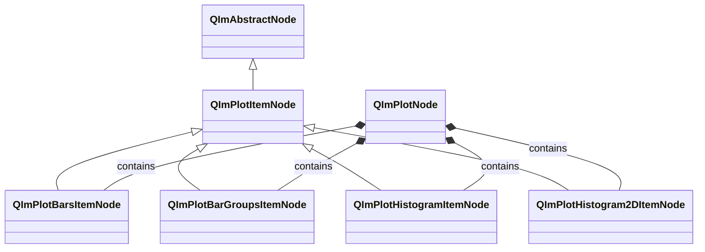
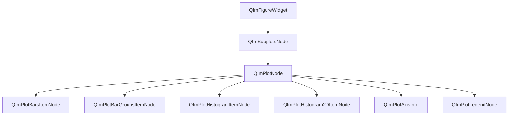

# Bar Charts and Histograms Usage Guide

QIm provides four types of bar/histogram chart nodes for different data visualization scenarios:
`QImPlotBarsItemNode` (basic bar chart), `QImPlotBarGroupsItemNode` (bar groups chart),
`QImPlotHistogramItemNode` (1D histogram), and `QImPlotHistogram2DItemNode` (2D histogram).
They all inherit from `QImPlotItemNode`, follow the Qt retained mode encapsulation, and support the complete property system and signal-slot mechanism.

## Main Features

**Features**

- ✅ **Basic Bar Chart (Bars)**: XY coordinate data-driven single-series bar chart, supports horizontal/vertical orientation and custom bar width
- ✅ **Grouped Bar Chart (BarGroups)**: Multi-item multi-group data displayed side-by-side or stacked, supports group width, shift, and horizontal orientation
- ✅ **1D Histogram (Histogram)**: Automatic binning for univariate distribution statistics, supports cumulative, density normalization, range limits, and outlier control
- ✅ **2D Histogram (Histogram2D)**: Bivariate joint distribution heatmap, supports independent X/Y binning, density normalization, and outlier exclusion
- ✅ **Qt Property System Integration**: All node properties exposed via Q_PROPERTY, supporting Designer editing and dynamic property systems
- ✅ **Signal-Slot Notifications**: Qt signals automatically emitted on property changes, supporting reactive programming
- ✅ **Object Tree Management**: Nodes created with QImPlotNode as parent automatically join the object tree and manage lifecycle

## Basic Concepts

### Class Inheritance



All bar/histogram nodes inherit from `QImPlotItemNode`, which inherits from `QImAbstractNode`.
`QImPlotItemNode` provides common properties (`label`) and axis binding interfaces,
and each subclass adds its own unique style and data properties.

### Object Tree Layout



**Object tree notes:**

- All bar/histogram nodes are created with `QImPlotNode` as parent, automatically joining the object tree
- Node lifecycle is managed by the Qt object tree; child nodes are automatically destroyed when the parent is destroyed
- Multiple bar/histogram nodes of different types can coexist within the same `QImPlotNode`

### Data Format Comparison

The four chart types have significantly different data input approaches. Choose the appropriate chart type based on data characteristics:

| Chart Type | Data Format | setData Call | Use Case |
|----------|----------|------------------|----------|
| Bars | XY coordinates | `setData(x, y)` | Single-series bar chart for categorical or discrete data |
| BarGroups | Labels + value matrix | `setData(labels, values, itemCount, groupCount)` | Multi-item cross-group comparison (side-by-side or stacked) |
| Histogram | Y-value sequence | `setData(y)` | Univariate distribution statistics (automatic binning) |
| Histogram2D | XY scatter data | `setData(xs, ys)` | Bivariate joint distribution statistics (automatic 2D binning) |

!!! tip "Choosing the Right Chart Type"
    - Need precise control over each bar's position and height → Use **Bars**
    - Need to compare multiple items across different groups → Use **BarGroups**
    - Need to observe data distribution shape (normal, skewed, etc.) → Use **Histogram**
    - Need to observe correlation between two variables → Use **Histogram2D**

## Bars — Basic Bar Chart

`QImPlotBarsItemNode` provides the most basic bar chart functionality, using XY coordinate data to draw single-series bar charts.
Each bar's position is determined by the X value, and its height by the Y value.

### 1. Basic Usage

Example code is located in `examples/qimfigure-test/functions/datapoints/BarsFunction.cpp`:

```cpp
#include "QImFigureWidget.h"
#include "plot/QImPlotNode.h"
#include "plot/QImPlotBarsItemNode.h"

// Create plot window
QIM::QImFigureWidget* figure = new QIM::QImFigureWidget(this);
figure->setSubplotGrid(2, 2);

// Create subplot - Bar chart
if (QIM::QImPlotNode* plot = figure->createPlotNode()) {
    plot->setTitle("Bars");
    plot->x1Axis()->setLabel("Category");
    plot->y1Axis()->setLabel("Value");
    plot->setLegendEnabled(true);

    // Prepare data
    std::vector<double> x {1, 2, 3, 4};
    std::vector<double> y {3.6, 5.1, 4.4, 6.2};

    // Create bar chart node, with plot as parent (auto-joins object tree)
    QIM::QImPlotBarsItemNode* bars = new QIM::QImPlotBarsItemNode(plot);
    bars->setLabel("2026");       // Legend label
    bars->setData(x, y);          // XY coordinate data
    bars->setBarWidth(0.6);       // Bar width (plot units)
    bars->setColor(QColor(80, 170, 90));  // Bar color

    // Effect: 4 bars at x=1,2,3,4, heights 3.6, 5.1, 4.4, 6.2
}
```

### 2. Data Format Notes

Bars data is in standard XY format, set via `setData()`:

- **`setData(x, y)`**: Accepts two containers (`std::vector<double>`, `QVector<double>`, etc.); X and Y arrays must have the same length
- **`setData(series)`**: Accepts `QImAbstractXYDataSeries*` pointer, suitable for custom data sources
- **Move semantic version**: `setData(std::move(x), std::move(y))` avoids data copying

```cpp
// Method 1: Pass containers directly (copy)
std::vector<double> x {1, 2, 3, 4, 5};
std::vector<double> y {10, 20, 15, 25, 18};
bars->setData(x, y);

// Method 2: Move semantics (zero copy)
std::vector<double> x = generateXData();
std::vector<double> y = generateYData();
bars->setData(std::move(x), std::move(y));

// Method 3: Use data series object
QIM::QImAbstractXYDataSeries* series = new QIM::QImVectorXYDataSeries<...>(xData, yData);
bars->setData(series);
```

### 3. Style Configuration

```cpp
// Horizontal bar chart (bars extend horizontally along the Y axis)
bars->setHorizontal(true);

// Bar width control (plot units, not pixels)
bars->setBarWidth(0.5);   // Bar occupies 0.5 plot units of width

// Bar color
bars->setColor(QColor(0, 114, 189));
```

!!! warning "Bar Width Units"
    The unit of `barWidth` is plot coordinate units (not pixels). For example, in a chart with x-axis range 0~10,
    setting `barWidth = 0.6` means each bar occupies 0.6 coordinate units of width. Excessively large bar widths will cause bar overlap.

### 4. Property List

**Bars-specific properties (Q_PROPERTY):**

| Property | Type | Getter | Setter | Signal | Default | Description |
|------|------|--------|--------|------|--------|------|
| barWidth | double | `barWidth()` | `setBarWidth()` | `barWidthChanged` | - | Bar width (plot units) |
| horizontal | bool | `isHorizontal()` | `setHorizontal()` | `orientationChanged` | false | Horizontal orientation flag |
| color | QColor | `color()` | `setColor()` | `colorChanged` | - | Bar color |

**Properties inherited from QImPlotItemNode:**

| Property | Type | Getter | Setter | Signal | Description |
|------|------|--------|--------|------|------|
| label | QString | `label()` | `setLabel()` | `labelChanged` | Legend label |

**Other methods:**

| Method | Description |
|------|------|
| `setData(x, y)` | Set XY data (template method) |
| `setData(series)` | Set data series pointer |
| `data()` | Get current data series |
| `barsFlags()` | Get raw ImPlotBarsFlags |
| `setBarsFlags(int)` | Set raw ImPlotBarsFlags |

### 5. Signal List

| Signal | Parameters | Trigger Timing |
|------|------|----------|
| `barWidthChanged(width)` | double | When bar width actually changes |
| `orientationChanged(horizontal)` | bool | When orientation flag actually changes |
| `colorChanged(color)` | QColor | When bar color actually changes |
| `dataChanged()` | - | When data series changes |
| `barsFlagChanged()` | - | When any flag property changes |

```cpp
// Monitor bar width changes
connect(bars, &QIM::QImPlotBarsItemNode::barWidthChanged,
        this, [](double newWidth) {
    qDebug() << "Bar width updated to:" << newWidth;
});

// Monitor orientation changes
connect(bars, &QIM::QImPlotBarsItemNode::orientationChanged,
        this, [](bool isHorizontal) {
    qDebug() << "Orientation switched to:" << (isHorizontal ? "Horizontal" : "Vertical");
});
```

## BarGroups — Grouped Bar Chart

`QImPlotBarGroupsItemNode` is used for visualizing multi-item cross-group comparison data,
supporting both grouped (side-by-side) and stacked display modes.

### 1. Basic Usage

Example code is located in `examples/qimfigure-test/functions/datapoints/BarGroupsFunction.cpp`:

```cpp
#include "QImFigureWidget.h"
#include "plot/QImPlotNode.h"
#include "plot/QImPlotBarGroupsItemNode.h"

// Create plot window
QIM::QImFigureWidget* figure = new QIM::QImFigureWidget(this);

// Create subplot
if (QIM::QImPlotNode* plot = figure->createPlotNode()) {
    plot->setTitle("Product Performance");
    plot->x1Axis()->setLabel("Quarter");
    plot->y1Axis()->setLabel("Revenue");
    plot->setLegendEnabled(true);

    // Item labels (3 items)
    QStringList itemLabels;
    itemLabels << "A" << "B" << "C";

    // Value matrix: row-major, 3 items × 4 groups = 12 values
    // Item A: Q1=10, Q2=20, Q3=15, Q4=25
    // Item B: Q1=15, Q2=25, Q3=20, Q4=30
    // Item C: Q1=12, Q2=18, Q3=22, Q4=28
    QVector<double> values = {
        10.0, 20.0, 15.0, 25.0,  // Item A
        15.0, 25.0, 20.0, 30.0,  // Item B
        12.0, 18.0, 22.0, 28.0   // Item C
    };

    // Create grouped bar chart node
    QIM::QImPlotBarGroupsItemNode* barGroups = new QIM::QImPlotBarGroupsItemNode(plot);
    barGroups->setLabel("Product Performance");
    barGroups->setData(itemLabels, values, 3, 4);  // 3 items × 4 groups
    barGroups->setGroupWidth(0.67);                 // Group width (default 0.67)

    // Effect: 3 items displayed side-by-side across 4 groups, legend shows A/B/C
}
```

### 2. Data Format Notes

BarGroups data format differs from Bars, using **labels + value matrix**:

- **labels**: `QStringList`, one label per item, used for legend display
- **values**: Row-major value matrix, size `itemCount × groupCount`
- **itemCount**: Number of items (how many bars per group)
- **groupCount**: Number of groups (how many groups on the X axis)

```text
Value matrix layout (row-major):

             Group0  Group1  Group2  Group3
  Item0  │  v[0]    v[1]    v[2]    v[3]
  Item1  │  v[4]    v[5]    v[6]    v[7]
  Item2  │  v[8]    v[9]    v[10]   v[11]
```

!!! warning "Data Matrix Size"
    The `values` container size must strictly equal `itemCount × groupCount`,
    and `labels` size must strictly equal `itemCount`.
    Non-compliance will trigger a `Q_ASSERT` assertion failure.

### 3. Stacked Mode

Switch to stacked bar chart via `setStacked(true)`, where bars within the same group are stacked vertically rather than side-by-side:

```cpp
// Grouped mode (default)
barGroups->setStacked(false);  // Bars within each group are placed side-by-side

// Stacked mode
barGroups->setStacked(true);   // Bars within each group are stacked vertically
```

!!! tip "Stacked vs Grouped"
    - **Grouped**: Suitable for comparing absolute value differences between items in the same group
    - **Stacked**: Suitable for showing each item's proportional contribution to the group total

### 4. Horizontal Orientation and Shift

```cpp
// Horizontal grouped bar chart
barGroups->setHorizontal(true);  // Bars extend horizontally along the Y axis

// Group shift (adjusts the entire group's position on the X axis)
barGroups->setShift(0.5);  // Group shifted right by 0.5 plot units
```

The `shift` property is used to fine-tune group position, useful in multi-group bar chart overlay scenarios,
e.g., aligning data from different years to the same group position.

### 5. Property List

**BarGroups-specific properties (Q_PROPERTY):**

| Property | Type | Getter | Setter | Signal | Default | Description |
|------|------|--------|--------|------|--------|------|
| groupWidth | double | `groupWidth()` | `setGroupWidth()` | `groupWidthChanged` | 0.67 | Group width (plot units) |
| horizontal | bool | `isHorizontal()` | `setHorizontal()` | `orientationChanged` | false | Horizontal orientation flag |
| stacked | bool | `isStacked()` | `setStacked()` | `stackedChanged` | false | Stacked mode flag |
| shift | double | `shift()` | `setShift()` | `shiftChanged` | 0 | Group offset (plot units) |
| color | QColor | `color()` | `setColor()` | `colorChanged` | - | Bar color (uses ImPlot default sequence if not set) |

**Properties inherited from QImPlotItemNode:**

| Property | Type | Getter | Setter | Signal | Description |
|------|------|--------|--------|------|------|
| label | QString | `label()` | `setLabel()` | `labelChanged` | Legend label |

**Other methods:**

| Method | Description |
|------|------|
| `setData(labels, values, itemCount, groupCount)` | Set grouped data (template method) |
| `setData(series)` | Set data series pointer |
| `data()` | Get current data series |
| `barGroupsFlags()` | Get raw ImPlotBarGroupsFlags |
| `setBarGroupsFlags(int)` | Set raw ImPlotBarGroupsFlags |

### 6. Signal List

| Signal | Parameters | Trigger Timing |
|------|------|----------|
| `groupWidthChanged(width)` | double | When group width actually changes |
| `orientationChanged(horizontal)` | bool | When orientation flag actually changes |
| `stackedChanged(stacked)` | bool | When stacked flag actually changes |
| `shiftChanged(shift)` | double | When shift actually changes |
| `colorChanged(color)` | QColor | When bar color actually changes |
| `dataChanged()` | - | When data series changes |
| `barGroupsFlagChanged()` | - | When any flag property changes |

```cpp
// Monitor stacked mode changes
connect(barGroups, &QIM::QImPlotBarGroupsItemNode::stackedChanged,
        this, [](bool isStacked) {
    qDebug() << "Stacked mode:" << (isStacked ? "Enabled" : "Disabled");
});

// Monitor group width changes
connect(barGroups, &QIM::QImPlotBarGroupsItemNode::groupWidthChanged,
        this, [](double newWidth) {
    qDebug() << "Group width updated to:" << newWidth;
});
```

## Histogram — 1D Histogram

`QImPlotHistogramItemNode` is used for counting the distribution shape of univariate data.
Simply pass a sequence of Y values, and ImPlot automatically bins the data into a bar display.
Supports cumulative distribution, density normalization, range limits, and various statistical modes.

### 1. Basic Usage

Example code is located in `examples/qimfigure-test/functions/datapoints/HistogramFunction.cpp`:

```cpp
#include "QImFigureWidget.h"
#include "plot/QImPlotNode.h"
#include "plot/QImPlotHistogramItemNode.h"
#include "plot/QImPlotHistogramDataSeries.h"
#include <random>

// Create plot window
QIM::QImFigureWidget* figure = new QIM::QImFigureWidget(this);

// Create subplot
if (QIM::QImPlotNode* plot = figure->createPlotNode()) {
    plot->setTitle("Histogram");
    plot->x1Axis()->setLabel("Value");
    plot->y1Axis()->setLabel("Frequency");
    plot->setLegendEnabled(true);

    // Generate 1000 normally-distributed random values (mean=0, stddev=1)
    const int numValues = 1000;
    QVector<double> values(numValues);
    std::random_device rd;
    std::mt19937 gen(rd());
    std::normal_distribution<double> dist(0.0, 1.0);
    for (int i = 0; i < numValues; ++i) {
        values[i] = dist(gen);
    }

    // Create histogram node
    QIM::QImPlotHistogramItemNode* hist = new QIM::QImPlotHistogramItemNode(plot);
    hist->setLabel("Normal Distribution");
    auto dataSeries = new QIM::QImVectorHistogramDataSeries<QVector<double>>(std::move(values));
    hist->setData(dataSeries);
    hist->setBins(-2);           // Sturges automatic binning method
    hist->setColor(QColor(0, 150, 136));

    // Effect: Bell-shaped histogram of normal distribution, auto-selected bin count
}
```

### 2. Data Format Notes

Histogram data only requires a Y value sequence; the X axis is automatically calculated by ImPlot based on binning results:

- **`setData(y)`**: Accepts a single container, only Y values needed (template method)
- **`setData(series)`**: Accepts `QImAbstractXYDataSeries*` or `QImAbstractHistogramDataSeries*`
- **Move semantic version**: `setData(std::move(y))` avoids data copying

```cpp
// Method 1: Pass Y value container directly
QVector<double> values = {1.2, 3.5, 2.8, 5.1, 4.3, ...};
hist->setData(values);

// Method 2: Move semantics
QVector<double> values = generateData();
hist->setData(std::move(values));

// Method 3: Use data series object
auto* series = new QIM::QImVectorHistogramDataSeries<QVector<double>>(std::move(values));
hist->setData(series);
```

!!! info "Data Difference from Bars"
    Bars requires explicit XY data (you control each bar's position and height),
    while Histogram only needs a Y value sequence (ImPlot auto-bins to calculate positions and heights).

### 3. Binning Configuration

The `bins` property controls the binning strategy, supporting positive integers (fixed bin count) and negative values (automatic methods):

| bins Value | Binning Method | Description |
|---------|----------|------|
| Positive integer (e.g., 20) | Fixed bin count | Specifies a fixed number of bins |
| -1 | SquareRoot | √n bins, simple approximation |
| -2 | Sturges | ⌈log₂(n) + 1⌉, **default**, suitable for approximately normal distributions |
| -3 | Rice | ⌈2 × ∛n⌉, suitable for larger datasets |
| -4 | Scott | Based on Scott's normal reference rule, bin width adaptive |
| -5 | Freedman-Diaconis | Based on IQR, robust to outliers |
| -6 | Doane | Modified Sturges, suitable for skewed distributions |

```cpp
// Use 20 fixed bins
hist->setBins(20);

// Use Sturges automatic method (default)
hist->setBins(-2);

// Use Freedman-Diaconis method (robust to outliers)
hist->setBins(-5);
```

### 4. Statistical Modes

**Cumulative Distribution:**

When cumulative mode is enabled, each bar height represents the cumulative frequency of all preceding bins rather than individual frequency:

```cpp
hist->setCumulative(true);  // Cumulative distribution mode
```

**Density Normalization:**

When density mode is enabled, bar heights are normalized to probability density (total bar area sums to 1), rather than frequency counts:

```cpp
hist->setDensity(true);  // Density normalization mode
```

!!! tip "Statistical Mode Combinations"
    - Default mode: Frequency counts (number of data points in each bin)
    - `cumulative = true`: Cumulative frequency (incrementing counts)
    - `density = true`: Probability density (area normalized to 1)
    - `cumulative + density`: Cumulative probability density (CDF, final value = 1)

### 5. Range Limits and Outliers

**Range Limits:**

Specify the binning range via `rangeMin` and `rangeMax`; values outside this range are excluded from statistics:

```cpp
// Only count values in the range -3 to 3
hist->setRangeMin(-3.0);
hist->setRangeMax(3.0);
// 0 means automatic range (default)
```

**Outliers Included:**

Controls whether values outside the range affect normalization and cumulative calculations:

```cpp
// Include outliers (outliers affect normalization base)
hist->setOutliersIncluded(true);

// Exclude outliers (only values within range participate in normalization)
hist->setOutliersIncluded(false);
```

!!! warning "outliersIncluded and ImPlot Semantic Conversion"
    ImPlot natively uses the negative semantics `ImPlotHistogramFlags_NoOutliers`.
    QIm converts this to the affirmative semantics `outliersIncluded`.
    `setOutliersIncluded(false)` corresponds to ImPlot's `NoOutliers` flag.
    See [Flag Mapping Specification](../dev/flag-mapping.md) for details.

### 6. Horizontal Orientation and Bar Scale

```cpp
// Horizontal histogram (bars extend horizontally along the Y axis)
hist->setHorizontal(true);

// Bar scale factor (adjusts bar width ratio, default 1.0)
hist->setBarScale(0.8);  // Bar width reduced to 80%
```

### 7. Property List

**Histogram-specific properties (Q_PROPERTY):**

| Property | Type | Getter | Setter | Signal | Default | Description |
|------|------|--------|--------|------|--------|------|
| bins | int | `bins()` | `setBins()` | `binsChanged` | -2 (Sturges) | Bin count or automatic binning method |
| barScale | double | `barScale()` | `setBarScale()` | `barScaleChanged` | 1.0 | Bar scale factor |
| rangeMin | double | `rangeMin()` | `setRangeMin()` | `rangeChanged` | 0 (Auto) | Binning range minimum |
| rangeMax | double | `rangeMax()` | `setRangeMax()` | `rangeChanged` | 0 (Auto) | Binning range maximum |
| cumulative | bool | `isCumulative()` | `setCumulative()` | `cumulativeChanged` | false | Cumulative distribution flag |
| density | bool | `isDensity()` | `setDensity()` | `densityChanged` | false | Density normalization flag |
| horizontal | bool | `isHorizontal()` | `setHorizontal()` | `orientationChanged` | false | Horizontal orientation flag |
| outliersIncluded | bool | `isOutliersIncluded()` | `setOutliersIncluded()` | `outliersIncludedChanged` | true | Include outliers flag (affirmative semantics) |
| colMajor | bool | `isColMajor()` | `setColMajor()` | `histogramFlagChanged` | false | Column-major data layout flag |
| color | QColor | `color()` | `setColor()` | `colorChanged` | - | Bar color |

**Properties inherited from QImPlotItemNode:**

| Property | Type | Getter | Setter | Signal | Description |
|------|------|--------|--------|------|------|
| label | QString | `label()` | `setLabel()` | `labelChanged` | Legend label |

**Other methods:**

| Method | Description |
|------|------|
| `setData(y)` | Set Y value sequence (template method) |
| `setData(series)` | Set data series pointer |
| `data()` | Get current data series |
| `histogramFlags()` | Get raw ImPlotHistogramFlags |
| `setHistogramFlags(int)` | Set raw ImPlotHistogramFlags |

### 8. Signal List

| Signal | Parameters | Trigger Timing |
|------|------|----------|
| `binsChanged(bins)` | int | When bin count actually changes |
| `barScaleChanged(scale)` | double | When bar scale factor actually changes |
| `rangeChanged()` | - | When rangeMin or rangeMax actually changes |
| `cumulativeChanged(cumulative)` | bool | When cumulative flag actually changes |
| `densityChanged(density)` | bool | When density flag actually changes |
| `orientationChanged(horizontal)` | bool | When orientation flag actually changes |
| `outliersIncludedChanged(included)` | bool | When outliers included flag actually changes |
| `colorChanged(color)` | QColor | When bar color actually changes |
| `dataChanged()` | - | When data series changes |
| `histogramFlagChanged()` | - | When any flag property changes |

```cpp
// Monitor bin count changes
connect(hist, &QIM::QImPlotHistogramItemNode::binsChanged,
        this, [](int newBins) {
    qDebug() << "Bin count updated to:" << newBins;
});

// Monitor range changes (single signal covers both min and max)
connect(hist, &QIM::QImPlotHistogramItemNode::rangeChanged,
        this, [hist]() {
    qDebug() << "Range updated:" << hist->rangeMin() << "~" << hist->rangeMax();
});
```

!!! warning "rangeChanged Signal"
    `rangeMin` and `rangeMax` share the `rangeChanged()` signal.
    This signal does not indicate which range value changed. Connected slots must query both properties to determine what changed.

## Histogram2D — 2D Histogram

`QImPlotHistogram2DItemNode` is used for visualizing the joint distribution of two variables,
displayed as a heatmap where color intensity indicates data point density within each region.
Pass XY scatter data and ImPlot automatically performs binning in both dimensions.

### 1. Basic Usage

Example code is located in `examples/qimfigure-test/functions/datapoints/Histogram2DFunction.cpp`:

```cpp
#include "QImFigureWidget.h"
#include "plot/QImPlotNode.h"
#include "plot/QImPlotHistogram2DItemNode.h"
#include "plot/QImPlotHistogram2DDataSeries.h"
#include <random>

// Create plot window
QIM::QImFigureWidget* figure = new QIM::QImFigureWidget(this);

// Create subplot
if (QIM::QImPlotNode* plot = figure->createPlotNode()) {
    plot->setTitle("2D Histogram");
    plot->x1Axis()->setLabel("X Variable");
    plot->y1Axis()->setLabel("Y Variable");
    plot->setLegendEnabled(false);  // 2D histograms typically don't use legends

    // Generate 1000 correlated random points
    const int numPoints = 1000;
    QVector<double> xs(numPoints);
    QVector<double> ys(numPoints);
    std::random_device rd;
    std::mt19937 gen(rd());
    std::normal_distribution<double> distX(0.0, 1.0);
    std::normal_distribution<double> distY(0.0, 0.8);
    for (int i = 0; i < numPoints; ++i) {
        xs[i] = distX(gen);
        ys[i] = distY(gen) + 0.5 * xs[i];  // Y correlates with X
    }

    // Create 2D histogram node
    QIM::QImPlotHistogram2DItemNode* hist2d = new QIM::QImPlotHistogram2DItemNode(plot);
    hist2d->setLabel("Correlated 2D Normal");
    auto dataSeries = new QIM::QImVectorHistogram2DDataSeries<QVector<double>, QVector<double>>(
        std::move(xs), std::move(ys));
    hist2d->setData(dataSeries);
    hist2d->setXBins(-2);  // X dimension uses Sturges automatic binning
    hist2d->setYBins(-2);  // Y dimension uses Sturges automatic binning

    // Effect: 2D heatmap where color intensity indicates joint distribution density of X/Y variables
}
```

### 2. Data Format Notes

Histogram2D data is in XY scatter format; ImPlot automatically performs 2D binning:

- **`setData(xs, ys)`**: Accepts two containers for X and Y coordinate values
- **`setData(series)`**: Accepts `QImAbstractXYDataSeries*` pointer
- **Move semantic version**: `setData(std::move(xs), std::move(ys))`

```cpp
// Method 1: Pass containers directly
QVector<double> xs = {...};
QVector<double> ys = {...};
hist2d->setData(xs, ys);

// Method 2: Move semantics
hist2d->setData(std::move(xs), std::move(ys));

// Method 3: Use data series object
auto* series = new QIM::QImVectorHistogram2DDataSeries<...>(std::move(xs), std::move(ys));
hist2d->setData(series);
```

!!! info "Data Difference from Histogram"
    Histogram only needs Y values (univariate distribution), while Histogram2D needs XY scatter data (bivariate joint distribution).
    ImPlot bins scatter data separately in the X and Y dimensions, forming a 2D grid.

### 3. Binning Configuration

Histogram2D supports independent binning strategy configuration for X and Y dimensions:

```cpp
// X dimension: 30 fixed bins
hist2d->setXBins(30);

// Y dimension: Sturges automatic method
hist2d->setYBins(-2);

// Can also set uniformly
hist2d->setXBins(-2);  // Default value
hist2d->setYBins(-2);  // Default value
```

Binning methods are the same as 1D Histogram. See the [Binning Configuration](#3-binning-configuration) section's table.

### 4. Range Limits

Histogram2D supports independent range limits for X and Y dimensions:

```cpp
// Limit X dimension binning range
hist2d->setXRangeMin(-3.0);
hist2d->setXRangeMax(3.0);

// Limit Y dimension binning range
hist2d->setYRangeMin(-2.0);
hist2d->setYRangeMax(2.0);

// 0 means automatic range (default)
```

When `xRangeMin == xRangeMax == 0` or `yRangeMin == yRangeMax == 0`,
ImPlot auto-calculates the range based on the data.

### 5. Density Normalization and Outliers

**Density Normalization:**

When density mode is enabled, counts are normalized to probability density (volume sums to 1):

```cpp
hist2d->setDensity(true);  // 2D probability density normalization
```

**Outlier Exclusion (NoOutliers):**

!!! warning "noOutliers Semantic Note"
    Histogram2D uses **negative semantics** `noOutliers` (as opposed to Histogram's affirmative semantics `outliersIncluded`).
    This is because Histogram2D directly maps ImPlot's `ImPlotHistogramFlags_NoOutliers` flag.
    Setting `setNoOutliers(true)` means outliers are excluded.

```cpp
// Exclude outliers outside the range (doesn't affect normalization base)
hist2d->setNoOutliers(true);

// Include outliers (default)
hist2d->setNoOutliers(false);
```

### 6. Column-Major Layout

```cpp
// Column-major data layout (for scenarios reading from column-major data sources)
hist2d->setColMajor(true);

// Row-major (default)
hist2d->setColMajor(false);
```

### 7. Property List

**Histogram2D-specific properties (Q_PROPERTY):**

| Property | Type | Getter | Setter | Signal | Default | Description |
|------|------|--------|--------|------|--------|------|
| xBins | int | `xBins()` | `setXBins()` | `xBinsChanged` | -2 (Sturges) | X dimension bin count or auto method |
| yBins | int | `yBins()` | `setYBins()` | `yBinsChanged` | -2 (Sturges) | Y dimension bin count or auto method |
| xRangeMin | double | `xRangeMin()` | `setXRangeMin()` | `xRangeChanged` | 0 (Auto) | X binning range minimum |
| xRangeMax | double | `xRangeMax()` | `setXRangeMax()` | `xRangeChanged` | 0 (Auto) | X binning range maximum |
| yRangeMin | double | `yRangeMin()` | `setYRangeMin()` | `yRangeChanged` | 0 (Auto) | Y binning range minimum |
| yRangeMax | double | `yRangeMax()` | `setYRangeMax()` | `yRangeChanged` | 0 (Auto) | Y binning range maximum |
| density | bool | `isDensity()` | `setDensity()` | `densityChanged` | false | Density normalization flag |
| noOutliers | bool | `isNoOutliers()` | `setNoOutliers()` | `noOutliersChanged` | false | Exclude outliers flag (negative semantics) |
| colMajor | bool | `isColMajor()` | `setColMajor()` | `colMajorChanged` | false | Column-major data layout flag |

**Properties inherited from QImPlotItemNode:**

| Property | Type | Getter | Setter | Signal | Description |
|------|------|--------|--------|------|------|
| label | QString | `label()` | `setLabel()` | `labelChanged` | Legend label |

**Other methods:**

| Method | Description |
|------|------|
| `setData(xs, ys)` | Set XY scatter data (template method) |
| `setData(series)` | Set data series pointer |
| `data()` | Get current data series |
| `histogramFlags()` | Get raw ImPlotHistogramFlags |
| `setHistogramFlags(int)` | Set raw ImPlotHistogramFlags |

!!! warning "Histogram2D Has No color Property"
    `QImPlotHistogram2DItemNode` does not provide a `color` Q_PROPERTY.
    The color of the 2D histogram is automatically managed by ImPlot's built-in colormap (heatmap color mapping).

### 8. Signal List

| Signal | Parameters | Trigger Timing |
|------|------|----------|
| `xBinsChanged(bins)` | int | When X bin count actually changes |
| `yBinsChanged(bins)` | int | When Y bin count actually changes |
| `xRangeChanged()` | - | When X range value actually changes |
| `yRangeChanged()` | - | When Y range value actually changes |
| `densityChanged(density)` | bool | When density flag actually changes |
| `noOutliersChanged(noOutliers)` | bool | When exclude outliers flag actually changes |
| `colMajorChanged(colMajor)` | bool | When column-major flag actually changes |
| `dataChanged()` | - | When data series changes |
| `histogramFlagChanged()` | - | When any flag property changes |

```cpp
// Monitor X bin count changes
connect(hist2d, &QIM::QImPlotHistogram2DItemNode::xBinsChanged,
        this, [](int newBins) {
    qDebug() << "X bin count updated to:" << newBins;
});

// Monitor X range changes
connect(hist2d, &QIM::QImPlotHistogram2DItemNode::xRangeChanged,
        this, [hist2d]() {
    qDebug() << "X range updated:" << hist2d->xRangeMin() << "~" << hist2d->xRangeMax();
});
```

!!! warning "Range Change Signals"
    `xRangeChanged()` and `yRangeChanged()` each cover min/max changes for their respective dimensions.
    They don't indicate which range value changed. Query the corresponding properties.

## Notes

!!! warning "Bar/Group Width Units Are Plot Coordinates"
    `barWidth`, `groupWidth`, and `shift` are all in plot coordinate units (not pixels).
    In a chart with x-axis range 0~10, `barWidth = 0.6` means the bar occupies 0.6 coordinate units.
    When the axis range changes, the visual bar width scales accordingly.

!!! warning "Property Changes Require Redraw"
    All property changes (bar width, bin count, color, etc.) for bar/histogram nodes require a redraw to take effect visually.
    QIm's adaptive rendering mode handles this flow automatically; no manual `update` call is needed.

!!! warning "Histogram2D Performance"
    Large bin counts (>100×100) may affect rendering performance. Use automatic binning methods or moderately control bin counts.

!!! info "Object Tree Parent-Child Relationship"
    When creating bar/histogram nodes, specify `QImPlotNode` as parent to automatically join the object tree:
    ```cpp
    // Method 1: Specify parent at construction (recommended)
    QIM::QImPlotBarsItemNode* bars = new QIM::QImPlotBarsItemNode(plot);

    // Method 2: Set parent after creation
    QIM::QImPlotBarsItemNode* bars = new QIM::QImPlotBarsItemNode();
    bars->setParent(plot);
    ```
    Method 1 is more aligned with Qt object tree conventions; node lifecycle is managed by the parent node.

!!! info "Histogram and Histogram2D Outlier Semantic Differences"
    - `QImPlotHistogramItemNode` uses **affirmative semantics** `outliersIncluded`
    - `QImPlotHistogram2DItemNode` uses **negative semantics** `noOutliers`
    This difference stems from their different mapping strategies to ImPlot flags.
    Histogram converts `NoOutliers` to affirmative semantics,
    while Histogram2D retains negative semantics for compatibility with the ImPlot colormap module.
    See [Flag Mapping Specification](../dev/flag-mapping.md) for details.

!!! tip "Histogram2D and Colormap"
    The 2D histogram result is rendered as a heatmap, with colors automatically mapped by ImPlot's colormap system.
    The current version does not provide an independent colormap configuration interface. Future versions plan to add
    `QImPlotHeatmapItemNode` related colormap properties.

## References

- Related documentation: [QImPlotNode](plot-node.md), [Axis Configuration](plot-axis.md), [Render Node](../render-node.md), [Flag Mapping](../dev/flag-mapping.md)
- Example code: `examples/qimfigure-test/functions/datapoints/BarsFunction.cpp`, `BarGroupsFunction.cpp`, `HistogramFunction.cpp`, `Histogram2DFunction.cpp`
- API reference: `src/core/plot/QImPlotBarsItemNode.h`, `src/core/plot/QImPlotBarGroupsItemNode.h`, `src/core/plot/QImPlotHistogramItemNode.h`, `src/core/plot/QImPlotHistogram2DItemNode.h`