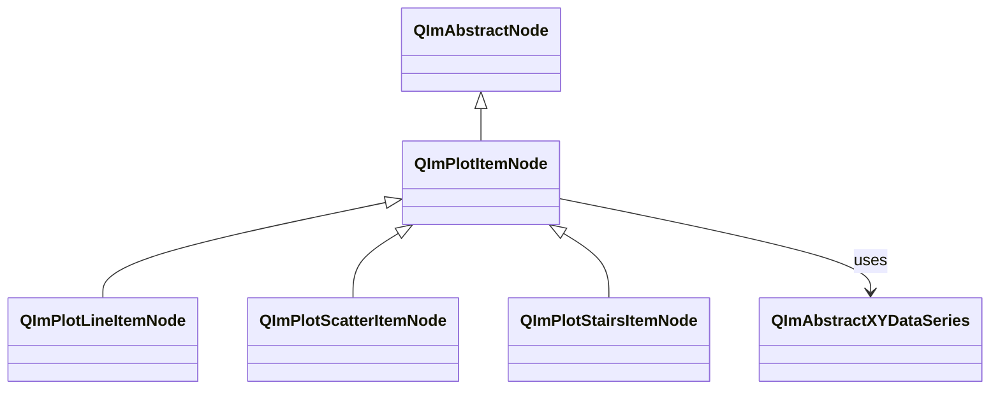
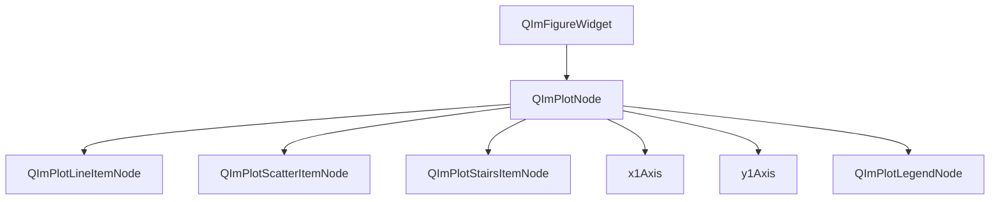

# 2D Basic Charts Usage Guide

Line charts, scatter charts, and stair charts are the most fundamental 2D plot types in QIm,
used respectively for visualizing continuous data, discrete point distributions, and step-change data.
They share the same `QImPlotItemNode` base class and XY data series interface,
providing a consistent usage pattern through the Qt property system.

## Main Features

**Features**

- ✅ **Unified Base Class**: All three chart types inherit from `QImPlotItemNode`, sharing common properties such as label, axis binding, and color
- ✅ **Qt Property Integration**: All configurable properties exposed via Q_PROPERTY, supporting signal-slot reactive programming
- ✅ **Adaptive Sampling**: Line and Scatter have built-in LTTB downsampling for smooth rendering with millions of data points
- ✅ **Object Tree Management**: Specifying `QImPlotNode` as parent at construction automatically joins the object tree
- ✅ **Convenient Creation**: Line provides `addLine()` template method for quick creation; Scatter/Stairs can be manually constructed
- ✅ **Rich Styles**: Line supports shaded fill and loop mode; Scatter supports 10 marker shapes; Stairs supports pre/post step switching

## Basic Concepts

### Class Inheritance

All three basic chart nodes inherit from `QImPlotItemNode`, which inherits from `QImAbstractNode`:



`QImPlotItemNode` is the base class for all 2D plot items, providing common properties such as label (`label`), axis binding (`bindAxis`),
visibility (`visible`), etc. `QImAbstractXYDataSeries` is the abstract base class for data series,
and all three chart types bind data via the `setData()` method.

### Object Tree Layout

Chart item nodes exist as children of `QImPlotNode`:



**Object tree notes:**

- Chart item nodes are created with `QImPlotNode` as parent, automatically joining the object tree
- Multiple chart items of different types can coexist under the same `QImPlotNode`
- Node lifecycle is managed by the Qt object tree; child nodes are automatically destroyed when the parent is destroyed

### Differences Between the Three Chart Types

| Chart Type | Use Case | Data Characteristics | Rendering Method |
|----------|----------|----------|----------|
| Line | Continuous data trends | Data points connected by line segments | `ImPlot::PlotLine` |
| Scatter | Discrete point distribution | Each data point displayed independently as a marker | `ImPlot::PlotScatter` |
| Stairs | Step-change data | Data points connected by horizontal + vertical line segments | `ImPlot::PlotStairs` |

!!! info "Choosing the Right Chart Type"
    - Observing data trends and continuous changes → **Line**
    - Observing data point distribution and discrete characteristics → **Scatter**
    - Expressing discrete state switches or step changes (e.g., digital signals, inventory levels) → **Stairs**

## Line Chart (QImPlotLineItemNode)

`QImPlotLineItemNode` is the most commonly used plotting component in QIm for drawing line charts and curves,
connecting data points with continuous line segments, suitable for visualizing continuous data trends.

### 1. Basic Usage

#### Method 1: addLine() Convenience Method

Quick line chart creation via `QImPlotNode::addLine()` template method, which internally creates the node and adds it to the object tree:

```cpp
#include "QImFigureWidget.h"
#include "plot/QImPlotNode.h"

// Create plot window
QIM::QImFigureWidget* figure = new QIM::QImFigureWidget(this);
QIM::QImPlotNode* plot = figure->createPlotNode();
plot->setTitle("Example Chart");

// Pass data arrays directly; addLine() auto-creates QImPlotLineItemNode
std::vector<double> x = {0, 1, 2, 3, 4};
std::vector<double> y = {0, 1, 4, 9, 16};
QIM::QImPlotLineItemNode* line = plot->addLine(x, y, "Quadratic");
// line automatically becomes a child of plot and joins the object tree
```

`addLine()` is a template method that supports `QVector<double>`, `std::vector<double>`, and other standard container types.
The internal flow is:

1. Create a `QImPlotLineItemNode` object
2. Call `setData(x, y)` to set data
3. Call `setLabel(label)` to set the legend label
4. Call `addPlotItem()` to add the node to the object tree
5. Return the node pointer for subsequent style configuration

!!! tip "addLine() vs Manual Creation"
    `addLine()` is suitable for quick creation scenarios. When you need more flexible control (e.g., creating the node first then configuring properties step by step),
    manually create a `QImPlotLineItemNode`.

#### Method 2: Manual Node Creation

Manual creation allows finer control over node properties:

```cpp
#include "plot/QImPlotLineItemNode.h"

// Manually create line node, specifying plot as parent (auto-joins object tree)
QIM::QImPlotLineItemNode* line = new QIM::QImPlotLineItemNode(plot);
line->setLabel("Custom Curve");
line->setData(x, y);
line->setColor(QColor(255, 0, 0));  // Red

// Effect: displays a red polyline; node tree structure: figure → plot → line
```

!!! info "Object Tree Parent-Child Relationship"
    When creating chart item nodes, specify `QImPlotNode` as parent to automatically join the object tree:
    ```cpp
    // Method 1: Specify parent at construction (recommended)
    QIM::QImPlotLineItemNode* line = new QIM::QImPlotLineItemNode(plot);

    // Method 2: Add via addPlotItem()
    QIM::QImPlotLineItemNode* line = new QIM::QImPlotLineItemNode();
    plot->addPlotItem(line);
    ```
    Both methods are equivalent. Method 1 is more aligned with Qt object tree conventions, where node lifecycle is managed by the parent node.

### 2. Style Configuration

```cpp
// Set line color
line->setColor(QColor(0, 100, 200));

// Enable shaded fill (area below the line filled with semi-transparent color)
line->setShaded(true);

// Enable loop mode (first and last data points connected, forming a closed curve)
line->setLoop(true);

// Skip NaN values (break segments when encountering NaN instead of connecting)
line->setSkipNaN(true);

// Enable segment drawing (draw independent segments between each adjacent pair)
line->setSegments(true);

// Enable clipping (don't clip line segments at plot area edges, reverses ImPlot's NoClip)
line->setClippingEnabled(true);
```

### 3. Adaptive Sampling

Line charts have LTTB (Largest Triangle Three Buckets) adaptive downsampling enabled by default.
When the data volume exceeds a threshold, it automatically downsamples to maintain smooth rendering:

```cpp
// Query adaptive sampling state
bool enabled = line->isAdaptiveSampling();

// Disable adaptive sampling (for small datasets, <100k points, disable for precise rendering)
line->setAdaptivesSampling(false);

// Enable adaptive sampling (for large datasets, enabled by default)
line->setAdaptivesSampling(true);
```

!!! tip "Adaptive Sampling Recommendations"
    - **<100k points**: Can disable adaptive sampling for precise rendering
    - **100k~1M points**: Keep default enabled
    - **>1M points**: Must be enabled, otherwise FPS drops significantly

### 4. Large Dataset Example

This example is from `examples/qimfigure-test/functions/line/Line10KFunction.cpp`:

```cpp
#include "QImFigureWidget.h"
#include "plot/QImPlotNode.h"
#include "plot/QImPlotLineItemNode.h"
#include "plot/QImWaveformGenerator.hpp"

// Create plot node
QIM::QImPlotNode* plotNode = figure->createPlotNode();
plotNode->x1Axis()->setLabel("x");
plotNode->y1Axis()->setLabel("cos(x)");
plotNode->setTitle("Line10K");

// Generate 10000 cosine wave data points
const int numPoints = 10000;
auto wave = QIM::make_waveform<QIM::CosineWave>(15.0, 0.001);
auto datas = wave.generate(numPoints, 0.0, 20 * M_PI);

// Manually create line node (specify plotNode as parent, auto-joins object tree)
QIM::QImPlotLineItemNode* lineNode = new QIM::QImPlotLineItemNode(plotNode);
lineNode->setData(datas.first, datas.second);
lineNode->setColor(QColor(0, 114, 189));
// Adaptive sampling enabled by default, no manual setup needed
```

### 5. Property List

| Property | Type | Getter | Setter | Signal | Description |
|------|------|--------|--------|------|------|
| label | QString | `label()` | `setLabel()` | `labelChanged` | Legend label (inherited from QImPlotItemNode) |
| segments | bool | `isSegments()` | `setSegments()` | `lineFlagChanged` | Segment drawing mode |
| loop | bool | `isLoop()` | `setLoop()` | `lineFlagChanged` | Loop mode (end-to-end connection) |
| skipNaN | bool | `isSkipNaN()` | `setSkipNaN()` | `lineFlagChanged` | Skip NaN values |
| clippingEnabled | bool | `isClippingEnabled()` | `setClippingEnabled()` | `lineFlagChanged` | Clipping enabled (reverses ImPlot !NoClip) |
| shaded | bool | `isShaded()` | `setShaded()` | `lineFlagChanged` | Shaded fill |
| adaptiveSampling | bool | `isAdaptiveSampling()` | `setAdaptivesSampling()` | - | Adaptive sampling (LTTB) |
| color | QColor | `color()` | `setColor()` | - | Line color |

!!! warning "Flag Semantic Conversion"
    ImPlot natively uses negative semantics (e.g., `ImPlotLineFlags_NoClip`). QIm uniformly converts them to affirmative semantics
    (e.g., `clippingEnabled`). `setClippingEnabled(false)` is equivalent to ImPlot's `ImPlotLineFlags_NoClip`.
    See [Flag Mapping Specification](../dev/flag-mapping.md) for details.

!!! warning "lineFlagChanged Signal"
    All flag properties (segments, loop, skipNaN, clippingEnabled, shaded) share the `lineFlagChanged()` signal.
    This signal does not indicate which specific flag changed. Connected slots must query the relevant properties to determine what changed.

### 6. Signal List

| Signal | Parameters | Trigger Timing |
|------|------|----------|
| `lineFlagChanged()` | - | When any line flag property changes |
| `labelChanged(name)` | QString | When label changes (inherited from QImPlotItemNode) |

```cpp
// Monitor flag changes
connect(line, &QIM::QImPlotLineItemNode::lineFlagChanged,
        this, [line]() {
    if (line->isShaded()) {
        qDebug() << "Shaded fill enabled";
    }
});

// Monitor label changes
connect(line, &QIM::QImPlotItemNode::labelChanged,
        this, [](const QString& name) {
    qDebug() << "Label updated to:" << name;
});
```

## Scatter Chart (QImPlotScatterItemNode)

`QImPlotScatterItemNode` is used for drawing scatter charts. Each data point is independently displayed as a marker,
without connecting line segments, suitable for visualizing the distribution and clustering characteristics of discrete data points.

### 1. Basic Usage

Scatter charts are used via manual node creation:

```cpp
#include "plot/QImPlotScatterItemNode.h"

// Create plot node
QIM::QImPlotNode* plot = figure->createPlotNode();
plot->setTitle("Scatter Example");

// Create scatter node, specifying plot as parent (auto-joins object tree)
QIM::QImPlotScatterItemNode* scatter = new QIM::QImPlotScatterItemNode(plot);
scatter->setLabel("Sample Data");

// Set data
std::vector<double> x = {0.2, 0.5, 0.9, 1.3, 1.8, 2.1, 2.6, 3.0};
std::vector<double> y = {1.4, 1.0, 1.8, 1.3, 2.0, 1.7, 2.3, 2.1};
scatter->setData(x, y);

// Configure marker style
scatter->setMarkerSize(6.0f);
scatter->setMarkerFill(true);
scatter->setColor(QColor(0, 114, 189));

// Effect: displays a scatter chart with blue filled circular markers
```

### 2. Marker Shapes (ImPlotMarker)

Scatter chart marker shapes are set via `setMarkerShape()`, corresponding to ImPlot's `ImPlotMarker` enum:

```cpp
// Set marker shape (pass ImPlotMarker enum value)
scatter->setMarkerShape(ImPlotMarker_Circle);   // Circle (default)
scatter->setMarkerShape(ImPlotMarker_Square);   // Square
scatter->setMarkerShape(ImPlotMarker_Diamond);  // Diamond
```

**ImPlotMarker Enum Values:**

| Enum Value | Value | Shape | Fillable | Description |
|--------|------|------|--------|------|
| `ImPlotMarker_None` | -1 | None | - | Do not show marker |
| `ImPlotMarker_Circle` | 0 | Circle | ✅ | Default marker shape |
| `ImPlotMarker_Square` | 1 | Square | ✅ | Square marker |
| `ImPlotMarker_Diamond` | 2 | Diamond | ✅ | 45° rotated square |
| `ImPlotMarker_Up` | 3 | Up Triangle | ✅ | Upward-pointing triangle |
| `ImPlotMarker_Down` | 4 | Down Triangle | ✅ | Downward-pointing triangle |
| `ImPlotMarker_Left` | 5 | Left Triangle | ✅ | Left-pointing triangle |
| `ImPlotMarker_Right` | 6 | Right Triangle | ✅ | Right-pointing triangle |
| `ImPlotMarker_Cross` | 7 | Cross | ❌ | Cross lines (non-fillable) |
| `ImPlotMarker_Plus` | 8 | Plus | ❌ | Plus sign (non-fillable) |
| `ImPlotMarker_Asterisk` | 9 | Asterisk | ❌ | Six-pointed asterisk (non-fillable) |

!!! warning "Non-Fillable Markers"
    `ImPlotMarker_Cross`, `ImPlotMarker_Plus`, and `ImPlotMarker_Asterisk` do not support filling.
    Even with `setMarkerFill(true)`, only the outline will be shown.

### 3. Marker Style Configuration

```cpp
// Set marker size (pixel units)
scatter->setMarkerSize(8.0f);

// Set marker fill (true=fill color, false=outline only)
scatter->setMarkerFill(true);

// Set marker color
scatter->setColor(QColor(217, 83, 25));

// Set clipping (whether markers are clipped at plot area edges)
scatter->setClippingEnabled(true);
```

### 4. Adaptive Sampling and Downsample Threshold

Scatter charts also support adaptive sampling with independent downsample threshold control:

```cpp
// Query adaptive sampling state
bool enabled = scatter->isAdaptiveSampling();

// Enable/disable adaptive sampling
scatter->setAdaptiveSampling(true);

// Set downsample threshold (downsampling triggers when data points exceed this value)
scatter->setDownsampleThreshold(5000);  // Default value is internally set

// Query current threshold
int threshold = scatter->downsampleThreshold();
```

!!! tip "Scatter Chart Downsampling Recommendations"
    - Scatter chart downsampling uses the MinMaxLTTB algorithm, ensuring the point distribution after downsampling retains the range characteristics of the original data
    - For cluster analysis scenarios, disable downsampling or increase the threshold to avoid losing key distribution characteristics

### 5. Complete Example

This example is from `examples/qimfigure-test/functions/datapoints/ScatterFunction.cpp`:

```cpp
#include "QImFigureWidget.h"
#include "plot/QImPlotNode.h"
#include "plot/QImPlotScatterItemNode.h"

// Create plot node
QIM::QImPlotNode* plotNode = figure->createPlotNode();
plotNode->x1Axis()->setLabel("x");
plotNode->y1Axis()->setLabel("y");
plotNode->setTitle("Scatter");
plotNode->setLegendEnabled(true);

// Generate 1000 random scatter data points
const int numPoints = 1000;
std::vector<double> xData(numPoints);
std::vector<double> yData(numPoints);

std::random_device rd;
std::mt19937 gen(rd());
std::normal_distribution<double> xDist(0.0, 1.0);
std::normal_distribution<double> yDist(0.0, 1.0);

for (int i = 0; i < numPoints; ++i) {
    xData[i] = xDist(gen);
    yData[i] = yDist(gen);
}

// Create scatter node, specifying plotNode as parent
QIM::QImPlotScatterItemNode* scatterNode = new QIM::QImPlotScatterItemNode(plotNode);
scatterNode->setData(xData, yData);
scatterNode->setMarkerSize(4.0f);
scatterNode->setMarkerShape(0);   // Circle
scatterNode->setMarkerFill(true);
scatterNode->setColor(QColor(0, 114, 189));
scatterNode->setClippingEnabled(true);
```

### 6. Property List

| Property | Type | Getter | Setter | Signal | Description |
|------|------|--------|--------|------|------|
| label | QString | `label()` | `setLabel()` | `labelChanged` | Legend label (inherited from QImPlotItemNode) |
| markerSize | float | `markerSize()` | `setMarkerSize()` | `markerSizeChanged` | Marker size (pixels) |
| markerShape | int | `markerShape()` | `setMarkerShape()` | `markerShapeChanged` | Marker shape (ImPlotMarker enum value) |
| markerFill | bool | `isMarkerFill()` | `setMarkerFill()` | `markerFillChanged` | Marker fill mode |
| adaptiveSampling | bool | `isAdaptiveSampling()` | `setAdaptiveSampling()` | `adaptiveSamplingChanged` | Adaptive sampling |
| downsampleThreshold | int | `downsampleThreshold()` | `setDownsampleThreshold()` | `downsampleThresholdChanged` | Downsample threshold |
| color | QColor | `color()` | `setColor()` | `colorChanged` | Marker color |
| clippingEnabled | bool | `isClippingEnabled()` | `setClippingEnabled()` | `scatterFlagChanged` | Clipping enabled (reverses ImPlot !NoClip) |

!!! warning "Flag Semantic Conversion"
    The `clippingEnabled` property reverses ImPlot's `ImPlotScatterFlags_NoClip`.
    `setClippingEnabled(false)` is equivalent to setting `ImPlotScatterFlags_NoClip`.

### 7. Signal List

| Signal | Parameters | Trigger Timing |
|------|------|----------|
| `markerSizeChanged(size)` | float | When marker size changes |
| `markerShapeChanged(shape)` | int | When marker shape changes |
| `markerFillChanged(fill)` | bool | When marker fill state changes |
| `adaptiveSamplingChanged(enabled)` | bool | When adaptive sampling state changes |
| `downsampleThresholdChanged(threshold)` | int | When downsample threshold changes |
| `colorChanged(color)` | QColor | When marker color changes |
| `dataChanged()` | - | When data series changes |
| `scatterFlagChanged()` | - | When scatter chart flags change |
| `labelChanged(name)` | QString | When label changes (inherited from QImPlotItemNode) |

```cpp
// Monitor marker size changes
connect(scatter, &QIM::QImPlotScatterItemNode::markerSizeChanged,
        this, [](float newSize) {
    qDebug() << "Marker size updated to:" << newSize;
});

// Monitor color changes
connect(scatter, &QIM::QImPlotScatterItemNode::colorChanged,
        this, [](const QColor& newColor) {
    qDebug() << "Marker color updated to:" << newColor.name();
});
```

!!! warning "scatterFlagChanged Signal"
    The `scatterFlagChanged()` signal is currently only triggered by `clippingEnabled` property changes.

## Stairs Chart (QImPlotStairsItemNode)

`QImPlotStairsItemNode` is used for drawing stair charts (stepped polylines). Data points are connected by horizontal
and vertical line segments, forming a stair-step appearance. Unlike line charts, stair charts do not use diagonal lines to connect adjacent points,
making them suitable for expressing discrete state switches, digital signals, or inventory levels where data changes in steps.

### Difference from Line Charts

Stairs charts and line charts use the same XY data but differ in connection style:

- **Line chart**: Adjacent data points are connected by diagonal line segments, forming a continuous curve
- **Stairs chart**: Adjacent data points are connected by horizontal + vertical line segments, forming a stair-step appearance

```text
Line chart:        Stairs chart (post-step):
    │   /          │     ┌──┐
    │  /           │     │  │
    │ /            │ ┌──┐│  │
    │/             │ │  ││  └──
```

### 1. Basic Usage

```cpp
#include "plot/QImPlotStairsItemNode.h"

// Create plot node
QIM::QImPlotNode* plot = figure->createPlotNode();
plot->setTitle("Stairs Example");

// Create stairs node, specifying plot as parent (auto-joins object tree)
QIM::QImPlotStairsItemNode* stairs = new QIM::QImPlotStairsItemNode(plot);
stairs->setLabel("State Change");

// Set data
std::vector<double> x = {0, 1, 2, 3, 4, 5, 6, 7, 8, 9};
std::vector<double> y = {1, 2, 1, 3, 2, 1, 3, 2, 1, 3};
stairs->setData(x, y);

// Set color
stairs->setColor(QColor(80, 170, 90));
```

### 2. preStep Property

The stairs chart provides the `preStep` property to control the drawing direction of the steps:

- **preStep = false (default, post-step)**: The step is drawn **after** the data point — first draw a horizontal line to the next x value, then a vertical line to the next y value
- **preStep = true (pre-step)**: The step is drawn **before** the data point — first draw a vertical line to the next y value, then a horizontal line to the next x value

```cpp
// Post-step mode (default)
stairs->setPreStep(false);

// Pre-step mode
stairs->setPreStep(true);
```

```text
Post-step (preStep=false):    Pre-step (preStep=true):
    │     ┌──┐                  │ ┌──┐
    │     │  │                  │ │  │
    │ ┌──┐│  │                  │ │  └──┐
    │ │  ││  └──                │ │     │
```

!!! info "preStep Use Cases"
    - **Post-step**: "Starting from the current moment, the value becomes y" — suitable for expressing state changes after an event triggers
    - **Pre-step**: "Before the current moment, the value has already become y" — suitable for expressing expected state or pre-effective changes

### 3. shaded Property

When `shaded` is enabled, the area below the stair line is filled with a semi-transparent color:

```cpp
// Enable shaded fill
stairs->setShaded(true);

// Disable shaded fill
stairs->setShaded(false);
```

### 4. Complete Example

This example is from `examples/qimfigure-test/functions/datapoints/StairsFunction.cpp`:

```cpp
#include "QImFigureWidget.h"
#include "plot/QImPlotNode.h"
#include "plot/QImPlotStairsItemNode.h"

// Create plot node
QIM::QImPlotNode* plotNode = figure->createPlotNode();
plotNode->x1Axis()->setLabel("x");
plotNode->y1Axis()->setLabel("y");
plotNode->setTitle("Stairs");
plotNode->setLegendEnabled(true);

// Generate 10 stair data points
const int numPoints = 10;
std::vector<double> xData(numPoints);
std::vector<double> yData(numPoints);

for (int i = 0; i < numPoints; ++i) {
    xData[i] = i;
    yData[i] = static_cast<double>(i % 3) + 1.0;  // Values cycle between 1/2/3
}

// Create stairs node, specifying plotNode as parent
QIM::QImPlotStairsItemNode* stairsNode = new QIM::QImPlotStairsItemNode(plotNode);
stairsNode->setLabel("Stairs Plot");
stairsNode->setData(xData, yData);
stairsNode->setColor(QColor(80, 170, 90));
stairsNode->setShaded(false);   // No shaded fill
stairsNode->setPreStep(false);  // Post-step mode
```

### 5. Property List

| Property | Type | Getter | Setter | Signal | Description |
|------|------|--------|--------|------|------|
| label | QString | `label()` | `setLabel()` | `labelChanged` | Legend label (inherited from QImPlotItemNode) |
| shaded | bool | `isShaded()` | `setShaded()` | `stairsFlagChanged` | Shaded fill |
| preStep | bool | `isPreStep()` | `setPreStep()` | `stairsFlagChanged` | Pre-step mode |

!!! warning "Flag Semantic Conversion"
    The `preStep` property corresponds to ImPlot's `ImPlotStairsFlags_PreStep`.
    `setPreStep(true)` is equivalent to setting this flag.

!!! warning "stairsFlagChanged Signal"
    The two flag properties `shaded` and `preStep` share the `stairsFlagChanged()` signal.
    This signal does not indicate which specific flag changed. Connected slots must query the relevant properties to determine what changed.

### 6. Signal List

| Signal | Parameters | Trigger Timing |
|------|------|----------|
| `stairsFlagChanged()` | - | When stairs chart flags (shaded, preStep) change |
| `labelChanged(name)` | QString | When label changes (inherited from QImPlotItemNode) |

```cpp
// Monitor stairs chart flag changes
connect(stairs, &QIM::QImPlotStairsItemNode::stairsFlagChanged,
        this, [stairs]() {
    if (stairs->isShaded()) {
        qDebug() << "Shaded fill enabled";
    }
    if (stairs->isPreStep()) {
        qDebug() << "Pre-step mode enabled";
    }
});
```

## Shared Interfaces

All three basic chart nodes share the following interfaces (inherited from `QImPlotItemNode`):

### Data Setup

```cpp
// Method 1: Pass an existing data series object
void setData(QImAbstractXYDataSeries* series);

// Method 2: Pass containers directly (template method, supports std::vector, QVector, etc.)
QImAbstractXYDataSeries* setData(const ContainerX& x, const ContainerY& y);

// Method 3: Pass rvalue containers (move semantics, avoids data copying)
QImAbstractXYDataSeries* setData(ContainerX&& x, ContainerY&& y);

// Get current data series
QImAbstractXYDataSeries* data() const;
```

### Common Properties (QImPlotItemNode)

| Method | Description |
|------|------|
| `setLabel(name)` / `label()` | Set/get legend label |
| `bindAxis(xId, yId)` | Bind axes (x and y axis IDs) |
| `xAxisId()` / `yAxisId()` | Get bound axis IDs |
| `plotNode()` | Get the owning QImPlotNode |
| `setVisible(on)` / `isVisible()` | Set/get visibility |
| `itemColor()` | Get ImPlot-assigned item color |
| `isLegendHovered()` | Whether legend item is hovered by mouse |
| `pixelsToPlot(sx, sy)` | Screen coordinates → plot coordinates (must be called within beginDraw) |
| `plotToPixels(dx, dy)` | Plot coordinates → screen coordinates (must be called within beginDraw) |

!!! warning "Interaction Method Call Timing"
    `pixelsToPlot()`, `plotToPixels()`, and `isLegendHovered()` must be called during `beginDraw()` execution,
    while the ImPlot context is active. Calling at other times will return invalid values.

## Notes

!!! warning "String Storage Convention"
    QIm nodes internally only store `QByteArray` (UTF-8 format), not `QString`.
    `setLabel()` accepts `QString` parameters but internally converts to UTF-8 storage.
    Code should use the `QIM::` namespace and `Q_SLOTS`/`Q_SIGNALS`/`Q_EMIT` macros.
    Using `slots`/`signals`/`emit` is prohibited.

!!! tip "Large Dataset Performance"
    - Line and Scatter have LTTB adaptive downsampling enabled by default, maintaining smooth rendering for millions of data points
    - For small datasets (<100k points), you can disable downsampling for precise rendering
    - Stairs does not provide adaptive sampling properties, but it is recommended to control the number of data points for large datasets

!!! info "Axis Binding"
    By default, chart items are bound to the x1/y1 primary axes. Use `bindAxis()` to bind to secondary axes:
    ```cpp
    // Bind to x2/y2 secondary axes
    line->bindAxis(QIM::QImPlotAxisId::X2, QIM::QImPlotAxisId::Y2);
    ```

!!! warning "Line Styles Not Available"
    QIm currently does not support line styles (dashed, dot-dash, etc.). This is a known limitation of ImPlot.

## References

- Related documentation: [QImPlotNode Usage Guide](plot-node.md), [Line Plot](plot-line.md), [Render Node](../render-node.md), [Flag Mapping](../dev/flag-mapping.md)
- Example code: `examples/qimfigure-test/functions/line/Line10KFunction.cpp`, `examples/qimfigure-test/functions/datapoints/ScatterFunction.cpp`, `examples/qimfigure-test/functions/datapoints/StairsFunction.cpp`
- API reference: `src/core/plot/QImPlotLineItemNode.h`, `src/core/plot/QImPlotScatterItemNode.h`, `src/core/plot/QImPlotStairsItemNode.h`, `src/core/plot/QImPlotItemNode.h`