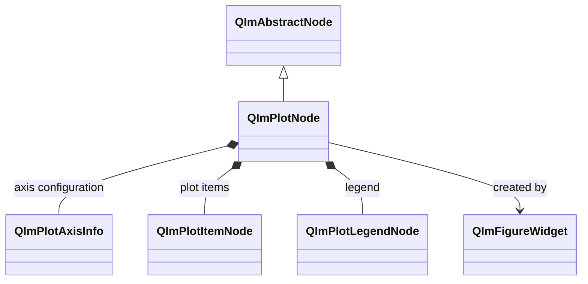
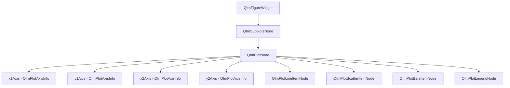

# QImPlotNode Usage Guide

`QImPlotNode` is the core 2D plotting node in QIm, inheriting from `QImAbstractNode`,
managing the lifecycle, axis configuration, and rendering context of a single ImPlot plot area.
It serves as the parent node for all 2D plot elements.

## Main Features

**Features**

- ✅ **Plot Area Management**: Encapsulates ImPlot's BeginPlot/EndPlot rendering flow, automatically managing plot context
- ✅ **Axis Configuration**: Supports up to 6 axes (x1/y1/x2/y2/x3/y3) with fine-grained control via `QImPlotAxisInfo`
- ✅ **Flag Property System**: Maps ImPlotFlags to Qt affirmative-semantic boolean properties (titleEnabled, legendEnabled, etc.)
- ✅ **Convenient Line Creation**: Provides `addLine()` template method for quick line chart creation
- ✅ **Interaction Queries**: Supports mouse hover detection, screen-to-plot and plot-to-screen coordinate conversion
- ✅ **Signal Notifications**: Emits Qt signals on property changes, supporting reactive programming

## Basic Concepts

### Class Inheritance



`QImPlotNode` inherits from `QImAbstractNode` and is the core node for 2D plot areas in the QIm object tree.
Each `QImPlotNode` internally manages axis configuration objects (`QImPlotAxisInfo`), plot item nodes (`QImPlotItemNode`),
and legend nodes (`QImPlotLegendNode`).

### Object Tree Layout

`QImPlotNode`'s position and child node relationships in the QIm object tree:



**Object tree notes:**

- `QImPlotNode` is created by `QImFigureWidget::createPlotNode()` and automatically becomes a child of `QImSubplotsNode`
- Axis configuration objects (`QImPlotAxisInfo`) are internally created and owned by `QImPlotNode`
- Plot item nodes (such as `QImPlotLineItemNode`) are added to the object tree via `addPlotItem()` or by specifying the parent at construction time
- Legend nodes (`QImPlotLegendNode`) are internally created by `QImPlotNode`, accessed via `legendNode()`

### Rendering Flow

The rendering flow of `QImPlotNode` strictly follows ImPlot constraints:

1. `beginDraw()` → calls `ImPlot::BeginPlot()` to create the plot context
2. `SetupAxes()` → configures axes (must be done before the first plot call)
3. Child node rendering → each `QImPlotItemNode` calls ImPlot plotting APIs
4. `endDraw()` → calls `ImPlot::EndPlot()` to close the plot context

## Usage

Example code is located in `examples/qimfigure-test` and `examples/readme-2d-example`.

### 1. Basic Usage

Create a plot node via `QImFigureWidget::createPlotNode()` and add a curve:

```cpp
#include "QImFigureWidget.h"
#include "plot/QImPlotNode.h"

// Create plot window
QIM::QImFigureWidget* figure = new QIM::QImFigureWidget(this);
setCentralWidget(figure);

// Create plot node (default 1x1 layout)
QIM::QImPlotNode* plot = figure->createPlotNode();
plot->setTitle("Example Chart");

// Set axis labels
plot->x1Axis()->setLabel("x");
plot->y1Axis()->setLabel("y");

// Quickly add a line
std::vector<double> x = {0, 1, 2, 3, 4};
std::vector<double> y = {0, 1, 4, 9, 16};
plot->addLine(x, y, "Quadratic");
```

Effect: Displays a plot window with a single line, with axis labels "x" and "y".

### 2. Multi-Plot Configuration

Create multiple plots of different types in a 2x2 subplot grid:
(this example is from `examples/readme-2d-example/main.cpp`)

```cpp
// Create figure, set 2x2 subplot layout
QIM::QImFigureWidget* figure = new QIM::QImFigureWidget(this);
figure->setSubplotGrid(2, 2);
figure->setRenderMode(QIM::QImWidget::RenderOnDemand);

// Subplot 1 - Line chart
if (QIM::QImPlotNode* plot = figure->createPlotNode()) {
    plot->setTitle("Sine Wave");
    plot->x1Axis()->setLabel("x");
    plot->y1Axis()->setLabel("sin(x)");
    plot->setLegendEnabled(true);

    std::vector<double> x, y;
    x.reserve(400);
    y.reserve(400);
    for (int i = 0; i < 400; ++i) {
        double value = i * 2.0 * M_PI / 399.0;
        x.push_back(value);
        y.push_back(std::sin(value));
    }
    plot->addLine(x, y, "sin(x)");
}

// Subplot 2 - Scatter chart
if (QIM::QImPlotNode* plot = figure->createPlotNode()) {
    plot->setTitle("Scatter");
    plot->x1Axis()->setLabel("x");
    plot->y1Axis()->setLabel("y");
    plot->setLegendEnabled(true);
    std::vector<double> x {0.2, 0.5, 0.9, 1.3, 1.8, 2.1, 2.6, 3.0};
    std::vector<double> y {1.4, 1.0, 1.8, 1.3, 2.0, 1.7, 2.3, 2.1};
    auto* scatter = new QIM::QImPlotScatterItemNode(plot);  // Automatically becomes child of plot
    scatter->setLabel("samples");
    scatter->setData(x, y);
    scatter->setMarkerSize(6.0f);
    scatter->setMarkerFill(true);
    scatter->setColor(QColor(0, 114, 189));
}

// Subplot 4 - Pie chart (configure equal aspect ratio and hide decorations)
if (QIM::QImPlotNode* plot = figure->createPlotNode()) {
    plot->setTitle("Pie Chart");
    plot->setEqual(true);                    // Equal aspect ratio
    plot->setMouseTextEnabled(false);         // Hide mouse coordinate text
    plot->x1Axis()->setNoDecorations(true);   // Hide x-axis decorations
    plot->y1Axis()->setNoDecorations(true);   // Hide y-axis decorations
    plot->x1Axis()->setLimits(0.0, 1.0, QIM::QImPlotCondition::Always);
    plot->y1Axis()->setLimits(0.0, 1.0, QIM::QImPlotCondition::Always);
}
```

Note that `createPlotNode()` fills subplot cells in order and returns `nullptr` when all cells are occupied.

### 3. Axis Configuration

Fine-grained axis control via `QImPlotAxisInfo`:

```cpp
QIM::QImPlotNode* plot = figure->createPlotNode();

// Get primary axes
QIM::QImPlotAxisInfo* x1 = plot->x1Axis();
QIM::QImPlotAxisInfo* y1 = plot->y1Axis();

// Set labels
x1->setLabel("Time (s)");
y1->setLabel("Amplitude (V)");

// Set range limits (Always means enforced every frame)
x1->setLimits(0.0, 10.0, QIM::QImPlotCondition::Always);
y1->setLimits(-1.0, 1.0, QIM::QImPlotCondition::Once);

// Set scale type
x1->setScaleType(QIM::QImPlotScaleType::Time);  // Time axis
y1->setScaleType(QIM::QImPlotScaleType::Log10);  // Log axis

// Enable/disable secondary axis
plot->setAxisEnabled(QIM::QImPlotAxisId::X2, true);
plot->x2Axis()->setLabel("Temperature (°C)");
```

### 4. Large Dataset Plotting

Handle large datasets via the `addLine()` template method or manual node creation:
(this example is from `examples/qimfigure-test/functions/line/Line10KFunction.cpp`)

```cpp
// Create plot node
QIM::QImPlotNode* plotNode = figure->createPlotNode();

// Configure axes and title
plotNode->x1Axis()->setLabel("x");
plotNode->y1Axis()->setLabel("cos(x)");
plotNode->setTitle("Line10K");

// Generate 10000 cosine wave data points
const int numPoints = 10000;
std::vector<double> x, y;
x.reserve(numPoints);
y.reserve(numPoints);
for (int i = 0; i < numPoints; ++i) {
    double t = i * 20.0 * M_PI / (numPoints - 1);
    x.push_back(t);
    y.push_back(std::cos(t));
}

// Manually create line node (specify plotNode as parent, auto-joins object tree)
QIM::QImPlotLineItemNode* lineNode = new QIM::QImPlotLineItemNode(plotNode);
lineNode->setData(x, y);
lineNode->setColor(QColor(0, 114, 189));
// addPlotItem is automatically done by specifying parent at construction time
```

!!! tip "Large Dataset Performance"
    LTTB adaptive downsampling is enabled by default. Large datasets are automatically downsampled for smooth rendering.
    For small datasets (<100k points), you can disable it for precise rendering: `lineNode->setAdaptiveSampling(false)`.

### 5. Flag Property Configuration

Control various display and interaction features of the plot area using affirmative-semantic boolean properties:

```cpp
QIM::QImPlotNode* plot = figure->createPlotNode();

// Title display
plot->setTitleEnabled(true);    // Show title (enabled by default)

// Legend display
plot->setLegendEnabled(true);   // Show legend

// Mouse coordinate text
plot->setMouseTextEnabled(true);  // Show mouse position coordinate text

// Interaction control
plot->setInputsEnabled(true);     // Enable mouse interaction (drag/zoom etc.)
plot->setMenusEnabled(true);      // Enable right-click menus
plot->setBoxSelectEnabled(true);  // Enable box selection

// Display control
plot->setFrameEnabled(true);      // Show frame
plot->setEqual(true);             // Equal aspect ratio axes
plot->setCrosshairs(true);        // Show crosshairs
plot->setCanvasEnabled(true);     // Show canvas background
```

!!! warning "Flag Semantic Conversion"
    ImPlot natively uses negative semantics (e.g., `ImPlotFlags_NoTitle`). QIm uniformly converts them to affirmative semantics
    (e.g., `titleEnabled`). Setting `setTitleEnabled(false)` is equivalent to ImPlot's
    `ImPlotFlags_NoTitle`. See [Flag Mapping Specification](../dev/flag-mapping.md) for details.

### 6. Colormap

QIm provides stack-based colormap management. Control the current plot area's colormap via `pushColormap()` / `popColormap()`:

```cpp
QIM::QImPlotNode* plot = figure->createPlotNode();

// Method 1: Set colormap via enum value
plot->pushColormap(QIM::QImPlotColormap::Viridis);

// Method 2: Set colormap via name string (must be registered in QImPlotColormapManager)
plot->pushColormap(QByteArray("MyCustomColormap"));

// Add plot nodes that use the current colormap
QIM::QImPlotHeatmapItemNode* heatmap = new QIM::QImPlotHeatmapItemNode(plot);
heatmap->setData(values, rows, cols);

// Restore previous colormap
plot->popColormap();

// Pop multiple at once
plot->popColormap(2);
```

The `QImPlotColormap` enum provides 16 built-in colormaps:

| Enum Value | Index | Enum Value | Index |
|--------|------|--------|------|
| `Deep` | 0 | `Dark` | 1 |
| `Pastel` | 2 | `Paired` | 3 |
| `Viridis` | 4 | `Plasma` | 5 |
| `Hot` | 6 | `Cool` | 7 |
| `Pink` | 8 | `Jet` | 9 |
| `Twilight` | 10 | `RdBu` | 11 |
| `BrBG` | 12 | `PiYG` | 13 |
| `Spectral` | 14 | `Greys` | 15 |

`pushColormap()` takes effect in `beginDraw()`, and `popColormap()` executes in `endDraw()`.
Custom colormaps can be registered via `QImPlotColormapManager`.
See [Colormap Documentation](colormap.md) for details.

## API Reference

### Property List

| Property | Type | Getter | Setter | Signal | Description |
|------|------|--------|--------|------|------|
| title | QString | `title()` | `setTitle()` | `titleChanged` | Plot title |
| size | QSizeF | `size()` | `setSize()` | `sizeChanged` | Plot area size |
| autoSize | bool | `isAutoSize()` | `setAutoSize()` | `autoSizeChanged` | Auto-fit size |
| titleEnabled | bool | `isTitleEnabled()` | `setTitleEnabled()` | `plotFlagChanged` | Whether to show title |
| legendEnabled | bool | `isLegendEnabled()` | `setLegendEnabled()` | `plotFlagChanged` | Whether to show legend |
| mouseTextEnabled | bool | `isMouseTextEnabled()` | `setMouseTextEnabled()` | `plotFlagChanged` | Whether to show mouse coordinate text |
| inputsEnabled | bool | `isInputsEnabled()` | `setInputsEnabled()` | `plotFlagChanged` | Whether to enable mouse interaction |
| menusEnabled | bool | `isMenusEnabled()` | `setMenusEnabled()` | `plotFlagChanged` | Whether to enable right-click menu |
| boxSelectEnabled | bool | `isBoxSelectEnabled()` | `setBoxSelectEnabled()` | `plotFlagChanged` | Whether to enable box selection |
| frameEnabled | bool | `isFrameEnabled()` | `setFrameEnabled()` | `plotFlagChanged` | Whether to show frame |
| equal | bool | `isEqual()` | `setEqual()` | `plotFlagChanged` | Equal aspect ratio axes |
| crosshairs | bool | `isCrosshairs()` | `setCrosshairs()` | `plotFlagChanged` | Whether to show crosshairs |
| canvasEnabled | bool | `isCanvasEnabled()` | `setCanvasEnabled()` | `plotFlagChanged` | Whether to show canvas background |

### Method List

| Method | Parameters | Description |
|------|------|------|
| `axisInfo(id)` | `QImPlotAxisId` | Get the specified axis configuration object |
| `x1Axis()` / `y1Axis()` | - | Get primary axis configuration |
| `x2Axis()` / `y2Axis()` | - | Get secondary axis configuration |
| `x3Axis()` / `y3Axis()` | - | Get tertiary axis configuration |
| `isAxisEnabled(id)` | `QImPlotAxisId` | Check if axis is enabled |
| `setAxisEnabled(id, on)` | `QImPlotAxisId`, bool | Enable/disable axis |
| `addPlotItem(item)` | `QImPlotItemNode*` | Add plot item node |
| `addLine(x, y, label)` | Container, Container, QString | Template method, quickly add line |
| `addLine(lineItem)` | `QImPlotLineItemNode*` | Add existing line node |
| `plotItemNodes()` | - | Get all plot item nodes |
| `legendNode()` | - | Get legend node |
| `isPlotHovered()` | - | Whether mouse is hovering over the plot area |
| `pixelsToPlot(sx, sy)` | float, float | Screen coordinates → plot coordinates |
| `plotToPixels(dx, dy)` | double, double | Plot coordinates → screen coordinates |
| `rescaleAxes()` | - | Auto-fit axis ranges |
| `setAxesToFit()` | - | Set axis ranges to fit data |
| `pushColormap(colormap)` | QImPlotColormap | Push colormap (enum value) |
| `pushColormap(name)` | QByteArray | Push colormap (name string) |
| `popColormap(count)` | int | Pop N colormaps (default 1) |
| `imPlotFlags()` | - | Get raw ImPlot flags |
| `setImPlotFlags(flags)` | int | Set raw ImPlot flags |

!!! info "addLine() Template Method"
    `addLine()` is a template method that supports `QVector<double>`, `std::vector<double>`, and other container types.
    It internally creates a `QImPlotLineItemNode` and calls `addPlotItem()` to join the object tree.

!!! warning "Interaction Method Call Timing"
    `isPlotHovered()`, `pixelsToPlot()`, `plotToPixels()` must be called during `beginDraw()` execution,
    i.e., while the ImPlot context is active. Calling at other times will return invalid values.

## Signal-Slot Connections

| Signal | Parameters | Trigger Timing |
|------|------|----------|
| `titleChanged(title)` | QString | When title changes |
| `sizeChanged(size)` | QSizeF | When size changes |
| `autoSizeChanged(autoSize)` | bool | When auto-size state changes |
| `plotFlagChanged()` | - | When any flag property changes |

```cpp
// Monitor title changes
connect(plot, &QIM::QImPlotNode::titleChanged,
        this, [](const QString& newTitle) {
    qDebug() << "Title updated to:" << newTitle;
});

// Monitor flag changes (a single signal covers all flag properties)
connect(plot, &QIM::QImPlotNode::plotFlagChanged,
        this, [plot]() {
    // Must query specific properties to determine what changed
    if (!plot->isLegendEnabled()) {
        qDebug() << "Legend hidden";
    }
});
```

!!! warning "plotFlagChanged Signal"
    All flag properties (titleEnabled, legendEnabled, etc.) share the `plotFlagChanged()` signal.
    This signal does not indicate which specific flag changed. Connected slots must query the relevant properties to determine what changed.

## Notes

!!! warning "createPlotNode() Returns nullptr"
    When subplot cells are full, `createPlotNode()` returns `nullptr`. Always check the return value:
    ```cpp
    if (QIM::QImPlotNode* plot = figure->createPlotNode()) {
        plot->setTitle("Chart");
    } else {
        qDebug() << "Subplot cells full, cannot create new plot";
    }
    ```

!!! warning "Axis Setup Timing"
    `SetupAxes()` must complete before the first plot call. QIm handles this flow automatically within `beginDraw()`,
    but axis configuration (labels, ranges, flags, etc.) should be set immediately after creating the plot node, not dynamically modified in the rendering loop.

!!! info "Object Tree Parent-Child Relationship"
    When creating plot item nodes, specify `QImPlotNode` as the parent to automatically join the object tree:
    ```cpp
    // Method 1: Specify parent at construction (recommended)
    QIM::QImPlotLineItemNode* line = new QIM::QImPlotLineItemNode(plot);

    // Method 2: Add via addPlotItem()
    QIM::QImPlotLineItemNode* line = new QIM::QImPlotLineItemNode();
    plot->addPlotItem(line);
    ```
    Both methods are equivalent. Method 1 is more aligned with Qt object tree conventions, where node lifecycle is managed by the parent node.

!!! info "Axis Condition Enum"
    The `QImPlotCondition` parameter of `setLimits()` controls the range limit enforcement strategy:
    - `Always`: Force the range on every render
    - `Once`: Set the range only on the first render (default)

## References

- Related documentation: [QImFigureWidget](figure-widget.md), [Line Plot](plot-line.md), [Render Node](../render-node.md), [Flag Mapping](../dev/flag-mapping.md)
- Example code: `examples/qimfigure-test`, `examples/readme-2d-example`
- API reference: `src/core/plot/QImPlotNode.h`, `src/core/plot/QImPlotAxisInfo.h`