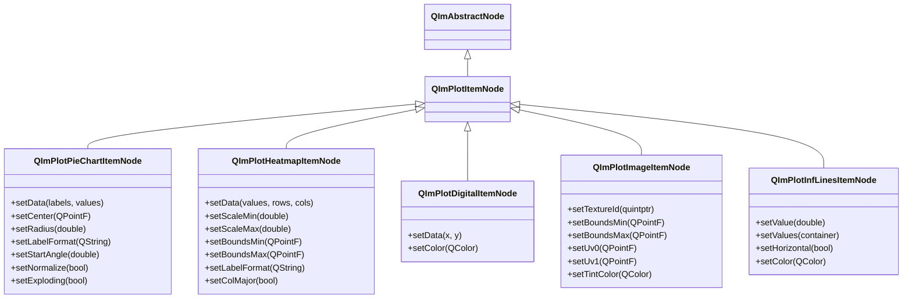
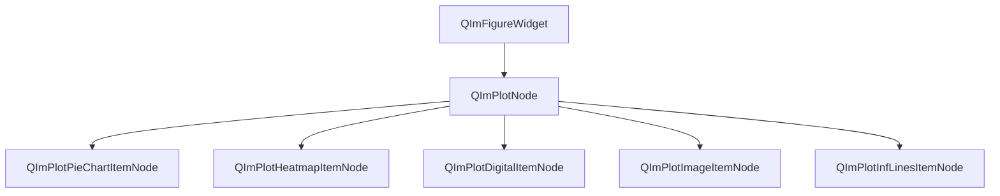

# 2D Special Charts Usage Guide

QIm provides 5 special 2D chart nodes for pie charts, heatmaps, digital signals, image rendering, and infinite reference lines —
all for non-standard curve scenarios. These chart nodes all inherit from `QImPlotItemNode`, follow the same object tree management pattern,
and achieve configuration and interaction through the Qt property system and signal-slot mechanism.

## Main Features

**Features**

- ✅ **PieChart**: Proportional data visualization, supports normalization, exploding slices, custom label formats, and start angle
- ✅ **Heatmap**: 2D matrix data color grid, supports color scale, coordinate bounds, and column-major layout
- ✅ **Digital**: Binary/logic level signal visualization, stepped plotting of 0/1 state switches
- ✅ **Image**: GPU texture rendering in plot coordinate space, supports UV coordinates and tint color overlay
- ✅ **InfLines**: Vertical/horizontal reference lines, supports single-value and batch multi-value setting

## Basic Concepts

### Class Inheritance



All special chart nodes inherit from `QImPlotItemNode`. By specifying `QImPlotNode` as parent at construction,
they automatically join the object tree without needing to manually call `addPlotItem()`.

### Object Tree Layout



**Object tree notes:**

- Special chart nodes specify `QImPlotNode` as parent via the constructor, automatically becoming its child nodes
- Node lifecycle is managed by the Qt object tree; child nodes are automatically destroyed when the parent is destroyed
- All chart node rendering executes within the `QImPlotNode::beginDraw()` / `endDraw()` context

## PieChart

`QImPlotPieChartItemNode` provides Qt-style retained mode encapsulation for ImPlot pie charts.
Pie charts visualize proportional data using circular slices, suitable for market share, resource allocation, and similar scenarios.

### Data Setup

Pie chart data consists of a label list (`QStringList`) and a numeric container:

```cpp
// Create pie chart node, with plotNode as parent
QIM::QImPlotPieChartItemNode* pie = new QIM::QImPlotPieChartItemNode(plotNode);

// Set data: labels and corresponding values
pie->setData(QStringList() << "Desktop" << "Web" << "Embedded" << "Tools",
             std::vector<double> {28.0, 34.0, 22.0, 16.0});
```

`setData()` is a template method that supports `std::vector<double>`, `QVector<double>`, and other container types.
It also supports move semantics to avoid copying large containers:

```cpp
QStringList labels = {"Apple", "Banana", "Cherry", "Date", "Elderberry"};
std::vector<double> values = {30.0, 25.0, 15.0, 20.0, 10.0};
pie->setData(std::move(labels), std::move(values));  // Move semantics, avoid copying
```

### Position and Size

Pie charts are positioned in plot coordinates and require a center point and radius:

```cpp
pie->setCenter(QPointF(0.5, 0.5));  // Center point coordinates (plot units)
pie->setRadius(0.40);               // Radius (plot units)
```

!!! warning "Coordinate System Requirements"
    Pie charts typically require equal aspect ratio axes (`setEqual(true)`) and fixed ranges to appear circular,
    otherwise they may be distorted into ellipses due to X/Y scaling differences.

### Label Format

`labelFormat` uses printf-style format strings to control slice label display:

```cpp
pie->setLabelFormat("%.0f");     // Integer: 28
pie->setLabelFormat("%.1f");     // One decimal: 28.0
pie->setLabelFormat("%.1f%%");   // Percentage: 28.0%
```

### Start Angle

`startAngle` controls the start angle of the first slice (in degrees), where 0 degrees corresponds to the 3 o'clock position and 90 degrees to the 12 o'clock position:

```cpp
pie->setStartAngle(90.0);  // Start drawing from the top
pie->setStartAngle(0.0);   // Start drawing from the right (default)
```

### Flag Properties

| Property | Type | Getter | Setter | Description |
|------|------|--------|--------|------|
| normalize | bool | `isNormalized()` | `setNormalize()` | Normalization: forces slice values to sum to a complete circle |
| ignoreHidden | bool | `isIgnoreHidden()` | `setIgnoreHidden()` | Ignore hidden slices: skip hidden items during drawing |
| exploding | bool | `isExploding()` | `setExploding()` | Explosion effect: slices offset from center on legend hover |

```cpp
pie->setNormalize(true);    // Normalize: even if values don't sum to 100, display a complete circle
pie->setIgnoreHidden(true); // Ignore hidden slices
pie->setExploding(true);    // Explosion effect: slice pops out when hovering over legend item
```

!!! tip "Exploding Effect"
    When the `exploding` property is enabled, hovering over a slice item in the legend causes that slice to
    offset outward from the center, creating a visual "explosion" effect that makes individual slices easier to distinguish.

### Hiding Axes

Pie charts typically don't need axis decorations. They require axis configuration on `QImPlotNode` to hide axes and ticks:

```cpp
// Complete pie chart example from examples/readme-2d-example/main.cpp
if (QIM::QImPlotNode* plot = figure->createPlotNode()) {
    plot->setTitle("Pie Chart");
    plot->setEqual(true);                     // Equal aspect ratio axes, ensures pie chart is circular
    plot->setMouseTextEnabled(false);          // Hide mouse coordinate text
    plot->x1Axis()->setNoDecorations(true);    // Hide X axis decorations (ticks, labels, grid lines)
    plot->y1Axis()->setNoDecorations(true);    // Hide Y axis decorations
    plot->x1Axis()->setLimits(0.0, 1.0, QIM::QImPlotCondition::Always);  // Fix X axis range
    plot->y1Axis()->setLimits(0.0, 1.0, QIM::QImPlotCondition::Always);  // Fix Y axis range

    auto* pie = new QIM::QImPlotPieChartItemNode(plot);  // With plot as parent
    pie->setData(QStringList() << "Desktop" << "Web" << "Embedded" << "Tools",
                 std::vector<double> {28.0, 34.0, 22.0, 16.0});
    pie->setCenter(QPointF(0.5, 0.5));
    pie->setRadius(0.40);
    pie->setLabelFormat("%.0f");
    pie->setExploding(true);
    pie->setIgnoreHidden(true);
}
```

!!! warning "Pie Chart Axis Configuration Essentials"
    Pie charts require three key configurations: ① `setEqual(true)` ensures equal aspect ratio;
    ② `setNoDecorations(true)` hides axis decorations; ③ `setLimits()` fixes coordinate ranges.
    See the [QImPlotNode Usage Guide](plot-node.md) and [Axis Configuration](plot-axis.md) for details.

### Property List

| Property | Type | Getter | Setter | Signal | Description |
|------|------|--------|--------|------|------|
| center | QPointF | `center()` | `setCenter()` | `centerChanged` | Pie chart center position (plot units) |
| radius | double | `radius()` | `setRadius()` | `radiusChanged` | Pie chart radius (plot units) |
| labelFormat | QString | `labelFormat()` | `setLabelFormat()` | `labelFormatChanged` | Slice label format string |
| startAngle | double | `startAngle()` | `setStartAngle()` | `startAngleChanged` | Start angle (degrees) |
| normalize | bool | `isNormalized()` | `setNormalize()` | `normalizeChanged` | Normalization flag |
| ignoreHidden | bool | `isIgnoreHidden()` | `setIgnoreHidden()` | `ignoreHiddenChanged` | Ignore hidden slices flag |
| exploding | bool | `isExploding()` | `setExploding()` | `explodingChanged` | Exploding slices flag |

### Signal List

| Signal | Parameters | Trigger Timing |
|------|------|----------|
| `centerChanged(center)` | QPointF | When center position changes |
| `radiusChanged(radius)` | double | When radius changes |
| `labelFormatChanged(format)` | QString | When label format changes |
| `startAngleChanged(angle)` | double | When start angle changes |
| `normalizeChanged(normalize)` | bool | When normalization flag changes |
| `ignoreHiddenChanged(ignore)` | bool | When ignore hidden flag changes |
| `explodingChanged(exploding)` | bool | When exploding flag changes |
| `dataChanged()` | - | When data series changes |
| `pieChartFlagChanged()` | - | When any pie chart flag property changes |

!!! warning "pieChartFlagChanged Signal"
    The `normalize`, `ignoreHidden`, and `exploding` flag properties share the `pieChartFlagChanged()` signal.
    This signal does not indicate which specific flag changed. Slots must query the relevant properties to determine what changed.

### Example

Pie chart examples are located in `examples/qimfigure-test/functions/other/PieChartFunction.cpp` and
`examples/readme-2d-example/main.cpp`.

## Heatmap

`QImPlotHeatmapItemNode` provides Qt-style retained mode encapsulation for ImPlot heatmaps.
Heatmaps visualize 2D matrix data as color grids, suitable for correlation matrices, temperature distribution, density maps, and similar scenarios.

### Data Setup

Heatmap data is a 2D matrix, specified via a 1D container + row and column counts:

```cpp
// Create heatmap node, with plotNode as parent
QIM::QImPlotHeatmapItemNode* heatmap = new QIM::QImPlotHeatmapItemNode(plotNode);

// Generate 10x10 sine pattern data
const int rows = 10;
const int cols = 10;
std::vector<double> values(rows * cols);
for (int i = 0; i < rows; ++i) {
    for (int j = 0; j < cols; ++j) {
        values[i * cols + j] = sin(i * 0.5) * cos(j * 0.5);
    }
}

// Set data: values container, row count, column count
heatmap->setData(values, rows, cols);
```

The fourth parameter of `setData()`, `colMajor`, controls the data layout (default row-major `false`):

```cpp
heatmap->setData(values, rows, cols, true);  // Column-major layout
```

Move semantics are also supported:

```cpp
heatmap->setData(std::move(values), rows, cols);  // Move semantics
```

!!! info "Data Layout Notes"
    - **Row-major (default)**: Data stored by row, `values[i * cols + j]` represents row i, column j
    - **Column-major**: Data stored by column, `values[j * rows + i]` represents row i, column j
    - The `colMajor` property can be set via `setData()` parameter or the `setColMajor()` method

### Color Scale

`scaleMin` / `scaleMax` control the numeric range for color mapping:

```cpp
heatmap->setScaleMin(0.0);   // Color scale minimum (0 = auto)
heatmap->setScaleMax(1.0);   // Color scale maximum (0 = auto)
```

When set to 0, ImPlot automatically determines the scale range based on the data.
Manual setting ensures different heatmaps use the same color scale baseline for comparison.

!!! tip "Color Scale Range Comparison"
    When comparing multiple heatmaps, it's recommended to uniformly set `scaleMin` and `scaleMax`,
    so identical values map to identical colors, avoiding color inconsistency from automatic scaling.

### Coordinate Bounds

`boundsMin` / `boundsMax` define the rectangular area of the heatmap in plot coordinates:

```cpp
heatmap->setBoundsMin(QPointF(0.0, 0.0));    // Bottom-left corner coordinates
heatmap->setBoundsMax(QPointF(10.0, 10.0));   // Top-right corner coordinates
```

If bounds are not set, ImPlot uses a default coordinate system (row/column indices as coordinates).

### Label Format

`labelFormat` controls the display format for numeric labels on heatmap cells:

```cpp
heatmap->setLabelFormat("%.1f");   // Display one decimal
heatmap->setLabelFormat("");       // Empty string = don't show labels
```

### Column-Major Layout

```cpp
heatmap->setColMajor(true);   // Column-major data layout
heatmap->setColMajor(false);  // Row-major (default)
```

### Property List

| Property | Type | Getter | Setter | Signal | Description |
|------|------|--------|--------|------|------|
| scaleMin | double | `scaleMin()` | `setScaleMin()` | `scaleMinChanged` | Color scale minimum (0 = auto) |
| scaleMax | double | `scaleMax()` | `setScaleMax()` | `scaleMaxChanged` | Color scale maximum (0 = auto) |
| labelFormat | QString | `labelFormat()` | `setLabelFormat()` | `labelFormatChanged` | Numeric label format string |
| boundsMin | QPointF | `boundsMin()` | `setBoundsMin()` | `boundsMinChanged` | Bottom-left corner boundary |
| boundsMax | QPointF | `boundsMax()` | `setBoundsMax()` | `boundsMaxChanged` | Top-right corner boundary |
| colMajor | bool | `isColMajor()` | `setColMajor()` | `colMajorChanged` | Column-major data layout flag |

### Signal List

| Signal | Parameters | Trigger Timing |
|------|------|----------|
| `scaleMinChanged(min)` | double | When color scale minimum changes |
| `scaleMaxChanged(max)` | double | When color scale maximum changes |
| `labelFormatChanged(format)` | QString | When label format changes |
| `boundsMinChanged(min)` | QPointF | When bottom-left corner boundary changes |
| `boundsMaxChanged(max)` | QPointF | When top-right corner boundary changes |
| `colMajorChanged(colMajor)` | bool | When column-major flag changes |
| `dataChanged()` | - | When data series changes |
| `heatmapFlagChanged()` | - | When any heatmap flag property changes |

### Example

Heatmap examples are located in `examples/qimfigure-test/functions/other/HeatmapFunction.cpp`.

```cpp
// Core code from HeatmapFunction.cpp
void HeatmapFunction::createPlot(QIM::QImFigureWidget* figure)
{
    m_plotNode = figure->createPlotNode();
    m_plotNode->x1Axis()->setLabel(m_xLabel);
    m_plotNode->y1Axis()->setLabel(m_yLabel);
    m_plotNode->setTitle(m_title);
    m_plotNode->setLegendEnabled(true);

    const int rows = 10;
    const int cols = 10;
    std::vector<double> values(rows * cols);
    for (int i = 0; i < rows; ++i) {
        for (int j = 0; j < cols; ++j) {
            values[i * cols + j] = sin(i * 0.5) * cos(j * 0.5);
        }
    }

    m_heatmapNode = new QIM::QImPlotHeatmapItemNode(m_plotNode);  // With plot as parent
    m_heatmapNode->setLabel("Heatmap");
    m_heatmapNode->setData(values, rows, cols, m_colMajor);
    m_heatmapNode->setScaleMin(m_scaleMin);
    m_heatmapNode->setScaleMax(m_scaleMax);
    m_heatmapNode->setLabelFormat(m_labelFormat);
    m_heatmapNode->setBoundsMin(m_boundsMin);
    m_heatmapNode->setBoundsMax(m_boundsMax);
}
```

!!! warning "Large Heatmap Performance"
    Heatmaps exceeding 1000×1000 in size may affect rendering performance. For large heatmaps,
    it is recommended to disable label display (`setLabelFormat("")`) to reduce draw overhead.

## Digital

`QImPlotDigitalItemNode` provides Qt-style retained mode encapsulation for ImPlot digital signals.
Digital signal charts visualize binary/logic level signals (0/1 state switches), suitable for logic analyzers,
signal timing diagrams, embedded debugging, and similar scenarios.

### Data Format

Digital signal data uses XY format, where Y values are 0 or 1 representing state switches:

```cpp
// Create digital signal node, with plotNode as parent
QIM::QImPlotDigitalItemNode* digital = new QIM::QImPlotDigitalItemNode(plotNode);

// X for time/sample points, Y for 0/1 state values
QVector<double> xs = {0, 1, 2, 3, 4, 5, 6, 7, 8};
QVector<double> ys = {0, 1, 1, 0, 0, 1, 1, 0, 1};  // State switch sequence

digital->setData(xs, ys);
```

!!! info "0/1 Switch Data Format"
    Digital signal Y values can only be 0 or 1 (or other discrete values), representing high/low signal states.
    QIm automatically draws stepped connections between adjacent data points, forming square waveforms.
    Unlike line charts, digital signal charts do not respond to Y-axis dragging/scaling and always reference the bottom of the plot.

### Color Setting

```cpp
digital->setColor(QColor(0, 114, 189));   // Set signal line color
```

When color is not set, ImPlot's default color sequence is used.

### Property List

| Property | Type | Getter | Setter | Signal | Description |
|------|------|--------|--------|------|------|
| color | QColor | `color()` | `setColor()` | `colorChanged` | Digital signal line color |

### Signal List

| Signal | Parameters | Trigger Timing |
|------|------|----------|
| `colorChanged(color)` | QColor | When signal color changes |
| `dataChanged()` | - | When data series changes |
| `digitalFlagChanged()` | - | When any digital flag property changes |

### Example

Digital signal examples are located in `examples/qimfigure-test/functions/other/DigitalFunction.cpp`.

```cpp
// Core code from DigitalFunction.cpp
void DigitalFunction::createPlot(QIM::QImFigureWidget* figure)
{
    m_plotNode = figure->createPlotNode();
    m_plotNode->x1Axis()->setLabel(m_xLabel);
    m_plotNode->y1Axis()->setLabel(m_yLabel);
    m_plotNode->setTitle(m_title);
    m_plotNode->setLegendEnabled(true);

    // 0/1 digital signal data
    QVector<double> xs = {0, 1, 2, 3, 4, 5, 6, 7, 8};
    QVector<double> ys = {0, 1, 1, 0, 0, 1, 1, 0, 1};

    m_digitalNode = new QIM::QImPlotDigitalItemNode(m_plotNode);  // With plot as parent
    m_digitalNode->setLabel(m_digitalLabel);
    m_digitalNode->setData(xs, ys);
    m_digitalNode->setColor(m_digitalColor);
}
```

!!! warning "Digital Signal Chart Characteristics"
    Digital signal charts always reference the bottom of the plot and do not respond to Y axis scaling.
    Multiple digital signals automatically stack vertically, each occupying an independent height layer.

## Image

`QImPlotImageItemNode` provides Qt-style retained mode encapsulation for ImPlot image rendering.
It renders GPU texture images in plot coordinates, suitable for overlaying icons, logos, or pre-rendered graphics.

### Texture ID

`textureId` is a GPU texture identifier and must be a valid `ImTextureID` from the rendering backend:

```cpp
// Create image node, with plotNode as parent
QIM::QImPlotImageItemNode* imageNode = new QIM::QImPlotImageItemNode(plotNode);

// Set GPU texture ID (0 means no texture)
imageNode->setTextureId(textureId);
```

!!! warning "Texture ID Source"
    `textureId` must be a valid GPU texture ID created via OpenGL or the rendering backend.
    Using a texture ID that hasn't been uploaded will cause the image to fail to render or display as blank.
    It is typically obtained through `QOpenGLTexture` or ImGui's texture loading mechanism.

### Coordinate Bounds

`boundsMin` / `boundsMax` define the rectangular position of the image in plot coordinates:

```cpp
imageNode->setBoundsMin(QPointF(0.0, 0.0));    // Bottom-left corner coordinates
imageNode->setBoundsMax(QPointF(10.0, 10.0));   // Top-right corner coordinates
```

The image will be rendered within this rectangular area, and the coordinates change with plot zooming/panning.

### UV Coordinates

`uv0` / `uv1` define the texture's UV coordinate range for cropping or flipping textures:

```cpp
imageNode->setUv0(QPointF(0.0, 0.0));   // Texture bottom-left UV coordinate (default)
imageNode->setUv1(QPointF(1.0, 1.0));   // Texture top-right UV coordinate (default)
```

!!! info "UV Coordinate System"
    UV coordinates use the OpenGL standard: origin (0,0) at the texture bottom-left, (1,1) at the top-right.
    - Full texture: `uv0 = (0,0)`, `uv1 = (1,1)`
    - Top half: `uv0 = (0,0.5)`, `uv1 = (1,1)`
    - Horizontal flip: `uv0 = (1,0)`, `uv1 = (0,1)` (X coordinates swapped)

### Tint Color

`tintColor` applies a color overlay to the image texture, with the alpha channel controlling transparency:

```cpp
imageNode->setTintColor(QColor(255, 255, 255, 255));  // Original color display (default)
imageNode->setTintColor(QColor(255, 0, 0, 128));      // Semi-transparent red overlay
```

### Property List

| Property | Type | Getter | Setter | Signal | Description |
|------|------|--------|--------|------|------|
| textureId | quintptr | `textureId()` | `setTextureId()` | `textureIdChanged` | GPU texture identifier |
| boundsMin | QPointF | `boundsMin()` | `setBoundsMin()` | `boundsMinChanged` | Bottom-left corner boundary |
| boundsMax | QPointF | `boundsMax()` | `setBoundsMax()` | `boundsMaxChanged` | Top-right corner boundary |
| uv0 | QPointF | `uv0()` | `setUv0()` | `uv0Changed` | Texture bottom-left UV coordinate |
| uv1 | QPointF | `uv1()` | `setUv1()` | `uv1Changed` | Texture top-right UV coordinate |
| tintColor | QColor | `tintColor()` | `setTintColor()` | `tintColorChanged` | Tint overlay color |

### Signal List

| Signal | Parameters | Trigger Timing |
|------|------|----------|
| `textureIdChanged(id)` | quintptr | When texture ID changes |
| `boundsMinChanged(min)` | QPointF | When bottom-left corner boundary changes |
| `boundsMaxChanged(max)` | QPointF | When top-right corner boundary changes |
| `uv0Changed(uv)` | QPointF | When UV0 coordinate changes |
| `uv1Changed(uv)` | QPointF | When UV1 coordinate changes |
| `tintColorChanged(color)` | QColor | When tint color changes |
| `imageFlagChanged()` | - | When any image flag property changes |

### Example

Image examples are located in `examples/qimfigure-test/functions/other/ImageFunction.cpp`.

```cpp
// Core code from ImageFunction.cpp
void ImageFunction::createPlot(QIM::QImFigureWidget* figure)
{
    m_plotNode = figure->createPlotNode();
    m_plotNode->x1Axis()->setLabel(m_xLabel);
    m_plotNode->y1Axis()->setLabel(m_yLabel);
    m_plotNode->setTitle(m_title);
    m_plotNode->setLegendEnabled(true);

    m_imageNode = new QIM::QImPlotImageItemNode(m_plotNode);  // With plot as parent
    m_imageNode->setLabel("Image");
    m_imageNode->setTextureId(m_textureId);
    m_imageNode->setBoundsMin(m_boundsMin);
    m_imageNode->setBoundsMax(m_boundsMax);
    m_imageNode->setUv0(m_uv0);
    m_imageNode->setUv1(m_uv1);
    m_imageNode->setTintColor(m_tintColor);
}
```

!!! warning "textureId Is 0"
    When `textureId` is 0, the image node does not render anything.
    Ensure the texture has been uploaded to the GPU and a valid ID obtained before setting.

## InfLines — Infinite Lines

`QImPlotInfLinesItemNode` provides Qt-style retained mode encapsulation for ImPlot infinite lines.
Infinite lines are vertical or horizontal lines that extend infinitely within the plot area,
suitable for marking thresholds, reference values, asymptotes, etc.

### Single Value Setting

`setValue()` sets the position of a single infinite line:

```cpp
// Create infinite line node, with plotNode as parent
QIM::QImPlotInfLinesItemNode* infLine = new QIM::QImPlotInfLinesItemNode(plotNode);

// Set a single vertical infinite line (X = 3.0)
infLine->setValue(3.0);
```

### Multi-Value Batch Setting

`setValues()` sets positions of multiple infinite lines, supporting various data sources:

```cpp
// std::vector container
std::vector<double> vValues = {2.0, 4.0, 6.0};
infLine->setValues(vValues);

// Initializer list
infLine->setValues({1.0, 3.0, 5.0});

// std::vector move semantics
infLine->setValues(std::vector<double>{1.5, 3.5});

// Raw pointer + count
double data[] = {2.0, 5.0, 8.0};
infLine->setValues(data, 3);
```

### Direction Control

Default is vertical infinite lines (X coordinate). The `horizontal` property switches to horizontal infinite lines (Y coordinate):

```cpp
// Vertical infinite lines (default): values are X coordinates
infLine->setHorizontal(false);

// Horizontal infinite lines: values are Y coordinates
infLine->setHorizontal(true);
```

!!! info "Direction Notes"
    - **Vertical mode (default)**: `setValues()` values are X coordinates, drawing vertical infinite lines
    - **Horizontal mode**: `setValues()` values are Y coordinates, drawing horizontal infinite lines

### Color Setting

```cpp
infLine->setColor(QColor(255, 0, 0));   // Red infinite line
```

### Typical Usage: Using Both Vertical and Horizontal Infinite Lines

Infinite lines are often used together with line charts to mark key threshold positions:

```cpp
// Core code from InfLinesFunction.cpp
void InfLinesFunction::createPlot(QIM::QImFigureWidget* figure)
{
    m_plotNode = figure->createPlotNode();
    m_plotNode->setTitle(m_title);
    m_plotNode->setLegendEnabled(true);

    // Background curve: 200-point sine wave
    const int numPoints = 200;
    std::vector<double> xData(numPoints), yData(numPoints);
    for (int i = 0; i < numPoints; ++i) {
        xData[i] = i * 0.05;
        yData[i] = std::sin(xData[i]) * 5.0;
    }
    m_lineNode = new QIM::QImPlotLineItemNode(m_plotNode);  // With plot as parent
    m_lineNode->setLabel("Sine Wave");
    m_lineNode->setData(xData, yData);

    // Vertical infinite lines
    m_verticalInfLinesNode = new QIM::QImPlotInfLinesItemNode(m_plotNode);
    m_verticalInfLinesNode->setLabel("Vertical Ref");
    m_verticalInfLinesNode->setValues(std::vector<double>{2.0, 5.0, 7.0});
    m_verticalInfLinesNode->setHorizontal(false);   // Vertical direction
    m_verticalInfLinesNode->setColor(QColor(255, 0, 0));

    // Horizontal infinite lines
    m_horizontalInfLinesNode = new QIM::QImPlotInfLinesItemNode(m_plotNode);
    m_horizontalInfLinesNode->setLabel("Horizontal Ref");
    m_horizontalInfLinesNode->setValues(std::vector<double>{0.0, 3.0, -3.0});
    m_horizontalInfLinesNode->setHorizontal(true);   // Horizontal direction
    m_horizontalInfLinesNode->setColor(QColor(0, 128, 0));
}
```

### Property List

| Property | Type | Getter | Setter | Signal | Description |
|------|------|--------|--------|------|------|
| horizontal | bool | `isHorizontal()` | `setHorizontal()` | `orientationChanged` | Horizontal direction flag |
| color | QColor | `color()` | `setColor()` | `colorChanged` | Infinite line color |

### Signal List

| Signal | Parameters | Trigger Timing |
|------|------|----------|
| `orientationChanged(horizontal)` | bool | When direction changes |
| `colorChanged(color)` | QColor | When color changes |
| `dataChanged()` | - | When data changes |
| `infLinesFlagChanged()` | - | When any infinite line flag property changes |

### Data Access

| Method | Parameters | Description |
|------|------|------|
| `setValue(value)` | double | Set single infinite line position |
| `setValues(container)` | Container | Set multiple infinite line positions (template method) |
| `setValues(values, count)` | double*, int | Raw pointer + count |
| `setValues(init_list)` | initializer_list | Initializer list |
| `setValues(vector&&)` | std::vector&& | Move semantics |
| `count()` | - | Get infinite line count |
| `value(index)` | int | Get value at specified index |

### Example

Infinite line examples are located in `examples/qimfigure-test/functions/other/InfLinesFunction.cpp`.

## General Notes

!!! warning "Object Tree Parent Node"
    All special chart nodes must specify `QImPlotNode` as parent when created:
    ```cpp
    // Correct: Specify parent at construction
    auto* node = new QIM::QImPlotPieChartItemNode(plotNode);
    
    // Not recommended: Create first, then add
    auto* node = new QIM::QImPlotPieChartItemNode();
    plotNode->addPlotItem(node);
    ```
    Method 1 is more aligned with Qt object tree conventions; node lifecycle is managed by the parent node.

!!! warning "Rendering Flow"
    All chart node rendering must execute within the `QImPlotNode::beginDraw()` / `endDraw()` context.
    QIm automatically manages this flow, but property changes (setData, setColor, etc.) can be called at any time,
    and take effect on the next render.

!!! info "setData Template Method"
    All chart node `setData()` methods are template methods, supporting `std::vector`, `QVector`,
    `std::array`, and other standard container types. They also provide move semantics versions to avoid copying large data containers.

!!! info "Flag Change Signals"
    PieChart, Heatmap, Digital, Image, and InfLines each have their own dedicated flag change signals
    (`pieChartFlagChanged`, `heatmapFlagChanged`, etc.). All flag properties share this signal,
    which does not indicate which specific flag changed.

## References

- Related documentation: [QImPlotNode Usage Guide](plot-node.md), [Axis Configuration](plot-axis.md), [Render Node](../render-node.md)
- Example code: `examples/qimfigure-test/functions/other/`, `examples/readme-2d-example/main.cpp`
- API reference: `src/core/plot/QImPlotPieChartItemNode.h`, `src/core/plot/QImPlotHeatmapItemNode.h`, `src/core/plot/QImPlotDigitalItemNode.h`, `src/core/plot/QImPlotImageItemNode.h`, `src/core/plot/QImPlotInfLinesItemNode.h`