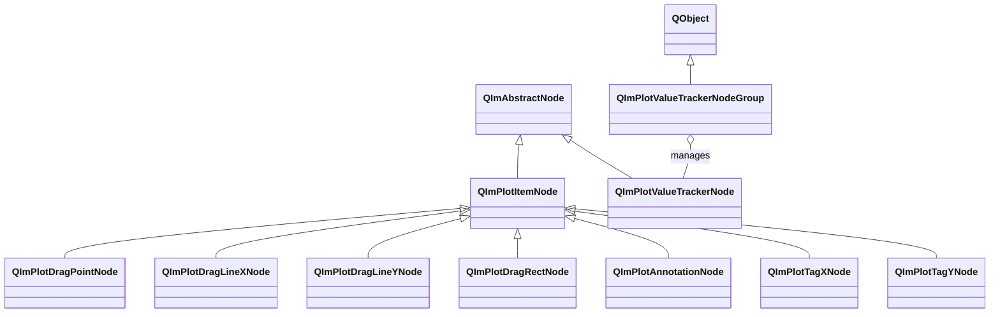

# 2D Interactive Tools Usage Guide

QIm provides a set of interactive tool nodes that encapsulate ImPlot's DragPoint, DragLine, DragRect, Annotation, Tag, and ValueTracker tools as Qt-style retained mode nodes.
These tool nodes inherit from `QImPlotItemNode` or `QImAbstractNode`, support responding to user mouse interactions via signal-slots,
and are the only plot element types in the QIm object tree that can capture user input in real time.

## Main Features

**Features**

- ✅ **Drag Interaction**: DragPoint, DragLineX/Y, and DragRect support mouse drag operations, with position changes notified in real time via signals
- ✅ **Interaction State Detection**: All drag tools share three-state signals (clicked/hovered/held) for precise user operation detection
- ✅ **Annotations**: Annotation provides annotation text labels with printf-style formatting and pixel offset positioning
- ✅ **Axis Tags**: TagX/Y display labeled axis lines at specified coordinates for marking key value positions
- ✅ **Value Tracker**: ValueTracker automatically tracks plot data points near the mouse cursor, supporting multi-subplot linked tracking
- ✅ **Cross-Tool Linking**: DragPoint position change signals can be connected to Annotation setText for real-time drag point annotation
- ✅ **Flag Property Affirmative Semantics**: ImPlot's NoCursors/NoFit/NoInputs/Delayed are converted to cursorsEnabled/fitEnabled/inputsEnabled/delayed

## Basic Concepts

### Class Inheritance



**Inheritance notes:**

- DragPoint, DragLineX/Y, DragRect, Annotation, and TagX/Y inherit from `QImPlotItemNode` and are plot item nodes
- ValueTracker inherits from `QImAbstractNode`, not a plot item node, but an independent tracking overlay
- ValueTrackerNodeGroup inherits from `QObject` and manages a group of ValueTrackers for linked tracking

### Object Tree Layout

The position of interactive tool nodes in the QIm object tree:

```mermaid
graph TD
    Plot[QImPlotNode] --> DragPoint[QImPlotDragPointNode]
    Plot --> DragLineX[QImPlotDragLineXNode]
    Plot --> DragLineY[QImPlotDragLineYNode]
    Plot --> DragRect[QImPlotDragRectNode]
    Plot --> Annotation[QImPlotAnnotationNode]
    Plot --> TagX[QImPlotTagXNode]
    Plot --> TagY[QImPlotTagYNode]
    Plot --> Tracker[QImPlotValueTrackerNode]
    TrackerGroup[QImPlotValueTrackerNodeGroup] -.-> Tracker : sync
```

**Object tree notes:**

- All interactive tools are created with `QImPlotNode` as parent and join the object tree via constructor or `addChildNode()`
- ValueTracker must be constructed with a `QImPlotNode*` parameter to associate it with a plot area
- ValueTrackerNodeGroup is a standalone QObject, not part of the plot object tree, managing linkage relationships only

### Drag Tool Categories

Interactive tools are divided into three categories by interaction method:

| Category | Tool | Interaction Method | Base Class |
|------|------|----------|------|
| Drag Tool | DragPoint | Mouse-draggable point marker | `QImPlotItemNode` |
| Drag Tool | DragLineX/Y | Mouse-draggable vertical/horizontal line | `QImPlotItemNode` |
| Drag Tool | DragRect | Mouse-draggable rectangular region | `QImPlotItemNode` |
| Annotation Tool | Annotation | Static annotation text (can link with DragPoint) | `QImPlotItemNode` |
| Annotation Tool | TagX/Y | Axis tag lines | `QImPlotItemNode` |
| Tracking Tool | ValueTracker | Auto track mouse data points | `QImAbstractNode` |

### Shared Interaction State Pattern

All drag tools (DragPoint, DragLineX/Y, DragRect) share three read-only interaction state properties:

| Property | Type | Signal | Description |
|------|------|------|------|
| `clicked` | bool | `clickedChanged(bool)` | Whether clicked in the current frame (mouse down) |
| `hovered` | bool | `hoveredChanged(bool)` | Whether hovered by mouse in the current frame |
| `held` | bool | `heldChanged(bool)` | Whether held and dragged in the current frame |

These states are updated after each rendering loop and can be used via signal-slots to detect precise user interaction behavior.

### Drag Flag Properties

All drag tools share four flag properties, following QIm's negative→affirmative semantic conversion rules:

| QIm Property (Affirmative) | ImPlot Native Flag (Negative) | Default | Description |
|----------------------|----------------------------|--------|------|
| `cursorsEnabled` | `ImPlotDragToolFlags_NoCursors` | true | Show crosshair cursor guides while dragging |
| `fitEnabled` | `ImPlotDragToolFlags_NoFit` | true | Auto-fit plot range while dragging |
| `inputsEnabled` | `ImPlotDragToolFlags_NoInputs` | true | Respond to mouse input (non-interactive if disabled) |
| `delayed` | `ImPlotDragToolFlags_Delayed` | false | Delayed commit mode (position only updated on mouse release) |

These four properties share the `dragToolFlagChanged()` signal. Any flag change triggers this signal.

!!! warning "Flag Semantic Conversion"
    ImPlot natively uses negative semantics (e.g., `ImPlotDragToolFlags_NoCursors`). QIm uniformly converts them to affirmative semantics
    (e.g., `cursorsEnabled`). Setting `setCursorsEnabled(false)` is equivalent to setting `ImPlotDragToolFlags_NoCursors`.
    See [Flag Mapping Specification](../dev/flag-mapping.md) for details.

## Usage

Interactive tool examples are located in `examples/qimfigure-test/functions/tools/` and `examples/qimfigure-splitWidget/`.

### 1. DragPoint — Draggable Point

`QImPlotDragPointNode` encapsulates ImPlot's DragPoint tool, displaying a draggable colored marker point in plot coordinate space.

(Example from `examples/qimfigure-test/functions/tools/DragPointFunction.cpp`)

```cpp
// Create plot node
QIM::QImPlotNode* plotNode = figure->createPlotNode();

// Create draggable point, with plotNode as parent
QIM::QImPlotDragPointNode* dragPoint = new QIM::QImPlotDragPointNode(plotNode);
dragPoint->setPosition(QPointF(5.0, 5.0));   // Set initial position (plot coordinates)
dragPoint->setColor(QColor(255, 100, 100));   // Set point color
dragPoint->setSize(8.0f);                      // Set point size (pixels)
dragPoint->setId(0);                            // Set unique ID
dragPoint->setCursorsEnabled(true);             // Show cursor guides while dragging
dragPoint->setFitEnabled(true);                 // Auto-fit plot range while dragging
dragPoint->setInputsEnabled(true);              // Enable mouse interaction
dragPoint->setDelayed(false);                   // Commit position changes immediately
plotNode->addChildNode(dragPoint);

// Listen for position change signals
connect(dragPoint, &QIM::QImPlotDragPointNode::positionChanged,
        [](const QPointF& newPos) {
    qDebug() << "Drag point position updated:" << newPos;
});
```

Effect: A red marker point is displayed in the plot area. Users can click and drag the point to any position, with the `positionChanged` signal notifying new coordinates in real time.

#### DragPoint Property List

| Property | Type | Getter | Setter | Signal | Description |
|------|------|--------|--------|------|------|
| position | QPointF | `position()` | `setPosition()` | `positionChanged` | Point position in plot coordinates |
| color | QColor | `color()` | `setColor()` | `colorChanged` | Point marker color |
| size | float | `size()` | `setSize()` | `sizeChanged` | Point marker size (pixels), default 4.0 |
| id | int | `id()` | `setId()` | `idChanged` | Unique drag tool identifier |
| flags | int | `flags()` | `setFlags()` | `flagsChanged` | ImPlotDragToolFlags bitmask |
| cursorsEnabled | bool | `isCursorsEnabled()` | `setCursorsEnabled()` | `dragToolFlagChanged` | Show cursor guides while dragging |
| fitEnabled | bool | `isFitEnabled()` | `setFitEnabled()` | `dragToolFlagChanged` | Auto-fit range while dragging |
| inputsEnabled | bool | `isInputsEnabled()` | `setInputsEnabled()` | `dragToolFlagChanged` | Enable mouse interaction |
| delayed | bool | `isDelayed()` | `setDelayed()` | `dragToolFlagChanged` | Delayed commit mode |
| clicked | bool | `clicked()` | - | `clickedChanged` | Read-only: clicked in current frame |
| hovered | bool | `hovered()` | - | `hoveredChanged` | Read-only: hovered in current frame |
| held | bool | `held()` | - | `heldChanged` | Read-only: held/dragged in current frame |

#### DragPoint Signal List

| Signal | Parameters | Trigger Timing |
|------|------|----------|
| `positionChanged(pos)` | QPointF | When position changes (user drag or programmatic set) |
| `colorChanged(color)` | QColor | When color changes |
| `sizeChanged(size)` | float | When size changes |
| `idChanged(id)` | int | When ID changes |
| `flagsChanged(flags)` | int | When flag bitmask changes |
| `dragToolFlagChanged()` | - | When any flag property changes (shared signal) |
| `clickedChanged(clicked)` | bool | When click state changes |
| `hoveredChanged(hovered)` | bool | When hover state changes |
| `heldChanged(held)` | bool | When hold state changes |

!!! info "setPosition Overloads"
    `setPosition()` provides two overloads:
    - `setPosition(const QPointF& pos)` — Set position using QPointF
    - `setPosition(double x, double y)` — Set position using coordinate components

### 2. DragLineX/Y — Draggable Lines

`QImPlotDragLineXNode` encapsulates ImPlot's DragLineX tool, displaying a draggable vertical line;
`QImPlotDragLineYNode` encapsulates the DragLineY tool, displaying a draggable horizontal line.

They are independent classes, corresponding to X-axis and Y-axis direction drag lines respectively. DragLineX's `value` property represents the X coordinate,
and DragLineY's `value` property represents the Y coordinate.

(Example from `examples/qimfigure-test/functions/tools/DragLinesFunction.cpp`)

```cpp
// Create plot node
QIM::QImPlotNode* plotNode = figure->createPlotNode();

// Create draggable vertical line (DragLineX)
QIM::QImPlotDragLineXNode* dragLineX = new QIM::QImPlotDragLineXNode(plotNode);
dragLineX->setValue(5.0);                       // Set X coordinate position
dragLineX->setColor(QColor(255, 200, 0));        // Set line color
dragLineX->setThickness(2.0f);                   // Set line thickness (pixels)
dragLineX->setId(0);                             // Set unique ID
dragLineX->setCursorsEnabled(true);              // Show cursor while dragging
dragLineX->setInputsEnabled(true);               // Enable mouse interaction
plotNode->addChildNode(dragLineX);

// Create draggable horizontal line (DragLineY)
QIM::QImPlotDragLineYNode* dragLineY = new QIM::QImPlotDragLineYNode(plotNode);
dragLineY->setValue(5.0);                       // Set Y coordinate position
dragLineY->setColor(QColor(0, 200, 255));        // Set line color
dragLineY->setThickness(2.0f);                   // Set line thickness (pixels)
dragLineY->setId(1);                             // ID must differ from DragLineX
dragLineY->setCursorsEnabled(true);
dragLineY->setInputsEnabled(true);
plotNode->addChildNode(dragLineY);

// Listen for vertical line position changes
connect(dragLineX, &QIM::QImPlotDragLineXNode::valueChanged,
        [](double newX) {
    qDebug() << "Vertical line X coordinate updated:" << newX;
});

// Listen for horizontal line position changes
connect(dragLineY, &QIM::QImPlotDragLineYNode::valueChanged,
        [](double newY) {
    qDebug() << "Horizontal line Y coordinate updated:" << newY;
});
```

Effect: A yellow vertical line and a cyan horizontal line are displayed in the plot area. Lines follow the mouse when dragged, with the two lines intersecting to form a crosshair marker.

#### DragLineX Property List

| Property | Type | Getter | Setter | Signal | Description |
|------|------|--------|--------|------|------|
| value | double | `value()` | `setValue()` | `valueChanged` | X coordinate of vertical line |
| color | QColor | `color()` | `setColor()` | `colorChanged` | Line color |
| thickness | float | `thickness()` | `setThickness()` | `thicknessChanged` | Thickness (pixels), default 1.0 |
| id | int | `id()` | `setId()` | `idChanged` | Unique drag tool identifier |
| flags | int | `flags()` | `setFlags()` | `flagsChanged` | ImPlotDragToolFlags bitmask |
| cursorsEnabled | bool | `isCursorsEnabled()` | `setCursorsEnabled()` | `dragToolFlagChanged` | Show cursor while dragging |
| fitEnabled | bool | `isFitEnabled()` | `setFitEnabled()` | `dragToolFlagChanged` | Auto-fit while dragging |
| inputsEnabled | bool | `isInputsEnabled()` | `setInputsEnabled()` | `dragToolFlagChanged` | Enable mouse interaction |
| delayed | bool | `isDelayed()` | `setDelayed()` | `dragToolFlagChanged` | Delayed commit mode |
| clicked | bool | `clicked()` | - | `clickedChanged` | Read-only: clicked in current frame |
| hovered | bool | `hovered()` | - | `hoveredChanged` | Read-only: hovered in current frame |
| held | bool | `held()` | - | `heldChanged` | Read-only: held in current frame |

#### DragLineY Property List

| Property | Type | Getter | Setter | Signal | Description |
|------|------|--------|--------|------|------|
| value | double | `value()` | `setValue()` | `valueChanged` | Y coordinate of horizontal line |
| color | QColor | `color()` | `setColor()` | `colorChanged` | Line color |
| thickness | float | `thickness()` | `setThickness()` | `thicknessChanged` | Line thickness (pixels), default 1.0 |
| id | int | `id()` | `setId()` | `idChanged` | Unique drag tool identifier |
| flags | int | `flags()` | `setFlags()` | `flagsChanged` | ImPlotDragToolFlags bitmask |
| cursorsEnabled | bool | `isCursorsEnabled()` | `setCursorsEnabled()` | `dragToolFlagChanged` | Show cursor while dragging |
| fitEnabled | bool | `isFitEnabled()` | `setFitEnabled()` | `dragToolFlagChanged` | Auto-fit while dragging |
| inputsEnabled | bool | `isInputsEnabled()` | `setInputsEnabled()` | `dragToolFlagChanged` | Enable mouse interaction |
| delayed | bool | `isDelayed()` | `setDelayed()` | `dragToolFlagChanged` | Delayed commit mode |
| clicked | bool | `clicked()` | - | `clickedChanged` | Read-only: clicked in current frame |
| hovered | bool | `hovered()` | - | `hoveredChanged` | Read-only: hovered in current frame |
| held | bool | `held()` | - | `heldChanged` | Read-only: held in current frame |

#### DragLineX/Y Signal List

| Signal | Parameters | Trigger Timing |
|------|------|----------|
| `valueChanged(value)` | double | When position changes (X/Y coordinate) |
| `colorChanged(color)` | QColor | When color changes |
| `thicknessChanged(thickness)` | float | When thickness changes |
| `idChanged(id)` | int | When ID changes |
| `flagsChanged(flags)` | int | When flag bitmask changes |
| `dragToolFlagChanged()` | - | When any flag property changes |
| `clickedChanged(clicked)` | bool | When click state changes |
| `hoveredChanged(hovered)` | bool | When hover state changes |
| `heldChanged(held)` | bool | When hold state changes |

!!! info "Difference Between DragLineX and DragLineY"
    `QImPlotDragLineXNode` and `QImPlotDragLineYNode` are two independent classes, corresponding to vertical and horizontal lines respectively.
    DragLineX's `value` represents the X coordinate (line extends along Y direction), and DragLineY's `value` represents the Y coordinate (line extends along X direction).
    When using both line types in the same plot, ensure their `id` values are different.

### 3. DragRect — Draggable Rectangle

`QImPlotDragRectNode` encapsulates ImPlot's DragRect tool, displaying a draggable rectangular region in plot coordinate space.
Users can drag the rectangle's center to move it and drag corners to resize.

(Example from `examples/qimfigure-test/functions/tools/DragRectFunction.cpp`)

```cpp
// Create plot node
QIM::QImPlotNode* plotNode = figure->createPlotNode();

// Create draggable rectangle, with plotNode as parent
QIM::QImPlotDragRectNode* dragRect = new QIM::QImPlotDragRectNode(plotNode);
dragRect->setRect(2.0, 3.0, 7.0, 8.0);          // Set rectangle coordinates (x1,y1,x2,y2)
dragRect->setColor(QColor(255, 150, 50));         // Set border color
dragRect->setId(0);                                // Set unique ID
dragRect->setCursorsEnabled(true);                 // Show cursor while dragging
dragRect->setInputsEnabled(true);                  // Enable mouse interaction
plotNode->addChildNode(dragRect);

// Listen for rectangle coordinate changes
connect(dragRect, &QIM::QImPlotDragRectNode::rectChanged,
        [](const QRectF& newRect) {
    qDebug() << "Rectangle region updated:" << newRect;
});
```

Effect: An orange-bordered rectangle is displayed in the plot area. Users can drag the center to move the rectangle and drag corners to resize.

#### DragRect Property List

| Property | Type | Getter | Setter | Signal | Description |
|------|------|--------|--------|------|------|
| rect | QRectF | `rect()` | `setRect()` | `rectChanged` | Rectangle coordinates (x1,y1,x2,y2) |
| color | QColor | `color()` | `setColor()` | `colorChanged` | Rectangle border color |
| id | int | `id()` | `setId()` | `idChanged` | Unique drag tool identifier |
| flags | int | `flags()` | `setFlags()` | `flagsChanged` | ImPlotDragToolFlags bitmask |
| cursorsEnabled | bool | `isCursorsEnabled()` | `setCursorsEnabled()` | `dragToolFlagChanged` | Show cursor while dragging |
| fitEnabled | bool | `isFitEnabled()` | `setFitEnabled()` | `dragToolFlagChanged` | Auto-fit while dragging |
| inputsEnabled | bool | `isInputsEnabled()` | `setInputsEnabled()` | `dragToolFlagChanged` | Enable mouse interaction |
| delayed | bool | `isDelayed()` | `setDelayed()` | `dragToolFlagChanged` | Delayed commit mode |
| clicked | bool | `clicked()` | - | `clickedChanged` | Read-only: clicked in current frame |
| hovered | bool | `hovered()` | - | `hoveredChanged` | Read-only: hovered in current frame |
| held | bool | `held()` | - | `heldChanged` | Read-only: held in current frame |

#### DragRect Signal List

| Signal | Parameters | Trigger Timing |
|------|------|----------|
| `rectChanged(rect)` | QRectF | When rectangle coordinates change |
| `colorChanged(color)` | QColor | When color changes |
| `idChanged(id)` | int | When ID changes |
| `flagsChanged(flags)` | int | When flag bitmask changes |
| `dragToolFlagChanged()` | - | When any flag property changes |
| `clickedChanged(clicked)` | bool | When click state changes |
| `hoveredChanged(hovered)` | bool | When hover state changes |
| `heldChanged(held)` | bool | When hold state changes |

!!! info "setRect Overloads"
    `setRect()` provides two overloads:
    - `setRect(const QRectF& rect)` — Set rectangle using QRectF
    - `setRect(double x1, double y1, double x2, double y2)` — Set rectangle using coordinate components

!!! warning "QRectF Coordinate Semantics"
    ImPlot's DragRect uses (x1, y1, x2, y2) to represent two diagonal corners of the rectangle, where x1 < x2 and y1 < y2.
    QRectF's semantics are left/top/width/height or left/top/right/bottom. Note the semantic difference in coordinate mapping.

### 4. Annotation — Annotation Label

`QImPlotAnnotationNode` encapsulates ImPlot's Annotation tool, displaying annotation text labels in plot coordinate space.
Annotation is a static tool (does not support dragging), but can be linked with DragPoint via signal-slots for dynamic annotation.

#### Basic Usage

```cpp
// Create annotation, with plotNode as parent
QIM::QImPlotAnnotationNode* annotation = new QIM::QImPlotAnnotationNode(plotNode);
annotation->setPosition(QPointF(5.0, 5.0));       // Annotation anchor position (plot coordinates)
annotation->setText("Key Data Point");              // Annotation text
annotation->setColor(QColor(255, 255, 255));       // Text color
annotation->setPixelOffset(20.0, -20.0);           // Pixel offset (relative to anchor)
annotation->setClamp(false);                        // Don't clamp within plot area
plotNode->addChildNode(annotation);
```

#### Printf-Style Formatting

Annotation's `setText()` supports printf-style formatting for dynamically generating numeric annotations:

```cpp
// Printf-style text setting
annotation->setText("X=%.2f, Y=%.2f", 5.0, 3.14);
```

!!! info "setText Overloads"
    `setText()` provides two overloads:
    - `setText(const QString& text)` — Set text using QString
    - `setText(const char* fmt, ...)` — Set text using printf-style formatting

#### DragPoint→Annotation Linking

Annotation's most powerful usage is linking with DragPoint via signal-slots for real-time annotation of drag points:
When the user drags a DragPoint, the Annotation's position and text follow automatically.

(Example from `examples/qimfigure-test/functions/tools/AnnotationFunction.cpp`)

```cpp
// Create draggable point
QIM::QImPlotDragPointNode* dragPoint = new QIM::QImPlotDragPointNode(plotNode);
dragPoint->setPosition(QPointF(5.0, 5.0));
dragPoint->setColor(QColor(255, 100, 100));
dragPoint->setSize(8.0f);
dragPoint->setId(0);

// Connect DragPoint position change signal to Annotation update
connect(dragPoint, &QIM::QImPlotDragPointNode::positionChanged,
        this, &MyClass::onDragPointMoved);
plotNode->addChildNode(dragPoint);

// Create annotation, initial position same as DragPoint
QIM::QImPlotAnnotationNode* annotation = new QIM::QImPlotAnnotationNode(plotNode);
annotation->setPosition(QPointF(5.0, 5.0));      // Same as drag point's initial position
annotation->setText("Data Point");                 // Annotation text
annotation->setColor(QColor(255, 255, 255));
annotation->setPixelOffset(20.0, -20.0);          // Pixel offset (upper-right)
annotation->setClamp(false);
plotNode->addChildNode(annotation);

// Slot: Update Annotation position when DragPoint position changes
void MyClass::onDragPointMoved(const QPointF& pos)
{
    if (m_annotationNode) {
        m_annotationNode->setPosition(pos);       // Annotation follows drag point position
    }
}
```

Effect: A red drag point and annotation text are displayed in the plot area. When the drag point is moved, the annotation text follows automatically, always appearing 20 pixels to the upper-right of the drag point.

#### Annotation Property List

| Property | Type | Getter | Setter | Signal | Description |
|------|------|--------|--------|------|------|
| position | QPointF | `position()` | `setPosition()` | `positionChanged` | Annotation anchor position (plot coordinates) |
| color | QColor | `color()` | `setColor()` | `colorChanged` | Annotation text color |
| text | QString | `text()` | `setText()` | `textChanged` | Annotation text content (supports printf formatting) |
| pixelOffset | QPointF | `pixelOffset()` | `setPixelOffset()` | `pixelOffsetChanged` | Pixel offset (relative to anchor) |
| clamp | bool | `clamp()` | `setClamp()` | `clampChanged` | Whether to clamp within plot area |
| round | bool | `round()` | `setRound()` | `roundChanged` | Whether to round position to integer pixels |

#### Annotation Signal List

| Signal | Parameters | Trigger Timing |
|------|------|----------|
| `positionChanged(pos)` | QPointF | When position changes |
| `colorChanged(color)` | QColor | When color changes |
| `textChanged(text)` | QString | When text changes |
| `pixelOffsetChanged(offset)` | QPointF | When pixel offset changes |
| `clampChanged(clamp)` | bool | When clamp setting changes |
| `roundChanged(round)` | bool | When round setting changes |

!!! tip "Purpose of pixelOffset"
    `pixelOffset` controls the pixel offset of annotation text relative to the anchor. Positive values shift right/down, negative shift left/up.
    Adjusting the offset can prevent annotation text from overlapping with data points. Annotation draws a connecting line from the plot coordinate position to the offset text position.

!!! warning "Annotation Does Not Support Dragging"
    Annotation is a static annotation tool and does not support user drag interaction. For dynamic positioning, use it in conjunction with DragPoint.

### 5. TagX/Y — Axis Tag Lines

`QImPlotTagXNode` encapsulates ImPlot's TagX tool, displaying a vertical line with text label at a specified X coordinate;
`QImPlotTagYNode` encapsulates the TagY tool, displaying a horizontal line with text label at a specified Y coordinate.

TagX/Y are static tools (do not support dragging), used for marking key value positions on axes.

(Example from `examples/qimfigure-test/functions/tools/TagsFunction.cpp`)

```cpp
// Create plot node
QIM::QImPlotNode* plotNode = figure->createPlotNode();

// Create X axis tag (vertical line + text)
QIM::QImPlotTagXNode* tagX = new QIM::QImPlotTagXNode(plotNode);
tagX->setValue(3.5);                              // X coordinate position
tagX->setText("Marker X=3.5");                    // Tag text
tagX->setColor(QColor(255, 100, 0));              // Tag line color
plotNode->addChildNode(tagX);

// Create Y axis tag (horizontal line + text)
QIM::QImPlotTagYNode* tagY = new QIM::QImPlotTagYNode(plotNode);
tagY->setValue(5.0);                              // Y coordinate position
tagY->setText("Threshold Y=5.0");                 // Tag text
tagY->setColor(QColor(0, 150, 255));              // Tag line color
plotNode->addChildNode(tagY);
```

Effect: An orange vertical line with tag text is displayed at X=3.5, and a blue horizontal line with tag text at Y=5.0 in the plot area.

#### TagX Property List

| Property | Type | Getter | Setter | Signal | Description |
|------|------|--------|--------|------|------|
| value | double | `value()` | `setValue()` | `valueChanged` | X coordinate position |
| color | QColor | `color()` | `setColor()` | `colorChanged` | Tag line color |
| text | QString | `text()` | `setText()` | `textChanged` | Tag text (supports printf formatting) |
| round | bool | `round()` | `setRound()` | `roundChanged` | Whether to round position to integer pixels |

#### TagY Property List

| Property | Type | Getter | Setter | Signal | Description |
|------|------|--------|--------|------|------|
| value | double | `value()` | `setValue()` | `valueChanged` | Y coordinate position |
| color | QColor | `color()` | `setColor()` | `colorChanged` | Tag line color |
| text | QString | `text()` | `setText()` | `textChanged` | Tag text (supports printf formatting) |
| round | bool | `round()` | `setRound()` | `roundChanged` | Whether to round position to integer pixels |

#### TagX/Y Signal List

| Signal | Parameters | Trigger Timing |
|------|------|----------|
| `valueChanged(value)` | double | When coordinate position changes |
| `colorChanged(color)` | QColor | When color changes |
| `textChanged(text)` | QString | When text changes |
| `roundChanged(round)` | bool | When round setting changes |

!!! info "Difference Between TagX and TagY"
    `QImPlotTagXNode` displays a vertical line tag in the X-axis direction for marking specific X values;
    `QImPlotTagYNode` displays a horizontal line tag in the Y-axis direction for marking specific Y values.
    TagX's label text is displayed near the X axis, and TagY's label text is displayed near the Y axis.

!!! tip "Difference Between TagX/Y and DragLineX/Y"
    TagX/Y are static annotation tools that display tag text but do not support dragging;
    DragLineX/Y are interactive drag tools that support mouse dragging but do not come with text labels.
    For draggable labeled lines, you can combine DragLineX/Y + Annotation.

!!! info "setText printf Formatting"
    TagX/Y's `setText()` also supports printf-style formatting:
    ```cpp
    tagX->setText("X=%.1f", 3.5);
    tagY->setText("Y=%.2f", 5.0);
    ```

### 6. ValueTracker — Value Tracker

`QImPlotValueTrackerNode` is an intelligent value tracking overlay that displays a crosshair-style annotation at the plot data point nearest to the mouse cursor.
It automatically tracks all visible plot items in the parent `QImPlotNode`, extracting label, color, and Y-value information for real-time tooltip rendering.

ValueTracker inherits from `QImAbstractNode` (not `QImPlotItemNode`) and must be constructed with a `QImPlotNode*` parameter.

#### Basic Usage

```cpp
// Create plot node
QIM::QImPlotNode* plotNode = figure->createPlotNode();
plotNode->addLine(xData, yData, "sin(x)");

// Create value tracker, passing the associated plot node
QIM::QImPlotValueTrackerNode* tracker = new QIM::QImPlotValueTrackerNode(plotNode);
plotNode->addChildNode(tracker);

// Listen for tracker activation state
connect(tracker, &QIM::QImPlotValueTrackerNode::activeChanged,
        [](bool on) {
    qDebug() << "Tracker activation state:" << on;
});
```

Effect: When the mouse enters the plot area, the tracker automatically activates, displaying a crosshair and numeric annotation at the nearest plot data point.

#### Style Customization

ValueTracker supports customizing the tooltip appearance:

```cpp
QIM::QImPlotValueTrackerNode* tracker = new QIM::QImPlotValueTrackerNode(plotNode);

// Tooltip width
tracker->setFixedWidth(200.0f);              // Fixed width (pixels)
tracker->setAutoWidthEnabled(true);          // Auto-calculate width (default)

// Tooltip colors
tracker->setTextColor(QColor(255, 255, 255));         // Text color
tracker->setBackgroundColor(QColor(30, 30, 30, 200)); // Background color (semi-transparent)
tracker->setBorderColor(QColor(100, 100, 100));       // Border color

// Tracker line color
tracker->setTrackerLineColor(QColor(255, 200, 0));    // Crosshair line color

// Data filtering
tracker->setSkipNanFiniteValues(true);       // Skip NaN and infinite values
plotNode->addChildNode(tracker);
```

#### Multi-Subplot Linked Tracking

`QImPlotValueTrackerNodeGroup` manages a group of ValueTracker instances to enable linked cursor tracking across multiple subplots.
When the mouse moves in one subplot, all trackers in the group update their crosshairs at the same pixel ratio position, providing a unified cross-chart data inspection experience.

(Example from `examples/qimfigure-splitWidget/MainWindow.cpp`)

```cpp
// Create tracker group for managing linkage relationships
QIM::QImPlotValueTrackerNodeGroup* trackerGroup = new QIM::QImPlotValueTrackerNodeGroup(this);

// Subplot 1
if (QIM::QImPlotNode* plot1 = figure->createPlotNode()) {
    plot1->setTitle("10K Points");
    plot1->addLine(x1, y1, "Curve A");

    // Create tracker and join the linkage group
    QIM::QImPlotValueTrackerNode* tracker1 = new QIM::QImPlotValueTrackerNode(plot1);
    tracker1->setGroup(trackerGroup);          // Join linkage group
    plot1->addChildNode(tracker1);
}

// Subplot 2
if (QIM::QImPlotNode* plot2 = figure->createPlotNode()) {
    plot2->setTitle("1M Points");
    plot2->addLine(x2, y2, "Curve B");

    // Create tracker and join the linkage group
    QIM::QImPlotValueTrackerNode* tracker2 = new QIM::QImPlotValueTrackerNode(plot2);
    tracker2->setGroup(trackerGroup);          // Join linkage group
    plot2->addChildNode(tracker2);
}
```

Effect: When the mouse moves in any subplot, all subplots' trackers synchronously display crosshair annotations, enabling cross-subplot linked data inspection.

#### ValueTracker Properties and Methods

| Property/Method | Type | Getter | Setter | Description |
|-----------|------|--------|--------|------|
| group | Group* | `group()` | `setGroup()` | Tracker linkage group |
| hasGroup | bool | `hasGroup()` | - | Whether joined a linkage group |
| fixedWidth | float | `fixedWidth()` | `setFixedWidth()` | Tooltip fixed width (pixels) |
| autoWidthEnabled | bool | `isAutoWidthEnabled()` | `setAutoWidthEnabled()` | Auto-calculate tooltip width |
| textColor | QColor | `textColor()` | `setTextColor()` | Tooltip text color |
| backgroundColor | QColor | `backgroundColor()` | `setBackgroundColor()` | Tooltip background color |
| borderColor | QColor | `borderColor()` | `setBorderColor()` | Tooltip border color |
| trackerLineColor | QColor | `trackerLineColor()` | `setTrackerLineColor()` | Crosshair line color |
| skipNanFiniteValues | bool | `isSkipNanFiniteValues()` | `setSkipNanFiniteValues()` | Skip NaN/infinite values |

#### ValueTracker Signal List

| Signal | Parameters | Trigger Timing |
|------|------|----------|
| `activeChanged(on)` | bool | When tracker activation/non-activation state changes |

#### ValueTrackerNodeGroup API

| Method | Parameters | Description |
|------|------|------|
| `addTracker(tracker)` | `QImPlotValueTrackerNode*` | Add tracker to linkage group |
| `removeTracker(tracker)` | `QImPlotValueTrackerNode*` | Remove tracker from linkage group |
| `syncMode()` | - | Get sync mode (currently only Pixel supported) |
| `setSyncMode(mode)` | `SyncMode` | Set sync mode |
| `isActive()` | - | Whether there is an active tracker in the group |
| `pixelRatio()` | - | Get current pixel ratio |

!!! info "SyncMode"
    `QImPlotValueTrackerNodeGroup::SyncMode` currently only supports `Pixel` mode:
    When the mouse moves in one subplot, the other subplots' trackers display crosshairs at the same pixel ratio position.

!!! warning "Trackers Must Belong to Different Plots"
    Trackers must belong to different `QImPlotNode` instances. Grouping multiple trackers within the same plot has no additional effect.

!!! info "ValueTracker Constructor"
    ValueTracker must be constructed with the associated plot node:
    ```cpp
    QIM::QImPlotValueTrackerNode* tracker = new QIM::QImPlotValueTrackerNode(plotNode);
    ```
    The `plotNode` parameter specifies the plot area the tracker is associated with. The tracker renders and tracks data within this plot area.

!!! tip "ValueTracker Auto-Tracking Mechanism"
    ValueTracker automatically listens for child node add/remove events of the parent plot node (via `onChildNodeAdded`/`onChildNodeRemoved` slots).
    Newly added plot items are automatically covered by the tracker without needing manual registration.

## Signal-Slot Connections

### Cross-Tool Linking Examples

The core value of interactive tools lies in signal-slot linkage. Below are typical linkage patterns:

#### DragPoint → Annotation Position Linkage

```cpp
// Update annotation position when drag point position changes
connect(dragPoint, &QIM::QImPlotDragPointNode::positionChanged,
        annotation, [annotation](const QPointF& pos) {
    annotation->setPosition(pos);
});
```

#### DragLineX → TagX Value Linkage

```cpp
// Update X axis tag when vertical drag line position changes
connect(dragLineX, &QIM::QImPlotDragLineXNode::valueChanged,
        tagX, [tagX](double value) {
    tagX->setValue(value);
    tagX->setText(QString("X=%.2f").arg(value));
});
```

#### DragPoint → Annotation printf Text Linkage

```cpp
// Update annotation text when drag point position changes (display coordinate values)
connect(dragPoint, &QIM::QImPlotDragPointNode::positionChanged,
        this, [this, annotation](const QPointF& pos) {
    annotation->setPosition(pos);
    annotation->setText(QString("(%1, %2)")
        .arg(pos.x(), 0, 'f', 2)
        .arg(pos.y(), 0, 'f', 2));
});
```

#### DragRect → Annotation Region Annotation Linkage

```cpp
// Update annotation text when rectangle region changes
connect(dragRect, &QIM::QImPlotDragRectNode::rectChanged,
        this, [this, annotation](const QRectF& rect) {
    annotation->setPosition(rect.center());
    annotation->setText(QString("Region: %1×%2")
        .arg(rect.width(), 0, 'f', 1)
        .arg(rect.height(), 0, 'f', 1));
});
```

#### Drag Tool Interaction State Monitoring

```cpp
// Monitor drag point interaction states
connect(dragPoint, &QIM::QImPlotDragPointNode::hoveredChanged,
        [](bool hovered) {
    if (hovered) {
        qDebug() << "Mouse hovering over drag point";
    }
});

connect(dragPoint, &QIM::QImPlotDragPointNode::heldChanged,
        [](bool held) {
    if (held) {
        qDebug() << "User is dragging the point";
    }
});

connect(dragPoint, &QIM::QImPlotDragPointNode::clickedChanged,
        [](bool clicked) {
    if (clicked) {
        qDebug() << "Drag point clicked";
    }
});
```

### Signal Summary

All interactive tool signals fall into three categories:

**Data Change Signals**: Triggered when property values change

| Tool | Signal | Parameters |
|------|------|------|
| DragPoint | `positionChanged` | QPointF |
| DragLineX | `valueChanged` | double |
| DragLineY | `valueChanged` | double |
| DragRect | `rectChanged` | QRectF |
| Annotation | `positionChanged` | QPointF |
| Annotation | `textChanged` | QString |
| TagX/Y | `valueChanged` | double |
| TagX/Y | `textChanged` | QString |
| ValueTracker | `activeChanged` | bool |

**Interaction State Signals**: Three-state signals shared by drag tools

| Signal | Applicable Tools | Parameters |
|------|----------|------|
| `clickedChanged` | DragPoint/DragLineX/Y/DragRect | bool |
| `hoveredChanged` | DragPoint/DragLineX/Y/DragRect | bool |
| `heldChanged` | DragPoint/DragLineX/Y/DragRect | bool |

**Flag Change Signals**: Shared signal for drag tool flag properties

| Signal | Applicable Tools | Parameters |
|------|----------|------|
| `dragToolFlagChanged` | DragPoint/DragLineX/Y/DragRect | None |

## Notes

!!! warning "Drag Tool ID Uniqueness"
    Within the same plot context, all drag tools must have unique `id` values.
    ImPlot uses `id` to distinguish multiple drag tools in the same plot. ID conflicts cause interaction anomalies.

!!! warning "inputsEnabled Disables Interaction"
    Setting `setInputsEnabled(false)` makes the drag tool non-interactive (equivalent to setting `ImPlotDragToolFlags_NoInputs`).
    The drag tool then only serves as a visual marker and no longer responds to mouse input.

!!! warning "delayed Commit Mode"
    When `setDelayed(true)`, position changes are only committed after mouse release.
    During dragging, `positionChanged`/`valueChanged`/`rectChanged` signals do not fire,
    only firing once after release. Suitable for scenarios where intermediate states should be avoided.

!!! info "Annotation vs Tag Positioning Difference"
    - Annotation uses `pixelOffset` to control text offset and draws a connecting line between the plot coordinate position and the offset position
    - TagX/Y text is automatically displayed near the corresponding axis, with no manual offset specification needed

!!! warning "ValueTracker Does Not Inherit QImPlotItemNode"
    ValueTracker inherits from `QImAbstractNode` and is not a plot item node.
    It does not participate in `QImPlotNode::plotItemNodes()`'s return list.
    When constructed, it must be passed a `QImPlotNode*` parameter, not `QObject*`, to ensure correct plot area association.

!!! info "Object Tree Parent-Child Relationship"
    When creating interactive tool nodes, specify `QImPlotNode` as parent to automatically join the object tree:
    ```cpp
    // Recommended: Specify parent at construction
    QIM::QImPlotDragPointNode* dragPoint = new QIM::QImPlotDragPointNode(plotNode);

    // Then call addChildNode to join the rendering tree
    plotNode->addChildNode(dragPoint);
    ```
    Specifying parent at construction ensures node lifecycle is managed by the parent node (Qt object tree mechanism).
    `addChildNode()` ensures the node participates in the rendering flow.

!!! tip "wasModified() Method"
    All drag tools provide a `wasModified()` method returning `true` if the user modified the tool position in the last rendering cycle.
    This method does not correspond to Q_PROPERTY and cannot be accessed via the property system; it must be called directly.

## References

- Related documentation: [QImPlotNode](plot-node.md), [Axis Configuration](plot-axis.md), [Render Node](../render-node.md), [Flag Mapping](../dev/flag-mapping.md)
- Example code:
    - DragPoint: `examples/qimfigure-test/functions/tools/DragPointFunction.cpp`
    - DragLines: `examples/qimfigure-test/functions/tools/DragLinesFunction.cpp`
    - DragRect: `examples/qimfigure-test/functions/tools/DragRectFunction.cpp`
    - Annotation: `examples/qimfigure-test/functions/tools/AnnotationFunction.cpp`
    - Tags: `examples/qimfigure-test/functions/tools/TagsFunction.cpp`
    - ValueTracker: `examples/qimfigure-splitWidget/MainWindow.cpp`
- API reference:
    - `src/core/plot/QImPlotDragPointNode.h`
    - `src/core/plot/QImPlotDragLineXNode.h`
    - `src/core/plot/QImPlotDragLineYNode.h`
    - `src/core/plot/QImPlotDragRectNode.h`
    - `src/core/plot/QImPlotAnnotationNode.h`
    - `src/core/plot/QImPlotTagXNode.h`
    - `src/core/plot/QImPlotTagYNode.h`
    - `src/core/plot/QImPlotValueTrackerNode.h`
    - `src/core/plot/QImPlotValueTrackerNodeGroup.h`