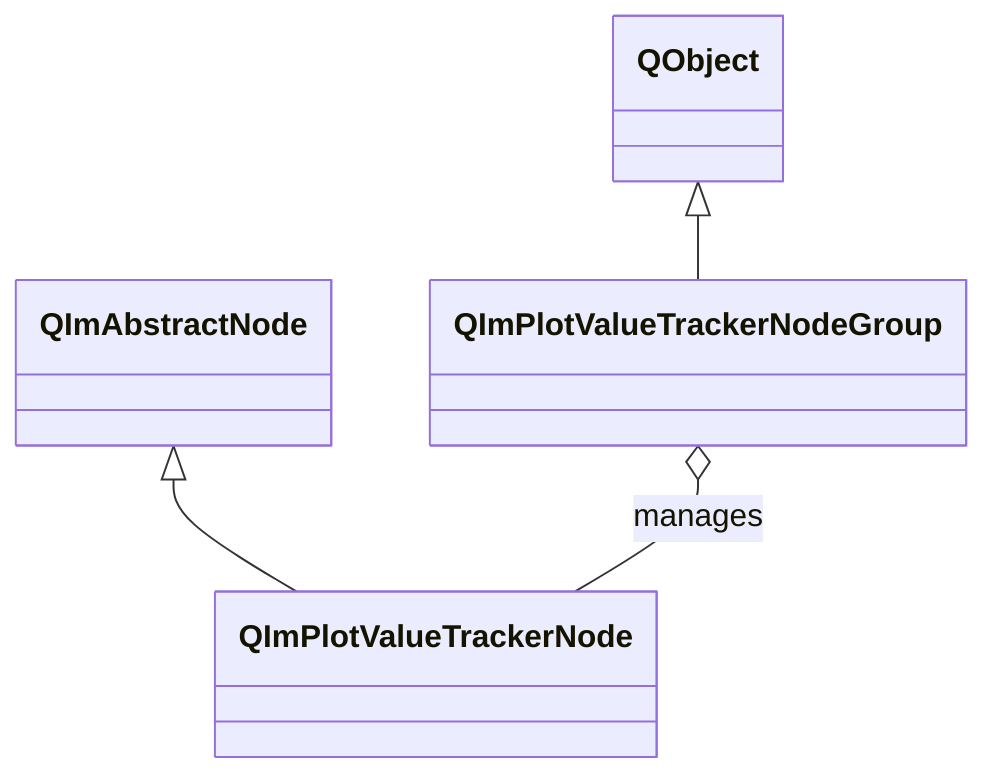

# 2D Value Tracker Usage Guide

`QImPlotValueTrackerNode` is an intelligent value tracking overlay that displays a crosshair-style annotation at the plot data point nearest to the mouse cursor.
`QImPlotValueTrackerNodeGroup` enables linked cursor tracking across multiple subplots.
ValueTracker inherits from `QImAbstractNode` (not `QImPlotItemNode`) and is an independent tracking overlay node.

## Main Features

**Features**

- ✅ **Auto Tracking**: Automatically activates when the mouse enters the plot area, displaying a crosshair and numeric annotation at the nearest data point
- ✅ **Style Customization**: Supports customizing tooltip width, text/background/border/tracker line colors
- ✅ **Multi-Subplot Linking**: Managed via `QImPlotValueTrackerNodeGroup`; when the mouse moves in any subplot, all trackers in the group update synchronously
- ✅ **Smart Filtering**: Supports skipping NaN and infinite values to avoid invalid data interference
- ✅ **Auto Discovery**: Automatically listens for child node add/remove events of the parent plot node; newly added plot items are automatically covered by the tracker
- ✅ **Pixel Ratio Synchronization**: Trackers in a group display crosshairs at the same pixel ratio position, providing a unified cross-chart data inspection experience

## Basic Concepts

### Class Inheritance



**Inheritance notes:**

- `QImPlotValueTrackerNode` inherits from `QImAbstractNode`, not from `QImPlotItemNode`, and does not participate in `QImPlotNode::plotItemNodes()`'s return list
- `QImPlotValueTrackerNodeGroup` inherits from `QObject`, manages a group of ValueTrackers for linked tracking, and is not part of the plot object tree

### Object Tree Layout

```mermaid
graph TD
    Figure[QImFigureWidget] --> Plot1[QImPlotNode Subplot 1]
    Figure --> Plot2[QImPlotNode Subplot 2]
    Plot1 --> Tracker1[QImPlotValueTrackerNode]
    Plot2 --> Tracker2[QImPlotValueTrackerNode]
    TrackerGroup[QImPlotValueTrackerNodeGroup] -.-> Tracker1 : sync
    TrackerGroup[QImPlotValueTrackerNodeGroup] -.-> Tracker2 : sync
```

**Object tree notes:**

- ValueTracker must be constructed with a `QImPlotNode*` parameter to associate it with a specific plot area
- ValueTracker joins the object tree with the associated `QImPlotNode` as parent
- ValueTrackerNodeGroup is a standalone QObject; management relationships with trackers are established via `setGroup()`

### TrackedValue Struct

Each tracked data point is described by the `TrackedValue` struct:

| Field | Type | Description |
|------|------|------|
| `label` | `const char*` | Data series label |
| `color` | `QColor` | Color of the corresponding plot item |
| `xValue` | `double` | X coordinate value |
| `yValue` | `double` | Y coordinate value |
| `xValueLabel` | `std::string` | X value formatted string |
| `yValueLabel` | `std::string` | Y value formatted string |

## Usage

### 1. Basic Usage

Create a ValueTracker and listen for activation state:

```cpp
#include "QImFigureWidget.h"
#include "plot/QImPlotNode.h"
#include "plot/QImPlotValueTrackerNode.h"

// Create plot node
QIM::QImPlotNode* plotNode = figure->createPlotNode();
plotNode->setTitle("Sine Wave");
plotNode->addLine(xData, yData, "sin(x)");

// Create value tracker, passing the associated plot node
QIM::QImPlotValueTrackerNode* tracker = new QIM::QImPlotValueTrackerNode(plotNode);
plotNode->addChildNode(tracker);

// Listen for tracker activation state
connect(tracker, &QIM::QImPlotValueTrackerNode::activeChanged,
        [](bool on) {
    qDebug() << "Tracker activation state:" << on;
});
```

Effect: When the mouse enters the plot area, the tracker automatically activates, displaying a crosshair and a tooltip containing labels and coordinate values at the nearest plot data point.

### 2. Style Customization

ValueTracker supports customizing the tooltip's appearance:

```cpp
QIM::QImPlotValueTrackerNode* tracker = new QIM::QImPlotValueTrackerNode(plotNode);

// Tooltip width control
tracker->setFixedWidth(200.0f);              // Fixed width (pixels)
tracker->setAutoWidthEnabled(true);          // Auto-calculate width (enabled by default)

// Tooltip color customization
tracker->setTextColor(QColor(255, 255, 255));         // Text color
tracker->setBackgroundColor(QColor(30, 30, 30, 200)); // Semi-transparent background
tracker->setBorderColor(QColor(100, 100, 100));       // Border color

// Tracker crosshair line color
tracker->setTrackerLineColor(QColor(255, 200, 0));    // Crosshair and connecting line color

// Data filtering: skip invalid values
tracker->setSkipNanFiniteValues(true);       // Skip NaN and infinite values

plotNode->addChildNode(tracker);
```

### 3. Multi-Subplot Linked Tracking

`QImPlotValueTrackerNodeGroup` manages a group of ValueTrackers to enable linked cursor tracking across multiple subplots.
When the mouse moves in one subplot, all trackers in the group update their crosshairs at the same pixel ratio position.

(Example from `examples/qimfigure-splitWidget/MainWindow.cpp`)

```cpp
#include "plot/QImPlotValueTrackerNodeGroup.h"

// Create tracker group for managing linkage relationships
QIM::QImPlotValueTrackerNodeGroup* trackerGroup =
    new QIM::QImPlotValueTrackerNodeGroup(this);

// Subplot 1
if (QIM::QImPlotNode* plot1 = figure->createPlotNode()) {
    plot1->setTitle("Subplot 1");
    plot1->addLine(x1, y1, "Curve A");

    QIM::QImPlotValueTrackerNode* tracker1 =
        new QIM::QImPlotValueTrackerNode(plot1);
    tracker1->setGroup(trackerGroup);          // Join linkage group
    plot1->addChildNode(tracker1);
}

// Subplot 2
if (QIM::QImPlotNode* plot2 = figure->createPlotNode()) {
    plot2->setTitle("Subplot 2");
    plot2->addLine(x2, y2, "Curve B");

    QIM::QImPlotValueTrackerNode* tracker2 =
        new QIM::QImPlotValueTrackerNode(plot2);
    tracker2->setGroup(trackerGroup);          // Join linkage group
    plot2->addChildNode(tracker2);
}
```

Effect: When the mouse moves in any subplot, all subplots' trackers synchronously display crosshair annotations, indicating their respective data points at the same pixel ratio position.

### 4. Dynamic Linkage Group Management

You can dynamically manage trackers within a group via `addTracker()` and `removeTracker()`:

```cpp
// Add to group (equivalent to tracker->setGroup(group))
group->addTracker(tracker);

// Remove from group
group->removeTracker(tracker);

// Query group status
if (group->isActive()) {
    qDebug() << "There is an active tracker in the group";
}
```

## ValueTracker Property List

### General Properties

| Property/Method | Type | Getter | Setter | Description |
|-----------|------|--------|--------|------|
| group | Group* | `group()` | `setGroup()` | Tracker linkage group, nullptr means ungrouped |
| hasGroup | bool | `hasGroup()` | - | Whether joined a linkage group |
| fixedWidth | float | `fixedWidth()` | `setFixedWidth()` | Tooltip fixed width (pixels) |
| autoWidthEnabled | bool | `isAutoWidthEnabled()` | `setAutoWidthEnabled()` | Enable auto width calculation |
| textColor | QColor | `textColor()` | `setTextColor()` | Tooltip text color |
| backgroundColor | QColor | `backgroundColor()` | `setBackgroundColor()` | Tooltip background color (supports transparency) |
| borderColor | QColor | `borderColor()` | `setBorderColor()` | Tooltip border color |
| trackerLineColor | QColor | `trackerLineColor()` | `setTrackerLineColor()` | Crosshair tracker and connecting line color |
| skipNanFiniteValues | bool | `isSkipNanFiniteValues()` | `setSkipNanFiniteValues()` | Whether to skip NaN and infinite values |

### Protected Methods

The following methods are available in derived classes for custom tooltip rendering:

| Method | Parameters | Description |
|------|------|------|
| `renderTooltip(values, mouseScreenPos)` | `const std::vector<TrackedValue>&`, `const QPointF&` | Custom tooltip rendering logic |

## Signal List

| Signal | Parameters | Trigger Timing |
|------|------|----------|
| `activeChanged(on)` | bool | When tracker activation/non-activation state changes (mouse enters/leaves the plot area) |

## ValueTrackerNodeGroup API

### Enum

| Enum Value | Description |
|--------|------|
| `SyncMode::Pixel` | Pixel ratio sync mode: trackers in the group display crosshairs at the same pixel ratio position |

### Methods

| Method | Parameters | Returns | Description |
|------|------|--------|------|
| `addTracker(tracker)` | `QImPlotValueTrackerNode*` | void | Add tracker to linkage group |
| `removeTracker(tracker)` | `QImPlotValueTrackerNode*` | void | Remove tracker from linkage group |
| `syncMode()` | - | `SyncMode` | Get current sync mode |
| `setSyncMode(mode)` | `SyncMode` | void | Set sync mode |
| `isActive()` | - | bool | Whether there is an active tracker in the group |
| `pixelRatio()` | - | float | Get current pixel ratio |
| `updateActiveTracker(activeTracker, pixelRatio)` | `QImPlotValueTrackerNode*`, float | void | Update active tracker and pixel ratio (internal use) |
| `getSyncState(outPixelRatio, outMode)` | float&, SyncMode& | bool | Query tracker sync state (used during rendering) |

## Notes

!!! warning "ValueTracker Does Not Inherit QImPlotItemNode"
    ValueTracker inherits from `QImAbstractNode` and is not a plot item node (`QImPlotItemNode`).
    It does not participate in `QImPlotNode::plotItemNodes()`'s return list. Its rendering occurs within the parent `QImPlotNode`'s BeginPlot/EndPlot block.

!!! warning "Constructor Must Be Passed QImPlotNode*"
    ValueTracker must be constructed with the associated plot node:
    ```cpp
    QIM::QImPlotValueTrackerNode* tracker = new QIM::QImPlotValueTrackerNode(plotNode);
    ```
    The `plotNode` parameter specifies the plot area the tracker is associated with. The tracker renders and tracks data within this plot area. `nullptr` is not acceptable.

!!! warning "Linked Group Trackers Must Belong to Different Plots"
    Trackers added to `QImPlotValueTrackerNodeGroup` must belong to different `QImPlotNode` instances.
    Grouping multiple trackers within the same plot has no additional effect, as they are already naturally synchronized within the same pixel space.

!!! info "Auto Child Node Discovery"
    ValueTracker automatically listens for child node add/remove events of the parent `QImPlotNode` (via `onChildNodeAdded`/`onChildNodeRemoved` private slots).
    Newly added plot items are automatically covered by the tracker without needing manual registration. After deleting a plot item, the corresponding tracking entry is automatically removed.

!!! tip "autoWidthEnabled vs fixedWidth"
    - When `autoWidthEnabled` is `true` (default), the tooltip width is automatically calculated based on content
    - When `autoWidthEnabled` is `false`, the fixed width specified by `fixedWidth` is used
    - The two are mutually exclusive: setting `setFixedWidth()` does not automatically disable auto-width; you must explicitly call `setAutoWidthEnabled(false)`

!!! tip "skipNanFiniteValues Filtering"
    After enabling `setSkipNanFiniteValues(true)`, the tracker skips NaN, positive infinity, and negative infinity values when evaluating the nearest data point.
    Suitable for scenarios with gaps or outliers in the data to prevent the tracker from positioning at meaningless numeric positions.

## References

- Related documentation: [QImPlotNode](plot-node.md), [Render Node](../render-node.md), [Interactive Tools](plot-tools.md)
- Example code:
    - ValueTracker linkage: `examples/qimfigure-splitWidget/MainWindow.cpp`
    - Test functions: `examples/qimfigure-test/functions/tools/`
- API reference:
    - `src/core/plot/QImPlotValueTrackerNode.h`
    - `src/core/plot/QImPlotValueTrackerNodeGroup.h`