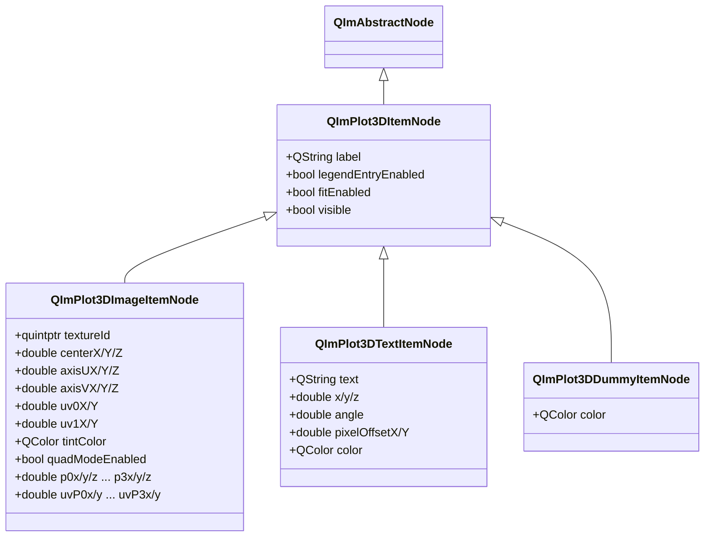
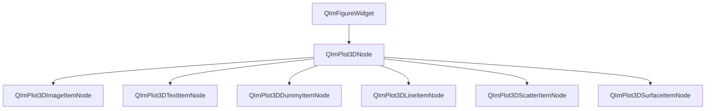

# 3D Annotation Elements Usage Guide

QIm provides three types of 3D annotation nodes for adding image textures, text labels, and legend placeholders in 3D plot space,
corresponding to ImPlot3D's Image, Text, and Dummy plot items respectively.
These annotation nodes inherit from `QImPlot3DItemNode`, following QIm's object tree management mechanism and PIMPL design pattern.

## Key Features

**Features**

- ✅ **3D Image**: Renders texture images in 3D space, supporting standard (billboard) mode and quad mode (arbitrary 3D positioning)
- ✅ **3D Text Label**: Renders centered text at 3D plot coordinates, supporting angle rotation and pixel offset fine positioning
- ✅ **3D Dummy Item**: Creates legend-only placeholder entries without rendering any graphics, for custom legend annotations
- ✅ **Property System**: All annotation properties exposed via Q_PROPERTY, supporting signal-slot reactive programming
- ✅ **Object Tree Management**: Annotation nodes created with `QImPlot3DNode` as parent, automatically added to the object tree

## Basic Concepts

### Class Inheritance



All three annotation node types inherit from `QImPlot3DItemNode`, sharing common base class properties like `label`, `visible`, `legendEntryEnabled`, `fitEnabled`.

### Object Tree Positioning

The position of annotation nodes in the QIm object tree:



**Object Tree Notes:**

- Annotation nodes specify `QImPlot3DNode` as parent in the constructor, automatically joining the object tree
- `QImPlot3DDummyItemNode` only affects the legend and does not affect other child node rendering in the plot area
- `QImPlot3DImageItemNode` and `QImPlot3DTextItemNode` render visible elements in 3D space

## QImPlot3DImageItemNode

`QImPlot3DImageItemNode` wraps ImPlot3D 3D image rendering, supporting texture image display in 3D space.
This node provides two rendering modes: standard (billboard) and quad (arbitrary 3D positioning).

### Rendering Modes

#### Standard Mode (Billboard)

Standard mode defines the image's position and orientation in 3D space through a center point and two direction vectors (axisU, axisV):

```text
                    axisV (vertical direction vector)
                    ┌─────┐
                    │     │
           center → │  ★  │ ← image center anchor
                    │     │
                    └─────┘
              axisU (horizontal direction vector)
```

- **center**: The image's center anchor coordinates in 3D space (centerX/Y/Z)
- **axisU**: Direction vector extending right from center, defining the image's horizontal width and orientation (axisUX/Y/Z)
- **axisV**: Direction vector extending up from center, defining the image's vertical height and orientation (axisVX/Y/Z)
- **textureId**: GPU texture ID from the rendering backend (e.g., `ImGui::GetIO().Fonts->TexRef.GetTexID()`)

The image's four corners are computed from `center - axisU - axisV`, `center + axisU - axisV`, `center + axisU + axisV`, `center - axisU + axisV`.

#### Quad Mode

Quad mode directly defines the image's shape in 3D space through 4 corner points (p0-p3), supporting arbitrary skew and perspective distortion:

```text
    p3 ──────────── p2
     │             │
     │   Texture   │
     │   Image     │
     │             │
    p0 ──────────── p1
```

- **quadModeEnabled**: Set to `true` to enable quad mode
- **p0-p3**: 3D coordinates of the 4 corner points (p0x/y/z, p1x/y/z, p2x/y/z, p3x/y/z)
- **uvP0-uvP3**: Independent UV texture coordinates for each corner point (uvP0x/y, uvP1x/y, uvP2x/y, uvP3x/y)

The advantage of quad mode is precise control over the image's shape in 3D space, supporting non-rectangular mapping and perspective deformation.

#### Mode Comparison

| Feature | Standard Mode | Quad Mode |
|------|----------|------------|
| Positioning | center + axisU + axisV | 4 corner points p0-p3 |
| Shape | Symmetric rectangle | Arbitrary quadrilateral |
| Texture Coordinates | uv0 + uv1 (bottom-left and top-right corners) | uvP0-uvP3 (independent per corner) |
| Use Cases | Icons, logos, simple texture mapping | Perspective mapping, skewed surface texturing, terrain texturing |
| Enable Condition | quadModeEnabled = false (default) | quadModeEnabled = true |

### UV Texture Coordinates

UV coordinates define the texture image's sampling region, with range `[0.0, 1.0]` corresponding to the full texture area:

**Standard Mode UV:**

```text
    uv1 (top-right) ──────── (1.0, 1.0)
         │              │
         │  Texture     │
         │  Sampling    │
         │  Region      │
         │              │
    uv0 (bottom-left) ──── (0.0, 0.0)
```

- **uv0X/Y**: Bottom-left texture coordinate (default 0.0, 0.0)
- **uv1X/Y**: Top-right texture coordinate (default 1.0, 1.0)

**Quad Mode UV:**

In quad mode, each corner point has independent UV coordinates, enabling more flexible texture mapping:

```text
    uvP3 ──────────── uvP2
     │               │
     │  Arbitrary    │
     │  Texture Map  │
     │               │
    uvP0 ──────────── uvP1
```

- **uvP0x/y**: UV coordinates for corner 0
- **uvP1x/y**: UV coordinates for corner 1
- **uvP2x/y**: UV coordinates for corner 2
- **uvP3x/y**: UV coordinates for corner 3

!!! info "UV Coordinate Use Cases"
    - Display full texture: uv0=(0,0), uv1=(1,1)
    - Display partial region: uv0=(0.25,0.25), uv1=(0.75,0.75)
    - Texture flip: uv0=(1,1), uv1=(0,0)
    - Partial transparency clipping: controlled via tintColor's alpha component

### Tint Color

The `tintColor` property defines a color multiplier applied to the image texture:

- Default white `(255, 255, 255)` keeps the image unchanged
- Alpha component controls transparency: `QColor(255, 255, 255, 128)` for semi-transparent
- Other colors for tinting effects: `QColor(255, 200, 0)` applies a yellow hue overlay

```cpp
// Keep image original appearance
image3D->setTintColor(QColor(255, 255, 255));  // default value

// Semi-transparent effect (alpha = 128, ~50% transparency)
image3D->setTintColor(QColor(255, 255, 255, 128));

// Yellow hue overlay
image3D->setTintColor(QColor(255, 200, 0));
```

### Basic Usage (Standard Mode)

Examples for this component are in `examples/qimfigure-test` under Plot3DImageFunction; a sample screenshot follows:


Render a texture image in 3D space using standard mode:

```cpp
#include "QImFigureWidget.h"
#include "plot3d/QImPlot3DNode.h"
#include "plot3d/QImPlot3DImageItemNode.h"
#include "imgui.h"

// Create 3D plot node as parent
QIM::QImPlot3DNode* plot3D = figure->createPlot3DNode();
plot3D->setTitle("3D Image Example");
plot3D->setBoxRotation(35.264, 45.0);  // isometric view

// Create 3D image node, specifying plot3D as parent
QIM::QImPlot3DImageItemNode* image3D = new QIM::QImPlot3DImageItemNode(plot3D);

// Set texture ID (obtained from rendering backend)
ImTextureID fontTexId = ImGui::GetIO().Fonts->TexRef.GetTexID();
image3D->setTextureId(static_cast<quintptr>(fontTexId));

// Set image center position and direction vectors (standard mode)
image3D->setCenterX(0.0);   // center X coordinate
image3D->setCenterY(0.0);   // center Y coordinate
image3D->setCenterZ(0.5);   // center Z coordinate
image3D->setAxisUX(0.5);    // horizontal direction X component
image3D->setAxisUY(0.0);    // horizontal direction Y component
image3D->setAxisUZ(0.0);    // horizontal direction Z component
image3D->setAxisVX(0.0);    // vertical direction X component
image3D->setAxisVY(0.5);    // vertical direction Y component
image3D->setAxisVZ(0.0);    // vertical direction Z component

// Effect: renders a texture image at 3D space (0, 0, 0.5),
//         image extends 0.5 along X axis and 0.5 along Y axis
// Object tree structure: figure → plot3D → image3D
```

!!! warning "Texture ID Requirements"
    `textureId` must be a valid ImTextureID from the rendering backend.
    Typically obtained via `ImGui::GetIO().Fonts->TexRef.GetTexID()` for font textures,
    or a GPU ID from custom textures. Invalid texture IDs will cause rendering errors.

### Quad Mode Usage

Enable quad mode and define the image shape directly through 4 corner points:

```cpp
// Create 3D image node
QIM::QImPlot3DImageItemNode* image3D = new QIM::QImPlot3DImageItemNode(plot3D);

// Enable quad mode
image3D->setQuadModeEnabled(true);

// Set texture ID
image3D->setTextureId(static_cast<quintptr>(fontTexId));

// Use convenience method to set all quad parameters at once
image3D->setQuadImage(
    static_cast<quintptr>(fontTexId),  // texture ID
    0.0, 0.0, 0.0,     // p0 (bottom-left)
    1.0, 0.0, 0.0,     // p1 (bottom-right)
    1.0, 0.0, 1.0,     // p2 (top-right)
    0.0, 0.0, 1.0,     // p3 (top-left)
    0.0, 0.0,          // uvP0
    1.0, 0.0,          // uvP1
    1.0, 1.0,          // uvP2
    0.0, 1.0           // uvP3
);

// Effect: renders a skewed textured quad in 3D space
```

!!! info "setQuadImage Convenience Method"
    The `setQuadImage()` method sets all quad mode parameters at once (texture ID, 4 corner coordinates,
    4 corner UV coordinates, tint color), avoiding individual property settings. Tint color defaults to white.

### Property List

#### Common Properties

| Property | Type | Getter | Setter | Signal | Description |
|------|------|--------|--------|------|------|
| textureId | quintptr | `textureId()` | `setTextureId()` | `textureIdChanged` | GPU texture ID |

#### Standard Mode Properties

| Property | Type | Getter | Setter | Signal | Description |
|------|------|--------|--------|------|------|
| centerX | double | `centerX()` | `setCenterX()` | `centerChanged` | Image center X coordinate |
| centerY | double | `centerY()` | `setCenterY()` | `centerChanged` | Image center Y coordinate |
| centerZ | double | `centerZ()` | `setCenterZ()` | `centerChanged` | Image center Z coordinate |
| axisUX | double | `axisUX()` | `setAxisUX()` | `axisUChanged` | U axis direction X component |
| axisUY | double | `axisUY()` | `setAxisUY()` | `axisUChanged` | U axis direction Y component |
| axisUZ | double | `axisUZ()` | `setAxisUZ()` | `axisUChanged` | U axis direction Z component |
| axisVX | double | `axisVX()` | `setAxisVX()` | `axisVChanged` | V axis direction X component |
| axisVY | double | `axisVY()` | `setAxisVY()` | `axisVChanged` | V axis direction Y component |
| axisVZ | double | `axisVZ()` | `setAxisVZ()` | `axisVChanged` | V axis direction Z component |
| uv0X | double | `uv0X()` | `setUv0X()` | `uv0Changed` | Bottom-left texture coordinate X (default 0.0) |
| uv0Y | double | `uv0Y()` | `setUv0Y()` | `uv0Changed` | Bottom-left texture coordinate Y (default 0.0) |
| uv1X | double | `uv1X()` | `setUv1X()` | `uv1Changed` | Top-right texture coordinate X (default 1.0) |
| uv1Y | double | `uv1Y()` | `setUv1Y()` | `uv1Changed` | Top-right texture coordinate Y (default 1.0) |
| tintColor | QColor | `tintColor()` | `setTintColor()` | `tintColorChanged` | Tint color (default white) |

#### Quad Mode Properties

| Property | Type | Getter | Setter | Signal | Description |
|------|------|--------|--------|------|------|
| quadModeEnabled | bool | `quadModeEnabled()` | `setQuadModeEnabled()` | `quadModeEnabledChanged` | Quad mode toggle |
| p0x | double | `p0x()` | `setP0x()` | `p0Changed` | Corner 0 X coordinate |
| p0y | double | `p0y()` | `setP0y()` | `p0Changed` | Corner 0 Y coordinate |
| p0z | double | `p0z()` | `setP0z()` | `p0Changed` | Corner 0 Z coordinate |
| p1x | double | `p1x()` | `setP1x()` | `p1Changed` | Corner 1 X coordinate |
| p1y | double | `p1y()` | `setP1y()` | `p1Changed` | Corner 1 Y coordinate |
| p1z | double | `p1z()` | `setP1z()` | `p1Changed` | Corner 1 Z coordinate |
| p2x | double | `p2x()` | `setP2x()` | `p2Changed` | Corner 2 X coordinate |
| p2y | double | `p2y()` | `setP2y()` | `p2Changed` | Corner 2 Y coordinate |
| p2z | double | `p2z()` | `setP2z()` | `p2Changed` | Corner 2 Z coordinate |
| p3x | double | `p3x()` | `setP3x()` | `p3Changed` | Corner 3 X coordinate |
| p3y | double | `p3y()` | `setP3y()` | `p3Changed` | Corner 3 Y coordinate |
| p3z | double | `p3z()` | `setP3z()` | `p3Changed` | Corner 3 Z coordinate |
| uvP0x | double | `uvP0x()` | `setUvP0x()` | `uvP0Changed` | Corner 0 UV X |
| uvP0y | double | `uvP0y()` | `setUvP0y()` | `uvP0Changed` | Corner 0 UV Y |
| uvP1x | double | `uvP1x()` | `setUvP1x()` | `uvP1Changed` | Corner 1 UV X |
| uvP1y | double | `uvP1y()` | `setUvP1y()` | `uvP1Changed` | Corner 1 UV Y |
| uvP2x | double | `uvP2x()` | `setUvP2x()` | `uvP2Changed` | Corner 2 UV X |
| uvP2y | double | `uvP2y()` | `setUvP2y()` | `uvP2Changed` | Corner 2 UV Y |
| uvP3x | double | `uvP3x()` | `setUvP3x()` | `uvP3Changed` | Corner 3 UV X |
| uvP3y | double | `uvP3y()` | `setUvP3y()` | `uvP3Changed` | Corner 3 UV Y |

!!! info "Signal Consolidation"
    The three center components share the `centerChanged(double x, double y, double z)` signal,
    the three axisU components share the `axisUChanged(double x, double y, double z)` signal,
    the three axisV components share the `axisVChanged(double x, double y, double z)` signal,
    each corner's three components share a dedicated signal (e.g., `p0Changed(double x, double y, double z)`),
    and each corner UV's two components share a dedicated signal (e.g., `uvP0Changed(double x, double y)`).

### Method List

| Method | Parameters | Description |
|------|------|------|
| `setTextureId(id)` | quintptr | Set GPU texture ID |
| `textureId()` | - | Get GPU texture ID |
| `setCenterX/Y/Z(val)` | double | Set image center coordinate components |
| `centerX/Y/Z()` | - | Get image center coordinate components |
| `setAxisUX/Y/Z(val)` | double | Set U axis direction vector components |
| `axisUX/Y/Z()` | - | Get U axis direction vector components |
| `setAxisVX/Y/Z(val)` | double | Set V axis direction vector components |
| `axisVX/Y/Z()` | - | Get V axis direction vector components |
| `setUv0X/Y(val)` | double | Set bottom-left texture coordinate components |
| `uv0X/Y()` | - | Get bottom-left texture coordinate components |
| `setUv1X/Y(val)` | double | Set top-right texture coordinate components |
| `uv1X/Y()` | - | Get top-right texture coordinate components |
| `setTintColor(color)` | QColor | Set tint color |
| `tintColor()` | - | Get tint color |
| `setQuadModeEnabled(enabled)` | bool | Enable/disable quad mode |
| `quadModeEnabled()` | - | Check if quad mode is enabled |
| `setP0x/y/z(val)` ... `setP3x/y/z(val)` | double | Set corner coordinate components |
| `p0x/y/z()` ... `p3x/y/z()` | - | Get corner coordinate components |
| `setUvP0x/y(val)` ... `setUvP3x/y(val)` | double | Set corner UV components |
| `uvP0x/y()` ... `uvP3x/y()` | - | Get corner UV components |
| `setQuadImage(...)` | 21+ parameters | Convenience method: set all quad parameters at once |
| `imageFlags()` | - | Get raw ImPlot3DImageFlags |
| `setImageFlags(flags)` | int | Set raw ImPlot3DImageFlags |

### Signal List

| Signal | Parameters | Trigger |
|------|------|----------|
| `textureIdChanged(id)` | quintptr | When texture ID changes |
| `centerChanged(x, y, z)` | double, double, double | When any center coordinate changes |
| `axisUChanged(x, y, z)` | double, double, double | When any U axis component changes |
| `axisVChanged(x, y, z)` | double, double, double | When any V axis component changes |
| `uv0Changed(x, y)` | double, double | When any UV0 coordinate changes |
| `uv1Changed(x, y)` | double, double | When any UV1 coordinate changes |
| `tintColorChanged(color)` | QColor | When tint color changes |
| `imageFlagChanged()` | - | When any image flag changes |
| `quadModeEnabledChanged(enabled)` | bool | When quad mode toggle changes |
| `p0Changed(x, y, z)` | double, double, double | When any corner 0 coordinate changes |
| `p1Changed(x, y, z)` | double, double, double | When any corner 1 coordinate changes |
| `p2Changed(x, y, z)` | double, double, double | When any corner 2 coordinate changes |
| `p3Changed(x, y, z)` | double, double, double | When any corner 3 coordinate changes |
| `uvP0Changed(x, y)` | double, double | When any UV point 0 coordinate changes |
| `uvP1Changed(x, y)` | double, double | When any UV point 1 coordinate changes |
| `uvP2Changed(x, y)` | double, double | When any UV point 2 coordinate changes |
| `uvP3Changed(x, y)` | double, double | When any UV point 3 coordinate changes |

```cpp
// Monitor image center position changes
connect(image3D, &QIM::QImPlot3DImageItemNode::centerChanged,
        this, [](double x, double y, double z) {
    qDebug() << "Image center updated to:" << x << y << z;
});

// Monitor quad mode toggle
connect(image3D, &QIM::QImPlot3DImageItemNode::quadModeEnabledChanged,
        this, [](bool enabled) {
    qDebug() << "Quad mode:" << (enabled ? "enabled" : "disabled");
});
```

!!! warning "imageFlagChanged Signal"
    All image flag properties share the `imageFlagChanged()` signal.
    This signal does not indicate which specific flag changed; connected slots must query relevant properties to determine what changed.

### Example Code

Complete example from `examples/qimfigure-test/functions/3d/Plot3DImageFunction.cpp`:

```cpp
void Plot3DImageFunction::createPlot(QIM::QImFigureWidget* figure)
{
    // Reset to single plot mode
    figure->setSubplot3DGrid(1, 1);
    
    // Create 3D plot node
    m_plot3DNode = figure->createPlot3DNode();
    
    // Configure axes and title
    m_plot3DNode->xAxis()->setLabel(m_xLabel);
    m_plot3DNode->yAxis()->setLabel(m_yLabel);
    m_plot3DNode->zAxis()->setLabel(m_zLabel);
    m_plot3DNode->setTitle(m_title);
    
    // Set isometric view
    m_plot3DNode->setBoxRotation(35.264, 45.0);
    
    // Create 3D image node, specifying plot3D as parent
    m_image3DNode = new QIM::QImPlot3DImageItemNode(m_plot3DNode);
    
    // Use ImGui font texture as test texture source
    ImTextureID fontTexId = ImGui::GetIO().Fonts->TexRef.GetTexID();
    m_image3DNode->setTextureId(static_cast<quintptr>(fontTexId));
    
    // Set standard mode properties
    m_image3DNode->setCenterX(m_centerX);
    m_image3DNode->setCenterY(m_centerY);
    m_image3DNode->setCenterZ(m_centerZ);
    
    m_image3DNode->setAxisUX(m_axisUX);
    m_image3DNode->setAxisUY(m_axisUY);
    m_image3DNode->setAxisUZ(m_axisUZ);
    
    m_image3DNode->setAxisVX(m_axisVX);
    m_image3DNode->setAxisVY(m_axisVY);
    m_image3DNode->setAxisVZ(m_axisVZ);
    
    m_image3DNode->setTintColor(m_tintColor);
    
    m_image3DNode->setUv0X(m_uv0X);
    m_image3DNode->setUv0Y(m_uv0Y);
    m_image3DNode->setUv1X(m_uv1X);
    m_image3DNode->setUv1Y(m_uv1Y);
}
```

## QImPlot3DTextItemNode

`QImPlot3DTextItemNode` wraps ImPlot3D text labels, rendering centered text at specified 3D plot coordinates,
with optional angle rotation and pixel offset. Suitable for annotating data points, marking feature regions, or adding descriptive labels in 3D space.

!!! info "Difference from 2D Text Labels"
    3D text labels use 3D coordinates `(x, y, z)` for positioning (instead of 2D's `(x, y)`),
    use the `angle` property for rotation control (instead of 2D's `vertical` boolean),
    and otherwise behave the same as the 2D version.

### Basic Usage

Examples for this component are in `examples/qimfigure-test` under Plot3DTextFunction; a sample screenshot follows:


Create a 3D text label positioned at plot coordinates:

```cpp
#include "QImFigureWidget.h"
#include "plot3d/QImPlot3DNode.h"
#include "plot3d/QImPlot3DTextItemNode.h"

// Create 3D plot node as parent
QIM::QImPlot3DNode* plot3D = figure->createPlot3DNode();
plot3D->setTitle("3D Text Annotation Example");
plot3D->setBoxRotation(35.264, 45.0);

// Create 3D text label, specifying plot3D as parent
QIM::QImPlot3DTextItemNode* text3D = new QIM::QImPlot3DTextItemNode(plot3D);
text3D->setLabel("Text Label");
text3D->setText("Key Data Point");           // set text content
text3D->setPosition(0.0, 0.0, 0.5);         // set 3D plot coordinate position
text3D->setColor(QColor(255, 0, 0));        // set text color

// Effect: displays red text "Key Data Point" at 3D space coordinate (0, 0, 0.5)
// Object tree structure: figure → plot3D → text3D
```

### 3D Positioning & Offset

`position` uses the 3D plot coordinate system (same coordinate space as data points), while `pixelOffset` uses the screen pixel coordinate system.
Both combine for fine positioning: first anchor at 3D coordinates, then fine-tune display position via pixel offset.

```cpp
// Annotate near a 3D data point, using pixel offset to avoid occlusion
text3D->setPosition(1.0, 2.0, 0.5);     // anchor at 3D coordinate (1.0, 2.0, 0.5)
text3D->setPixelOffset(10.0, -5.0);     // offset 10 pixels right, 5 pixels up

// Effect: text label appears above-right of the 3D position (1.0, 2.0, 0.5), avoiding data point overlap
```

!!! info "position vs pixelOffset Distinction"
    - `position (x, y, z)`: 3D plot coordinate system, changes with rotation, zoom, and pan. Suitable for annotating specific data locations
    - `pixelOffset (pixelOffsetX, pixelOffsetY)`: Screen pixel coordinate system, unaffected by 3D transforms. Suitable for fine-tuning the text's relative distance from the anchor

### Rotation Angle

The `angle` property controls text rotation (in degrees), unlike the 2D version's `vertical` boolean:
- `angle = 0`: Text displayed horizontally (default)
- `angle = 90`: Text displayed vertically
- `angle = 45`: Text tilted 45°

```cpp
// Horizontal text (default)
text3D->setAngle(0.0);    // text horizontal

// Vertical text
text3D->setAngle(90.0);   // text rotated 90° vertically

// Custom angle
text3D->setAngle(45.0);   // text tilted 45°
```

### Property List

| Property | Type | Getter | Setter | Signal | Description |
|------|------|--------|--------|------|------|
| text | QString | `text()` | `setText()` | `textChanged` | Text content |
| x | double | `x()` | `setX()` | `positionChanged` | 3D position X coordinate |
| y | double | `y()` | `setY()` | `positionChanged` | 3D position Y coordinate |
| z | double | `z()` | `setZ()` | `positionChanged` | 3D position Z coordinate |
| angle | double | `angle()` | `setAngle()` | `angleChanged` | Rotation angle (degrees) |
| pixelOffsetX | double | `pixelOffsetX()` | `setPixelOffsetX()` | `pixelOffsetChanged` | Horizontal pixel offset |
| pixelOffsetY | double | `pixelOffsetY()` | `setPixelOffsetY()` | `pixelOffsetChanged` | Vertical pixel offset |
| color | QColor | `color()` | `setColor()` | `colorChanged` | Text color |

!!! info "Convenience Overloads"
    - `setPosition(double x, double y, double z)`: Set all 3 coordinate components at once
    - `setPixelOffset(double offsetX, double offsetY)`: Set both offset components at once

!!! info "positionChanged Signal Consolidation"
    The x, y, z components share the `positionChanged(double x, double y, double z)` signal,
    and pixelOffsetX, pixelOffsetY share the `pixelOffsetChanged(double offsetX, double offsetY)` signal.

### Method List

| Method | Parameters | Description |
|------|------|------|
| `setText(text)` | QString | Set text content |
| `text()` | - | Get text content |
| `setX(x)` | double | Set 3D position X coordinate |
| `x()` | - | Get 3D position X coordinate |
| `setY(y)` | double | Set 3D position Y coordinate |
| `y()` | - | Get 3D position Y coordinate |
| `setZ(z)` | double | Set 3D position Z coordinate |
| `z()` | - | Get 3D position Z coordinate |
| `setPosition(x, y, z)` | double, double, double | Convenience method: set 3D position at once |
| `setAngle(angleDeg)` | double | Set rotation angle (degrees) |
| `angle()` | - | Get rotation angle (degrees) |
| `setPixelOffsetX(offset)` | double | Set horizontal pixel offset |
| `pixelOffsetX()` | - | Get horizontal pixel offset |
| `setPixelOffsetY(offset)` | double | Set vertical pixel offset |
| `pixelOffsetY()` | - | Get vertical pixel offset |
| `setPixelOffset(offsetX, offsetY)` | double, double | Convenience method: set pixel offset at once |
| `setColor(color)` | QColor | Set text color |
| `color()` | - | Get text color |

### Signal List

| Signal | Parameters | Trigger |
|------|------|----------|
| `textChanged(text)` | QString | When text content changes |
| `positionChanged(x, y, z)` | double, double, double | When any position coordinate changes |
| `angleChanged(angleDeg)` | double | When rotation angle changes |
| `pixelOffsetChanged(offsetX, offsetY)` | double, double | When any pixel offset changes |
| `colorChanged(color)` | QColor | When text color changes |

```cpp
// Monitor 3D text position changes
connect(text3D, &QIM::QImPlot3DTextItemNode::positionChanged,
        this, [](double x, double y, double z) {
    qDebug() << "3D text position updated to:" << x << y << z;
});

// Monitor rotation angle changes
connect(text3D, &QIM::QImPlot3DTextItemNode::angleChanged,
        this, [](double angleDeg) {
    qDebug() << "Rotation angle updated to:" << angleDeg << "degrees";
});
```

### Example Code

Complete example from `examples/qimfigure-test/functions/3d/Plot3DTextFunction.cpp`:

```cpp
void Plot3DTextFunction::createPlot(QIM::QImFigureWidget* figure)
{
    // Reset to single plot mode
    figure->setSubplot3DGrid(1, 1);
    
    // Create 3D plot node
    m_plot3DNode = figure->createPlot3DNode();
    
    // Configure axes and title
    m_plot3DNode->xAxis()->setLabel(m_xLabel);
    m_plot3DNode->yAxis()->setLabel(m_yLabel);
    m_plot3DNode->zAxis()->setLabel(m_zLabel);
    m_plot3DNode->setTitle(m_title);
    
    // Set isometric view
    m_plot3DNode->setBoxRotation(35.264, 45.0);
    
    // Create 3D text node, specifying plot3D as parent
    m_text3DNode = new QIM::QImPlot3DTextItemNode(m_plot3DNode);
    m_text3DNode->setText(m_text);                               // text content
    m_text3DNode->setPosition(m_x, m_y, m_z);                   // 3D coordinate positioning
    m_text3DNode->setAngle(m_angle);                             // rotation angle
    m_text3DNode->setPixelOffset(m_pixelOffsetX, m_pixelOffsetY); // pixel offset fine-tuning
    m_text3DNode->setColor(m_color);                             // text color
}
```

## QImPlot3DDummyItemNode

`QImPlot3DDummyItemNode` is a special annotation node that only creates a placeholder entry with a color icon in the legend,
rendering no visible graphics in the 3D plot area. Its design matches that of the 2D `QImPlotDummyItemNode`.

### Design Purpose

The core purpose of dummy items is to add custom legend entries without associating them with actual plot data:

- Add legend descriptions for manual annotations
- Represent category identifiers for grouped data
- Serve as separator or hint entries in legends

```text
3D Plot Area: Only spiral data displayed (dummy items render nothing)
Legend Area:
┌─────────────────────┐
│ ── Helix            │ ← 3D line legend entry
│ ■ Sensor A          │ ← Dummy item legend entry (icon + label only)
│ ■ Sensor B          │ ← Dummy item legend entry
│ ■ Sensor C          │ ← Dummy item legend entry
└─────────────────────┘
```

!!! info "Dummy Items Render No Graphics"
    `QImPlot3DDummyItemNode` only creates an entry with a color icon and label in the legend;
    no corresponding graphical element appears in the 3D plot area.

### Basic Usage

Examples for this component are in `examples/qimfigure-test` under Plot3DDummyFunction; a sample screenshot follows:


Create dummy items as legend placeholders:

```cpp
#include "QImFigureWidget.h"
#include "plot3d/QImPlot3DNode.h"
#include "plot3d/QImPlot3DLineItemNode.h"
#include "plot3d/QImPlot3DDummyItemNode.h"

// Create 3D plot node
QIM::QImPlot3DNode* plot3D = figure->createPlot3DNode();
plot3D->setTitle("3D Dummy Item Example");
plot3D->setLegendEnabled(true);  // must enable legend to see dummy items

// Create 3D spiral data
std::vector<double> xs, ys, zs;
for (int i = 0; i < 200; ++i) {
    double t = i * 0.05 * M_PI;
    xs.push_back(std::cos(t));
    ys.push_back(std::sin(t));
    zs.push_back(t * 0.1);
}

// Create 3D line node
QIM::QImPlot3DLineItemNode* line3D = new QIM::QImPlot3DLineItemNode(plot3D);
line3D->setData(xs, ys, zs);
line3D->setColor(QColor(0, 114, 189));
line3D->setLineWeight(2.0f);
line3D->setLabel("Helix");

// Create dummy item nodes, serving only as legend placeholders
QIM::QImPlot3DDummyItemNode* dummy1 = new QIM::QImPlot3DDummyItemNode(plot3D);
dummy1->setLabel("Sensor A");         // label shown in legend
dummy1->setColor(QColor(255, 0, 0)); // legend icon color

QIM::QImPlot3DDummyItemNode* dummy2 = new QIM::QImPlot3DDummyItemNode(plot3D);
dummy2->setLabel("Sensor B");
dummy2->setColor(QColor(0, 255, 0));

QIM::QImPlot3DDummyItemNode* dummy3 = new QIM::QImPlot3DDummyItemNode(plot3D);
dummy3->setLabel("Sensor C");
dummy3->setColor(QColor(0, 0, 255));

// Effect: legend shows 4 entries — line "Helix" and dummy items "Sensor A/B/C"
// 3D plot area only shows spiral data; dummy items render no graphics
// Object tree structure: figure → plot3D → line3D, dummy1, dummy2, dummy3
```

!!! warning "Legend Must Be Enabled"
    Dummy items are only visible in the legend. If `QImPlot3DNode`'s `legendEnabled` is `false`,
    dummy items are completely invisible. Ensure the legend is enabled before creating dummy items:
    ```cpp
    plot3D->setLegendEnabled(true);  // enable legend
    ```

### Property List

| Property | Type | Getter | Setter | Signal | Description |
|------|------|--------|--------|------|------|
| color | QColor | `color()` | `setColor()` | `colorChanged` | Legend icon color |

!!! info "label Property"
    The `label` property is inherited from the `QImPlot3DItemNode` base class; use `setLabel()` to set the legend label text
    and `label()` to get the label. This is the most important property of dummy items, determining the text displayed in the legend.

### Method List

| Method | Parameters | Description |
|------|------|------|
| `setColor(color)` | QColor | Set legend icon color |
| `color()` | - | Get legend icon color |

### Signal List

| Signal | Parameters | Trigger |
|------|------|----------|
| `colorChanged(color)` | QColor | When legend icon color changes |

```cpp
// Monitor dummy item color changes
connect(dummyNode, &QIM::QImPlot3DDummyItemNode::colorChanged,
        this, [](const QColor& newColor) {
    qDebug() << "Dummy item color updated to:" << newColor.name();
});
```

### Example Code

Complete example from `examples/qimfigure-test/functions/3d/Plot3DDummyFunction.cpp`:

```cpp
void Plot3DDummyFunction::createPlot(QIM::QImFigureWidget* figure)
{
    // Reset to single plot mode
    figure->setSubplot3DGrid(1, 1);
    
    // Create 3D plot node
    m_plot3DNode = figure->createPlot3DNode();
    
    // Configure axes and title
    m_plot3DNode->xAxis()->setLabel(m_xLabel);
    m_plot3DNode->yAxis()->setLabel(m_yLabel);
    m_plot3DNode->zAxis()->setLabel(m_zLabel);
    m_plot3DNode->setTitle(m_title);
    
    // Enable legend to display dummy items
    m_plot3DNode->setLegendEnabled(true);
    
    // Create 3 dummy item nodes, serving only as legend placeholders
    m_dummy1Node = new QIM::QImPlot3DDummyItemNode(m_plot3DNode);
    m_dummy1Node->setLabel(QStringLiteral("Sensor A"));
    m_dummy1Node->setColor(m_dummy1Color);
    
    m_dummy2Node = new QIM::QImPlot3DDummyItemNode(m_plot3DNode);
    m_dummy2Node->setLabel(QStringLiteral("Sensor B"));
    m_dummy2Node->setColor(m_dummy2Color);
    
    m_dummy3Node = new QIM::QImPlot3DDummyItemNode(m_plot3DNode);
    m_dummy3Node->setLabel(QStringLiteral("Sensor C"));
    m_dummy3Node->setColor(m_dummy3Color);
    
    // Add visible spiral as 3D geometry demonstration
    const int numLinePoints = 200;
    std::vector<double> xsLine, ysLine, zsLine;
    for (int i = 0; i < numLinePoints; ++i) {
        double t = i * 0.05 * M_PI;
        xsLine.push_back(std::cos(t));
        ysLine.push_back(std::sin(t));
        zsLine.push_back(t * 0.1);
    }
    m_lineNode = new QIM::QImPlot3DLineItemNode(m_plot3DNode);
    m_lineNode->setData(xsLine, ysLine, zsLine);
    m_lineNode->setColor(QColor(0, 114, 189));
    m_lineNode->setLineWeight(2.0f);
    m_lineNode->setLabel(QStringLiteral("Helix"));
}
```

## Inherited Properties

All three annotation node types inherit from `QImPlot3DItemNode` and share the following common properties:

| Property | Type | Getter | Setter | Signal | Description |
|------|------|--------|--------|------|------|
| label | QString | `label()` | `setLabel()` | `labelChanged` | Legend label text |
| legendEntryEnabled | bool | `isLegendEntryEnabled()` | `setLegendEntryEnabled()` | `legendEntryEnabledChanged` | Whether shown in legend |
| fitEnabled | bool | `isFitEnabled()` | `setFitEnabled()` | `fitEnabledChanged` | Whether participating in axis auto-fit |
| visible | bool | `isVisible()` | `setVisible()` | - | Visibility control |

!!! info "label UTF8 Storage Convention"
    `QImPlot3DItemNode` internally stores label text only in UTF8 format (using `QByteArray`),
    in compliance with QIm's string storage convention. The `labelConstData()` method returns a UTF8 pointer for direct rendering use.

## Signal-Slot Connections

The three annotation node types use signals consistently, all following the Qt signal-slot mechanism:

```cpp
// 3D Image signal connection
connect(image3D, &QIM::QImPlot3DImageItemNode::centerChanged,
        this, &MyClass::onImageCenterChanged);

// 3D Text signal connection
connect(text3D, &QIM::QImPlot3DTextItemNode::positionChanged,
        this, &MyClass::onTextPositionChanged);

// 3D Dummy signal connection
connect(dummyNode, &QIM::QImPlot3DDummyItemNode::colorChanged,
        this, &MyClass::onDummyColorChanged);
```

!!! info "Signal Naming Convention"
    QIm signal naming follows Qt convention: property change signals are `propertyNameChanged`,
    flag change signals are `flagNameChanged` (e.g., `imageFlagChanged`).
    Note the use of the `Q_SIGNALS` keyword instead of `signals`.

## Notes

!!! warning "Object Tree Parent-Child Relationships"
    When creating 3D annotation nodes, `QImPlot3DNode` must be specified as the parent:
    ```cpp
    // Correct: specify parent in constructor (recommended)
    QIM::QImPlot3DTextItemNode* text = new QIM::QImPlot3DTextItemNode(plot3D);
    
    // Correct: add via addPlotItem()
    QIM::QImPlot3DTextItemNode* text = new QIM::QImPlot3DTextItemNode();
    plot3D->addPlotItem(text);
    ```
    Both approaches are equivalent. Approach 1 is more consistent with Qt object tree conventions; node lifecycle is managed by the parent node.

!!! warning "Texture ID Validity"
    `QImPlot3DImageItemNode`'s `textureId` must be a valid GPU texture ID.
    Invalid texture IDs (e.g., 0) will cause rendering errors. Obtain texture ID after ImGui context initialization is complete:
    ```cpp
    // ImGui 1.92+ get font texture ID
    ImTextureID fontTexId = ImGui::GetIO().Fonts->TexRef.GetTexID();
    image3D->setTextureId(static_cast<quintptr>(fontTexId));
    ```

!!! warning "Switching Between Standard Mode and Quad Mode"
    When switching modes, ensure complete corresponding property groups are set:
    - Switch to standard mode: set center + axisU + axisV + textureId + uv0/uv1
    - Switch to quad mode: set quadModeEnabled=true + p0-p3 + uvP0-uvP3 + textureId
    Missing properties may cause rendering anomalies.

!!! tip "Color Defaults"
    When the `color` property of all annotation nodes is not set, colors are auto-assigned using ImPlot3D's default color sequence.
    For precise color control, call `setColor()` immediately after node creation.

## References

- Related Docs: [3D Plotting Overview](index.md), [Render Nodes](../render-node.md), [2D Annotations](../plot2d/plot-annotations.md)
- Example Code: `examples/qimfigure-test/functions/3d/Plot3DImageFunction.cpp`, `examples/qimfigure-test/functions/3d/Plot3DTextFunction.cpp`, `examples/qimfigure-test/functions/3d/Plot3DDummyFunction.cpp`
- API Reference: `src/core/plot3d/QImPlot3DImageItemNode.h`, `src/core/plot3d/QImPlot3DTextItemNode.h`, `src/core/plot3d/QImPlot3DDummyItemNode.h`, `src/core/plot3d/QImPlot3DItemNode.h`