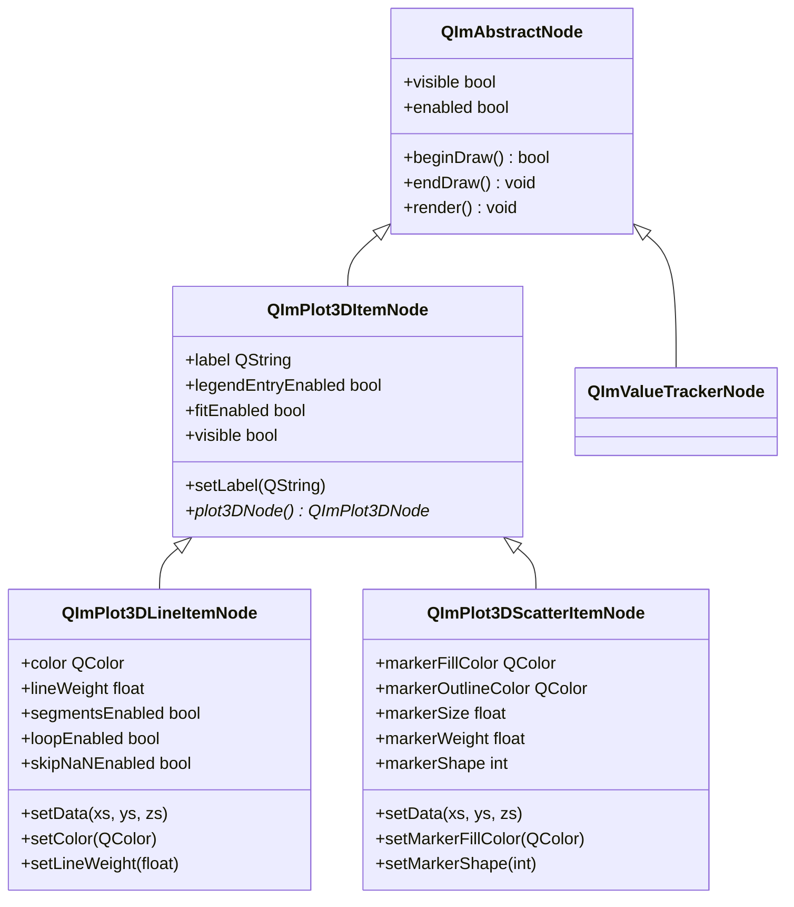
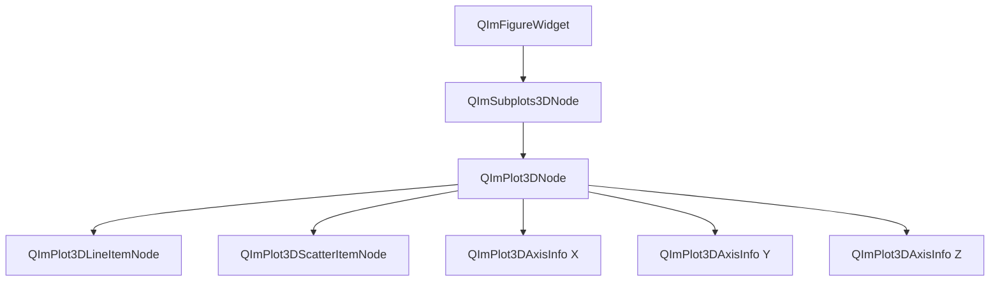

# 3D Basic Charts Usage Guide

QIm's 3D basic charts include two core chart types: **3D line charts** (`QImPlot3DLineItemNode`) and **3D scatter charts** (`QImPlot3DScatterItemNode`), used for visualizing continuous curves and discrete data points in 3D space respectively. All 3D chart elements are presented as Qt node objects, supporting the full Qt property system and signal-slot interaction.

## Key Features

**Features**

- ✅ **3D Line Charts**: Support continuous curve plotting in 3D space, with customizable color, line weight, and line flags
- ✅ **3D Scatter Charts**: Support 3D scatter data visualization, with configurable marker shape, size, fill color, and outline style
- ✅ **XYZ Data Format**: Use three vectors (xs, ys, zs) to describe 3D data, different from the 2D XY format
- ✅ **Convenience Methods**: `QImPlot3DNode` provides `addLine()` and `addScatter()` shortcut creation methods
- ✅ **Line Flags**: Support segment mode, loop mode, and skip NaN mode
- ✅ **10 Marker Shapes**: Support 10 marker shapes including circle, square, diamond, directional arrows, cross, plus, asterisk, etc.
- ✅ **Interactive Control**: Support mouse rotation, pan, and zoom operations, controllable via properties
- ✅ **Deferred Color Initialization**: Auto-capture ImPlot3D default colors when marker colors are not set

## Basic Concepts

### 3D vs 2D Data Format Differences

The core difference between 3D and 2D charts lies in the data format:

| Feature | 2D Charts | 3D Charts |
|------|--------|--------|
| Data Dimensions | XY (2 vectors) | XYZ (3 vectors) |
| Data Series Class | `QImAbstractXYDataSeries` | `QImAbstractXYZDataSeries` |
| Axes | X1/Y1/X2/Y2/X3/Y3 (6 axes) | X/Y/Z (3 axes) |
| setData Call | `setData(x, y)` | `setData(xs, ys, zs)` |

```cpp
// 2D data format: only needs X and Y vectors
std::vector<double> x2d, y2d;
line2d->setData(x2d, y2d);

// 3D data format: needs X, Y, Z vectors
std::vector<double> xs, ys, zs;
line3d->setData(xs, ys, zs);  // three dimensions
```

!!! info "Note"
    3D charts use `QImAbstractXYZDataSeries` as the data input interface. Its template implementation `QImVectorXYZDataSeries` supports zero-copy access to raw data pointers of contiguous containers (`std::vector<double>`, `QVector<double>`).

### Component Positioning

The position of 3D basic chart elements in the object tree is as follows:

- Both **3D line charts** and **3D scatter charts** use `QImPlot3DNode` as their parent node
- Pass `QImPlot3DNode` as the parent to the constructor when creating elements
- Elements automatically become children of the parent node, with lifecycle managed by the Qt object tree

### Class Inheritance



### Object Tree Structure



Expressed in text:

```text
QImFigureWidget (plot window)
└── QImSubplots3DNode (subplot layout management)
    └── QImPlot3DNode (3D plot area)
        ├── QImPlot3DLineItemNode (3D line)
        ├── QImPlot3DScatterItemNode (3D scatter)
        ├── QImPlot3DAxisInfo (X axis)
        ├── QImPlot3DAxisInfo (Y axis)
        └── QImPlot3DAxisInfo (Z axis)
```

## Usage

Examples of 3D basic charts are located in: `examples/qimfigure-test/functions/3d/` and `examples/readme-3d-example`

### 1. Creating a 3D Plot Area

Before creating 3D lines or scatters, you need to create a `QImPlot3DNode` as the plot container:

```cpp
// Create figure window, set 3D subplot layout
QIM::QImFigureWidget* figure = new QIM::QImFigureWidget(this);
figure->setSubplot3DGrid(1, 1);  // 1×1 layout

// Create 3D plot area node
QIM::QImPlot3DNode* plot = figure->createPlot3DNode();  // automatically becomes a child of figure
plot->setTitle("3D Plot");  // set title

// Configure axes
plot->xAxis()->setLabel("X");
plot->yAxis()->setLabel("Y");
plot->zAxis()->setLabel("Z");

// Set isometric view
plot->setBoxRotation(35.264, 45.0);  // elevation 35.264°, azimuth 45°

// Node tree structure: MainWindow → figure → Subplots3D → plot → (child elements)
```

### 2. 3D Line Chart (QImPlot3DLineItemNode)

3D line charts are used to draw continuous curves in 3D space, connecting an ordered set of XYZ data points with line segments.

**Basic Usage**:

```cpp
// Source: examples/qimfigure-test/functions/3d/Plot3DLineFunction.cpp

// Create 3D plot area
QIM::QImPlot3DNode* plot = figure->createPlot3DNode();
plot->setTitle("3D Spiral Line");
plot->xAxis()->setLabel("X");
plot->yAxis()->setLabel("Y");
plot->zAxis()->setLabel("Z");

// Set isometric view
plot->setBoxRotation(35.264, 45.0);

// Generate 3D spiral data
const int numPoints = 1000;
QVector<double> xs, ys, zs;
xs.reserve(numPoints);
ys.reserve(numPoints);
zs.reserve(numPoints);

for (int i = 0; i < numPoints; ++i) {
    double t = i * 0.01 * M_PI * 10;  // t from 0 to 10π
    xs.append(std::cos(t));
    ys.append(std::sin(t));
    zs.append(t / 10.0);
}

// Create 3D line element, with plot as parent
QIM::QImPlot3DLineItemNode* line = new QIM::QImPlot3DLineItemNode(plot);
line->setData(xs, ys, zs);      // set XYZ data
line->setColor(QColor(0, 114, 189));  // set color
line->setLineWeight(2.0f);      // set line weight

// Node tree: figure → plot → line
```

**Convenience Method**:

`QImPlot3DNode` provides the `addLine()` method for one-step creation and data setting:

```cpp
// Source: examples/readme-3d-example/main.cpp

QIM::QImPlot3DNode* plot = figure->createPlot3DNode();
plot->setTitle("3D Line");

std::vector<double> xs, ys, zs;
for (int i = 0; i < 200; ++i) {
    double t = i * 0.05;
    xs.push_back(std::cos(t));
    ys.push_back(std::sin(t));
    zs.push_back(t * 0.1);
}

// addLine() auto-creates QImPlot3DLineItemNode and sets data
auto* line = plot->addLine(xs, ys, zs, "helix");
// line automatically becomes a child of plot
```

**Line Flag Configuration**:

3D line charts support three line flags, all using affirmative semantics (setting `true` enables the feature):

```cpp
// Segment mode: draw independent segments between each pair of consecutive points
line->setSegmentsEnabled(true);

// Loop mode: connect the last point to the first point
line->setLoopEnabled(true);

// Skip NaN: skip NaN values without drawing segments
line->setSkipNaNEnabled(true);
```

!!! info "Semantic Notes"
    ImPlot3D's `ImPlot3DLineFlags` uses affirmative semantics (`Segments`, `Loop`, `SkipNaN`), not `NoXxx` negation forms. QIm directly maps them to `segmentsEnabled`, `loopEnabled`, `skipNaNEnabled` properties with consistent semantics, no inversion needed.

### 3. 3D Scatter Chart (QImPlot3DScatterItemNode)

3D scatter charts are used to draw discrete data points in 3D space, with each data point rendered as a marker.

**Basic Usage**:

```cpp
// Source: examples/qimfigure-test/functions/3d/Plot3DScatterFunction.cpp

// Create 3D plot area
QIM::QImPlot3DNode* plot = figure->createPlot3DNode();
plot->setTitle("3D Scatter");
plot->setLegendEnabled(true);

// Generate 3D scatter data (spiral pattern + noise)
const int numPoints = 1000;
std::vector<double> xData(numPoints);
std::vector<double> yData(numPoints);
std::vector<double> zData(numPoints);

for (int i = 0; i < numPoints; ++i) {
    double t = static_cast<double>(i) / numPoints * 6.0 * M_PI;
    double radius = 1.0 + noiseDist(gen) * 0.2;
    xData[i] = radius * std::cos(t) + noiseDist(gen) * 0.1;
    yData[i] = radius * std::sin(t) + noiseDist(gen) * 0.1;
    zData[i] = t / (6.0 * M_PI) * 2.0 - 1.0 + noiseDist(gen) * 0.1;
}

// Create 3D scatter element, with plot as parent
QIM::QImPlot3DScatterItemNode* scatter = new QIM::QImPlot3DScatterItemNode(plot);
scatter->setData(xData, yData, zData);  // set XYZ data
scatter->setMarkerSize(5.0f);           // set marker size (pixels)
scatter->setMarkerFillColor(QColor(217, 83, 25));  // set marker fill color

// Node tree: figure → plot → scatter
```

**Convenience Method**:

`QImPlot3DNode` provides the `addScatter()` method:

```cpp
// Source: examples/readme-3d-example/main.cpp

QIM::QImPlot3DNode* plot = figure->createPlot3DNode();
plot->setTitle("3D Scatter");

std::vector<double> xs, ys, zs;
for (int i = 0; i < 200; ++i) {
    double t = i * 0.05;
    xs.push_back(std::cos(t) * 0.8);
    ys.push_back(std::sin(t) * 0.8);
    zs.push_back(std::sin(t * 0.5));
}

// addScatter() auto-creates QImPlot3DScatterItemNode and sets data
auto* scatter = plot->addScatter(xs, ys, zs, "samples");
```

**Marker Style Configuration**:

3D scatter charts support rich marker style customization:

```cpp
// Set marker fill color
scatter->setMarkerFillColor(QColor(217, 83, 25));

// Set marker outline color
scatter->setMarkerOutlineColor(QColor(120, 45, 10));

// Set marker size (pixels)
scatter->setMarkerSize(6.0f);

// Set marker outline weight (pixels)
scatter->setMarkerWeight(1.5f);

// Set marker shape
scatter->setMarkerShape(static_cast<int>(QIM::QImPlot3DMarkerShape::Diamond));
```

### 4. Marker Shapes (QImPlot3DMarkerShape)

3D scatter charts support 10 marker shapes, set via `QImPlot3DMarkerShape` enum values:

| Enum Value | Value | Shape | Description |
|--------|------|------|------|
| `None` | -1 | No marker | Display no marker |
| `Circle` | 0 | Circle | Default marker shape, circular point |
| `Square` | 1 | Square | Square marker |
| `Diamond` | 2 | Diamond | Diamond-shaped marker |
| `Up` | 3 | Upward triangle | ▲ Upward arrow shape |
| `Down` | 4 | Downward triangle | ▼ Downward arrow shape |
| `Left` | 5 | Left triangle | ◀ Left arrow shape |
| `Right` | 6 | Right triangle | ▶ Right arrow shape |
| `Cross` | 7 | Cross | ✕ Cross-shaped marker |
| `Plus` | 8 | Plus | ＋ Plus-shaped marker |
| `Asterisk` | 9 | Asterisk | ★ Asterisk-shaped marker |

!!! info "Auto Marker Cycling"
    `QImPlot3DNode` provides the `nextMarker()` method to get the next marker shape for automatic cycling assignment. Each newly added scatter element can automatically receive a different marker shape.

Usage example:

```cpp
// Set marker shape to diamond
scatter->setMarkerShape(static_cast<int>(QIM::QImPlot3DMarkerShape::Diamond));

// Set marker shape to asterisk
scatter->setMarkerShape(static_cast<int>(QIM::QImPlot3DMarkerShape::Asterisk));
```

!!! warning "Note"
    The `markerShape` property type is `int`. `QImPlot3DMarkerShape` enum values must be converted using `static_cast<int>()` when setting.

### 5. Interactive Operations

3D plot areas support mouse interaction, consistent with native ImPlot3D behavior:

| Operation | Mouse Action | Description |
|------|----------|------|
| Pan | Left-click drag | Pan the view in 3D space |
| Rotate | Right-click drag | Rotate the 3D view |
| Zoom | Scroll wheel or middle-click drag | Zoom in/out |
| Reset Rotation | Right-click double-click | Reset to initial rotation state |
| Z-axis Zoom | Ctrl + Scroll wheel | Zoom along the Z-axis |
| Screen-plane Pan | Shift + Right-click drag | Pan along the screen plane |

Interactive operations can be controlled via `QImPlot3DNode` properties:

```cpp
// Enable rotation interaction (enabled by default)
plot->setRotateEnabled(true);

// Disable pan interaction
plot->setPanEnabled(false);

// Enable zoom interaction (enabled by default)
plot->setZoomEnabled(true);

// Disable all interactions (view-only, no interaction)
plot->setInputsEnabled(false);
```

!!! info "Semantic Notes"
    Interaction properties use negation→affirmative semantic conversion: ImPlot3D's `NoRotate`, `NoPan`, `NoZoom`, `NoInputs` flags are mapped to `rotateEnabled`, `panEnabled`, `zoomEnabled`, `inputsEnabled` properties. Setting `true` enables, setting `false` disables, with more intuitive semantics.

## Property Tables

### QImPlot3DLineItemNode Properties

| Property | Type | Getter | Setter | Signal | Description |
|--------|------|----------|----------|------|------|
| `color` | `QColor` | `color()` | `setColor(QColor)` | `colorChanged(QColor)` | Line color |
| `lineWeight` | `float` | `lineWeight()` | `setLineWeight(float)` | `lineWeightChanged(float)` | Line weight (pixels) |
| `segmentsEnabled` | `bool` | `isSegmentsEnabled()` | `setSegmentsEnabled(bool)` | `lineFlagChanged()` | Segment mode enabled |
| `loopEnabled` | `bool` | `isLoopEnabled()` | `setLoopEnabled(bool)` | `lineFlagChanged()` | Loop mode enabled |
| `skipNaNEnabled` | `bool` | `isSkipNaNEnabled()` | `setSkipNaNEnabled(bool)` | `lineFlagChanged()` | Skip NaN enabled |

Properties inherited from `QImPlot3DItemNode`:

| Property | Type | Getter | Setter | Signal | Description |
|--------|------|----------|----------|------|------|
| `label` | `QString` | `label()` | `setLabel(QString)` | `labelChanged(QString)` | Legend label |
| `legendEntryEnabled` | `bool` | `isLegendEntryEnabled()` | `setLegendEntryEnabled(bool)` | `legendEntryEnabledChanged()` | Legend entry enabled |
| `fitEnabled` | `bool` | `isFitEnabled()` | `setFitEnabled(bool)` | `fitEnabledChanged()` | Auto-fit axis range enabled |

### QImPlot3DScatterItemNode Properties

| Property | Type | Getter | Setter | Signal | Description |
|--------|------|----------|----------|------|------|
| `markerFillColor` | `QColor` | `markerFillColor()` | `setMarkerFillColor(QColor)` | `markerFillColorChanged(QColor)` | Marker fill color |
| `markerOutlineColor` | `QColor` | `markerOutlineColor()` | `setMarkerOutlineColor(QColor)` | `markerOutlineColorChanged(QColor)` | Marker outline color |
| `markerSize` | `float` | `markerSize()` | `setMarkerSize(float)` | `markerSizeChanged(float)` | Marker size (pixels) |
| `markerWeight` | `float` | `markerWeight()` | `setMarkerWeight(float)` | `markerWeightChanged(float)` | Marker outline weight (pixels) |
| `markerShape` | `int` | `markerShape()` | `setMarkerShape(int)` | `markerShapeChanged(int)` | Marker shape (QImPlot3DMarkerShape enum value) |

Properties inherited from `QImPlot3DItemNode`:

| Property | Type | Getter | Setter | Signal | Description |
|--------|------|----------|----------|------|------|
| `label` | `QString` | `label()` | `setLabel(QString)` | `labelChanged(QString)` | Legend label |
| `legendEntryEnabled` | `bool` | `isLegendEntryEnabled()` | `setLegendEntryEnabled(bool)` | `legendEntryEnabledChanged()` | Legend entry enabled |
| `fitEnabled` | `bool` | `isFitEnabled()` | `setFitEnabled(bool)` | `fitEnabledChanged()` | Auto-fit axis range enabled |

!!! info "Deferred Color Initialization"
    `markerFillColor` and `markerOutlineColor` use `QImOptional3DColor` for deferred initialization. When the user does not set a color, the system automatically captures ImPlot3D's default color on first render. This means you can skip setting colors and let ImPlot3D auto-assign the next color from its color cycle sequence.

### QImPlot3DNode Interaction Properties

| Property | Type | Getter | Setter | Signal | Description |
|--------|------|----------|----------|------|------|
| `rotateEnabled` | `bool` | `isRotateEnabled()` | `setRotateEnabled(bool)` | `plot3DFlagChanged()` | Rotation interaction enabled |
| `panEnabled` | `bool` | `isPanEnabled()` | `setPanEnabled(bool)` | `plot3DFlagChanged()` | Pan interaction enabled |
| `zoomEnabled` | `bool` | `isZoomEnabled()` | `setZoomEnabled(bool)` | `plot3DFlagChanged()` | Zoom interaction enabled |
| `inputsEnabled` | `bool` | `isInputsEnabled()` | `setInputsEnabled(bool)` | `plot3DFlagChanged()` | All interactions enabled |

## Signal-Slot Connections

### QImPlot3DLineItemNode Signals

| Signal | Parameters | Trigger |
|------|------|----------|
| `dataChanged()` | None | When XYZ data series changes |
| `colorChanged(QColor)` | New color value | When line color changes |
| `lineWeightChanged(float)` | New line weight value | When line weight changes |
| `lineFlagChanged()` | None | When any line flag (segments/loop/skipNaN) changes |

### QImPlot3DScatterItemNode Signals

| Signal | Parameters | Trigger |
|------|------|----------|
| `dataChanged()` | None | When XYZ data series changes |
| `markerFillColorChanged(QColor)` | New fill color | When marker fill color changes |
| `markerOutlineColorChanged(QColor)` | New outline color | When marker outline color changes |
| `markerSizeChanged(float)` | New marker size | When marker size changes |
| `markerWeightChanged(float)` | New outline weight | When marker outline weight changes |
| `markerShapeChanged(int)` | New marker shape enum value | When marker shape changes |
| `scatterFlagChanged()` | None | When scatter flags change |

### QImPlot3DItemNode Signals (Base Class)

| Signal | Parameters | Trigger |
|------|------|----------|
| `labelChanged(QString)` | New label text | When label changes |
| `legendEntryEnabledChanged()` | None | When legend entry enabled state changes |
| `fitEnabledChanged()` | None | When auto-fit enabled state changes |

### Signal-Slot Connection Examples

```cpp
// Connect 3D line color change signal
connect(line, &QIM::QImPlot3DLineItemNode::colorChanged,
        this, &MyClass::onLineColorChanged);

// Connect 3D scatter marker size change signal
connect(scatter, &QIM::QImPlot3DScatterItemNode::markerSizeChanged,
        this, &MyClass::onMarkerSizeChanged);

// Connect line flag change signal (segments/loop/skipNaN share one signal)
connect(line, &QIM::QImPlot3DLineItemNode::lineFlagChanged,
        this, &MyClass::onLineFlagChanged);

// Connect marker shape change signal
connect(scatter, &QIM::QImPlot3DScatterItemNode::markerShapeChanged,
        [](int shape) {
    qDebug() << "Marker shape changed to:" << shape;
});
```

## Advanced Usage

### Multiple Lines/Scatters Overlay

Multiple line or scatter series can be added to the same `QImPlot3DNode`:

```cpp
QIM::QImPlot3DNode* plot = figure->createPlot3DNode();
plot->setTitle("Multiple Series");

// Add first line (spiral)
auto* line1 = plot->addLine(xs1, ys1, zs1, "Line 1");

// Add second line
auto* line2 = plot->addLine(xs2, ys2, zs2, "Line 2");
line2->setColor(QColor(217, 83, 25));  // different color for distinction

// Add scatter series
auto* scatter = plot->addScatter(xs3, ys3, zs3, "Points");
scatter->setMarkerShape(static_cast<int>(QIM::QImPlot3DMarkerShape::Diamond));

// Node tree: plot → line1, line2, scatter (three child elements overlaid)
```

### Dynamic Data Updates

3D charts support dynamic data updates, enabling real-time data visualization via the signal-slot mechanism:

```cpp
// Dynamically update 3D line data
void MyClass::updateLineData() {
    std::vector<double> newXs, newYs, newZs;
    // Generate new data...
    m_line3DNode->setData(newXs, newYs, newZs);  // replace entire data series
    // dataChanged() signal auto-emitted
}

// Dynamically update 3D scatter marker size
void MyClass::onMarkerSizeChanged(float size) {
    m_scatter3DNode->setMarkerSize(size);
    // markerSizeChanged() signal auto-emitted
}
```

!!! warning "Note"
    The `setData(xs, ys, zs)` template method creates a new `QImVectorXYZDataSeries` object on each call, replacing the old data series. For frequent updates, consider using the `setData(QImAbstractXYZDataSeries*)` method with a pre-built data series object to avoid repeated creation overhead.

### 2×2 Layout Example

The following complete example creates a 2×2 layout window containing a 3D line chart and a 3D scatter chart:

```cpp
// Source: examples/readme-3d-example/main.cpp

#include "QImFigureWidget.h"
#include "plot3d/QImPlot3DLineItemNode.h"
#include "plot3d/QImPlot3DNode.h"
#include "plot3d/QImPlot3DScatterItemNode.h"
#include <QApplication>
#include <QMainWindow>
#include <cmath>
#include <vector>

int main(int argc, char* argv[])
{
    QApplication app(argc, argv);

    QMainWindow window;
    window.setWindowTitle("3D Plot Example");

    QIM::QImFigureWidget* figure3D = new QIM::QImFigureWidget(&window);
    figure3D->setSubplot3DGrid(2, 2);  // 2×2 layout
    figure3D->setRenderMode(QIM::QImWidget::RenderOnDemand);
    window.setCentralWidget(figure3D);

    // Subplot 1 - 3D line chart (spiral)
    if (QIM::QImPlot3DNode* plot = figure3D->createPlot3DNode()) {
        plot->setTitle("3D Line");
        std::vector<double> xs, ys, zs;
        for (int i = 0; i < 200; ++i) {
            double t = i * 0.05;
            xs.push_back(std::cos(t));
            ys.push_back(std::sin(t));
            zs.push_back(t * 0.1);
        }
        auto* line = new QIM::QImPlot3DLineItemNode(plot);
        line->setLabel("helix");
        line->setData(xs, ys, zs);
        line->setColor(QColor(0, 114, 189));
        line->setLineWeight(2.0f);
    }

    // Subplot 2 - 3D scatter chart
    if (QIM::QImPlot3DNode* plot = figure3D->createPlot3DNode()) {
        plot->setTitle("3D Scatter");
        std::vector<double> xs, ys, zs;
        for (int i = 0; i < 200; ++i) {
            double t = i * 0.05;
            xs.push_back(std::cos(t) * 0.8);
            ys.push_back(std::sin(t) * 0.8);
            zs.push_back(std::sin(t * 0.5));
        }
        auto* scatter = new QIM::QImPlot3DScatterItemNode(plot);
        scatter->setLabel("samples");
        scatter->setData(xs, ys, zs);
        scatter->setMarkerSize(4.0f);
        scatter->setMarkerFillColor(QColor(217, 83, 25));
    }

    window.resize(1280, 900);
    window.show();
    return app.exec();
}
```

!!! warning "Notes"
    - 3D charts use `setData(xs, ys, zs)` to set data. The three vectors should have the same length; otherwise the minimum length is used as the effective data point count
    - The `markerShape` property type is `int`. Setting `QImPlot3DMarkerShape` enum values requires `static_cast<int>()` conversion
    - Marker colors auto-capture ImPlot3D default values when not set; after setting, the specified color is used
    - `segmentsEnabled`, `loopEnabled`, `skipNaNEnabled` all use affirmative semantics; setting `true` enables the feature
    - Line weight (`lineWeight`) is in pixels, with the default value determined by the ImPlot3D style system

## References

- 3D Plotting Overview: [3D Plot Module](index.md)
- Core Concepts: [Render Nodes](../render-node.md)
- Base Class: `QImPlot3DItemNode` is the base class for all 3D chart elements
- Data Series: `QImAbstractXYZDataSeries` and `QImVectorXYZDataSeries` provide 3D data management
- Example Code: `examples/qimfigure-test/functions/3d/Plot3DLineFunction.cpp`, `examples/qimfigure-test/functions/3d/Plot3DScatterFunction.cpp`, `examples/readme-3d-example`
- ImPlot3D Official Docs: <https://github.com/epezent/implot3d>