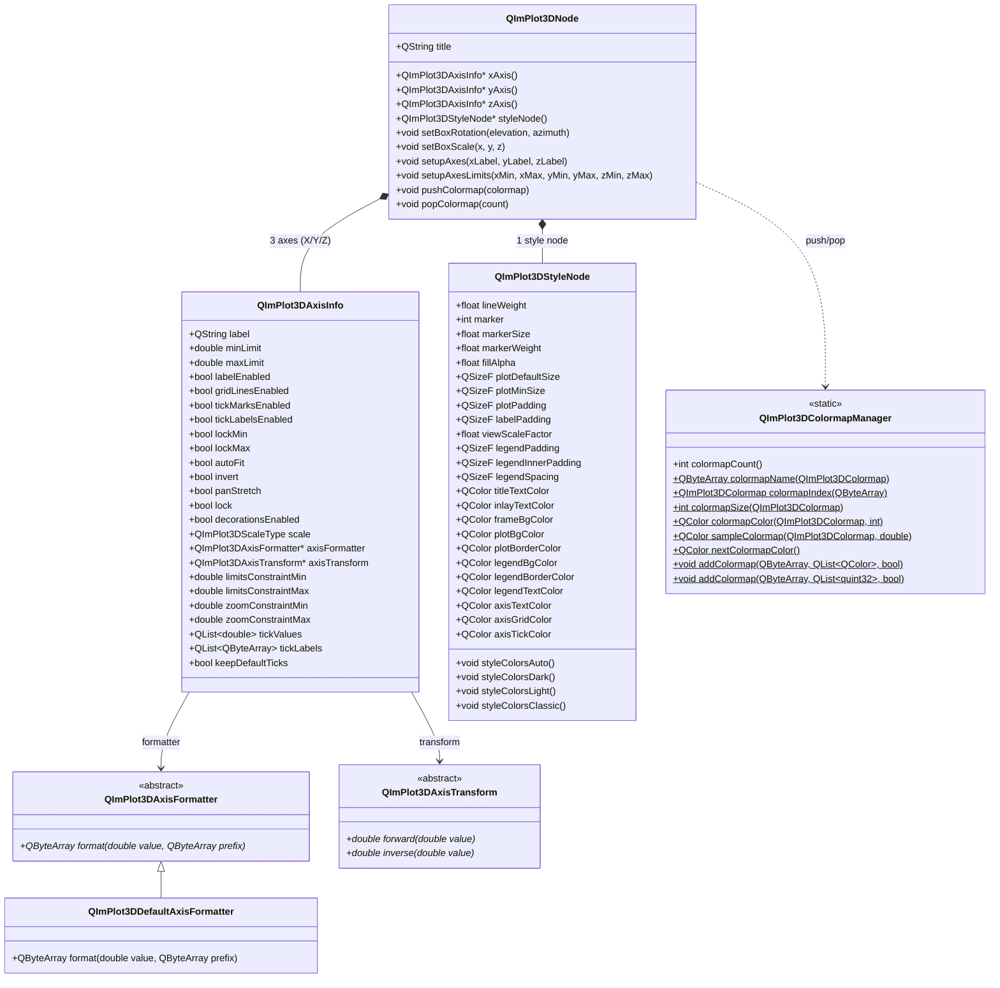

# 3D Configuration Guide (Axis + Style + Colormap)

QIm's 3D configuration system consists of three core components: `QImPlot3DAxisInfo` (axes), `QImPlot3DStyleNode` (styles), and `QImPlot3DColormapManager` (color mapping). Together they manage the appearance and behavior of 3D plots. Axes control X/Y/Z axis labels, ranges, and ticks; style nodes manage line weights, marker sizes, fill transparency, and all `QImPlot3DCol` color slots; the colormap system provides 16 built-in colormaps, push/pop stack-based switching, and custom registration capabilities.

## Key Features

**Features**

- ✅ **Three-Axis Configuration**: Independent X/Y/Z axis property system, supporting labels, ranges, ticks, flags, etc.
- ✅ **3D View Control**: Set 3D view via `setBoxRotation(elevation, azimuth)`, supporting quaternions and animation
- ✅ **Axis Scaling**: Independent scaling per axis direction via `setBoxScale(x, y, z)`
- ✅ **Custom Formatter**: Inherit `QImPlot3DAxisFormatter` to implement custom tick label formatting
- ✅ **Custom Axis Transform**: Inherit `QImPlot3DAxisTransform` to implement forward/inverse coordinate transforms
- ✅ **Style Variables**: 13 `QImPlot3DStyleVar` variables covering line weight, markers, fills, layout, etc.
- ✅ **Color Slots**: 15 `QImPlot3DCol` color properties covering plot area, legend, axes, and other visual elements
- ✅ **Theme Presets**: 4 built-in themes (Auto/Dark/Light/Classic), one-click switching
- ✅ **16 Built-in Colormaps**: Deep, Dark, Pastel, Viridis, Plasma, and other scientific visualization standard colormaps
- ✅ **Colormap Stack Management**: push/pop stack-based colormap switching, supporting different colormaps across multiple plots
- ✅ **Custom Colormap Registration**: Register custom colormaps via `addColormap()`
- ✅ **Colormap Sampling**: `sampleColormap()` for continuous colormap color sampling in the 0.0~1.0 range
- ✅ **Signal Notifications**: All configuration changes provide signal notifications for dynamic response

## Component Relationship Overview



Object tree structure:

```text
QImFigureWidget
└── QImSubplots3DNode
    └── QImPlot3DNode (3D plot area)
        ├── QImPlot3DAxisInfo (X axis)
        ├── QImPlot3DAxisInfo (Y axis)
        ├── QImPlot3DAxisInfo (Z axis)
        ├── QImPlot3DStyleNode (styles)
        ├── QImPlot3DLineItemNode / ScatterItemNode / SurfaceItemNode ... (plot elements)
```

## Axis Configuration (QImPlot3DAxisInfo)

`QImPlot3DAxisInfo` is QIm's Qt wrapper class for managing ImPlot3D axis configuration, providing type-safe property interfaces for configuring 3D axes without directly manipulating the underlying ImPlot3DAxisFlags bitmask.

!!! info "Relationship with 2D Axes"
    3D axes (`QImPlot3DAxisInfo`) share most property semantics with 2D axes (`QImPlotAxisInfo`) — labels, ranges, flags, scale types, etc. See the [2D Axis Configuration Guide](../plot2d/plot-axis.md) for details. This document **only supplements 3D-specific differences**; for common properties, refer to the 2D documentation.

### 3D Axis Key Differences

| Feature | 2D (QImPlotAxisInfo) | 3D (QImPlot3DAxisInfo) |
|------|----------------------|------------------------|
| Number of Axes | Up to 6 axes (X1/X2/X3, Y1/Y2/Y3) | Fixed 3 axes (X1/Y1/Z1) |
| Access | `plot->x1Axis()` / `y1Axis()` | `plot->xAxis()` / `yAxis()` / `zAxis()` |
| Enum Type | `QImPlotAxisId` → `ImAxis` | `QImPlot3DAxisId` → `ImAxis3D` |
| Scale Type | Linear/Time/Log10/SymLog | Linear/Log10/SymLog (**No Time**) |
| View Control | None | `setBoxRotation(elevation, azimuth)` |
| Axis Scaling | None | `setBoxScale(x, y, z)` |
| Condition Enum | `QImPlotCondition` | `QImPlot3DCondition` |
| Custom Formatter | None | `QImPlot3DAxisFormatter` |
| Custom Axis Transform | None | `QImPlot3DAxisTransform` |
| Flag Differences | Has `menusEnabled`, `highlightEnabled`, `sideSwitchEnabled`, etc. | Does not have these flags |
| Flag Differences | `noDecorations` | `decorationsEnabled` (affirmative semantics) |

### Accessing Axes

3D plot nodes provide 3 axis objects, accessed via the following methods:

```cpp
// Create 3D plot node
QIM::QImPlot3DNode* plot = figure->createPlot3DNode();

// Access the three axes
QIM::QImPlot3DAxisInfo* xAxis = plot->xAxis();   // X axis
QIM::QImPlot3DAxisInfo* yAxis = plot->yAxis();   // Y axis
QIM::QImPlot3DAxisInfo* zAxis = plot->zAxis();   // Z axis

// Can also access via axisId
QIM::QImPlot3DAxisInfo* axis = plot->axisInfo(QIM::QImPlot3DAxisId::X1);
```

Example from `examples/qimfigure-test/functions/3d/Plot3DSubplotsFunction.cpp`:

```cpp
// Set labels for all three axes
m_plot3DNode1->xAxis()->setLabel("X");
m_plot3DNode1->yAxis()->setLabel("Y");
m_plot3DNode1->zAxis()->setLabel("Z");
```

### Convenience Methods: setupAxes and setupAxesLimits

`QImPlot3DNode` provides two convenience methods to configure all three axes' labels and ranges at once:

```cpp
// Set all three axis labels and flags at once
plot->setupAxes("X axis", "Y axis", "Z axis");

// Set all three axis ranges at once
plot->setupAxesLimits(-3.0, 3.0, -3.0, 3.0, -1.0, 1.0,
                       QIM::QImPlot3DCondition::Once);
```

!!! tip "Convenience Methods vs Per-Axis Setting"
    `setupAxes()` and `setupAxesLimits()` are convenience wrappers that internally call each axis's `setLabel()` and `setLimits()`. If you need more detailed per-axis configuration (flags, formatters, etc.), use the per-axis setting approach.

### 3D View Control: setBoxRotation

A view control feature unique to 3D plots, specifying the observation angle in 3D space through elevation and azimuth.

```cpp
// Set isometric view (classic 3D view)
plot->setBoxRotation(35.264, 45.0);  // elevation: 35.264°, azimuth: 45°

// Set top view (looking straight down from above)
plot->setBoxRotation(90.0, 0.0);

// Set front view (looking straight from the front)
plot->setBoxRotation(0.0, 0.0);

// Set quaternion rotation (more precise 3D rotation control)
QQuaternion rotation = QQuaternion::fromEulerAngles(35.264f, 45.0f, 0.0f);
plot->setBoxRotation(rotation);

// Enable animated transition to new view
plot->setBoxRotation(35.264, 45.0, true);  // animate = true

// Set initial rotation angle (reverts to this view on right-click double-click reset)
plot->setBoxInitialRotation(35.264, 45.0);
```

Example from `examples/qimfigure-test/functions/3d/Plot3DSurfaceFunction.cpp`:

```cpp
// Set default isometric view for better 3D visualization
m_plot3DNode->setBoxRotation(35.264, 45.0);  // isometric view
```

!!! info "Elevation and Azimuth"
    - **Elevation**: Angle of upward rotation from horizontal plane; positive values tilt upward
    - **Azimuth**: Angle of horizontal rotation around the vertical axis; positive values rotate clockwise
    - **Default View**: ImPlot3D's default isometric view is elevation=35.264°, azimuth=45°

### 3D Axis Scaling: setBoxScale

Apply independent scaling transforms to X/Y/Z axis directions via `setBoxScale()`, for adjusting the visual proportions of each dimension in 3D space.

```cpp
// Uniform scaling (all axes proportional)
plot->setBoxScale(1.0, 1.0, 1.0);

// Stretch Z axis (make height direction more prominent)
plot->setBoxScale(1.0, 1.0, 2.0);

// Compress X axis (make width direction more compact)
plot->setBoxScale(0.5, 1.0, 1.0);
```

### Custom Axis Formatter (QImPlot3DAxisFormatter)

3D axes support custom tick label formatters, implemented by inheriting the `QImPlot3DAxisFormatter` abstract base class.

`QImPlot3DAxisFormatter` is a pure virtual interface (not QObject), requiring only the `format()` method to be implemented:

```cpp
// Custom temperature axis formatter: converts values to "xx°C" format
class TemperatureFormatter : public QIM::QImPlot3DAxisFormatter
{
public:
    QByteArray format(double value, const QByteArray& prefix) override
    {
        // Format numeric value in %g style, append temperature unit
        QByteArray numStr = QByteArray::number(value, 'f', 1);
        return prefix + numStr + "°C";
    }
};

// Apply custom formatter
auto* formatter = new TemperatureFormatter;  // Note: ensure lifetime management
plot->zAxis()->setAxisFormatter(formatter);
```

The built-in `QImPlot3DDefaultAxisFormatter` uses `%g` style (`QByteArray::number(value, 'g', 6)`) for standard numeric formatting.

!!! warning "Formatter Lifetime"
    The `QImPlot3DAxisFormatter` object must remain alive during plot rendering. If the formatter is deleted before rendering, undefined behavior will occur. It is recommended to manage the formatter as a child of the axis or use a long-lived smart pointer.

### Custom Axis Transform (QImPlot3DAxisTransform)

3D axes support custom scale transforms, implemented by inheriting `QImPlot3DAxisTransform` to implement forward (data→screen) and inverse (screen→data) bidirectional transforms.

`QImPlot3DAxisTransform` is a pure virtual interface (not QObject), requiring both `forward()` and `inverse()` methods to be implemented:

```cpp
// Custom square root transform: suitable for large data ranges with dense small values
class SquareRootTransform : public QIM::QImPlot3DAxisTransform
{
public:
    double forward(double value) override
    {
        // Data value → screen coordinate: take square root
        return (value >= 0) ? std::sqrt(value) : -std::sqrt(-value);
    }

    double inverse(double value) override
    {
        // Screen coordinate → data value: square
        return value * value;
    }
};

// Apply custom axis transform
auto* transform = new SquareRootTransform;  // Note: ensure lifetime management
plot->zAxis()->setAxisTransform(transform);
```

!!! warning "Transform Object Lifetime"
    The lifetime of `QImPlot3DAxisTransform` is managed externally — `QImPlot3DAxisInfo` does not own the transform object. Users must ensure the transform object remains alive during plot rendering.

### Axis Property Reference

The following is the complete Q_PROPERTY list for `QImPlot3DAxisInfo`. Properties shared with 2D axes have consistent semantics; only property definitions are listed here. See the [2D Axis Configuration Guide](../plot2d/plot-axis.md) for detailed descriptions.

**Basic Properties**

| Property | Type | Description |
|------|------|------|
| `label` | `QString` | Axis label text |
| `minLimit` | `double` | Minimum value of the axis visible range |
| `maxLimit` | `double` | Maximum value of the axis visible range |

**Flag Properties (Negation→Affirmative Semantics: NoXxx → xxxEnabled)**

| Property | Type | Corresponding ImPlot3D Flag | Description |
|------|------|---------------------|------|
| `labelEnabled` | `bool` | `ImPlot3DAxisFlags_NoLabel` | `true`=label visible |
| `gridLinesEnabled` | `bool` | `ImPlot3DAxisFlags_NoGridLines` | `true`=grid lines visible |
| `tickMarksEnabled` | `bool` | `ImPlot3DAxisFlags_NoTickMarks` | `true`=tick marks visible |
| `tickLabelsEnabled` | `bool` | `ImPlot3DAxisFlags_NoTickLabels` | `true`=tick labels visible |

**Flag Properties (Affirmative→Affirmative Semantics: Direct Mapping)**

| Property | Type | Corresponding ImPlot3D Flag | Description |
|------|------|---------------------|------|
| `lockMin` | `bool` | `ImPlot3DAxisFlags_LockMin` | Lock minimum value |
| `lockMax` | `bool` | `ImPlot3DAxisFlags_LockMax` | Lock maximum value |
| `autoFit` | `bool` | `ImPlot3DAxisFlags_AutoFit` | Auto-fit range |
| `invert` | `bool` | `ImPlot3DAxisFlags_Invert` | Invert axis direction |
| `panStretch` | `bool` | `ImPlot3DAxisFlags_PanStretch` | Pan stretch |

**Combined Flag Properties**

| Property | Type | Description |
|------|------|------|
| `lock` | `bool` | Lock both min and max values (`lockMin && lockMax`) |
| `decorationsEnabled` | `bool` | Whether to show all decorations (affirmative semantics for `NoDecorations`) |

**Scale Type**

| Property | Type | Description |
|------|------|------|
| `scale` | `QImPlot3DScaleType` | Scale type (Linear/Log10/SymLog) |

**Range Constraints**

| Property | Type | Description |
|------|------|------|
| `limitsConstraintMin` | `double` | Range minimum constraint value |
| `limitsConstraintMax` | `double` | Range maximum constraint value |
| `zoomConstraintMin` | `double` | Zoom minimum constraint value |
| `zoomConstraintMax` | `double` | Zoom maximum constraint value |

**Tick Configuration**

| Property | Type | Description |
|------|------|------|
| `tickValues` | `QList<double>` | Custom tick value list |
| `tickLabels` | `QList<QByteArray>` | Custom tick label list (UTF8) |
| `keepDefaultTicks` | `bool` | Whether to keep default ticks |

**Advanced Properties**

| Property | Type | Description |
|------|------|------|
| `axisFormatter` | `QImPlot3DAxisFormatter*` | Custom tick label formatter |
| `axisTransform` | `QImPlot3DAxisTransform*` | Custom axis transform (accessed via setter) |

### Axis Signals

| Signal | Parameters | Trigger |
|------|------|----------|
| `labelChanged(const QString& label)` | `QString` | When axis label text changes |
| `limitsChanged(double min, double max)` | `double, double` | When axis range limits change |
| `axisFlagChanged()` | None | When any axis flag property changes |
| `scaleChanged()` | None | When axis scale type changes |
| `limitsConstraintsChanged()` | None | When range constraints change |
| `zoomConstraintsChanged()` | None | When zoom constraints change |
| `axisTransformChanged(QImPlot3DAxisTransform* transform)` | Pointer | When custom axis transform changes |
| `axisFormatterChanged()` | None | When formatter changes |
| `tickConfigChanged()` | None | When tick configuration (values, labels, or keep default) changes |

### 3D Enum Types

#### QImPlot3DAxisId - Axis Identifier

| Enum Value | ImPlot3D Equivalent | Description |
|--------|-----------------|------|
| `X1` | `ImAxis3D_X` | X axis |
| `Y1` | `ImAxis3D_Y` | Y axis |
| `Z1` | `ImAxis3D_Z` | Z axis |
| `AxisCount` | `ImAxis3D_COUNT` | Total axis count (3) |

#### QImPlot3DScaleType - Scale Type

| Enum Value | ImPlot3D Equivalent | Description |
|--------|-----------------|------|
| `Linear` | `ImPlot3DScale_Linear` | Linear scale (default) |
| `Log10` | `ImPlot3DScale_Log10` | Base-10 logarithmic scale |
| `SymLog` | `ImPlot3DScale_SymLog` | Symmetric logarithmic scale |

!!! info "Difference from 2D Scale Type"
    3D scale types **do not include `Time`** (time scale) — this is a significant difference between ImPlot3D and ImPlot. Time axes are not applicable in 3D space.

#### QImPlot3DCondition - Condition Type

| Enum Value | ImPlot3D Equivalent | Description |
|--------|-----------------|------|
| `None` | `ImPlot3DCond_None` | Do not apply constraints |
| `Always` | `ImPlot3DCond_Always` | Apply constraints every frame |
| `Once` | `ImPlot3DCond_Once` | Apply constraints only on first frame (default) |

#### QImPlot3DMarkerShape - Marker Shape

| Enum Value | ImPlot3D Equivalent | Description |
|--------|-----------------|------|
| `None` | `ImPlot3DMarker_None` | No marker |
| `Circle` | `ImPlot3DMarker_Circle` | Circle |
| `Square` | `ImPlot3DMarker_Square` | Square |
| `Diamond` | `ImPlot3DMarker_Diamond` | Diamond |
| `Up` | `ImPlot3DMarker_Up` | Upward triangle |
| `Down` | `ImPlot3DMarker_Down` | Downward triangle |
| `Left` | `ImPlot3DMarker_Left` | Left triangle |
| `Right` | `ImPlot3DMarker_Right` | Right triangle |
| `Cross` | `ImPlot3DMarker_Cross` | Cross |
| `Plus` | `ImPlot3DMarker_Plus` | Plus |
| `Asterisk` | `ImPlot3DMarker_Asterisk` | Asterisk |

### Axis Usage Examples

Example from `examples/qimfigure-test/functions/3d/Plot3DSubplotsFunction.cpp`:

```cpp
// Create 3D plot node, configure axes
m_plot3DNode1 = figure->createPlot3DNode();
m_plot3DNode1->setTitle("3D Line");
m_plot3DNode1->xAxis()->setLabel("X");
m_plot3DNode1->yAxis()->setLabel("Y");
m_plot3DNode1->zAxis()->setLabel("Z");

// Hide axis decorations (for special scenarios like legend display)
m_plot3DNode4->xAxis()->setDecorationsEnabled(false);
m_plot3DNode4->yAxis()->setDecorationsEnabled(false);
m_plot3DNode4->zAxis()->setDecorationsEnabled(false);
```

Example from `examples/qimfigure-test/functions/3d/Plot3DSurfaceFunction.cpp`:

```cpp
// Create surface plot and set isometric view
m_plot3DNode = figure->createPlot3DNode();
m_plot3DNode->xAxis()->setLabel(m_xLabel);
m_plot3DNode->yAxis()->setLabel(m_yLabel);
m_plot3DNode->zAxis()->setLabel(m_zLabel);
m_plot3DNode->setBoxRotation(35.264, 45.0);  // set isometric view
```

## Style Configuration (QImPlot3DStyleNode)

`QImPlot3DStyleNode` is a persistent style node for 3D plots, providing Q_PROPERTY-based style management. It manages all `ImPlot3DStyle` fields and `ImPlot3DCol` color values, exposed as Qt properties. Each `QImPlot3DNode` owns a `QImPlot3DStyleNode` (created as a child node), accessible via `plot->styleNode()`.

The style node is applied as a one-time `GetStyle()` assignment in `QImPlot3DNode::beginDraw()` before child element rendering, without exposing Push/Pop APIs to users.

### Accessing the Style Node

```cpp
// Get the style node of the 3D plot
QIM::QImPlot3DStyleNode* style = plot->styleNode();

// Modify style variables
style->setLineWeight(2.0f);    // set line weight to 2px
style->setMarkerSize(6.0f);    // set marker size to 6px
style->setFillAlpha(0.5f);     // set fill transparency to 50%

// Modify colors
style->setPlotBgColor(QColor(30, 30, 30));   // dark plot background
style->setAxisGridColor(QColor(80, 80, 80));  // grid line color
```

### Style Variables (QImPlot3DStyleVar)

The following are all `QImPlot3DStyleVar` enum values and their corresponding Q_PROPERTY entries:

| Enum Value | ImPlot3D Equivalent | Q_PROPERTY | Type | Description |
|--------|-----------------|------------|------|------|
| `LineWeight` | `ImPlot3DStyleVar_LineWeight` | `lineWeight` | `float` | Line weight (pixels) |
| `Marker` | `ImPlot3DStyleVar_Marker` | `marker` | `int` | Marker shape (`QImPlot3DMarkerShape` value) |
| `MarkerSize` | `ImPlot3DStyleVar_MarkerSize` | `markerSize` | `float` | Marker size (pixels) |
| `MarkerWeight` | `ImPlot3DStyleVar_MarkerWeight` | `markerWeight` | `float` | Marker outline weight (pixels) |
| `FillAlpha` | `ImPlot3DStyleVar_FillAlpha` | `fillAlpha` | `float` | Fill transparency |
| `PlotDefaultSize` | `ImPlot3DStyleVar_PlotDefaultSize` | `plotDefaultSize` | `QSizeF` | Default plot size |
| `PlotMinSize` | `ImPlot3DStyleVar_PlotMinSize` | `plotMinSize` | `QSizeF` | Minimum plot size |
| `PlotPadding` | `ImPlot3DStyleVar_PlotPadding` | `plotPadding` | `QSizeF` | Plot padding |
| `LabelPadding` | `ImPlot3DStyleVar_LabelPadding` | `labelPadding` | `QSizeF` | Label padding |
| `ViewScaleFactor` | `ImPlot3DStyleVar_ViewScaleFactor` | `viewScaleFactor` | `float` | 3D view scale factor |
| `LegendPadding` | `ImPlot3DStyleVar_LegendPadding` | `legendPadding` | `QSizeF` | Legend margin from plot edge |
| `LegendInnerPadding` | `ImPlot3DStyleVar_LegendInnerPadding` | `legendInnerPadding` | `QSizeF` | Legend inner padding |
| `LegendSpacing` | `ImPlot3DStyleVar_LegendSpacing` | `legendSpacing` | `QSizeF` | Legend entry spacing |

!!! info "3D-Unique Style Variables"
    `ViewScaleFactor` is a style variable unique to 3D plots, used to control the 3D view scale factor; this property does not exist in 2D plots.

### Color Slots (QImPlot3DCol)

The following are all `QImPlot3DCol` enum values and their corresponding Q_PROPERTY entries:

| Enum Value | ImPlot3D Equivalent | Q_PROPERTY | Description |
|--------|-----------------|------------|------|
| `Line` | `ImPlot3DCol_Line` | — | Line color (set directly by plot elements) |
| `Fill` | `ImPlot3DCol_Fill` | — | Fill color (set directly by plot elements) |
| `MarkerOutline` | `ImPlot3DCol_MarkerOutline` | — | Marker outline color (set directly by plot elements) |
| `MarkerFill` | `ImPlot3DCol_MarkerFill` | — | Marker fill color (set directly by plot elements) |
| `TitleText` | `ImPlot3DCol_TitleText` | `titleTextColor` | Title text color |
| `InlayText` | `ImPlot3DCol_InlayText` | `inlayTextColor` | Inlay text color |
| `FrameBg` | `ImPlot3DCol_FrameBg` | `frameBgColor` | Frame background color |
| `PlotBg` | `ImPlot3DCol_PlotBg` | `plotBgColor` | Plot area background color |
| `PlotBorder` | `ImPlot3DCol_PlotBorder` | `plotBorderColor` | Plot area border color |
| `LegendBg` | `ImPlot3DCol_LegendBg` | `legendBgColor` | Legend background color |
| `LegendBorder` | `ImPlot3DCol_LegendBorder` | `legendBorderColor` | Legend border color |
| `LegendText` | `ImPlot3DCol_LegendText` | `legendTextColor` | Legend text color |
| `AxisText` | `ImPlot3DCol_AxisText` | `axisTextColor` | Axis text color |
| `AxisGrid` | `ImPlot3DCol_AxisGrid` | `axisGridColor` | Axis grid color |
| `AxisTick` | `ImPlot3DCol_AxisTick` | `axisTickColor` | Axis tick color |
| `COUNT` | `ImPlot3DCol_COUNT` | — | Total color slots (15) |

!!! info "Element Colors vs Style Colors"
    The 4 color slots `Line`, `Fill`, `MarkerOutline`, `MarkerFill` are set directly by specific plot elements (e.g., `QImPlot3DLineItemNode::setColor()`) and are not exposed in `QImPlot3DStyleNode`'s Q_PROPERTY. The remaining 11 color slots are exposed as style properties, controlling the overall appearance of the plot area.

### Style Node Property Reference

**Style Variable Properties**

| Property | Type | Description |
|------|------|------|
| `lineWeight` | `float` | Line weight (pixels), default ~1px |
| `marker` | `int` | Marker shape (`QImPlot3DMarkerShape` enum value) |
| `markerSize` | `float` | Marker size (pixels) |
| `markerWeight` | `float` | Marker outline weight (pixels) |
| `fillAlpha` | `float` | Fill transparency, range 0.0~1.0 |
| `plotDefaultSize` | `QSizeF` | Default plot size |
| `plotMinSize` | `QSizeF` | Minimum plot size |
| `plotPadding` | `QSizeF` | Plot padding |
| `labelPadding` | `QSizeF` | Label padding |
| `viewScaleFactor` | `float` | 3D view scale factor |
| `legendPadding` | `QSizeF` | Legend margin from plot edge |
| `legendInnerPadding` | `QSizeF` | Legend inner padding |
| `legendSpacing` | `QSizeF` | Legend entry spacing |

**Plot Area Colors**

| Property | Type | Description |
|------|------|------|
| `titleTextColor` | `QColor` | Title text color |
| `inlayTextColor` | `QColor` | Inlay text color |
| `frameBgColor` | `QColor` | Frame background color |
| `plotBgColor` | `QColor` | Plot area background color |
| `plotBorderColor` | `QColor` | Plot area border color |

**Legend Colors**

| Property | Type | Description |
|------|------|------|
| `legendBgColor` | `QColor` | Legend background color |
| `legendBorderColor` | `QColor` | Legend border color |
| `legendTextColor` | `QColor` | Legend text color |

**Axis Colors**

| Property | Type | Description |
|------|------|------|
| `axisTextColor` | `QColor` | Axis text color |
| `axisGridColor` | `QColor` | Axis grid color |
| `axisTickColor` | `QColor` | Axis tick color |

### Theme Presets

`QImPlot3DStyleNode` provides 4 built-in theme preset methods for one-click overall appearance switching:

```cpp
// Apply Auto theme (colors derived from current ImGui style)
plot->styleNode()->styleColorsAuto();

// Apply Dark theme (dark background)
plot->styleNode()->styleColorsDark();

// Apply Light theme (light background)
plot->styleNode()->styleColorsLight();

// Apply Classic theme (classic styling)
plot->styleNode()->styleColorsClassic();
```

!!! tip "Theme Usage Recommendations"
    Theme preset methods overwrite all color properties. If you need to fine-tune individual colors on top of a preset theme, call the preset method first, then individually modify specific color properties:

    ```cpp
    // Set Dark theme first, then fine-tune grid line color
    plot->styleNode()->styleColorsDark();
    plot->styleNode()->setAxisGridColor(QColor(100, 100, 100));  // light gray grid
    ```

### Style Node Signals

| Signal | Parameters | Trigger |
|------|------|----------|
| `styleChanged()` | None | When any style property (variable or color) changes |

!!! info "Signal Aggregation"
    `styleChanged()` is an aggregated signal and does not distinguish which specific style property changed. All style variable and color property changes trigger this signal. To determine the specific changed property, query relevant property values in the signal slot.

## Colormap

The 3D plotting colormap system consists of two parts: `QImPlot3DColormapManager` (static utility class) and `QImPlot3DNode` (push/pop stack operations). Colormaps are primarily used by Surface and similar plot elements to map colors based on Z values (or other data dimensions).

### Built-in Colormaps (QImPlot3DColormap)

QIm provides 16 built-in colormaps covering common scientific visualization schemes:

| Enum Value | ImPlot3D Equivalent | Description |
|--------|-----------------|------|
| `Deep` | `ImPlot3DColormap_Deep` | Deep gradient (default colormap) |
| `Dark` | `ImPlot3DColormap_Dark` | Dark gradient |
| `Pastel` | `ImPlot3DColormap_Pastel` | Soft gradient |
| `Paired` | `ImPlot3DColormap_Paired` | Paired colors (qualitative colormap) |
| `Viridis` | `ImPlot3DColormap_Viridis` | Viridis gradient (perceptually uniform, recommended for scientific visualization) |
| `Plasma` | `ImPlot3DColormap_Plasma` | Plasma gradient (perceptually uniform) |
| `Hot` | `ImPlot3DColormap_Hot` | Heatmap gradient (black→red→yellow→white) |
| `Cool` | `ImPlot3DColormap_Cool` | Cool color gradient |
| `Pink` | `ImPlot3DColormap_Pink` | Pink gradient |
| `Jet` | `ImPlot3DColormap_Jet` | Jet gradient (classic rainbow colormap) |
| `Twilight` | `ImPlot3DColormap_Twilight` | Twilight gradient (cyclic colormap) |
| `RdBu` | `ImPlot3DColormap_RdBu` | Red-blue bidirectional gradient (diverging colormap) |
| `BrBG` | `ImPlot3DColormap_BrBG` | Brown-blue-green bidirectional gradient (diverging colormap) |
| `PiYG` | `ImPlot3DColormap_PiYG` | Pink-yellow-green bidirectional gradient (diverging colormap) |
| `Spectral` | `ImPlot3DColormap_Spectral` | Spectral gradient (diverging colormap) |
| `Greys` | `ImPlot3DColormap_Greys` | Grayscale gradient |

### Colormap Stack Management: push/pop

3D plot nodes provide push/pop stack-based colormap switching. Push pushes a colormap onto the top of the stack, Pop pops colormaps from the stack. Stack operations are automatically mapped to ImPlot3D's `PushColormap/PopColormap` in `beginDraw()/endDraw()`.

```cpp
// Push Viridis colormap onto stack (current plot uses Viridis)
plot->pushColormap(QIM::QImPlot3DColormap::Viridis);

// Can also push colormap by name
plot->pushColormap("Viridis");

// Draw surface using Viridis colormap
// ...

// Pop 1 colormap (restore previous colormap)
plot->popColormap(1);

// Pop multiple colormaps (batch restore)
plot->popColormap(3);
```

!!! info "Typical push/pop Scenarios"
    The push/pop stack mechanism is primarily used in **multiple plots sharing the same ImPlot3D context** scenarios. When you need to alternate between different colormaps within the same plot area, push/pop switches colormaps without affecting colormap settings of other plot elements. For single plot elements (e.g., Surface), setting colormap directly via `setColormap()` is usually preferred over push/pop.

### Colormap Manager (QImPlot3DColormapManager)

`QImPlot3DColormapManager` is a pure static utility class (not QObject), providing colormap query and registration functionality.

#### Query Methods

```cpp
// Get available colormap count
int count = QIM::QImPlot3DColormapManager::colormapCount();

// Get colormap name
QByteArray name = QIM::QImPlot3DColormapManager::colormapName(
    QIM::QImPlot3DColormap::Viridis);  // returns "Viridis"

// Find colormap enum value by name
QIM::QImPlot3DColormap cmap = QIM::QImPlot3DColormapManager::colormapIndex(
    QByteArray("Viridis"));  // returns QImPlot3DColormap::Viridis

// Get number of colors in a colormap
int size = QIM::QImPlot3DColormapManager::colormapSize(
    QIM::QImPlot3DColormap::Viridis);  // returns number of colors in colormap

// Get color at specified index in colormap
QColor color = QIM::QImPlot3DColormapManager::colormapColor(
    QIM::QImPlot3DColormap::Viridis, 0);  // get Viridis's first color

// Sample colormap in 0.0~1.0 range
QColor sampled = QIM::QImPlot3DColormapManager::sampleColormap(
    QIM::QImPlot3DColormap::Viridis, 0.5);  // Viridis's middle color
```

#### Auto Colormap Color

```cpp
// Get next auto-assigned colormap color (for multi-series plot auto-coloring)
QColor autoColor = QIM::QImPlot3DColormapManager::nextColormapColor();
```

#### Custom Colormap Registration

```cpp
// Register custom colormap via QColor list
QList<QColor> colors = {
    QColor(0, 0, 0),      // Black
    QColor(255, 0, 0),    // Red
    QColor(255, 255, 0),  // Yellow
    QColor(255, 255, 255) // White
};
QIM::QImPlot3DColormapManager::addColormap(
    QByteArray("CustomHeat"), colors, false);  // qualitative = false means continuous colormap

// Register custom colormap via quint32 list (RGBA packed format)
QList<quint32> packedColors = {0xFF000000, 0xFFFF0000, 0xFFFF00FF, 0xFFFFFFFF};
QIM::QImPlot3DColormapManager::addColormap(
    QByteArray("CustomPacked"), packedColors, false);
```

!!! info "Qualitative vs Continuous Colormaps"
    The `qualitative` parameter of `addColormap()` controls the colormap type:
    - `qualitative = false` (default): **Continuous colormap**, suitable for numeric gradient mapping (e.g., Surface Z values)
    - `qualitative = true`: **Qualitative colormap**, suitable for discrete category differentiation (e.g., multi-series auto-coloring)

### Colormap Usage in Surface

Example from `examples/qimfigure-test/functions/3d/Plot3DSurfaceFunction.cpp`:

```cpp
// Create surface plot, enable colormap
m_surface3DNode = new QIM::QImPlot3DSurfaceItemNode(m_plot3DNode);
m_surface3DNode->setData(xs, ys, zs, rows, cols);
m_surface3DNode->setColormapEnabled(true);  // enable colormap
if (m_colormapEnabled) {
    m_surface3DNode->setColormap(ImPlot3DColormap_Viridis);  // use Viridis colormap
}
```

!!! warning "Colormap Enum Namespace"
    When setting colormaps on plot elements like Surface, you can directly use ImPlot3D native enum values (e.g., `ImPlot3DColormap_Viridis`) or QIm wrapper enum values (e.g., `QIM::QImPlot3DColormap::Viridis`). Both correspond to the same underlying value.

### Colormap Manager Complete Method List

| Method | Return Type | Description |
|------|----------|------|
| `colormapCount()` | `int` | Returns total available colormap count (includes built-in and custom) |
| `colormapName(QImPlot3DColormap)` | `QByteArray` | Returns the name of the specified colormap |
| `colormapIndex(const QByteArray&)` | `QImPlot3DColormap` | Find colormap enum value by name |
| `colormapSize(QImPlot3DColormap)` | `int` | Returns the number of colors in the specified colormap |
| `colormapColor(QImPlot3DColormap, int)` | `QColor` | Returns the color at the specified index in the colormap |
| `sampleColormap(QImPlot3DColormap, double)` | `QColor` | Sample colormap color in 0.0~1.0 range |
| `nextColormapColor()` | `QColor` | Returns the next auto-coloring color |
| `addColormap(const QByteArray&, const QList<QColor>&, bool)` | `void` | Register QColor list colormap |
| `addColormap(const QByteArray&, const QList<quint32>&, bool)` | `void` | Register quint32 list colormap |

## Comprehensive Configuration Example

The following example demonstrates comprehensive axis, style, and colormap configuration:

```cpp
#include "QImFigureWidget.h"
#include "plot3d/QImPlot3DNode.h"
#include "plot3d/QImPlot3DAxisInfo.h"
#include "plot3d/QImPlot3DSurfaceItemNode.h"
#include "plot3d/QImPlot3DColormapManager.h"

// Create plot window
QIM::QImFigureWidget* figure = new QIM::QImFigureWidget(this);

// Create 3D plot node
QIM::QImPlot3DNode* plot = figure->createPlot3DNode();

// === Axis Configuration ===
plot->xAxis()->setLabel("Longitude (°)");
plot->yAxis()->setLabel("Latitude (°)");
plot->zAxis()->setLabel("Elevation (m)");
plot->xAxis()->setLimits(-180.0, 180.0, QIM::QImPlot3DCondition::Always);
plot->yAxis()->setLimits(-90.0, 90.0, QIM::QImPlot3DCondition::Always);
plot->xAxis()->setGridLinesEnabled(true);
plot->yAxis()->setGridLinesEnabled(true);
plot->zAxis()->setGridLinesEnabled(true);

// === 3D View Control ===
plot->setBoxRotation(30.0, 45.0);  // custom view
plot->setBoxScale(1.0, 1.0, 1.5);  // Z axis stretched 1.5×

// === Style Configuration ===
QIM::QImPlot3DStyleNode* style = plot->styleNode();
style->styleColorsDark();                      // apply dark theme
style->setLineWeight(1.5f);                    // line weight
style->setMarkerSize(4.0f);                    // marker size
style->setFillAlpha(0.7f);                     // fill transparency
style->setPlotBgColor(QColor(20, 20, 30));     // custom plot background
style->setAxisGridColor(QColor(60, 60, 80));   // custom grid color

// === Colormap Configuration ===
plot->pushColormap(QIM::QImPlot3DColormap::Viridis);  // push Viridis colormap

// Query colormap info
int cmapSize = QIM::QImPlot3DColormapManager::colormapSize(
    QIM::QImPlot3DColormap::Viridis);
QColor midColor = QIM::QImPlot3DColormapManager::sampleColormap(
    QIM::QImPlot3DColormap::Viridis, 0.5);

// Create surface plot (using current colormap)
auto* surface = new QIM::QImPlot3DSurfaceItemNode(plot);
surface->setData(xs, ys, zs, rows, cols);
surface->setColormapEnabled(true);
surface->setColormap(ImPlot3DColormap_Viridis);

plot->popColormap(1);  // restore previous colormap
```

!!! warning "Comprehensive Notes"
    - **Property changes take effect with delay**: All property changes are only stored locally; actual plot appearance updates take effect when the configuration is applied to the ImPlot3D context during re-rendering.
    - **Range validation**: `setLimits()` does not validate `min < max`; invalid ranges may cause rendering issues.
    - **Log scale limitations**: When switching to `Log10` scale, data must contain positive values.
    - **Formatter/transform lifetime**: Custom formatter and transform objects must remain alive during rendering, otherwise undefined behavior occurs.
    - **push/pop pairing**: Ensure `pushColormap()` and `popColormap()` are used in pairs; stack imbalance may cause rendering anomalies.
    - **3D view parameters**: `setBoxRotation()` elevation and azimuth units are degrees (°), not radians.

## References

- 2D Axis Configuration: [QImPlotAxisInfo Axis Configuration Guide](../plot2d/plot-axis.md)
- 3D Plotting Overview: [3D Plot Module](index.md)
- Render Node Concepts: [Render Nodes](../render-node.md)
- Example Code: `examples/qimfigure-test/functions/3d/Plot3DSurfaceFunction.cpp`, `examples/qimfigure-test/functions/3d/Plot3DSubplotsFunction.cpp`
- API Reference: `src/core/plot3d/QImPlot3DAxisInfo.h`, `src/core/plot3d/QImPlot3DStyleNode.h`, `src/core/plot3d/QImPlot3DColormapManager.h`, `src/core/plot3d/QImPlot3DNode.h`
- ImPlot3D Official Docs: <https://github.com/epezent/implot3d>