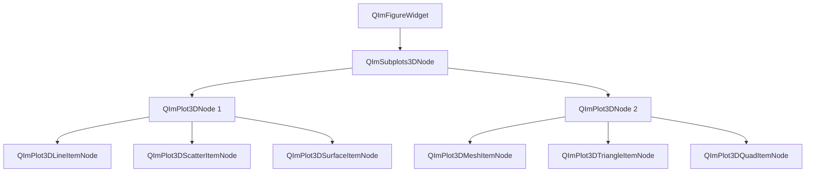
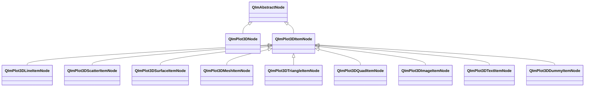

# 3D Plot Module

QIm's 3D plot module is based on `ImPlot3D` encapsulation, providing complete 3D data visualization capabilities including 3D line plots, scatter plots, surface plots, mesh plots, and other common 3D chart types. All 3D plot components are presented as Qt node objects, supporting signal/slot interaction and property system configuration, enabling Qt developers to build high-performance 3D visualization applications using familiar programming paradigms.

## Key Features

**Features**

- ✅ **Figure Widget Integration**: 3D plots can be directly embedded in `QImFigureWidget`, sharing the same window with 2D plots
- ✅ **3D Line Plot**: Supports curve drawing in 3D space with customizable line width, color, and style
- ✅ **3D Scatter Plot**: Supports 3D scatter data visualization with configurable marker size, fill color, and outline color
- ✅ **3D Surface Plot**: Supports surface data visualization with built-in colormap support, switchable fill/wireframe modes
- ✅ **3D Mesh Plot**: Supports triangle and quad mesh rendering, with built-in Cube, Sphere, Duck preset models
- ✅ **3D Annotations**: Supports 3D image textures (Image), 3D text labels (Text), and legend dummy entries (Dummy)
- ✅ **3D Axis Configuration**: Independent X/Y/Z axis property system with label, range, tick, custom formatter, and axis transform support
- ✅ **Interactive Operations**: Supports mouse rotation, panning, zoom, and other 3D interactions
- ✅ **Color Mapping**: Multiple built-in colormap schemes with customizable colormap stack

## Module Architecture

The 3D plot module's object tree structure is as follows:



The 3D plot module's class inheritance is as follows:



## Documentation Navigation

| Document | Description |
|------|------|
| [Basic Charts](basic-charts.md) | 3D line and scatter plot usage |
| [Surface Charts](surface-charts.md) | 3D surface, triangle, and quad plot configuration |
| [Mesh Charts](mesh.md) | 3D mesh plot usage and preset models |
| [Annotation Elements](annotations.md) | 3D image, text, and dummy annotation elements |
| [Configuration Guide](configuration.md) | 3D axis configuration, style settings, and colormap system |

## Quick Example

The following example creates a `2×2` 3D figure window with 3D line, scatter, surface, and wireframe plots:

```cpp
#include "QImFigureWidget.h"
#include "plot3d/QImPlot3DLineItemNode.h"
#include "plot3d/QImPlot3DNode.h"
#include "plot3d/QImPlot3DScatterItemNode.h"
#include "plot3d/QImPlot3DSurfaceItemNode.h"

#include "implot3d.h"

#include <QApplication>
#include <QMainWindow>
#include <cmath>
#include <vector>

int main(int argc, char* argv[])
{
    QApplication app(argc, argv);

    QMainWindow window;
    window.setWindowTitle("3D Plot Example");

    QIM::QImFigureWidget* figure3D = new QIM::QImFigureWidget(&window);
    figure3D->setSubplot3DGrid(2, 2);
    figure3D->setRenderMode(QIM::QImWidget::RenderOnDemand);
    window.setCentralWidget(figure3D);

    // Subplot 1 - 3D Line (Helix)
    if (QIM::QImPlot3DNode* plot = figure3D->createPlot3DNode()) {
        plot->setTitle("3D Line");
        std::vector<double> xs, ys, zs;
        for (int i = 0; i < 200; ++i) {
            double t = i * 0.05;
            xs.push_back(std::cos(t));
            ys.push_back(std::sin(t));
            zs.push_back(t * 0.1);
        }
        auto* line = new QIM::QImPlot3DLineItemNode(plot);
        line->setLabel("helix");
        line->setData(xs, ys, zs);
        line->setColor(QColor(0, 114, 189));
        line->setLineWeight(2.0f);
    }

    // Subplot 2 - 3D Scatter
    if (QIM::QImPlot3DNode* plot = figure3D->createPlot3DNode()) {
        plot->setTitle("3D Scatter");
        std::vector<double> xs, ys, zs;
        for (int i = 0; i < 200; ++i) {
            double t = i * 0.05;
            xs.push_back(std::cos(t) * 0.8);
            ys.push_back(std::sin(t) * 0.8);
            zs.push_back(std::sin(t * 0.5));
        }
        auto* scatter = new QIM::QImPlot3DScatterItemNode(plot);
        scatter->setLabel("samples");
        scatter->setData(xs, ys, zs);
        scatter->setMarkerSize(4.0f);
        scatter->setMarkerFillColor(QColor(217, 83, 25));
    }

    // Subplot 3 - 3D Surface (Fill Mode)
    if (QIM::QImPlot3DNode* plot = figure3D->createPlot3DNode()) {
        plot->setTitle("3D Surface");
        constexpr int rows = 40;
        constexpr int cols = 40;
        std::vector<double> xs(rows * cols);
        std::vector<double> ys(rows * cols);
        std::vector<double> zs(rows * cols);
        for (int r = 0; r < rows; ++r) {
            for (int c = 0; c < cols; ++c) {
                int index = r * cols + c;
                double x = -3.0 + 6.0 * c / (cols - 1);
                double y = -3.0 + 6.0 * r / (rows - 1);
                xs[index] = x;
                ys[index] = y;
                zs[index] = std::sin(x) * std::cos(y);
            }
        }
        auto* surface = new QIM::QImPlot3DSurfaceItemNode(plot);
        surface->setLabel("surface");
        surface->setData(xs, ys, zs, rows, cols);
        surface->setColormapEnabled(true);
        surface->setColormap(ImPlot3DColormap_Viridis);
    }

    // Subplot 4 - 3D Surface (Wireframe Mode)
    if (QIM::QImPlot3DNode* plot = figure3D->createPlot3DNode()) {
        plot->setTitle("3D Wireframe");
        constexpr int rows = 40;
        constexpr int cols = 40;
        std::vector<double> xs(rows * cols);
        std::vector<double> ys(rows * cols);
        std::vector<double> zs(rows * cols);
        for (int r = 0; r < rows; ++r) {
            for (int c = 0; c < cols; ++c) {
                int index = r * cols + c;
                double x = -3.0 + 6.0 * c / (cols - 1);
                double y = -3.0 + 6.0 * r / (rows - 1);
                xs[index] = x;
                ys[index] = y;
                zs[index] = std::sin(x) * std::cos(y);
            }
        }
        auto* wireframe = new QIM::QImPlot3DSurfaceItemNode(plot);
        wireframe->setLabel("wireframe");
        wireframe->setData(xs, ys, zs, rows, cols);
        wireframe->setColormapEnabled(true);
        wireframe->setColormap(ImPlot3DColormap_Viridis);
        wireframe->setFillVisible(false);
        wireframe->setMarkersVisible(false);
        wireframe->setLineWidth(1.2f);
    }

    window.resize(1280, 900);
    window.show();
    return app.exec();
}
```

## Interaction

The 3D plot module's interaction follows ImPlot3D's native behavior:

- **Left-click drag**: Pan view
- **Right-click drag**: Rotate view
- **Scroll wheel or middle-click drag**: Zoom view
- **Right-click double-click**: Reset rotation to initial state
- **Ctrl + Scroll wheel**: Zoom along Z-axis
- **Shift + Right-click drag**: Pan along screen plane

These interactions can be controlled via `QImPlot3DNode` properties:
- `rotateEnabled`: Enable/disable rotation interaction
- `panEnabled`: Enable/disable pan interaction  
- `zoomEnabled`: Enable/disable zoom interaction

## References

- Core Concepts: [Render Node](../render-node.md), [Object Tree](../object-tree.md)
- 2D Plot Module: [2D Plot Overview](../plot2d/index.md)
- Example Code: `examples/readme-3d-example`, `examples/qimfigure-mixed-test`
- ImPlot3D Official Documentation: <https://github.com/epezent/implot3d>