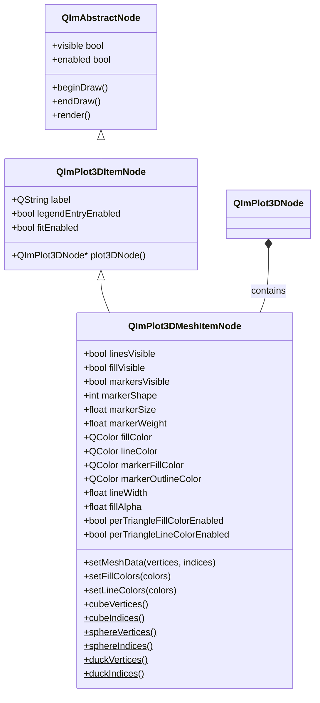
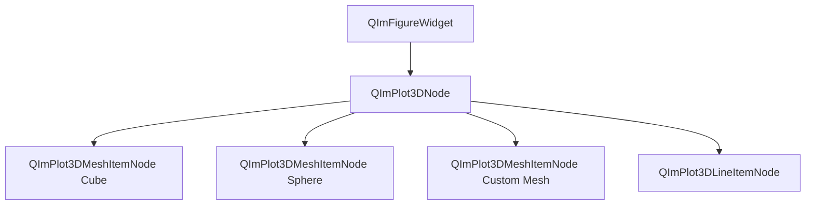

# 3D Mesh Usage Guide

`QImPlot3DMeshItemNode` is the most flexible drawing element in QIm's 3D plotting module, rendering 3D meshes from vertices and triangle face indices. It supports free-form modeling with custom vertex/index data, built-in preset model quick-creation methods for cube, sphere, and duck, and provides per-triangle coloring for fine-grained color control.

## Key Features

**Features**

- ✅ **Custom Mesh Data**: Pass arbitrary vertices and triangle face indices via `setMeshData(vertices, indices)` to render free-form 3D meshes
- ✅ **Preset Shape Quick Creation**: `QImPlot3DNode` provides `addCube()`, `addSphere()`, `addDuck()` convenience methods for creating common 3D models in a single line
- ✅ **Static Preset Data Access**: Access preset vertex data via `cubeVertices()/cubeIndices()`, `sphereVertices()/sphereIndices()`, `duckVertices()/duckIndices()` for custom mesh deformation
- ✅ **Independent Visibility for Three Elements**: Lines (`linesVisible`), fills (`fillVisible`), and markers (`markersVisible`) each have independent visibility controls
- ✅ **Per-Triangle Colors**: `perTriangleFillColorEnabled` and `perTriangleLineColorEnabled` support specifying individual fill and line colors for each triangle face
- ✅ **Custom Color Lists**: `setFillColors()` and `setLineColors()` accept `QList<QColor>` to set different colors for each triangle face
- ✅ **Marker Style Configuration**: Supports marker shape (`markerShape`), size (`markerSize`), outline weight (`markerWeight`), and other properties
- ✅ **Colors & Transparency**: Independent fill color, line color, marker fill color, marker outline color, plus fill transparency (`fillAlpha`) property

## Basic Concepts

### Component Positioning

`QImPlot3DMeshItemNode` exists as a child of `QImPlot3DNode` in the QIm object tree. Each Mesh node represents a 3D mesh graphic element, defined by a vertex list and a triangle face index list for geometry. Mesh nodes must be created with `QImPlot3DNode` as the parent, thereby automatically joining the 3D plotting render pipeline.

Mesh is the most unique element type in the 3D plotting module — other 3D elements (Line, Scatter, Surface) have fixed data formats, while Mesh allows users full control over geometric topology.

### Class Inheritance



### Object Tree Structure

The typical position of Mesh nodes in the object tree is as follows:



Expressed as text, the object tree structure is:

```text
QImFigureWidget (root node)
└── QImPlot3DNode (3D plot area)
    ├── QImPlot3DMeshItemNode (cube mesh)
    ├── QImPlot3DMeshItemNode (sphere mesh)
    ├── QImPlot3DMeshItemNode (custom mesh)
    └── QImPlot3DLineItemNode (curve)
```

## Usage

Examples for this component are in: `examples/qimfigure-test/functions/3d/Plot3DMeshFunction.cpp`

### 1. Basic Usage: Custom Mesh Data

Pass vertex coordinates and triangle face indices via the `setMeshData()` method to render 3D meshes of any shape. Vertices use the `QImPlot3DPoint` struct to represent 3D coordinate points, and indices are a list of triangle face vertex indices.

```cpp
#include "QImFigureWidget.h"
#include "plot3d/QImPlot3DNode.h"
#include "plot3d/QImPlot3DMeshItemNode.h"
#include "plot3d/QImPlot3DTypes.h"

// Create figure and 3D plot node
QIM::QImFigureWidget* figure = new QIM::QImFigureWidget(this);
figure->setSubplot3DGrid(1, 1);

QIM::QImPlot3DNode* plot3D = figure->createPlot3DNode();  // plot3D automatically becomes a child of figure
plot3D->setTitle("Custom Mesh");
plot3D->setBoxRotation(35.264, 45.0);  // set isometric view

// Define cube vertices: 8 corner points
std::vector<QIM::QImPlot3DPoint> vertices;
vertices.reserve(8);
vertices.emplace_back(-1.0, -1.0, -1.0);  // v0
vertices.emplace_back(1.0, -1.0, -1.0);   // v1
vertices.emplace_back(1.0, 1.0, -1.0);    // v2
vertices.emplace_back(-1.0, 1.0, -1.0);   // v3
vertices.emplace_back(-1.0, -1.0, 1.0);   // v4
vertices.emplace_back(1.0, -1.0, 1.0);    // v5
vertices.emplace_back(1.0, 1.0, 1.0);     // v6
vertices.emplace_back(-1.0, 1.0, 1.0);    // v7

// Define triangle face indices: 12 triangular faces (36 index values)
std::vector<unsigned int> indices;
indices.reserve(36);
// Front face (z=1)
indices.insert(indices.end(), {4, 5, 6, 4, 6, 7});
// Back face (z=-1)
indices.insert(indices.end(), {1, 0, 3, 1, 3, 2});
// Top face (y=1)
indices.insert(indices.end(), {7, 6, 2, 7, 2, 3});
// Bottom face (y=-1)
indices.insert(indices.end(), {0, 1, 5, 0, 5, 4});
// Right face (x=1)
indices.insert(indices.end(), {5, 1, 2, 5, 2, 6});
// Left face (x=-1)
indices.insert(indices.end(), {0, 4, 7, 0, 7, 3});

// Create Mesh node, with plot3D as parent
QIM::QImPlot3DMeshItemNode* mesh = new QIM::QImPlot3DMeshItemNode(plot3D);
mesh->setMeshData(vertices, indices);  // set mesh geometry data
mesh->setFillColor(QColor(100, 149, 237));  // cornflower blue fill
mesh->setLineColor(QColor(50, 50, 50));     // dark gray line color
mesh->setLineWidth(1.5f);                   // line width 1.5 pixels

// Effect: renders a filled cube mesh in the 3D plot area
// Object tree structure: figure → plot3D → mesh
```

!!! info "Note"
    `QImPlot3DPoint` is a double-precision (`double`) 3D coordinate point, mirroring ImPlot3D's `ImPlot3DPoint` API. `QVector3D` is not used because it uses single-precision floats, while ImPlot3D internally uses double precision.

### 2. Preset Shapes: addCube / addSphere / addDuck

`QImPlot3DNode` provides three convenience methods for creating preset 3D models in a single line. These methods internally auto-create a `QImPlot3DMeshItemNode`, call the corresponding static data methods to set vertices and indices, and add it as a child node.

```cpp
#include "QImFigureWidget.h"
#include "plot3d/QImPlot3DNode.h"
#include "plot3d/QImPlot3DMeshItemNode.h"

QIM::QImFigureWidget* figure = new QIM::QImFigureWidget(this);
figure->setSubplot3DGrid(3, 1);

// Subplot 1 - Cube (one-line creation with addCube)
if (QIM::QImPlot3DNode* plot = figure->createPlot3DNode()) {
    plot->setTitle("Cube");
    plot->setBoxRotation(35.264, 45.0);
    QIM::QImPlot3DMeshItemNode* cube = plot->addCube("unit cube");  // auto-create and add Mesh node
    cube->setFillColor(QColor(100, 149, 237));  // can continue configuring style
}

// Subplot 2 - Sphere (one-line creation with addSphere)
if (QIM::QImPlot3DNode* plot = figure->createPlot3DNode()) {
    plot->setTitle("Sphere");
    plot->setBoxRotation(35.264, 45.0);
    QIM::QImPlot3DMeshItemNode* sphere = plot->addSphere("sphere");  // auto-create and add Mesh node
    sphere->setFillColor(QColor(255, 165, 0));  // orange fill
    sphere->setLinesVisible(false);              // show only fill faces, hide lines
}

// Subplot 3 - Duck (one-line creation with addDuck)
if (QIM::QImPlot3DNode* plot = figure->createPlot3DNode()) {
    plot->setTitle("Duck");
    plot->setBoxRotation(35.264, 45.0);
    QIM::QImPlot3DMeshItemNode* duck = plot->addDuck("duck");  // ImPlot3D classic duck model
    duck->setFillColor(QColor(255, 220, 50));  // yellow duck
    duck->setFillVisible(true);
    duck->setLinesVisible(false);
}

// Effect: three subplots show cube, sphere, and duck model respectively
// Object tree structure: figure → plot(cube) → cubeMesh
//                        plot(sphere) → sphereMesh
//                        plot(duck) → duckMesh
```

!!! tip "Tip"
    The optional `label` parameter of `addCube()`, `addSphere()`, and `addDuck()` is used for legend display. If no label is passed, the Mesh entry will not appear in the legend.

### 3. Detailed Description of Preset Shapes

The geometric parameters of the three preset shapes are as follows:

| Preset Shape | Method | Vertex Count | Triangle Face Count | Description |
|----------|------|--------|----------|------|
| Cube | `addCube()` | 8 | 12 | Unit cube centered at origin, side length 2 (coordinate range ±1) |
| Sphere | `addSphere()` | Many | Many | Sphere centered at origin, radius approximately 1 |
| Duck | `addDuck()` | Many | Many | ImPlot3D classic duck model, for demonstration and testing |

### 4. Static Preset Data Methods

`QImPlot3DMeshItemNode` provides static methods to obtain preset shape vertex and index data. These methods return `QList` types, making it easy to use preset data as a base for deformation or composition when creating custom meshes.

```cpp
#include "plot3d/QImPlot3DMeshItemNode.h"
#include "plot3d/QImPlot3DTypes.h"

// Get cube preset data
QList<QIM::QImPlot3DPoint> cubeVerts = QIM::QImPlot3DMeshItemNode::cubeVertices();
QList<unsigned int> cubeIdx = QIM::QImPlot3DMeshItemNode::cubeIndices();

// Get sphere preset data
QList<QIM::QImPlot3DPoint> sphereVerts = QIM::QImPlot3DMeshItemNode::sphereVertices();
QList<unsigned int> sphereIdx = QIM::QImPlot3DMeshItemNode::sphereIndices();

// Get duck preset data
QList<QIM::QImPlot3DPoint> duckVerts = QIM::QImPlot3DMeshItemNode::duckVertices();
QList<unsigned int> duckIdx = QIM::QImPlot3DMeshItemNode::duckIndices();

// Example: create a deformed mesh based on preset cube data
// Convert QList to std::vector for custom modifications
std::vector<QIM::QImPlot3DPoint> customVerts(cubeVerts.begin(), cubeVerts.end());
std::vector<unsigned int> customIdx(cubeIdx.begin(), cubeIdx.end());

// Deform vertices — stretch along Z axis
for (auto& v : customVerts) {
    v.z *= 2.0;  // Z coordinate scaled by 2×, forming a rectangular cuboid
}

QIM::QImPlot3DMeshItemNode* mesh = new QIM::QImPlot3DMeshItemNode(plot3D);
mesh->setMeshData(customVerts, customIdx);  // use deformed data
mesh->setFillColor(QColor(200, 100, 50));

// Effect: renders a rectangular cuboid stretched along the Z axis (deformed from preset cube data)
```

!!! info "Note"
    Static methods return `QList`, while `setMeshData()` accepts `std::vector` parameters. You need to perform type conversion yourself. This is because static methods face the Qt ecosystem (`QList`), while the underlying ImPlot3D rendering uses `std::vector`.

### 5. Visibility Control

Mesh nodes' three elements (lines, fills, markers) have independent visibility properties, allowing free combination of display modes:

```cpp
// Create Mesh node
QIM::QImPlot3DMeshItemNode* mesh = plot->addCube("cube");

// Wireframe mode: show only lines, hide fills and markers
mesh->setFillVisible(false);      // hide fill faces
mesh->setMarkersVisible(false);   // hide markers
mesh->setLinesVisible(true);      // show lines

// Fill-only mode: show only fill faces, hide lines and markers
mesh->setFillVisible(true);       // show fill faces
mesh->setLinesVisible(false);     // hide lines
mesh->setMarkersVisible(false);   // hide markers

// Full mode: show fills, lines, and markers simultaneously
mesh->setFillVisible(true);
mesh->setLinesVisible(true);
mesh->setMarkersVisible(true);

// Effect: different visibility combinations present different visual styles
```

The default values for all three visibility properties are `true` (all visible).

### 6. Per-Triangle Coloring

Mesh nodes support per-triangle coloring — assigning independent fill or line colors to each triangle face instead of using a uniform color. This is an important feature that distinguishes Mesh from other 3D elements.

#### Enabling Per-Triangle Coloring

Control per-triangle coloring mode for fill faces and lines through the `perTriangleFillColorEnabled` and `perTriangleLineColorEnabled` properties:

```cpp
QIM::QImPlot3DMeshItemNode* mesh = plot->addCube("colored cube");

// Enable per-triangle fill color
mesh->setPerTriangleFillColorEnabled(true);

// Set fill color for each triangle face (12 faces → 12 colors)
QList<QColor> fillColors;
fillColors << QColor(255, 0, 0)     // Face 1: Red
           << QColor(0, 255, 0)     // Face 2: Green
           << QColor(0, 0, 255)     // Face 3: Blue
           << QColor(255, 255, 0)   // Face 4: Yellow
           << QColor(255, 0, 255)   // Face 5: Purple
           << QColor(0, 255, 255)   // Face 6: Cyan
           << QColor(128, 0, 0)     // Face 7: Dark Red
           << QColor(0, 128, 0)     // Face 8: Dark Green
           << QColor(0, 0, 128)     // Face 9: Dark Blue
           << QColor(128, 128, 0)   // Face 10: Dark Yellow
           << QColor(128, 0, 128)   // Face 11: Dark Purple
           << QColor(0, 128, 128);  // Face 12: Dark Cyan
mesh->setFillColors(fillColors);

// Effect: each triangle face of the cube shows a different color
```

#### Per-Triangle Line Colors

Similarly, you can set different colors for each triangle face's lines:

```cpp
QIM::QImPlot3DMeshItemNode* mesh = plot->addCube("cube");

// Enable per-triangle line color
mesh->setPerTriangleLineColorEnabled(true);

// Set line color for each triangle face
QList<QColor> lineColors;
for (int i = 0; i < 12; ++i) {
    lineColors << QColor(i * 21, 0, 255 - i * 21);  // gradient colored lines
}
mesh->setLineColors(lineColors);

// Effect: each triangle face's edge lines show gradient colors
```

!!! warning "Note"
    The per-triangle color list length should match the number of triangle faces. If the color list is too short, faces beyond the range will use the default color. After enabling per-triangle coloring, the uniform color properties (`fillColor` / `lineColor`) will no longer take effect.

### 7. Marker Style Configuration

Mesh nodes can display markers at vertex positions, supporting configurable shape, size, and outline weight:

```cpp
QIM::QImPlot3DMeshItemNode* mesh = plot->addCube("cube with markers");

// Show markers
mesh->setMarkersVisible(true);

// Configure marker style
mesh->setMarkerShape(QIM::QImPlot3DMarkerShape::Circle);  // circular marker
mesh->setMarkerSize(6.0f);       // marker size 6 pixels
mesh->setMarkerWeight(2.0f);     // marker outline weight 2 pixels

// Set marker colors
mesh->setMarkerFillColor(QColor(255, 255, 255));    // white fill
mesh->setMarkerOutlineColor(QColor(0, 0, 0));       // black outline

// Effect: white circular markers with black outlines displayed at each vertex position
```

### 8. Learning from Example Code

The following code is excerpted from `examples/qimfigure-test/functions/3d/Plot3DMeshFunction.cpp`, showing the complete creation and configuration flow for Mesh nodes:

```cpp
void Plot3DMeshFunction::createPlot(QIM::QImFigureWidget* figure)
{
    if (!figure) {
        return;
    }
    
    // Reset to single plot mode
    figure->setSubplot3DGrid(1, 1);
    
    // Create 3D plot node
    m_plot3DNode = figure->createPlot3DNode();
    
    // Configure axes and title
    m_plot3DNode->xAxis()->setLabel(m_xLabel);
    m_plot3DNode->yAxis()->setLabel(m_yLabel);
    m_plot3DNode->zAxis()->setLabel(m_zLabel);
    m_plot3DNode->setTitle(m_title);
    
    // Set isometric view
    m_plot3DNode->setBoxRotation(35.264, 45.0);
    
    // Define cube vertices: 8 corner points
    std::vector<QIM::QImPlot3DPoint> vertices;
    vertices.reserve(8);
    vertices.emplace_back(-1.0, -1.0, -1.0);  // v0
    vertices.emplace_back(1.0, -1.0, -1.0);   // v1
    vertices.emplace_back(1.0, 1.0, -1.0);    // v2
    vertices.emplace_back(-1.0, 1.0, -1.0);   // v3
    vertices.emplace_back(-1.0, -1.0, 1.0);   // v4
    vertices.emplace_back(1.0, -1.0, 1.0);    // v5
    vertices.emplace_back(1.0, 1.0, 1.0);     // v6
    vertices.emplace_back(-1.0, 1.0, 1.0);    // v7
    
    // Define triangle face indices: 12 faces (36 index values)
    std::vector<unsigned int> indices;
    indices.reserve(36);
    indices.insert(indices.end(), {4, 5, 6, 4, 6, 7});  // front
    indices.insert(indices.end(), {1, 0, 3, 1, 3, 2});  // back
    indices.insert(indices.end(), {7, 6, 2, 7, 2, 3});  // top
    indices.insert(indices.end(), {0, 1, 5, 0, 5, 4});  // bottom
    indices.insert(indices.end(), {5, 1, 2, 5, 2, 6});  // right
    indices.insert(indices.end(), {0, 4, 7, 0, 7, 3});  // left
    
    // Create Mesh node, with plot3D as parent
    m_mesh3DNode = new QIM::QImPlot3DMeshItemNode(m_plot3DNode);
    m_mesh3DNode->setMeshData(vertices, indices);
    m_mesh3DNode->setFillColor(m_fillColor);
    m_mesh3DNode->setLineColor(m_lineColor);
    m_mesh3DNode->setLineWidth(m_lineWidth);
    m_mesh3DNode->setLinesVisible(m_linesVisible);
    m_mesh3DNode->setFillVisible(m_fillVisible);
    m_mesh3DNode->setMarkersVisible(m_markersVisible);
}
```

!!! example "Example"
    Example code path: `examples/qimfigure-test/functions/3d/Plot3DMeshFunction.cpp`

## Property Overview

### Mesh Visibility Properties

| Property | Type | Default | Description |
|------|------|--------|------|
| `linesVisible` | `bool` | `true` | Whether mesh lines are visible. `true` shows lines, `false` hides lines |
| `fillVisible` | `bool` | `true` | Whether mesh fill faces are visible. `true` shows fills, `false` hides fills |
| `markersVisible` | `bool` | `true` | Whether mesh markers are visible. `true` shows markers, `false` hides markers |

### Marker Style Properties

| Property | Type | Default | Description |
|------|------|--------|------|
| `markerShape` | `int` | ImPlot3D default | Marker shape, corresponding to `ImPlot3DMarker` enum value |
| `markerSize` | `float` | ImPlot3D default | Marker size in pixels |
| `markerWeight` | `float` | ImPlot3D default | Marker outline weight in pixels |

### Color Properties

| Property | Type | Default | Description |
|------|------|--------|------|
| `fillColor` | `QColor` | ImPlot3D default | Uniform fill color. Returns invalid `QColor` when not set; captures ImPlot3D default after first render |
| `lineColor` | `QColor` | ImPlot3D default | Uniform line color. Returns invalid `QColor` when not set; captures ImPlot3D default after first render |
| `markerFillColor` | `QColor` | ImPlot3D default | Marker fill color |
| `markerOutlineColor` | `QColor` | ImPlot3D default | Marker outline color |

### Line Width & Transparency Properties

| Property | Type | Default | Description |
|------|------|--------|------|
| `lineWidth` | `float` | ImPlot3D default | Line width in pixels |
| `fillAlpha` | `float` | ImPlot3D default | Fill transparency, range 0.0 (fully transparent) to 1.0 (fully opaque), -1.0 means auto |

### Per-Triangle Color Properties

| Property | Type | Default | Description |
|------|------|--------|------|
| `perTriangleFillColorEnabled` | `bool` | `false` | Whether per-triangle fill color is enabled. When enabled, `fillColor` no longer takes effect |
| `perTriangleLineColorEnabled` | `bool` | `false` | Whether per-triangle line color is enabled. When enabled, `lineColor` no longer takes effect |

!!! warning "Note"
    Color properties return an invalid `QColor` (`!color.isValid()`) when not explicitly set by the user. After the first render, if the user still hasn't set a color, the node captures the default color value assigned by ImPlot3D, after which `color.isValid()` returns `true`. This is QIm's "deferred initialization" pattern — default values are only obtained from the underlying layer at render time.

## Method Overview

### Core Methods

| Method | Parameters | Description |
|------|------|------|
| `setMeshData(vertices, indices)` | `std::vector<QImPlot3DPoint>`, `std::vector<unsigned int>` | Set mesh vertex and triangle face indices, triggers `dataChanged` signal |
| `vertices()` | - | Returns reference to current mesh vertex list |
| `indices()` | - | Returns reference to current triangle face index list |

### Preset Data Static Methods

| Method | Return Type | Description |
|------|----------|------|
| `cubeVertices()` | `QList<QImPlot3DPoint>` | Returns cube preset vertex data (8 vertices) |
| `cubeIndices()` | `QList<unsigned int>` | Returns cube preset triangle face indices (12 faces, 36 indices) |
| `sphereVertices()` | `QList<QImPlot3DPoint>` | Returns sphere preset vertex data |
| `sphereIndices()` | `QList<unsigned int>` | Returns sphere preset triangle face indices |
| `duckVertices()` | `QList<QImPlot3DPoint>` | Returns duck preset vertex data |
| `duckIndices()` | `QList<unsigned int>` | Returns duck preset triangle face indices |

### Per-Triangle Color Methods

| Method | Parameters | Description |
|------|------|------|
| `setFillColors(colors)` | `QList<QColor>` | Set per-triangle fill color list |
| `fillColors()` | - | Returns current per-triangle fill color list |
| `setLineColors(colors)` | `QList<QColor>` | Set per-triangle line color list |
| `lineColors()` | - | Returns current per-triangle line color list |

### Raw Flag Methods

| Method | Parameters | Description |
|------|------|------|
| `meshFlags()` | - | Returns raw `ImPlot3DMeshFlags` integer value |
| `setMeshFlags(flags)` | `int` | Set raw `ImPlot3DMeshFlags` integer value |

!!! info "Note"
    `meshFlags()` / `setMeshFlags()` provide raw access to the underlying `ImPlot3DMeshFlags` for advanced scenarios. For everyday use, it is recommended to use the affirmative-semantic properties like `linesVisible`, `fillVisible`, `markersVisible`.

### QImPlot3DNode Preset Shape Convenience Methods

The following methods are in the `QImPlot3DNode` class, used for creating preset Mesh nodes in a single line:

| Method | Parameters | Return Type | Description |
|------|------|----------|------|
| `addCube(label)` | `QString` (optional) | `QImPlot3DMeshItemNode*` | Create cube Mesh node, automatically using `cubeVertices()/cubeIndices()` data |
| `addSphere(label)` | `QString` (optional) | `QImPlot3DMeshItemNode*` | Create sphere Mesh node, automatically using `sphereVertices()/sphereIndices()` data |
| `addDuck(label)` | `QString` (optional) | `QImPlot3DMeshItemNode*` | Create duck Mesh node, automatically using `duckVertices()/duckIndices()` data |

## Signal-Slot Connections

### QImPlot3DMeshItemNode Signals

| Signal | Parameters | Trigger |
|------|------|----------|
| `dataChanged` | - | Triggered when mesh vertices or indices are updated via `setMeshData()` |
| `meshFlagChanged` | - | Triggered when `linesVisible`, `fillVisible`, or `markersVisible` property changes |
| `markerShapeChanged` | `int shape` | Triggered by `setMarkerShape()` when marker shape actually changes |
| `markerStyleChanged` | - | Triggered when `markerSize` or `markerWeight` property changes |
| `fillColorChanged` | `QColor color` | Triggered by `setFillColor()` when fill color value actually changes |
| `lineColorChanged` | `QColor color` | Triggered by `setLineColor()` when line color value actually changes |
| `markerFillColorChanged` | `QColor color` | Triggered by `setMarkerFillColor()` when marker fill color value actually changes |
| `markerOutlineColorChanged` | `QColor color` | Triggered by `setMarkerOutlineColor()` when marker outline color value actually changes |
| `lineWidthChanged` | `float width` | Triggered by `setLineWidth()` when line width value actually changes |
| `fillAlphaChanged` | `float alpha` | Triggered by `setFillAlpha()` when fill transparency value actually changes |
| `perTriangleFillColorEnabledChanged` | `bool enabled` | Triggered when per-triangle fill color enabled state actually changes |
| `perTriangleLineColorEnabledChanged` | `bool enabled` | Triggered when per-triangle line color enabled state actually changes |

### Signals Inherited from QImPlot3DItemNode

| Signal | Parameters | Trigger |
|------|------|----------|
| `labelChanged` | `QString name` | Triggered when label text changes |
| `legendEntryEnabledChanged` | - | Triggered when legend entry enabled state changes |
| `fitEnabledChanged` | - | Triggered when auto-fit enabled state changes |

### Typical Signal-Slot Connection Examples

```cpp
// Listen for mesh data changes
connect(mesh, &QIM::QImPlot3DMeshItemNode::dataChanged,
        this, &MyClass::onMeshDataUpdated);

// Listen for fill color changes
connect(mesh, &QIM::QImPlot3DMeshItemNode::fillColorChanged,
        this, [](const QColor& color) {
    qDebug() << "Fill color changed to:" << color.name();
});

// Listen for visibility flag changes
connect(mesh, &QIM::QImPlot3DMeshItemNode::meshFlagChanged,
        this, &MyClass::onMeshVisibilityChanged);

// Listen for per-triangle color enabled state changes
connect(mesh, &QIM::QImPlot3DMeshItemNode::perTriangleFillColorEnabledChanged,
        this, [](bool enabled) {
    qDebug() << "Per-triangle fill coloring:" << (enabled ? "enabled" : "disabled");
});
```

## Notes

!!! warning "Object Tree Parent-Child Relationships"
    Mesh nodes must be created with `QImPlot3DNode` as the parent. If using `addCube()/addSphere()/addDuck()` convenience methods, the node automatically uses the calling `QImPlot3DNode` as its parent. If manually creating `new QImPlot3DMeshItemNode(plot3DNode)`, you need to pass the correct parent node pointer.

!!! warning "Per-Triangle Color List Length"
    When using `setFillColors()` or `setLineColors()`, the color list length should match the number of triangle faces. Number of triangle faces = `indices.size() / 3`. When the color count is insufficient, faces beyond the range will use ImPlot3D default colors.

!!! info "Deferred Color Initialization"
    Color properties (`fillColor`, `lineColor`, `markerFillColor`, `markerOutlineColor`) return invalid `QColor` when not explicitly set by the user. After the first render, the node captures the default color assigned by ImPlot3D. If you need to get the default color, read the property value after the first render.

!!! info "QImPlot3DPoint vs QVector3D"
    `QImPlot3DPoint` uses double-precision `double` storage (consistent with ImPlot3D), rather than `QVector3D`'s single-precision `float`. In high-precision scenarios (scientific computing, engineering simulation), double precision avoids floating-point accumulation errors.

!!! tip "Performance Recommendations"
    For complex meshes (vertex count >1000), it is recommended to disable marker display (`setMarkersVisible(false)`), as marker rendering overhead is significant. Additionally, wireframe mode (`setFillVisible(false)`, `setLinesVisible(true)`) can appear dense with many triangle faces; increasing `lineWidth` appropriately improves visual clarity.

## References

- 3D Plotting Overview: [3D Plot Module](index.md)
- Core Concepts: [Render Nodes](../render-node.md)
- Example Code: `examples/qimfigure-test/functions/3d/Plot3DMeshFunction.cpp`
- ImPlot3D Official Docs: <https://github.com/epezent/implot3d>