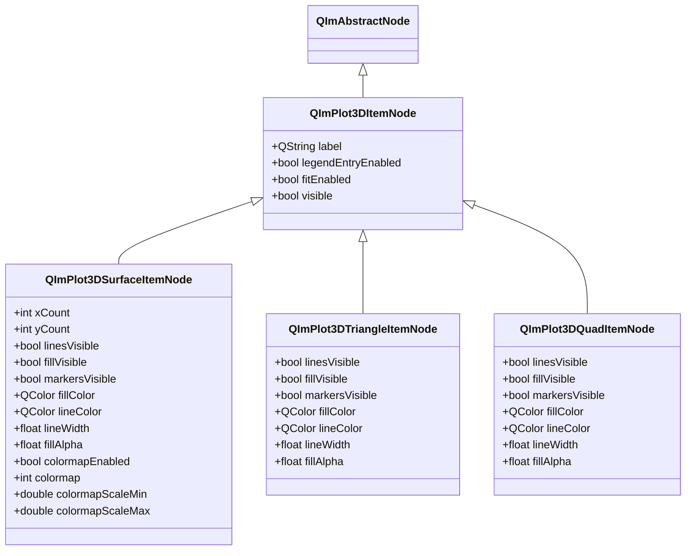
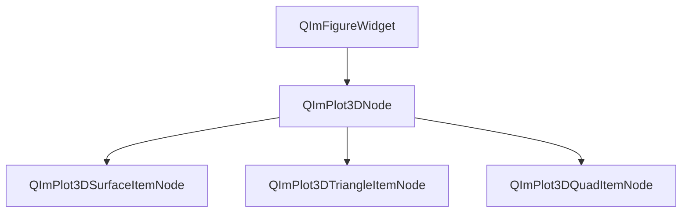

# 3D Surface Charts Usage Guide

QIm provides three 3D surface chart types — Surface, Triangle, and Quad — for rendering grid surfaces, triangle patches, and quadrilateral patches respectively. They share a unified `QImPlot3DItemNode` base class interface, support independent visibility control and color configuration for lines, fills, and markers, and manage parent-child node relationships through the object tree mechanism.

## Key Features

**Features**

- ✅ **Grid Surface**: Render 3D surfaces via X/Y/Z data grids, with fill mode and wireframe mode switching
- ✅ **Triangle Patches**: Every 3 consecutive vertices define a triangular face, suitable for irregular geometries
- ✅ **Quad Patches**: Every 4 consecutive vertices define a quadrilateral face, suitable for regular grid structures
- ✅ **Colormap**: Surface supports Z-value-based color mapping with 16 built-in mapping schemes
- ✅ **Wireframe Mode**: Surface can hide fill and markers, displaying only grid lines
- ✅ **Independent Style Control**: Lines, fills, and markers each have independent color and size properties
- ✅ **Signal-Slot Interaction**: All property changes are notified via Qt signals, supporting dynamic responsive updates

## Basic Concepts

### Component Positioning

Surface, Triangle, and Quad chart types are all children of `QImPlot3DNode` in the 3D object tree, added as plot item nodes to the 3D chart:

```text
QImFigureWidget (root node)
└── QImPlot3DNode (3D chart)
    ├── QImPlot3DSurfaceItemNode (surface item)
    ├── QImPlot3DTriangleItemNode (triangle patch item)
    └── QImPlot3DQuadItemNode (quad patch item)
```

Specify `QImPlot3DNode` as the parent when creating; the node is automatically added to the object tree.

### Class Inheritance



### Object Tree Structure



### Three Chart Type Comparison

| Feature | Surface | Triangle | Quad |
|------|---------|----------|------|
| Data Format | Grid (rows × cols) | 3 vertices/face | 4 vertices/face |
| setData Parameters | `(xs, ys, zs, rows, cols)` | `(xs, ys, zs)` | `(xs, ys, zs)` |
| Colormap | ✅ Supported | ❌ Not supported | ❌ Not supported |
| Wireframe Mode | ✅ Supported | ❌ Not applicable | ❌ Not applicable |
| Use Case | Regular grid surfaces | Irregular triangle meshes | Regular quad meshes |
| Grid Dimension Properties | xCount/yCount | None | None |

- **Surface**: Suitable for regular grid data, such as mathematical function surfaces, terrain data, etc. Data is organized in rows and columns, with data points forming a rectangular grid rendered as a surface
- **Triangle**: Suitable for triangle-patch geometries like tetrahedra, irregular triangulated networks (TIN), etc. Every 3 consecutive vertices define a triangular face
- **Quad**: Suitable for quadrilateral-patch structures like regular grid sections, architectural planes, etc. Every 4 consecutive vertices define a quadrilateral face

## Surface Charts

`QImPlot3DSurfaceItemNode` renders 3D surfaces from X, Y, Z data point grids and is the most commonly used 3D surface chart type. It supports fill mode and wireframe mode, as well as Z-value-based colormap coloring.

Examples for this component are in: `examples/readme-3d-example` and `examples/qimfigure-test/functions/3d/Plot3DSurfaceFunction.cpp`

### 1. Basic Usage (Fill Mode)

Create a fill surface with colormap, using data from `z = sin(x) * cos(y)` on a 40×40 grid:

```cpp
#include "QImFigureWidget.h"
#include "plot3d/QImPlot3DNode.h"
#include "plot3d/QImPlot3DSurfaceItemNode.h"
#include "implot3d.h"

#include <cmath>
#include <vector>

// Create chart widget
QIM::QImFigureWidget* figure3D = new QIM::QImFigureWidget(this);
figure3D->setSubplot3DGrid(1, 1);

// Create 3D chart node
if (QIM::QImPlot3DNode* plot = figure3D->createPlot3DNode()) {
    plot->setTitle("3D Surface");

    // Generate 40x40 grid data: z = sin(x)*cos(y)
    constexpr int rows = 40;
    constexpr int cols = 40;
    std::vector<double> xs(rows * cols);
    std::vector<double> ys(rows * cols);
    std::vector<double> zs(rows * cols);
    for (int r = 0; r < rows; ++r) {
        for (int c = 0; c < cols; ++c) {
            int index = r * cols + c;
            double x = -3.0 + 6.0 * c / (cols - 1);
            double y = -3.0 + 6.0 * r / (rows - 1);
            xs[index] = x;
            ys[index] = y;
            zs[index] = std::sin(x) * std::cos(y);
        }
    }

    // Create surface item node, with plot as parent
    auto* surface = new QIM::QImPlot3DSurfaceItemNode(plot);  // automatically becomes a child of plot
    surface->setLabel("surface");
    surface->setData(xs, ys, zs, rows, cols);  // set grid data
    surface->setColormapEnabled(true);          // enable colormap
    surface->setColormap(ImPlot3DColormap_Viridis);  // use Viridis mapping scheme
}
```

**Key Notes**:

- `setData(xs, ys, zs, rows, cols)`: Total data vector length is `rows * cols`, index calculation is `index = r * cols + c`
- `setColormapEnabled(true)` + `setColormap(ImPlot3DColormap_Viridis)`: After enabling colormap, surface colors are auto-mapped based on Z values
- Surface item nodes are created with `QImPlot3DNode` as parent and automatically added to the object tree

### 2. Wireframe Mode

Wireframe mode shows only grid lines without fill faces or markers. Achieved by disabling `fillVisible` and `markersVisible`:

```cpp
// Create 3D chart node
if (QIM::QImPlot3DNode* plot = figure3D->createPlot3DNode()) {
    plot->setTitle("3D Wireframe");

    // Generate same grid data as the fill surface
    constexpr int rows = 40;
    constexpr int cols = 40;
    std::vector<double> xs(rows * cols);
    std::vector<double> ys(rows * cols);
    std::vector<double> zs(rows * cols);
    for (int r = 0; r < rows; ++r) {
        for (int c = 0; c < cols; ++c) {
            int index = r * cols + c;
            double x = -3.0 + 6.0 * c / (cols - 1);
            double y = -3.0 + 6.0 * r / (rows - 1);
            xs[index] = x;
            ys[index] = y;
            zs[index] = std::sin(x) * std::cos(y);
        }
    }

    // Create surface item node, configured as wireframe mode
    auto* wireframe = new QIM::QImPlot3DSurfaceItemNode(plot);  // automatically becomes a child of plot
    wireframe->setLabel("wireframe");
    wireframe->setData(xs, ys, zs, rows, cols);
    wireframe->setColormapEnabled(true);              // wireframe also supports colormap
    wireframe->setColormap(ImPlot3DColormap_Viridis);
    wireframe->setFillVisible(false);                 // hide fill faces
    wireframe->setMarkersVisible(false);              // hide markers
    wireframe->setLineWidth(1.2f);                    // set line width
}
```

!!! info "Wireframe Mode Principle"
    Wireframe mode is achieved through a combination of three properties: `setFillVisible(false)` hides fill faces, `setMarkersVisible(false)` hides markers, and `setLineWidth()` controls line thickness. Colormap still works in wireframe mode — line colors are mapped based on Z values.

### 3. Custom Colors

When not using colormap, you can set fill color, line color, and marker color separately:

```cpp
// Create surface item node, using custom colors
auto* surface = new QIM::QImPlot3DSurfaceItemNode(plot);  // with plot as parent
surface->setData(xs, ys, zs, rows, cols);

// Set fill color and transparency
surface->setFillColor(QColor(0, 114, 189));  // fill color
surface->setFillAlpha(0.6f);                  // fill transparency (0.0~1.0)

// Set line color and width
surface->setLineColor(QColor(255, 255, 255));  // line color
surface->setLineWidth(1.0f);                    // line width

// Set marker style
surface->setMarkersVisible(true);
surface->setMarkerFillColor(QColor(217, 83, 25));     // marker fill color
surface->setMarkerOutlineColor(QColor(120, 45, 10));  // marker outline color
surface->setMarkerSize(4.0f);                          // marker size
surface->setMarkerWeight(1.0f);                        // marker outline width
```

### 4. Colormap System

Surface supports Z-value-based color mapping (colormap), automatically mapping Z values to color gradients, suitable for scientific data visualization.

#### Enabling Colormap

```cpp
surface->setColormapEnabled(true);              // enable colormap
surface->setColormap(ImPlot3DColormap_Viridis); // select mapping scheme
surface->setColormapScaleMin(-1.0);             // mapping minimum (optional)
surface->setColormapScaleMax(1.0);              // mapping maximum (optional)
```

!!! tip "Colormap Scale Range"
    `colormapScaleMin` and `colormapScaleMax` control the numerical range for color mapping. If not set, the system auto-determines the range from the data. Manual range setting is useful when a fixed color mapping range is needed, such as maintaining consistent mapping ranges across multiple charts for comparison.

#### QImPlot3DColormap Mapping Schemes

`QImPlot3DColormap` wraps ImPlot3D's colormap enum, providing 16 built-in mapping schemes:

| Enum Value | ImPlot3D Equivalent | Description |
|--------|----------------|------|
| `QImPlot3DColormap::Deep` | `ImPlot3DColormap_Deep` (0) | Deep gradient, suitable for dark themes |
| `QImPlot3DColormap::Dark` | `ImPlot3DColormap_Dark` (1) | Dark tones, low contrast |
| `QImPlot3DColormap::Pastel` | `ImPlot3DColormap_Pastel` (2) | Soft pastel tones, suitable for presentations |
| `QImPlot3DColormap::Paired` | `ImPlot3DColormap_Paired` (3) | Contrast color pairs, suitable for categories |
| `QImPlot3DColormap::Viridis` | `ImPlot3DColormap_Viridis` (4) | Perceptually uniform gradient, top choice for scientific visualization |
| `QImPlot3DColormap::Plasma` | `ImPlot3DColormap_Plasma` (5) | Purple-red gradient, high contrast |
| `QImPlot3DColormap::Hot` | `ImPlot3DColormap_Hot` (6) | Heatmap gradient (black→red→yellow→white) |
| `QImPlot3DColormap::Cool` | `ImPlot3DColormap_Cool` (7) | Cool-tone gradient (blue→green) |
| `QImPlot3DColormap::Pink` | `ImPlot3DColormap_Pink` (8) | Pink-tone gradient |
| `QImPlot3DColormap::Jet` | `ImPlot3DColormap_Jet` (9) | Classic rainbow gradient |
| `QImPlot3DColormap::Twilight` | `ImPlot3DColormap_Twilight` (10) | Cyclic gradient, suitable for periodic data |
| `QImPlot3DColormap::RdBu` | `ImPlot3DColormap_RdBu` (11) | Red-blue bidirectional gradient, suitable for positive/negative data |
| `QImPlot3DColormap::BrBG` | `ImPlot3DColormap_BrBG` (12) | Brown-blue-green bidirectional gradient |
| `QImPlot3DColormap::PiYG` | `ImPlot3DColormap_PiYG` (13) | Pink-yellow-green bidirectional gradient |
| `QImPlot3DColormap::Spectral` | `ImPlot3DColormap_Spectral` (14) | Multi-color spectral gradient |
| `QImPlot3DColormap::Greys` | `ImPlot3DColormap_Greys` (15) | Grayscale gradient |

!!! tip "Mapping Scheme Selection Guide"
    - For scientific data visualization, **Viridis** is recommended (perceptually uniform, colorblind-friendly)
    - For heat data, **Hot** or **Plasma** is recommended
    - For positive/negative contrast, **RdBu** or **Spectral** is recommended
    - For grayscale printing, **Greys** is recommended

When using `setColormap()`, you can directly pass ImPlot3D's native enum values (e.g., `ImPlot3DColormap_Viridis`) or `QImPlot3DColormap` integer values (e.g., `(int)QImPlot3DColormap::Viridis` which is 4).

### 5. Property Tables

#### Complete Q_PROPERTY List

| Property | Type | Getter | Setter | Notification Signal | Description |
|------|------|----------|----------|----------|------|
| `xCount` | `int` | `xCount()` | `setXCount(int)` | `gridShapeChanged()` | Number of grid points in X direction |
| `yCount` | `int` | `yCount()` | `setYCount(int)` | `gridShapeChanged()` | Number of grid points in Y direction |
| `linesVisible` | `bool` | `isLinesVisible()` | `setLinesVisible(bool)` | `surfaceFlagChanged()` | Whether lines are visible |
| `fillVisible` | `bool` | `isFillVisible()` | `setFillVisible(bool)` | `surfaceFlagChanged()` | Whether fill faces are visible |
| `markersVisible` | `bool` | `isMarkersVisible()` | `setMarkersVisible(bool)` | `surfaceFlagChanged()` | Whether markers are visible |
| `markerShape` | `int` | `markerShape()` | `setMarkerShape(int)` | `markerShapeChanged(int)` | Marker shape (ImPlot3DMarker) |
| `markerSize` | `float` | `markerSize()` | `setMarkerSize(float)` | `markerStyleChanged()` | Marker size |
| `markerWeight` | `float` | `markerWeight()` | `setMarkerWeight(float)` | `markerStyleChanged()` | Marker outline width |
| `fillColor` | `QColor` | `fillColor()` | `setFillColor(QColor)` | `fillColorChanged(QColor)` | Fill color |
| `lineColor` | `QColor` | `lineColor()` | `setLineColor(QColor)` | `lineColorChanged(QColor)` | Line color |
| `markerFillColor` | `QColor` | `markerFillColor()` | `setMarkerFillColor(QColor)` | `markerFillColorChanged(QColor)` | Marker fill color |
| `markerOutlineColor` | `QColor` | `markerOutlineColor()` | `setMarkerOutlineColor(QColor)` | `markerOutlineColorChanged(QColor)` | Marker outline color |
| `lineWidth` | `float` | `lineWidth()` | `setLineWidth(float)` | `lineWidthChanged(float)` | Line width (pixels) |
| `fillAlpha` | `float` | `fillAlpha()` | `setFillAlpha(float)` | `fillAlphaChanged(float)` | Fill transparency (0.0~1.0, -1.0 for auto) |
| `colormapEnabled` | `bool` | `isColormapEnabled()` | `setColormapEnabled(bool)` | `colormapChanged()` | Whether colormap is enabled |
| `colormap` | `int` | `colormap()` | `setColormap(int)` | `colormapChanged()` | Colormap scheme |
| `colormapScaleMin` | `double` | `colormapScaleMin()` | `setColormapScaleMin(double)` | `colormapScaleChanged()` | Colormap minimum value |
| `colormapScaleMax` | `double` | `colormapScaleMax()` | `setColormapScaleMax(double)` | `colormapScaleChanged()` | Colormap maximum value |

#### Marker Shapes (ImPlot3DMarker)

The `markerShape` property uses ImPlot3D's marker shape enum values, with the corresponding `QImPlot3DMarkerShape` wrapper as follows:

| Enum Value | Integer Value | Description |
|--------|--------|------|
| `QImPlot3DMarkerShape::None` | -1 | No marker |
| `QImPlot3DMarkerShape::Circle` | 0 | Circle |
| `QImPlot3DMarkerShape::Square` | 1 | Square |
| `QImPlot3DMarkerShape::Diamond` | 2 | Diamond |
| `QImPlot3DMarkerShape::Up` | 3 | Upward triangle |
| `QImPlot3DMarkerShape::Down` | 4 | Downward triangle |
| `QImPlot3DMarkerShape::Left` | 5 | Left triangle |
| `QImPlot3DMarkerShape::Right` | 6 | Right triangle |
| `QImPlot3DMarkerShape::Cross` | 7 | Cross |
| `QImPlot3DMarkerShape::Plus` | 8 | Plus |
| `QImPlot3DMarkerShape::Asterisk` | 9 | Asterisk |

### 6. Signal Table

| Signal | Parameters | Trigger |
|------|------|----------|
| `dataChanged()` | None | When `setData()` updates XYZ data |
| `gridShapeChanged()` | None | When `xCount` or `yCount` changes |
| `surfaceFlagChanged()` | None | When `linesVisible`, `fillVisible`, or `markersVisible` changes |
| `markerShapeChanged(int shape)` | New marker shape value | When `setMarkerShape()` actually changes the shape |
| `markerStyleChanged()` | None | When `markerSize` or `markerWeight` changes |
| `fillColorChanged(const QColor& color)` | New fill color | When `setFillColor()` actually changes the color |
| `lineColorChanged(const QColor& color)` | New line color | When `setLineColor()` actually changes the color |
| `markerFillColorChanged(const QColor& color)` | New marker fill color | When `setMarkerFillColor()` actually changes the color |
| `markerOutlineColorChanged(const QColor& color)` | New marker outline color | When `setMarkerOutlineColor()` actually changes the color |
| `lineWidthChanged(float width)` | New line width | When `setLineWidth()` actually changes line width |
| `fillAlphaChanged(float alpha)` | New transparency | When `setFillAlpha()` actually changes transparency |
| `colormapChanged()` | None | When `colormapEnabled` or `colormap` changes |
| `colormapScaleChanged()` | None | When `colormapScaleMin` or `colormapScaleMax` changes |

### 7. Signal-Slot Connection Examples

```cpp
// Listen for colormap toggle changes
connect(surface, &QIM::QImPlot3DSurfaceItemNode::colormapChanged,
        this, &MyClass::onColormapChanged);

// Listen for fill color changes
connect(surface, &QIM::QImPlot3DSurfaceItemNode::fillColorChanged,
        this, [](const QColor& color) {
    qDebug() << "Surface fill color changed to:" << color;
});

// Listen for line width changes
connect(surface, &QIM::QImPlot3DSurfaceItemNode::lineWidthChanged,
        this, [](float width) {
    qDebug() << "Surface line width changed to:" << width;
});
```

## Triangle Charts

`QImPlot3DTriangleItemNode` renders 3D triangle patches from X, Y, Z data point sequences. Every 3 consecutive vertices define a triangular face, suitable for rendering irregular geometries.

Examples for this component are in: `examples/qimfigure-test/functions/3d/Plot3DTriangleFunction.cpp`

### 1. Basic Usage

Create a tetrahedron (composed of 4 triangular faces):

```cpp
#include "QImFigureWidget.h"
#include "plot3d/QImPlot3DNode.h"
#include "plot3d/QImPlot3DTriangleItemNode.h"

#include <QVector>

// Create chart widget
QIM::QImFigureWidget* figure3D = new QIM::QImFigureWidget(this);
figure3D->setSubplot3DGrid(1, 1);

// Create 3D chart node
if (QIM::QImPlot3DNode* plot = figure3D->createPlot3DNode()) {
    plot->setTitle("3D Triangle - Tetrahedron");
    plot->setBoxRotation(35.264, 45.0);  // set isometric view

    // Define the 4 vertices of a tetrahedron
    // V0 = (0, 0, 1)            top
    // V1 = (0.943, 0, -0.333)   bottom right
    // V2 = (-0.471, 0.816, -0.333)   bottom back-left
    // V3 = (-0.471, -0.816, -0.333)  bottom front-left

    // 4 triangular faces (3 points per face, counter-clockwise from outside)
    // Total 12 points (4 faces × 3 points/face)
    QVector<double> xs, ys, zs;
    xs.reserve(12);
    ys.reserve(12);
    zs.reserve(12);

    // Face 0: V0-V1-V2
    xs.append(0.0);      ys.append(0.0);       zs.append(1.0);      // V0
    xs.append(0.943);    ys.append(0.0);       zs.append(-0.333);   // V1
    xs.append(-0.471);   ys.append(0.816);     zs.append(-0.333);   // V2

    // Face 1: V0-V2-V3
    xs.append(0.0);      ys.append(0.0);       zs.append(1.0);      // V0
    xs.append(-0.471);   ys.append(0.816);     zs.append(-0.333);   // V2
    xs.append(-0.471);   ys.append(-0.816);    zs.append(-0.333);   // V3

    // Face 2: V0-V3-V1
    xs.append(0.0);      ys.append(0.0);       zs.append(1.0);      // V0
    xs.append(-0.471);   ys.append(-0.816);    zs.append(-0.333);   // V3
    xs.append(0.943);    ys.append(0.0);       zs.append(-0.333);   // V1

    // Face 3: V1-V3-V2 (bottom face)
    xs.append(0.943);    ys.append(0.0);       zs.append(-0.333);   // V1
    xs.append(-0.471);   ys.append(-0.816);    zs.append(-0.333);   // V3
    xs.append(-0.471);   ys.append(0.816);     zs.append(-0.333);   // V2

    // Create triangle patch item node, with plot as parent
    auto* triangle = new QIM::QImPlot3DTriangleItemNode(plot);  // automatically becomes a child of plot
    triangle->setData(xs, ys, zs);  // set data (no rows/cols parameter needed)
    triangle->setFillColor(QColor(0, 114, 189));   // set fill color
    triangle->setLineColor(QColor(255, 255, 255));  // set line color
    triangle->setLineWidth(1.5f);                    // set line width
    triangle->setLinesVisible(true);                 // show lines
    triangle->setFillVisible(true);                  // show fill
    triangle->setMarkersVisible(false);              // do not show markers
}
```

**Key Notes**:

- `setData(xs, ys, zs)`: Triangle does not require `rows/cols` parameters; data length must be a multiple of 3 (3 vertices per triangular face)
- Vertex order should be counter-clockwise from the outside for correct face orientation
- Shared vertices must be repeated in the data vector (e.g., tetrahedron's V0 appears 3 times)

### 2. Property Tables

#### Complete Q_PROPERTY List

| Property | Type | Getter | Setter | Notification Signal | Description |
|------|------|----------|----------|----------|------|
| `linesVisible` | `bool` | `isLinesVisible()` | `setLinesVisible(bool)` | `triangleFlagChanged()` | Whether lines are visible |
| `fillVisible` | `bool` | `isFillVisible()` | `setFillVisible(bool)` | `triangleFlagChanged()` | Whether fill faces are visible |
| `markersVisible` | `bool` | `isMarkersVisible()` | `setMarkersVisible(bool)` | `triangleFlagChanged()` | Whether markers are visible |
| `markerShape` | `int` | `markerShape()` | `setMarkerShape(int)` | `markerShapeChanged(int)` | Marker shape (ImPlot3DMarker) |
| `markerSize` | `float` | `markerSize()` | `setMarkerSize(float)` | `markerStyleChanged()` | Marker size |
| `markerWeight` | `float` | `markerWeight()` | `setMarkerWeight(float)` | `markerStyleChanged()` | Marker outline width |
| `fillColor` | `QColor` | `fillColor()` | `setFillColor(QColor)` | `fillColorChanged(QColor)` | Fill color |
| `lineColor` | `QColor` | `lineColor()` | `setLineColor(QColor)` | `lineColorChanged(QColor)` | Line color |
| `markerFillColor` | `QColor` | `markerFillColor()` | `setMarkerFillColor(QColor)` | `markerFillColorChanged(QColor)` | Marker fill color |
| `markerOutlineColor` | `QColor` | `markerOutlineColor()` | `setMarkerOutlineColor(QColor)` | `markerOutlineColorChanged(QColor)` | Marker outline color |
| `lineWidth` | `float` | `lineWidth()` | `setLineWidth(float)` | `lineWidthChanged(float)` | Line width (pixels) |
| `fillAlpha` | `float` | `fillAlpha()` | `setFillAlpha(float)` | `fillAlphaChanged(float)` | Fill transparency (0.0~1.0, -1.0 for auto) |

!!! info "Triangle vs Surface Property Differences"
    Triangle does not support colormap properties, nor grid dimension properties (xCount/yCount). Notification signals use `triangleFlagChanged()` instead of `surfaceFlagChanged()`.

### 3. Signal Table

| Signal | Parameters | Trigger |
|------|------|----------|
| `dataChanged()` | None | When `setData()` updates XYZ data |
| `triangleFlagChanged()` | None | When `linesVisible`, `fillVisible`, or `markersVisible` changes |
| `markerShapeChanged(int shape)` | New marker shape value | When `setMarkerShape()` actually changes the shape |
| `markerStyleChanged()` | None | When `markerSize` or `markerWeight` changes |
| `fillColorChanged(const QColor& color)` | New fill color | When `setFillColor()` actually changes the color |
| `lineColorChanged(const QColor& color)` | New line color | When `setLineColor()` actually changes the color |
| `markerFillColorChanged(const QColor& color)` | New marker fill color | When `setMarkerFillColor()` actually changes the color |
| `markerOutlineColorChanged(const QColor& color)` | New marker outline color | When `setMarkerOutlineColor()` actually changes the color |
| `lineWidthChanged(float width)` | New line width | When `setLineWidth()` actually changes line width |
| `fillAlphaChanged(float alpha)` | New transparency | When `setFillAlpha()` actually changes transparency |

## Quad Charts

`QImPlot3DQuadItemNode` renders 3D quadrilateral patches from X, Y, Z data point sequences. Every 4 consecutive vertices define a quadrilateral face, suitable for rendering regular cross-sectional structures.

!!! tip "Complete Example"
    Quad component examples are in the `examples/qimfigure-test/functions/3d/` directory. The following usage instructions are based on the complete implementation.

### 1. Basic Usage

Create a geometry composed of quadrilateral patches:

```cpp
#include "QImFigureWidget.h"
#include "plot3d/QImPlot3DNode.h"
#include "plot3d/QImPlot3DQuadItemNode.h"

#include <vector>

// Create chart widget
QIM::QImFigureWidget* figure3D = new QIM::QImFigureWidget(this);
figure3D->setSubplot3DGrid(1, 1);

// Create 3D chart node
if (QIM::QImPlot3DNode* plot = figure3D->createPlot3DNode()) {
    plot->setTitle("3D Quad");

    // Define data: every 4 consecutive points define a quadrilateral face
    // Data length must be a multiple of 4
    std::vector<double> xs, ys, zs;

    // Quad face 1 (4 vertices)
    xs.push_back(0.0);   ys.push_back(0.0);   zs.push_back(1.0);
    xs.push_back(1.0);   ys.push_back(0.0);   zs.push_back(1.0);
    xs.push_back(1.0);   ys.push_back(1.0);   zs.push_back(1.0);
    xs.push_back(0.0);   ys.push_back(1.0);   zs.push_back(1.0);

    // Quad face 2 (4 vertices)
    xs.push_back(0.0);   ys.push_back(0.0);   zs.push_back(0.0);
    xs.push_back(1.0);   ys.push_back(0.0);   zs.push_back(0.0);
    xs.push_back(1.0);   ys.push_back(1.0);   zs.push_back(0.0);
    xs.push_back(0.0);   ys.push_back(1.0);   zs.push_back(0.0);

    // Create quad patch item node, with plot as parent
    auto* quad = new QIM::QImPlot3DQuadItemNode(plot);  // automatically becomes a child of plot
    quad->setData(xs, ys, zs);  // set data (no rows/cols parameter needed)
    quad->setFillColor(QColor(80, 170, 90));   // set fill color
    quad->setLineColor(QColor(60, 60, 60));     // set line color
    quad->setLineWidth(1.0f);                    // set line width
    quad->setFillVisible(true);                  // show fill
    quad->setLinesVisible(true);                 // show lines
    quad->setMarkersVisible(false);              // do not show markers
}
```

**Key Notes**:

- `setData(xs, ys, zs)`: Quad does not require `rows/cols` parameters; data length must be a multiple of 4 (4 vertices per quadrilateral face)
- Vertex order should be counter-clockwise from the outside for correct face orientation
- Quad does not support colormap

### 2. Property Tables

#### Complete Q_PROPERTY List

| Property | Type | Getter | Setter | Notification Signal | Description |
|------|------|----------|----------|----------|------|
| `linesVisible` | `bool` | `isLinesVisible()` | `setLinesVisible(bool)` | `quadFlagChanged()` | Whether lines are visible |
| `fillVisible` | `bool` | `isFillVisible()` | `setFillVisible(bool)` | `quadFlagChanged()` | Whether fill faces are visible |
| `markersVisible` | `bool` | `isMarkersVisible()` | `setMarkersVisible(bool)` | `quadFlagChanged()` | Whether markers are visible |
| `markerShape` | `int` | `markerShape()` | `setMarkerShape(int)` | `markerShapeChanged(int)` | Marker shape (ImPlot3DMarker) |
| `markerSize` | `float` | `markerSize()` | `setMarkerSize(float)` | `markerStyleChanged()` | Marker size |
| `markerWeight` | `float` | `markerWeight()` | `setMarkerWeight(float)` | `markerStyleChanged()` | Marker outline width |
| `fillColor` | `QColor` | `fillColor()` | `setFillColor(QColor)` | `fillColorChanged(QColor)` | Fill color |
| `lineColor` | `QColor` | `lineColor()` | `setLineColor(QColor)` | `lineColorChanged(QColor)` | Line color |
| `markerFillColor` | `QColor` | `markerFillColor()` | `setMarkerFillColor(QColor)` | `markerFillColorChanged(QColor)` | Marker fill color |
| `markerOutlineColor` | `QColor` | `markerOutlineColor()` | `setMarkerOutlineColor(QColor)` | `markerOutlineColorChanged(QColor)` | Marker outline color |
| `lineWidth` | `float` | `lineWidth()` | `setLineWidth(float)` | `lineWidthChanged(float)` | Line width (pixels) |
| `fillAlpha` | `float` | `fillAlpha()` | `setFillAlpha(float)` | `fillAlphaChanged(float)` | Fill transparency (0.0~1.0, -1.0 for auto) |

### 3. Signal Table

| Signal | Parameters | Trigger |
|------|------|----------|
| `dataChanged()` | None | When `setData()` updates XYZ data |
| `quadFlagChanged()` | None | When `linesVisible`, `fillVisible`, or `markersVisible` changes |
| `markerShapeChanged(int shape)` | New marker shape value | When `setMarkerShape()` actually changes the shape |
| `markerStyleChanged()` | None | When `markerSize` or `markerWeight` changes |
| `fillColorChanged(const QColor& color)` | New fill color | When `setFillColor()` actually changes the color |
| `lineColorChanged(const QColor& color)` | New line color | When `setLineColor()` actually changes the color |
| `markerFillColorChanged(const QColor& color)` | New marker fill color | When `setMarkerFillColor()` actually changes the color |
| `markerOutlineColorChanged(const QColor& color)` | New marker outline color | When `setMarkerOutlineColor()` actually changes the color |
| `lineWidthChanged(float width)` | New line width | When `setLineWidth()` actually changes line width |
| `fillAlphaChanged(float alpha)` | New transparency | When `setFillAlpha()` actually changes transparency |

## Base Class Properties

Surface, Triangle, and Quad share the following properties and signals from the `QImPlot3DItemNode` base class:

### Base Class Q_PROPERTY

| Property | Type | Getter | Setter | Notification Signal | Description |
|------|------|----------|----------|----------|------|
| `label` | `QString` | `label()` | `setLabel(QString)` | `labelChanged(QString)` | Legend label |

### Base Class Public Methods

| Method | Description |
|------|------|
| `plot3DNode()` | Returns parent `QImPlot3DNode` |
| `isLegendEntryEnabled()` | Whether shown in legend |
| `setLegendEntryEnabled(bool)` | Set legend display |
| `isFitEnabled()` | Whether participating in axis auto-fit |
| `setFitEnabled(bool)` | Set axis auto-fit |
| `isVisible()` | Whether visible |
| `setVisible(bool)` | Set visibility |

### Base Class Signals

| Signal | Parameters | Trigger |
|------|------|----------|
| `labelChanged(const QString& name)` | New label text | When `setLabel()` changes the label |
| `legendEntryEnabledChanged()` | None | When legend entry enabled state changes |
| `fitEnabledChanged()` | None | When auto-fit enabled state changes |

## setData Method Details

The three chart types have different `setData()` method signatures, reflecting their respective data organization approaches:

| Type | Method Signature | Data Requirements |
|------|----------|----------|
| Surface | `setData(xs, ys, zs, rows, cols)` | Data length = rows × cols |
| Triangle | `setData(xs, ys, zs)` | Data length = 3 × N (N = number of triangle faces) |
| Quad | `setData(xs, ys, zs)` | Data length = 4 × N (N = number of quad faces) |

All three types support both template and non-template versions:

- **Template version**: Accepts any container type (`std::vector<double>`, `QVector<double>`, etc.), internally creates a `QImVectorXYZDataSeries` and delegates to the non-template version
- **Non-template version**: Accepts a `QImAbstractXYZDataSeries*` pointer, taking ownership of the data series

```cpp
// Template version - using std::vector
surface->setData(xsVec, ysVec, zsVec, rows, cols);

// Template version - using QVector
surface->setData(xsQVec, ysQVec, zsQVec, rows, cols);

// Non-template version - using custom data series
QImAbstractXYZDataSeries* series = new MyCustomDataSeries(...);
surface->setData(series, rows, cols);  // Surface needs additional rows/cols
triangle->setData(series);             // Triangle doesn't need rows/cols
quad->setData(series);                 // Quad doesn't need rows/cols
```

!!! warning "Data Ownership"
    The non-template version of `setData()` takes ownership of the `QImAbstractXYZDataSeries` pointer; manual release is not needed. The template version internally creates a data series object, also managed by the node's lifecycle.

## Notes

!!! warning "Surface Data Format"
    For Surface's `setData(xs, ys, zs, rows, cols)`, the total length of the data vectors must be `rows × cols`. The index calculation is `index = row * cols + col`, where `row` corresponds to the Y direction and `col` corresponds to the X direction.

!!! warning "Triangle and Quad Data Length"
    - Triangle: Data length must be a multiple of 3; trailing data with fewer than 3 points is ignored
    - Quad: Data length must be a multiple of 4; trailing data with fewer than 4 points is ignored

!!! tip "Wireframe Mode Combination"
    Surface's wireframe mode is achieved through a combination of three properties:
    ```cpp
    surface->setFillVisible(false);      // hide fill faces
    surface->setMarkersVisible(false);   // hide markers
    surface->setLineWidth(1.2f);         // adjust line width (thinner lines for wireframe aesthetics)
    ```
    Colormap still works in wireframe mode — line colors are auto-mapped based on Z values.

!!! tip "fillAlpha Special Value"
    The `fillAlpha` property supports the special value `-1.0`, indicating automatic transparency (using ImPlot3D default). When set to a value between `0.0` and `1.0`, fill transparency is manually controlled.

!!! tip "Colormap vs Fill Color Relationship"
    When colormap is enabled (`colormapEnabled = true`), the `fillColor` property has no effect — surface color is entirely determined by the colormap. When colormap is disabled, the surface uses `fillColor` for coloring.

## References

- 3D Plotting Overview: [3D Plot Module](index.md)
- Basic Charts: [Basic Charts](basic-charts.md)
- Mesh Charts: [Mesh Charts](mesh.md)
- Style & Colormap: [3D Configuration](configuration.md)
- Core Concepts: [Render Nodes](../render-node.md)
- Example Code: `examples/readme-3d-example`, `examples/qimfigure-test/functions/3d/Plot3DSurfaceFunction.cpp`, `examples/qimfigure-test/functions/3d/Plot3DTriangleFunction.cpp`
- ImPlot3D Official Docs: <https://github.com/epezent/implot3d>