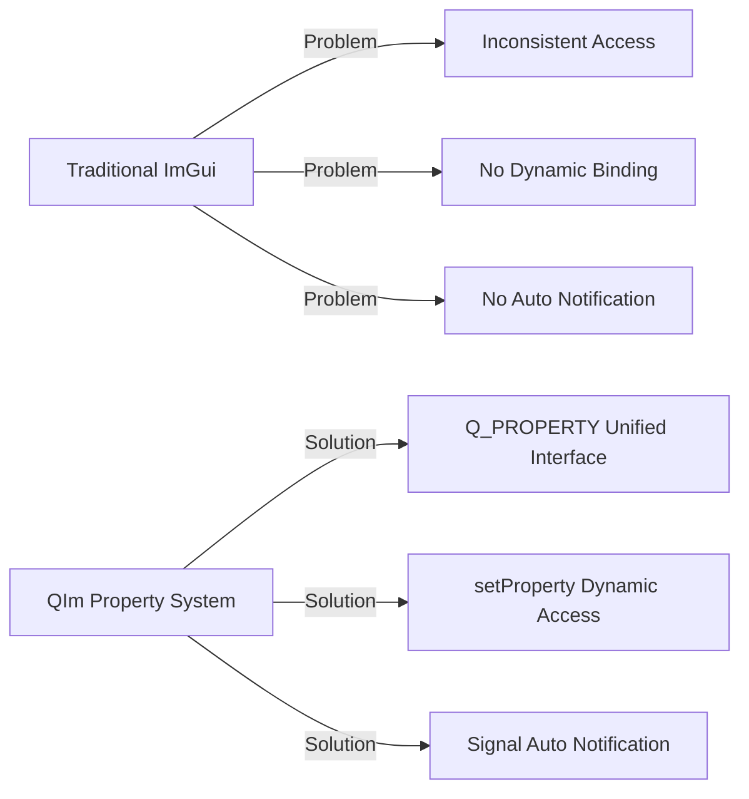
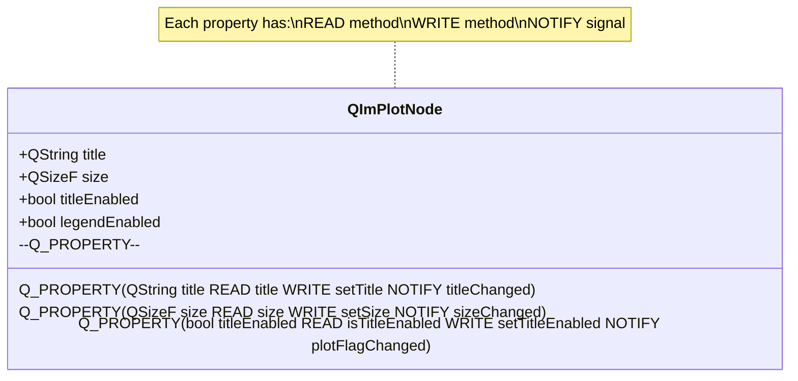

# Property System Integration

QIm fully utilizes Qt's **Property System (Q_PROPERTY)** to expose configurable component properties,
allowing developers to manage UI state using familiar Qt programming paradigms (setProperty, signal notifications).

## Why Property System is Needed

Traditional ImGui uses function calls for property settings, without a unified property management mechanism:

```cpp
// Traditional ImGui - direct function calls
ImPlot::SetNextPlotLimits(0, 10, 0, 100);
ImGui::SetWindowFontScale(1.5f);
```

This approach has several problems:
1. **No unified access**: Different properties use different functions, lacking consistency
2. **No dynamic binding**: Cannot access properties by string name like Qt
3. **No auto notification**: No automatic notification when properties change

QIm solves these problems through Q_PROPERTY:



## Core Principles

### Q_PROPERTY Mechanism

Q_PROPERTY is the core of Qt's meta-object system, providing:
- **READ function**: Get property value
- **WRITE function**: Set property value
- **NOTIFY signal**: Automatically emitted when property changes
- **Design-time property**: Supports Qt Designer integration



### QIm Property Naming Convention

QIm follows Qt's property naming conventions:

| Property Type | Getter Name | Setter Name | Signal Name |
|---------------|-------------|-------------|-------------|
| Basic Property | `color()` | `setColor()` | `colorChanged()` |
| Boolean Property | `isVisible()` or `visible()` | `setVisible()` | `visibleChanged()` |
| Size Property | `size()` | `setSize()` | `sizeChanged()` |
| Enable Property | `isTitleEnabled()` | `setTitleEnabled()` | `titleChanged()` |

!!! tip "Naming Convention"
    - Getter: Property name itself (`color`) or with `is` prefix (`isVisible`)
    - Setter: `set` + property name (`setColor`)
    - Signal: Property name + `Changed` (`colorChanged`)

## How to Apply

### 1. Basic Property Access

```cpp
// Get property value
QString title = plot->title();
QSizeF size = plot->size();
bool legendEnabled = plot->isLegendEnabled();

// Set property value (automatically emits signal)
plot->setTitle("Data Monitoring Chart");
plot->setSize(QSizeF(800, 600));
plot->setLegendEnabled(true);
```

### 2. Dynamic Property Access

Access properties dynamically via setProperty (suitable for scripts, config files):

```cpp
// Set property by name
plot->setProperty("title", QVariant("Dynamic Title"));
plot->setProperty("visible", QVariant(false));

// Get property by name
QVariant titleVar = plot->property("title");
QString title = titleVar.toString();

// Get all property names
const QMetaObject* meta = plot->metaObject();
for (int i = 0; i < meta->propertyCount(); ++i) {
    QMetaProperty prop = meta->property(i);
    qDebug() << prop.name() << ":" << plot->property(prop.name());
}
```

### 3. Property Change Monitoring

Connect NOTIFY signals to monitor changes:

```cpp
// Monitor title changes
connect(plot, &QIM::QImPlotNode::titleChanged,
        this, [](const QString& newTitle) {
    qDebug() << "Title updated:" << newTitle;
});

// Monitor size changes
connect(plot, &QIM::QImPlotNode::sizeChanged,
        this, [](const QSizeF& newSize) {
    qDebug() << "Size updated:" << newSize;
});
```

### 4. Property Binding (Qt 5.15+)

Use Qt's property binding mechanism for automatic property synchronization:

```cpp
// Qt 5.15+ property binding
plot->setTitle(QImPlotNode::bindableTitle().makeBinding([&]() {
    return QString("Chart - %1").arg(dataCount);
}));
```

## QIm Core Class Property List

### QImAbstractNode Properties

| Property | Type | Getter | Setter | Signal |
|----------|------|--------|--------|--------|
| visible | bool | `isVisible()` | `setVisible()` | `visibleChanged(bool)` |
| enabled | bool | `isEnabled()` | `setEnabled()` | `enabledChanged(bool)` |

### QImPlotNode Properties

| Property | Type | Getter | Setter | Signal |
|----------|------|--------|--------|--------|
| title | QString | `title()` | `setTitle()` | `titleChanged(QString)` |
| size | QSizeF | `size()` | `setSize()` | `sizeChanged(QSizeF)` |
| autoSize | bool | `isAutoSize()` | `setAutoSize()` | `autoSizeChanged(bool)` |
| titleEnabled | bool | `isTitleEnabled()` | `setTitleEnabled()` | `plotFlagChanged()` |
| legendEnabled | bool | `isLegendEnabled()` | `setLegendEnabled()` | `plotFlagChanged()` |
| mouseTextEnabled | bool | `isMouseTextEnabled()` | `setMouseTextEnabled()` | `plotFlagChanged()` |
| inputsEnabled | bool | `isInputsEnabled()` | `setInputsEnabled()` | `plotFlagChanged()` |
| menusEnabled | bool | `isMenusEnabled()` | `setMenusEnabled()` | `plotFlagChanged()` |
| boxSelectEnabled | bool | `isBoxSelectEnabled()` | `setBoxSelectEnabled()` | `plotFlagChanged()` |
| frameEnabled | bool | `isFrameEnabled()` | `setFrameEnabled()` | `plotFlagChanged()` |
| equal | bool | `isEqual()` | `setEqual()` | `plotFlagChanged()` |
| crosshairs | bool | `isCrosshairs()` | `setCrosshairs()` | `plotFlagChanged()` |
| canvasEnabled | bool | `isCanvasEnabled()` | `setCanvasEnabled()` | `plotFlagChanged()` |

### QImPlotLineItemNode Properties

| Property | Type | Getter | Setter | Signal |
|----------|------|--------|--------|--------|
| label | QString | `label()` | `setLabel()` | `labelChanged(QString)` |
| segments | bool | `isSegments()` | `setSegments()` | `lineFlagChanged()` |
| loop | bool | `isLoop()` | `setLoop()` | `lineFlagChanged()` |
| skipNaN | bool | `isSkipNaN()` | `setSkipNaN()` | `lineFlagChanged()` |
| shaded | bool | `isShaded()` | `setShaded()` | `lineFlagChanged()` |
| adaptiveSampling | bool | `isAdaptiveSampling()` | `setAdaptivesSampling()` | - |

!!! info "Note"
    - Multiple boolean properties may share the same Signal (e.g., plotFlagChanged)
    - Setter automatically emits the corresponding Notify signal internally
    - Property names use Qt style (camelCase), following naming conventions in AGENTS.md

## Best Practices

### Defining Properties in Custom Nodes

```cpp
class CustomNode : public QIM::QImAbstractNode
{
    Q_OBJECT
    // Define properties - follow QIm naming conventions
    Q_PROPERTY(QString customTitle READ customTitle WRITE setCustomTitle NOTIFY customTitleChanged)
    Q_PROPERTY(int customValue READ customValue WRITE setCustomValue NOTIFY customValueChanged)
    Q_PROPERTY(bool customEnabled READ isCustomEnabled WRITE setCustomEnabled NOTIFY customEnabledChanged)
    
public:
    // Getter
    QString customTitle() const { return m_customTitle; }
    int customValue() const { return m_customValue; }
    bool isCustomEnabled() const { return m_customEnabled; }
    
    // Setter (emits signal internally)
    void setCustomTitle(const QString& title) {
        if (m_customTitle != title) {
            m_customTitle = title;
            emit customTitleChanged(title);
        }
    }
    
    void setCustomValue(int value) {
        if (m_customValue != value) {
            m_customValue = value;
            emit customValueChanged(value);
        }
    }
    
    void setCustomEnabled(bool enabled) {
        if (m_customEnabled != enabled) {
            m_customEnabled = enabled;
            emit customEnabledChanged(enabled);
        }
    }
    
Q_SIGNALS:
    void customTitleChanged(const QString& title);
    void customValueChanged(int value);
    void customEnabledChanged(bool enabled);
    
private:
    QString m_customTitle;
    int m_customValue = 0;
    bool m_customEnabled = true;
};
```

!!! warning "Notes"
    - Setter must check if value changed to avoid duplicate signal emissions
    - NOTIFY signal parameter should match READ return type
    - Emit signal after property change, not before setting
    - Boolean properties can use either `isXxx()` or `xxx()` getter style

!!! tip "Best Practices"
    - Use PIMPL pattern to store property values, avoid header file bloat
    - Follow QIm naming conventions: setColor, color, colorChanged
    - Consider using Q_PROPERTY USER attribute for complex property marking
    - Use Qt5 new-style signal-slot syntax to connect property change signals

## References

- Related docs: [Signal/Slot](signal-slot.md), [PIMPL Pattern](pimpl-pattern.md)
- Qt Docs: [Qt Property System](https://doc.qt.io/qt-6/properties.html)
- Source Reference: `src/core/plot/QImPlotNode.h` (Q_PROPERTY definitions)