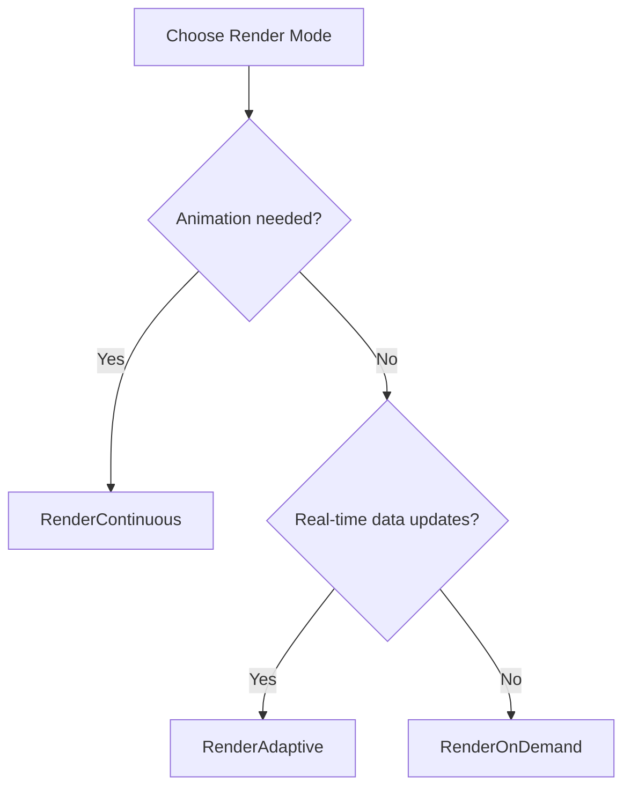

# Render Mode Control Guide

QIm provides three rendering strategies for different application scenarios, configured via `QImWidget::setRenderMode()`.

## Main Features

**Features**

- ✅ **Adaptive Mode**: High frame rate during interaction, low frame rate when idle
- ✅ **Continuous Mode**: Sustained high frame rate, suitable for animations
- ✅ **On-Demand Mode**: Render only on event triggers, most energy-efficient

## Three Rendering Modes

### 1. RenderAdaptive (Adaptive) - Default Recommended

```cpp
widget->setRenderMode(QIM::QImWidget::RenderAdaptive);
```

| State | Frame Rate | Suitable Scenario |
|-------|------------|-------------------|
| Interacting | ~18 FPS | Mouse drag, zoom |
| Idle | ~1 FPS | Waiting for user action |

**Characteristics**: Automatically adjusts frame rate based on user interaction state, balancing fluidity and energy consumption.

### 2. RenderContinuous (Continuous)

```cpp
widget->setRenderMode(QIM::QImWidget::RenderContinuous);
```

| State | Frame Rate | Suitable Scenario |
|-------|------------|-------------------|
| Always | ~18 FPS | Real-time animation, dynamic updates |

**Characteristics**: Always high frame rate rendering, suitable for scenarios needing continuous animation effects.

### 3. RenderOnDemand (On-Demand)

```cpp
widget->setRenderMode(QIM::QImWidget::RenderOnDemand);
```

| State | Frame Rate | Suitable Scenario |
|-------|------------|-------------------|
| Triggered | Single frame | Static charts, low power |

**Characteristics**: Renders one frame only when data updates or user actions occur, most energy-efficient but slower interaction response.

## Scenario Recommendations



| Application Type | Recommended Mode | Reason |
|------------------|------------------|--------|
| Real-time monitoring | RenderAdaptive | Smooth interaction, idle energy saving |
| Demo animation | RenderContinuous | Guarantees animation continuity |
| Static reports | RenderOnDemand | Zero CPU usage when no interaction |
| Scientific simulation | RenderAdaptive | Interactive when observing, energy saving during computation |

!!! warning "Notes"
    - RenderContinuous continuously occupies CPU/GPU
    - RenderOnDemand may cause interaction response delay
    - For real-time data updates, recommend RenderAdaptive or RenderContinuous

## References

- API Reference: `src/widgets/QImWidget.h`