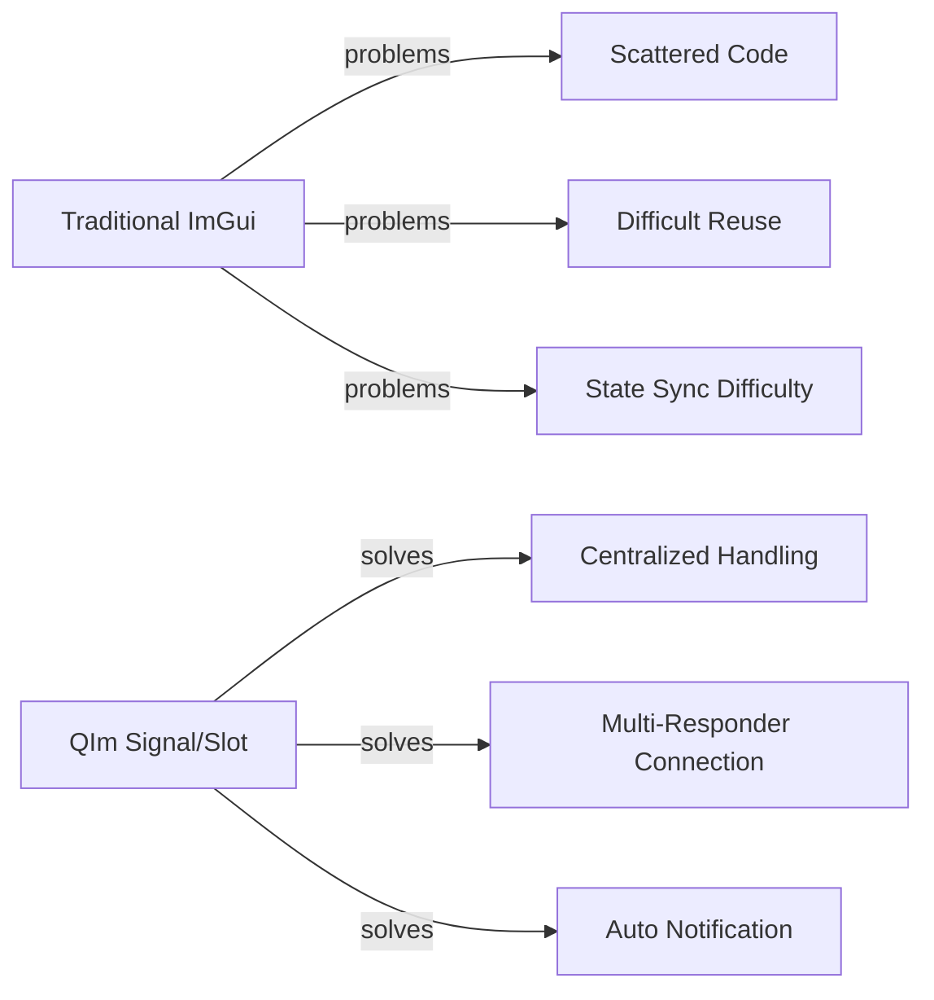

# Signal/Slot Integration

QIm fully leverages Qt's **signal/slot mechanism** to implement event communication between components,
allowing developers to respond to UI events and state changes using familiar Qt programming paradigms.

## Why Signal/Slot is Needed

Traditional ImGui event handling uses callbacks or immediate query methods:

```cpp
// Traditional ImGui - query state every frame
if (ImGui::Button("OK")) {
    // click event handling
}
if (ImPlot::IsPlotHovered()) {
    ImVec2 pos = ImPlot::GetPlotMousePos();
    // mouse position handling
}
```

This approach has several problems:
1. **Scattered code**: Event handling logic is scattered throughout rendering code
2. **Difficult to reuse**: Cannot connect multiple responders like Qt does
3. **State synchronization difficulty**: Property changes require manual notification

QIm solves these problems through signal/slot integration:



## Core Principles

### Design Philosophy

QIm maps ImGui state changes to Qt signals:
- Signals are automatically emitted when properties change (e.g., `visibleChanged`, `titleChanged`)
- Interaction events provide signals (e.g., mouse hover, click)
- Users can connect slot functions to respond to events

### Base Signals of QImAbstractNode

All nodes inherit the following base signals:

```cpp
Q_SIGNALS:
    void visibleChanged(bool visible);    // visibility changed
    void enabledChanged(bool enabled);    // enabled state changed
    void childNodeRemoved(QImAbstractNode* c);  // child node removed
    void childNodeAdded(QImAbstractNode* c);    // child node added
```

### Signals of QImPlotNode

Plot nodes provide property change signals:

```cpp
Q_SIGNALS:
    void titleChanged(const QString& title);     // title changed
    void sizeChanged(const QSizeF& size);        // size changed
    void autoSizeChanged(bool autoSize);         // auto-size changed
    void plotFlagChanged();                      // plot flags changed
```

### Signals of QImPlotItemNode

Plot item nodes provide label change signals:

```cpp
Q_SIGNALS:
    void labelChanged(const QString& name);  // label/name changed
```

### Signals of QImFigureWidget

Figure Widget provides subplot management signals:

```cpp
Q_SIGNALS:
    void plotNodeAttached(QImPlotNode* plot, bool attach);  // plot node added/removed
```

## How to Apply

### Basic Signal/Slot Connection

```cpp
// Connect title change signal
connect(plot, &QIM::QImPlotNode::titleChanged,
        this, [](const QString& title) {
    qDebug() << "Plot title changed to:" << title;
});

// Connect visibility change signal
connect(node, &QIM::QImAbstractNode::visibleChanged,
        this, [](bool visible) {
    qDebug() << "Node visibility:" << visible;
});
```

### Monitoring Child Node Changes

```cpp
// Monitor plot node addition
connect(figure, &QIM::QImFigureWidget::plotNodeAttached,
        this, [](QIM::QImPlotNode* plot, bool attach) {
    if (attach) {
        qDebug() << "New plot added";
    } else {
        qDebug() << "Plot removed";
    }
});
```

### Custom Node Signals

Add custom signals when inheriting from QImAbstractNode:

```cpp
class CustomPlotNode : public QImAbstractNode
{
    Q_OBJECT
public:
    // Custom signals
    Q_SIGNALS:
        void dataUpdated();           // data update signal
        void rangeChanged(double min, double max);  // range change signal
    
    void updateData()
    {
        // ... data update logic ...
        emit dataUpdated();  // emit signal
    }
};
```

!!! warning "Notes"
    - Signal emission is automatically handled in property setters, no need for manual emit
    - Use Qt5 new syntax (function pointers) when connecting signals to avoid string matching issues
    - Signal/slot connections do not affect rendering performance; connections are established during initialization

!!! tip "Best Practices"
    - Put business logic in slot functions to keep rendering code clean
    - Use lambda expressions for simple responses, member slot functions for complex logic
    - Use `QueuedConnection` for cross-thread communication

## References

- Related docs: [Property System](property-system.md), [Object Tree](object-tree.md)
- Qt Documentation: [Signals & Slots](https://doc.qt.io/qt-6/signalsandslots.html)
