# QIm：将 ImGui 生态融入 Qt 的高性能数据可视化库

> **作者**：[czt1988](https://github.com/czyt1988)　|　**项目地址**：[github.com/czyt1988/QIm](https://github.com/czyt1988/QIm)
>
> 一个让 Qt 开发者零学习成本即可获得 ImGui 级渲染性能的开源数据可视化库。

---

## 1. 引言

在 Qt 生态中做数据可视化，选型从来都不轻松。`QCustomPlot` 和 `Qwt` 虽然成熟，但其底层渲染基于 `QPainter`，面对百万级数据点时往往力不从心；`Qt Charts` 和 `KDChart` 的性能则不在同一量级。

另一边，`Dear ImGui` 生态凭借其 GPU 加速的即时模式渲染，在游戏引擎、调试工具、实时监控等领域早已证明了其卓越的渲染性能。但它独特的**即时模式**编程范式与 Qt 开发者习惯的**保留模式**相差甚远——每次渲染都要重新构建整个 UI 结构，信号槽、属性系统、对象树这些 Qt 开发者的日常工具统统缺席。

**QIm** 的使命就是在两者之间架起一座桥梁：**将 ImGui 生态的高性能渲染能力，以 Qt 开发者最熟悉的方式交付**。

具体来说，QIm 将 `Dear ImGui`、`ImPlot`、`ImPlot3D` 等 ImGui 生态组件，以**保留模式**封装到 Qt 框架中：

- 绘图组件映射为 **Qt 对象树节点**（父子关系自动管理生命周期）
- ImGui 属性映射为 **Qt 属性系统**（`Q_PROPERTY`，统一 setter/getter/signal 接口）
- 交互事件通过 **Qt 信号槽机制** 传递

你无需学习 ImGui 的即时模式编程模型，即可直接使用熟悉的 Qt 范式构建**实时数据监控、科学计算可视化、工程仿真界面**等高性能应用场景。

---

## 2. 核心理念：从即时模式到保留模式

### 2.1 ImGui 原生的即时模式

在 ImGui 原生编程中，每一帧都要重新执行一遍 UI 构建代码：

```cpp
// 传统 ImGui 即时模式 —— 这段代码每次刷新帧都要执行一遍
if (ImGui::Begin("Window")) {
    if (ImPlot::BeginPlot("Plot")) {
        ImPlot::PlotLine("sin", x.data(), y.data(), n);
        ImPlot::EndPlot();
    }
    ImGui::End();
}
```

这种方式虽然灵活，但与 Qt 的编程思维完全不同——你无法"持有"一个绘图对象并动态修改它的属性。

### 2.2 QIm 的保留模式

QIm 将上述代码转换为面向对象 + 对象树的风格：

```cpp
// QIm 方式 —— 面向对象，更符合 Qt 习惯
auto window = new QImWindowNode(root);
window->setTitle("Window");

auto plot = new QImPlotNode(window);  // 自动成为 window 的子节点
plot->setTitle("Plot");

auto line = new QImPlotLineNode(plot);
line->setData(x, y);                  // 数据只设置一次
line->setColor(Qt::red);              // 属性随时可改
```

**核心转换**：

| ImGui 原生 | QIm 封装 |
|-----------|---------|
| `if (ImPlot::BeginPlot("Plot"))` | `new QImPlotNode(parent)` |
| 每帧调用 `PlotLine(...)` | 调用一次 `setData(x, y)` |
| 属性通过标志位传入 | 通过 `setXxx()` / 属性系统设置 |
| 无对象生命周期管理 | Qt 对象树自动管理 |
| 无信号通知 | 属性变更触发 `xxxChanged()` 信号 |

### 2.3 对象树：QIm 的设计灵魂

QIm 的设计哲学是**万物皆节点**——每个图表元素都是一个节点，节点之间通过父-子关系组织：

```
QImFigureWidget (顶层 QWidget)
├── QImSubplotsNode (子图布局管理器)
│   ├── QImPlotNode (2D 子图)
│   │   ├── QImPlotLineItemNode (曲线)
│   │   ├── QImPlotScatterItemNode (散点)
│   │   ├── QImPlotAxisInfo (x1/y1 坐标轴)
│   │   └── QImPlotLegendNode (图例)
│   └── QImPlot3DNode (3D 子图)
│       ├── QImPlot3DSurfaceItemNode (曲面)
│       └── QImPlot3DAxisInfo (X/Y/Z 轴)
```

- **生命周期**：父节点析构时自动销毁所有子节点，无需手动管理
- **Z-Order**：子节点顺序决定渲染层级
- **可扩展**：继承 `QImAbstractNode` 即可创建自定义节点

---

## 3. 2D 绘图能力

QIm 目前已封装了 ImPlot 的全部主流图型，2D 绘图方面支持 **12+ 种图表类型**：

| 类别 | 支持图型 |
|------|---------|
| **基础图表** | 折线图 (Line)、散点图 (Scatter)、阶梯图 (Stairs) |
| **柱状图类** | 柱状图 (Bars)、分组柱状图 (Bar Groups)、直方图 (Histogram) |
| **区域图表** | 填充区域 (Shaded)、茎叶图 (Stems)、误差棒 (Error Bars) |
| **特殊图表** | 饼图 (Pie Chart)、热力图 (Heatmap)、二维直方图 (Histogram 2D) |
| **标注工具** | 文本标注 (Text)、无限线 (InfLines)、占位项 (Dummy) |

### 效果预览

以下是 QIm 2D 绘图的部分效果展示（动图）：

|  |  |  |
|:---:|:---:|:---:|
|  | 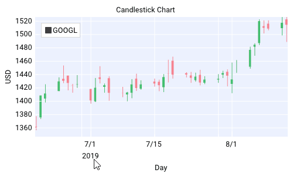 | 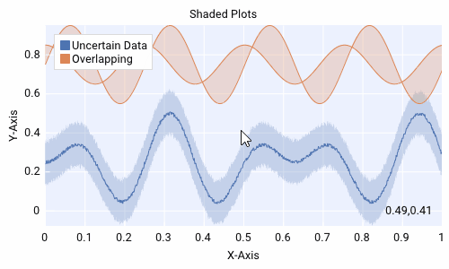 |
| 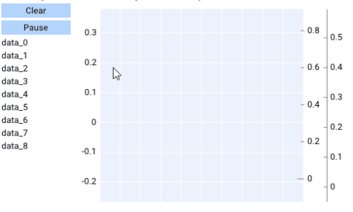 |  | 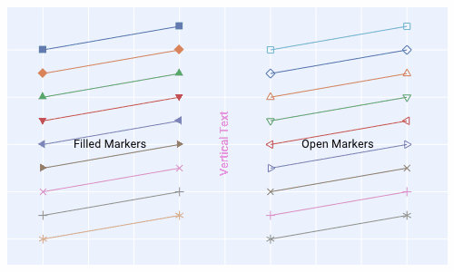 |
| 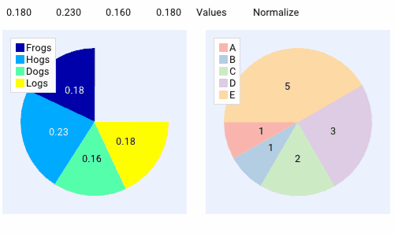 |  |  |

> **实时绘图** (`rt.gif`) 和 **热力图** (`heat.gif`) 最能体现 QIm 基于 OpenGL 渲染管线的性能优势——即使在大数据量持续更新的场景下，画面依然流畅。

每种子图 (QImPlotNode) 支持 **最多 6 条坐标轴**（x1/y1/x2/y2/x3/y3），可精细控制轴标签、刻度范围、网格线、图例等元素。坐标轴支持 `QImPlotCondition::Always`（刚性锁定）和 `QImPlotCondition::Once`（首次自适应）两种范围约束模式。

---

## 4. 3D 绘图能力

QIm 同时封装了 ImPlot3D，提供**三维数据可视化**能力：

| 类别 | 支持图型 |
|------|---------|
| **基础图形** | 3D 曲线图 (Line)、3D 散点图 (Scatter) |
| **曲面图形** | 曲面图 (Surface)、三角剖分 (Triangle)、网格图 (Mesh) |
| **标注元素** | 3D 图像、3D 文本、占位符 |

### 效果预览

|  |  |  |
|:---:|:---:|:---:|
|||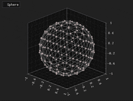|
|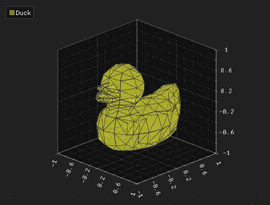|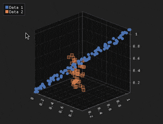|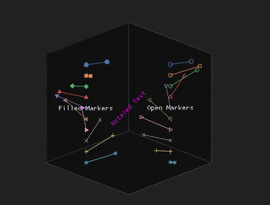|

**3D 交互方式**（与 ImPlot3D 原生一致）：
- **左键拖拽**：平移视角
- **右键拖拽**：旋转视角
- **滚轮 / 中键拖拽**：缩放
- **右键双击**：重置旋转

曲面图支持颜色映射（Colormap），内置 `Viridis`、`Plasma`、`Inferno` 等多种科学配色方案，适合热力分布、地形高程等场景。

---

## 5. 大规模数据处理

当数据量超过 50 万点时，即使 GPU 渲染也需要降采样策略来保证交互流畅度。QIm 内置了两种降采样算法：

### 5.1 LTTB 降采样

**LTTB**（Largest Triangle Three Buckets）是学术界公认效果最好的时序数据降采样算法之一。它通过保留视觉上最重要的数据点，在缩减数据量的同时最大程度维持曲线形态。

```cpp
// QIm 默认集成 LTTB 降采样，自动开启自适应采样
// 你也可以手动配置阈值：
QImLTTBDownsampler sampler;
sampler.setThreshold(1000);  // 超过 1000 点自动触发
```

QIm 还提供了 **MinMaxLTTB** 变体，在 LTTB 基础上额外保留每段的极值点，更适合需要同时关注趋势和峰值/谷值的场景。

### 5.2 自适应渲染模式

QIm 提供三种渲染策略，通过 `QImWidget::setRenderMode()` 切换：

```cpp
QImWidget* widget = new QImWidget();

// 1. 智能自适应（默认）：交互时高帧率(18FPS)，静止时低帧率(1FPS)
widget->setRenderMode(QImWidget::RenderAdaptive);

// 2. 持续渲染(18FPS)：适合动画、实时数据流
widget->setRenderMode(QImWidget::RenderContinuous);

// 3. 按需渲染：仅在事件触发时刷新，最节能
widget->setRenderMode(QImWidget::RenderOnDemand);
```

默认的 `RenderAdaptive` 模式在大多数场景下体验最佳——用户交互时保证流畅，静止时节省 CPU/GPU 资源。

---

## 6. 性能横评：QIm vs QCustomPlot vs Qwt

Qt 绘图库的性能之争主要聚焦在 `QCustomPlot` 和 `Qwt` 两个老牌选手身上（`Qt Charts` / `KDChart` 性能不在同一量级）。我们以 **100 万数据点的折线图** 为基准，渲染 100 次取平均值，覆盖四种配置组合：

### 6.1 渲染耗时对比

| 测试场景 | QCustomPlot | Qwt | **QIm** | QIm 领先幅度 |
|----------|:-----------:|:---:|:-------:|:-----------:|
| 无降采样 + 无 OpenGL | 249.3 ms | 144.1 ms | **92.5 ms** | 1.5~2.7× |
| 有降采样 + 无 OpenGL | 39.6 ms | 41.5 ms | **36.6 ms** | ~8% |
| 无降采样 + 有 OpenGL | 152.9 ms | 121.8 ms | **80.7 ms** | 1.5~1.9× |
| 有降采样 + 有 OpenGL | 44.6 ms | 43.6 ms | **38.7 ms** | ~12% |

> 📊 详细性能图表见下方（点击可放大）：
>
> 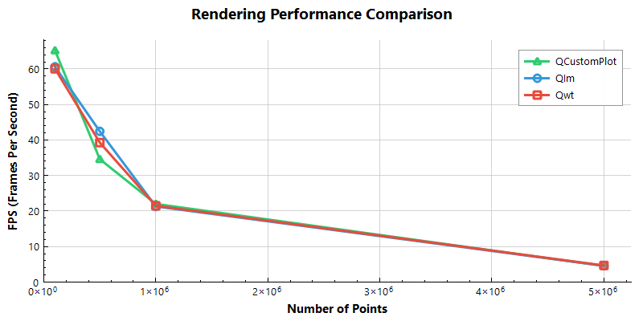

### 6.2 内存占用对比

| 库 | 100 万点内存 | 500 万点内存 | 特点 |
|----|:-----------:|:-----------:|------|
| **QIm** | ~460 MB | ~1.4 GB | ImGui 架构需维护双缓冲 + GPU 资源 |
| Qwt | ~21 MB | ~134 MB | 内存效率高 |
| QCustomPlot | ~21 MB | ~82 MB | 500 万点时反超 Qwt |

### 6.3 结论速览

1. **降采样是大数据量渲染的决定性因素**——>10 万点必须开启，开启后三库性能趋同（差异 < 10%）
2. **QIm 在原生渲染（无降采样）场景下优势显著**——得益于 OpenGL 渲染管线，领先 1.5~2 倍
3. **QIm 的内存开销明显更大**——这是双缓冲 + GPU 资源的架构代价，适合内存充裕的桌面应用
4. **OpenGL 对 QCustomPlot / Qwt 的加速有限**——在已开降采样时，FPS 提升 < 5%

> 完整测试代码与详细分析见 `benchmark/performance` 目录。

---

## 7. Qt 生态深度集成

QIm 最大的特色不是"能画图"，而是"像个 Qt 库一样画图"。

### 7.1 信号槽机制

每个节点的属性变更都会自动发出信号：

```cpp
auto line = new QImPlotLineNode(plot);
line->setLabel("Channel A");

// 属性变更信号
connect(line, &QImPlotLineNode::colorChanged, this, [](QColor c) {
    qDebug() << "Line color changed to:" << c;
});
connect(line, &QImPlotLineNode::visibleChanged, this, [](bool v) {
    qDebug() << "Line visibility:" << v;
});
```

### 7.2 属性系统

QIm 全面使用 `Q_PROPERTY` 暴露节点属性，支持 Qt 样式表、动画框架、属性编辑器等标准工具：

```cpp
// QImPlotLineNode 的部分属性列表
Q_PROPERTY(QColor color READ color WRITE setColor NOTIFY colorChanged)
Q_PROPERTY(float lineWidth READ lineWidth WRITE setLineWidth NOTIFY lineWidthChanged)
Q_PROPERTY(bool visible READ isVisible WRITE setVisible NOTIFY visibleChanged)
Q_PROPERTY(QString label READ label WRITE setLabel NOTIFY labelChanged)
```

### 7.3 QImFigureWidget：一站式绘图窗口

`QImFigureWidget` 是 QIm 提供的一站式绘图窗口控件，直接继承 `QWidget`，在一个窗口中完成子图布局、节点管理、2D/3D 混合绘图：

```cpp
#include <QImFigureWidget.h>

// 创建绘图窗口
QIM::QImFigureWidget* figure = new QIM::QImFigureWidget(this);

// 2×2 子图布局
figure->setSubplotGrid(2, 2);

// 混合 2D 和 3D 子图
QIM::QImPlotNode* plot1 = figure->createPlotNode();    // 2D 子图
QIM::QImPlot3DNode* plot2 = figure->createPlot3DNode(); // 3D 子图
```


---

## 8. 快速上手

### 8.1 环境要求

| 依赖 | 最低版本 |
|------|---------|
| CMake | 3.15+ |
| C++ 编译器 | MSVC 2019+ / GCC 7+ / Clang 5+ |
| Qt | 5.14+（需 Core、Gui、Widgets、OpenGL 模块） |

### 8.2 编译安装

```bash
# 创建构建目录
mkdir build && cd build

# 配置（指定 Qt 路径）
cmake .. -G "Visual Studio 17 2022" -A x64 \
         -DCMAKE_PREFIX_PATH="C:/Qt/6.5.0/msvc2019_64" \
         -DCMAKE_BUILD_TYPE=Release

# 构建并安装
cmake --build . --config Release
cmake --install .
```

### 8.3 CMake 集成

```cmake
set(MIN_QT_VERSION 5.14)
find_package(QT NAMES Qt6 Qt5 COMPONENTS Core REQUIRED)
find_package(Qt${QT_VERSION_MAJOR} ${MIN_QT_VERSION} COMPONENTS
    Core Gui Widgets OpenGL REQUIRED
)

# Qt6 需额外引入 OpenGLWidgets
if(${QT_VERSION_MAJOR} EQUAL 6)
    find_package(Qt${QT_VERSION_MAJOR} ${MIN_QT_VERSION}
        COMPONENTS OpenGLWidgets REQUIRED)
endif()

find_package(QIm REQUIRED)

target_link_libraries(your_app PRIVATE
    Qt${QT_VERSION_MAJOR}::Core
    Qt${QT_VERSION_MAJOR}::Gui
    Qt${QT_VERSION_MAJOR}::Widgets
    Qt${QT_VERSION_MAJOR}::OpenGL
    QIm::Core
    QIm::Widgets
)
```

### 8.4 30 行代码绘制第一个图表

```cpp
#include <QImFigureWidget.h>

class MainWindow : public QMainWindow {
    Q_OBJECT
public:
    MainWindow(QWidget* parent = nullptr) : QMainWindow(parent) {
        // 创建绘图窗口，设置 2 行 1 列子图
        QIM::QImFigureWidget* figure = new QIM::QImFigureWidget(this);
        setCentralWidget(figure);
        figure->setSubplotGrid(2, 1);

        // 子图 1：二次曲线
        auto* plot1 = figure->createPlotNode();
        plot1->x1Axis()->setLabel("时间 (s)");
        plot1->y1Axis()->setLabel("幅度");
        QVector<double> x = {0, 1, 2, 3, 4};
        QVector<double> y = {0, 1, 4, 9, 16};
        plot1->addLine(x, y, "二次曲线");

        // 子图 2：正弦 + 余弦
        auto* plot2 = figure->createPlotNode();
        plot2->setLegendEnabled(true);
        std::vector<double> x2 = {0, 1, 2, 3, 4};
        std::vector<double> sin_y, cos_y;
        for (double v : x2) {
            sin_y.push_back(std::sin(v));
            cos_y.push_back(std::cos(v));
        }
        plot2->addLine(x2, sin_y, "sin(x)");
        plot2->addLine(x2, cos_y, "cos(x)");
    }
};
```

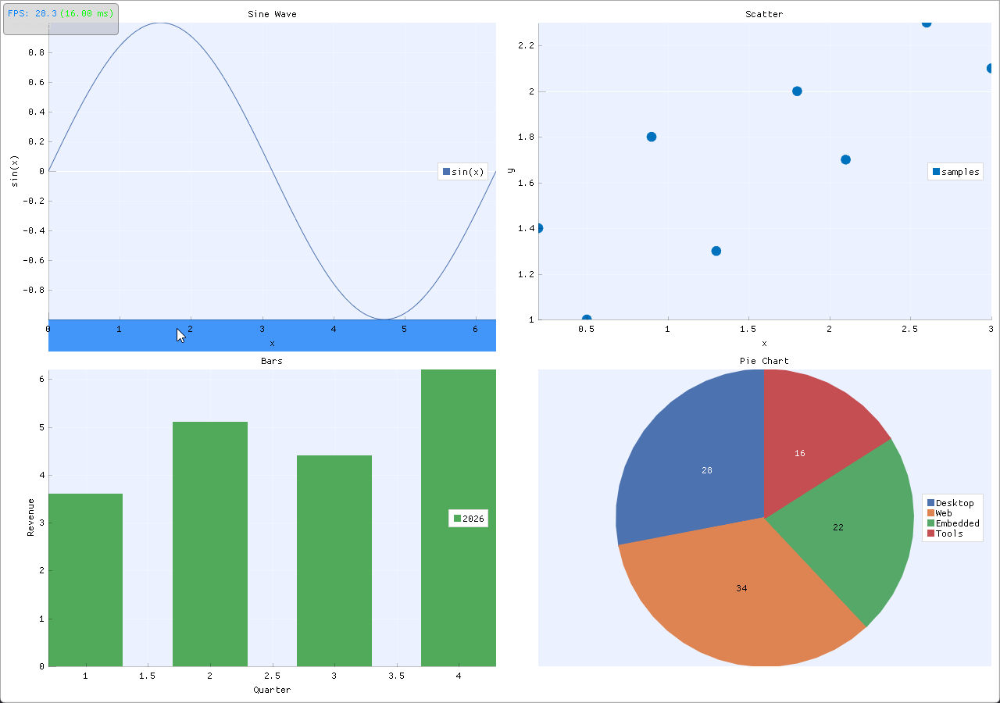

---

## 9. 扩展性：自定义节点开发

QIm 的节点体系是开放的——继承 `QImAbstractNode` 即可创建自己的组件，无缝融入对象树和渲染管线：

```cpp
class CustomPlotNode : public QImAbstractNode {
    Q_OBJECT
public:
    CustomPlotNode(QObject* parent = nullptr) : QImAbstractNode(parent) {}

protected:
    bool beginDraw() override {
        // 对应 ImGui::Begin("MyCustomWindow")
        return ImGui::Begin("MyCustomWindow", nullptr, m_flags);
    }

    void endDraw() override {
        ImGui::End();
    }

private:
    ImGuiWindowFlags m_flags = 0;
};
```

`beginDraw()` / `endDraw()` 是最小实现接口——你只需告诉 QIm "这段 ImGui 代码从哪里开始、到哪里结束"，其余的对象树管理、信号槽、属性系统全部由基类自动处理。

这种设计意味着：**任何 ImGui 生态的现有组件，都可以用同样的模式封装成 QIm 节点**，社区的扩展潜力巨大。

---

## 10. 总结与展望

### 10.1 QIm 的核心优势

| 维度 | QIm 的优势 |
|------|-----------|
| **学习成本** | Qt 开发者零 ImGui 知识即可上手 |
| **渲染性能** | OpenGL 原生管线 + LTTB 降采样，百万点流畅呈现 |
| **Qt 集成度** | 信号槽、属性系统、对象树完整支持，与 Qt 生态无缝衔接 |
| **功能广度** | 2D 12+ 种图型 + 3D 5+ 种图型 + 交互工具 + 坐标轴定制 |
| **可扩展性** | 继承 `QImAbstractNode` 即可封装任意 ImGui 组件 |
| **开源协议** | 完全开源，GitHub 托管 |

### 10.2 已知限制

- **不支持任意字体**：需先加载字体文件（`AddFontFromFileTTF`）
- **不支持线型**：无法指定虚线、点划线等线型样式
- **内存开销较大**：架构需维护双缓冲 + GPU 资源，不适合内存极度受限的环境

### 10.3 路线图

**当前已完成**：
- 2D 图形：Line、Scatter、Stairs、Bars、Shaded、ErrorBars、Stems、InfLines、PieChart、Text、Dummy、Histogram、Heatmap、Histogram2D
- 3D 图形：Line、Scatter、Surface、Triangle、Mesh
- 大数据：LTTB 和 MinMaxLTTB 降采样

**后续规划**：
- 补充 2D 图形：Digital（数字信号）、Image（图像渲染）
- 补充 3D 图形：Quad（四边形）
- 扩展 2D 图表：分组/堆叠柱状图增强、蜡烛图（OHLC）
- QML 集成（计划中）

---

> **项目地址**：[github.com/czyt1988/QIm](https://github.com/czyt1988/QIm)
>
> 欢迎 Star、Issue、PR！如果你正在寻找一个高性能、Qt 原生的数据可视化方案，QIm 值得一试。
