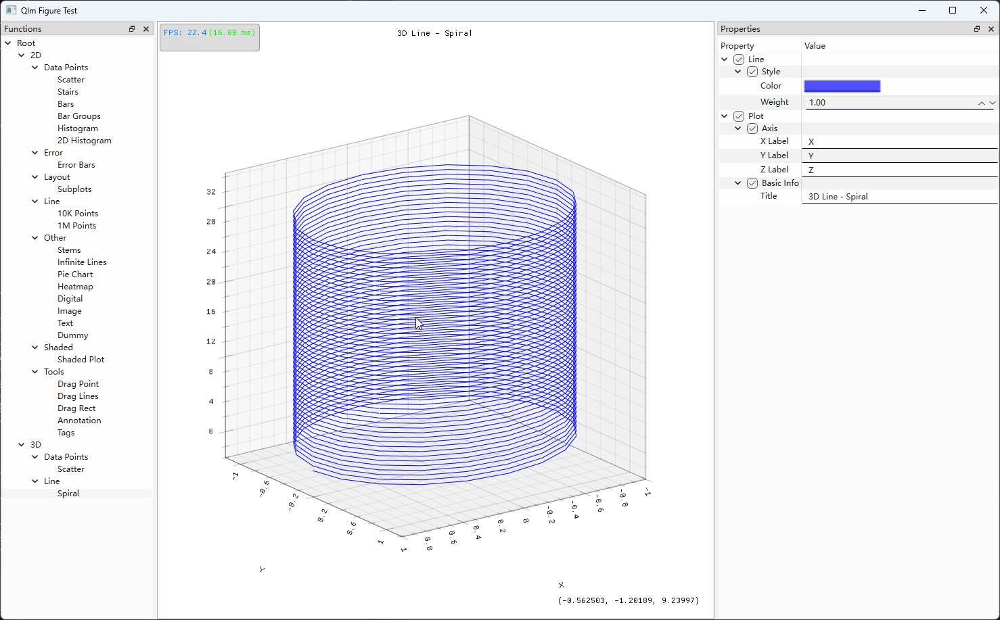
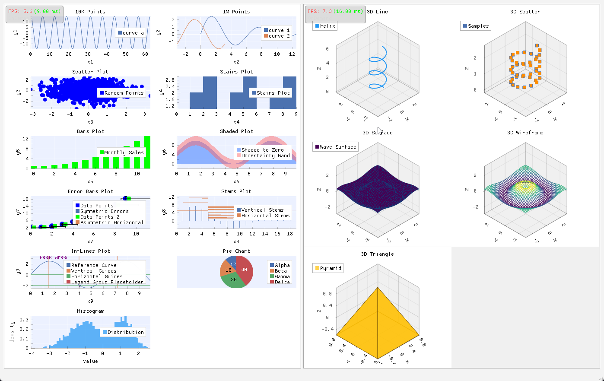
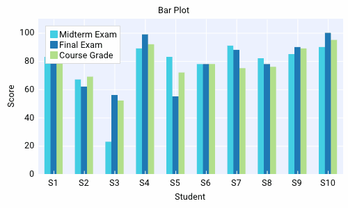
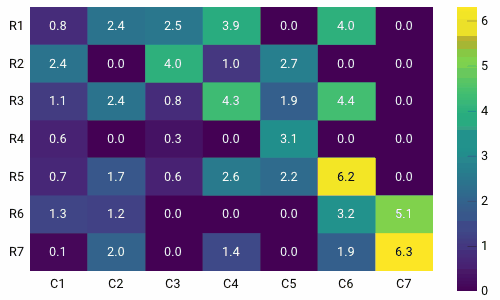
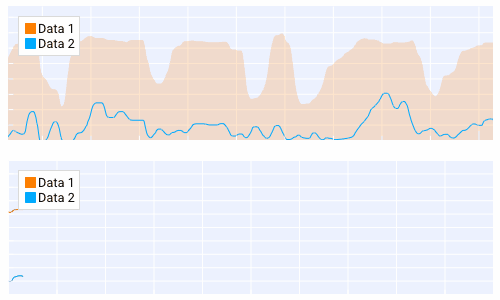
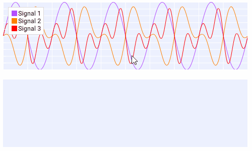
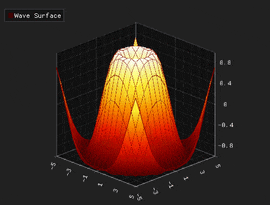
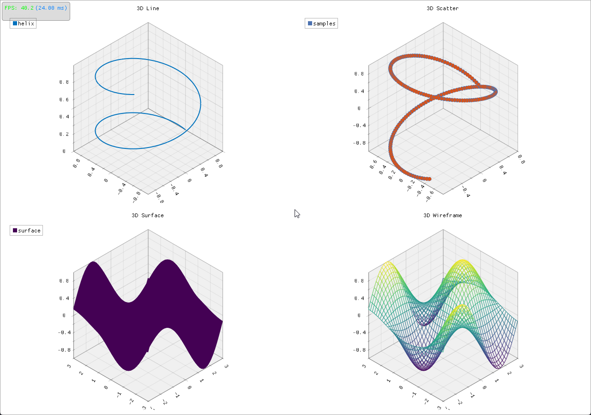

# Vibe Coding——Qt高性能绘图库QIm

这个项目80%都是AI干活，工具是`OpenCode` + `Oh-My-Openagent`，主力模型是`glm-5.1` + `kimi-k2.5` + `qwen3.6`

> **项目地址**：
>
>[https://github.com/czyt1988/QIm](https://github.com/czyt1988/QIm)
>[https://gitee.com/czyt1988/qim](https://gitee.com/czyt1988/qim)

在 Qt 里做高性能数据可视化目前只有两种选择：`QCustomPlot` 和 `Qwt`（`Qt Charts`性能完全不在一个量级），这两个库该有的2D功能都有，文档也算齐全，有降采样算法支撑百万点绘制，但`QCustomPlot`是GPL协议，你的项目使用也要使用GPL协议，`Qwt`协议和性能都比`QCustomPlot`好，但不够美观，所以目前我也针对`Qwt`进行了改进，可参考:[Qwt 7.0 新特性介绍 — 更现代、更强大的Qt数据可视化库](https://zhuanlan.zhihu.com/p/2027883844636779917)。

在`Qwt`项目中，有一个[Issues](https://github.com/czyt1988/QWT/issues/2)，提出了Qt另一种高性能绘图的方案：基于`Dear ImGui`的 `ImPlot`,它是MIT协议、GPU 加速、即时模式渲染，支持多种绘图，还有3D版的`ImPlot3D`,目前用于游戏引擎、调试工具

在了解后今年过年的时候自己上手试了发现的确效果很好，但它也有一些问题，主要是`ImGui`的编程范式跟 Qt 开发者习惯的保留模式差的较远，和Qt的信号槽对接需要做较多的工作，于是我就把它进行二次封装，形成了QIm这个库

**QIm 做的事很简单：把 ImGui 生态里 ImPlot 和 ImPlot3D  用 Qt 开发者最熟悉的方式包装起来。**

具体来说，就是把 ImGui 的绘图函数用渲染节点进行抽象，整个渲染过程就是对渲染树的遍历，每个节点有对应的开始渲染和结束渲染方法，节点之间会有父子关系，也能更好的匹配ImGui的begin/end方法。同时ImGui 属性映射为 `Q_PROPERTY`，交互事件通过 Qt 信号槽传递。这样就不需要学 ImGui 那一套即时模式的写法，直接用最熟悉的 Qt 范式就能构建高性能的数据可视化图表

下面是一些效果图





通过QIm，你能在任意窗口嵌入ImPlot/ImPlot3D，实现数据可视化

## 从即时模式到保留模式

原生 ImGui 的写法是下面这样的，——这段代码在OpenGL的`paintGL`函数里，每帧都要完整跑一遍：

```cpp
if (ImGui::Begin("Window")) {
    if (ImPlot::BeginPlot("Plot")) {
        ImPlot::PlotLine("sin", x.data(), y.data(), n);
        ImPlot::EndPlot();
    }
    ImGui::End();
}
```

你会发现你没办法"持有"一个绘图对象。每次渲染都得重新声明，属性不能持久保存，也没有信号通知你数据变了。

QIm 把这套逻辑换成了面向对象加对象树的方式,把各种功能封装成`QIm**Node`：

```cpp
auto window = new QImWidgetNode(root);
window->setWindowTitle("Window");

auto plot = new QImPlotNode(window);  
plot->setTitle("Plot");

auto line = new QImPlotLineItemNode(plot);// 自动成为 plot 的子节点,等效plot->addChildNode(line)
line->setData(x, y);                  // 设置数据
line->setColor(Qt::red);              // 属性直接使用Qt的类
```

这么一换，ImGui 的每帧声明变成了 Qt 开发者最熟悉的样子。对象树自动管理生命周期——父节点析构时子节点跟着销毁，不用你操心内存。

## 对象树是核心设计

QIm 里万物皆节点。每个图表元素都是一个 `QImAbstractNode` 的子类，通过父子关系组织成树：

```
QImFigureWidget (顶层 QWidget)
├── QImSubplotsNode (子图布局)
│   ├── QImPlotNode (2D 子图)
│   │   ├── QImPlotLineItemNode (折线)
│   │   ├── QImPlotScatterItemNode (散点)
│   │   ├── QImPlotAxisInfo (坐标轴)
│   │   └── QImPlotLegendNode (图例)
│   └── QImPlot3DNode (3D 子图)
│       ├── QImPlot3DSurfaceItemNode (曲面)
│       └── QImPlot3DAxisInfo (坐标轴)
```

这套结构带来的好处：

- 子节点顺序就是渲染顺序，控制 Z-Order 非常直接
- 如果想加自定义组件，只要继承 `QImAbstractNode`，实现 `beginDraw()` 和 `endDraw()` 就行
- 树遍历由基类搞定，你只关心自己的渲染逻辑

## Qt 生态集成

QIm 虽然底层是 ImGui，但对外暴露的接口完全是 Qt 风格的。每个节点的属性变更都通过 `Q_PROPERTY` 暴露，`NOTIFY` 信号会在值变化时自动发射：

```cpp
auto line = new QIM::QImPlotLineItemNode(plot);
line->setLabel("Channel A");

connect(line, &QIM::QImPlotLineItemNode::labelChanged, this, [](const QString& name) {
    qDebug() << "Label changed to:" << name;
});
```

如果你用过 Qt 的属性动画框架或者样式表，你会发现这套机制配合起来很自然——因为 QIm 的属性本身就是 Qt 的标准 `Q_PROPERTY`。

`QImFigureWidget` 是一站式的绘图窗口，继承自 `QOpenGLWidget`，开箱即用：

```cpp
auto figure = new QIM::QImFigureWidget(this);
figure->setSubplotGrid(2, 2);  // 2x2 子图布局

auto plot1 = figure->createPlotNode();    // 2D 子图
auto plot2 = figure->createPlot3DNode();  // 3D 子图
```

## 2D 绘图：12 种图表类型，6 条坐标轴

QIm 目前已经封装了 ImPlot 上你能用到的所有主流图型。折线图、散点图、阶梯图这些基础的不说了，柱状图（包括分组柱状）、饼图、热力图、二维直方图、填充区域、误差棒、茎叶图……你大概率需要的都有

每种子图支持最多 6 条坐标轴（x1/y1/x2/y2/x3/y3），坐标轴范围约束有 `Always`（刚性锁定）和 `Once`（首次自适应）两种模式。轴标签、刻度、网格线、图例这些细节都能精细控制

    

也支持ImPlot里的各种鼠标操作事件



## 3D 绘图

三维这块封装了 ImPlot3D，支持曲线图、散点图、曲面图、曲面网格、三角剖分、四边形、图像贴图、文本标注。曲面图内置了 Viridis、Plasma、Inferno 等科学配色方案，做热力分布、地形高程这种场景都能满足。

交互方式和 ImPlot3D 原生一致：

- 左键拖拽平移视角
- 右键拖拽旋转视角
- 滚轮或中键缩放
- 右键双击重置旋转




## 简单的代码演示

QIm 环境要求：CMake 3.15+，C++17，Qt 5.14+（需要 Core、Gui、Widgets、OpenGL）。Qt 6 的话额外加一个 `OpenGLWidgets`。

编译安装直接CMake：

```bash
mkdir build && cd build
cmake -S . -B build -G "Visual Studio 16 2019" -A x64 -DCMAKE_PREFIX_PATH="C:/Qt/6.7.3/msvc2019_64"
cmake --build build --config Release
cmake --install .
```

项目直接通过`find_package`集成：

```cmake
find_package(QT NAMES Qt6 Qt5 COMPONENTS Core REQUIRED)
find_package(Qt${QT_VERSION_MAJOR} COMPONENTS Core Gui Widgets OpenGL REQUIRED)
if(${QT_VERSION_MAJOR} EQUAL 6)
    find_package(Qt${QT_VERSION_MAJOR} COMPONENTS OpenGLWidgets REQUIRED)
endif()
find_package(QIm REQUIRED)

target_link_libraries(your_app PRIVATE
    QIm::Core
    QIm::Widgets
)
```

30 行代码就能跑起来一个 2x1 子图的窗口：

```cpp
#include <QImFigureWidget.h>

class MainWindow : public QMainWindow {
    Q_OBJECT
public:
    MainWindow(QWidget* parent = nullptr) : QMainWindow(parent) {
        auto figure = new QIM::QImFigureWidget(this);
        setCentralWidget(figure);
        figure->setSubplotGrid(2, 1);

        // 子图 1：二次曲线
        auto plot1 = figure->createPlotNode();
        plot1->addLine({0, 1, 2, 3, 4}, {0, 1, 4, 9, 16}, "二次曲线");

        // 子图 2：正弦 + 余弦
        auto plot2 = figure->createPlotNode();
        plot2->setLegendEnabled(true);
        std::vector<double> x2 = {0, 1, 2, 3, 4};
        std::vector<double> sin_y, cos_y;
        for (double v : x2) {
            sin_y.push_back(std::sin(v));
            cos_y.push_back(std::cos(v));
        }
        plot2->addLine(x2, sin_y, "sin(x)")->setColor(Qt::red);
        plot2->addLine(x2, cos_y, "cos(x)")->setColor(Qt::blue);
    }
};
```

## 大数据量的处理：降采样 + SIMD 加速

超过 50 万点的场景，不管哪个渲染引擎都得降采样。你的屏幕只有一千多个像素宽，但数据可能有上百万个点——绝大多数点都挤在同一个像素列里互相重叠，GPU 却在拼命渲染那些永远不可能被眼睛分辨的点。QCustomPlot和Qwt都提供了降采样算法，其中`QCustomPlot`是默认开启，`Qwt`是需要手动指定，这就是导致好多人使用感觉`QCustomPlot`性能比`Qwt`好的原因，实测同样开启降采样，`Qwt`性能好于`QCustomPlot`

`ImPlot`在大数据量渲染也会有很大压力，如果不启用降采样，大数据量下的渲染性能还不如开启了降采样的`Qwt`和`QCustomPlot`（CPU）

很可惜的是`ImPlot`并没有内置降采样算法，为了解决超大规模点渲染问题，QIm 内置了两套降采样算法：**LTTB** 和 **MinMaxLTTB**

LTTB（Largest Triangle Three Buckets）是时序数据降采样里公认视觉保真最好的。它的思路是：把数据分成桶，对每个桶选一个点——选那个与前后桶构成"面积最大三角形"的点。面积越大意味着偏离直线插值越远，也就是视觉上最"醒目"的点——峰值、谷值、拐点都被优先保留

MinMaxLTTB 是 LTTB 的加速版，思路是在每个桶里先用极值查找筛出一批候选点，再在这些候选点上做 LTTB 的面积选择。因为候选点通常只有原始点数的 1/2 到 1/4，面积计算量大幅减少，视觉质量和纯 LTTB 几乎没有区别

不过 MinMaxLTTB 里面还有一个瓶颈——极值查找（argmin/argmax）本身是个标量循环：逐个比较，一次处理一个 double，只用了现代 CPU 计算能力的 1/4。为此专门为极值查找进行了CPU指令集优化

### SIMD 加速

QIm 为此专门实现了一个 SIMD 加速的极值查找模块 `QImSimdArgMinMax`，在一条遍历里同时找出最小值和最大值。核心思路是用 CPU 的 SIMD 寄存器一次处理多个 double（这是最新C++26标准才提出的std::simd的内容）：

| 执行路径 | SIMD 宽度 | 覆盖 CPU | 加速比 |
|---------|-----------|---------|--------|
| AVX2 | 4 doubles/条指令 | 2013年后的 x86（Haswell+） | 3-5x |
| SSE4.2 | 2 doubles/条指令 | 2010年后的 x86（几乎全部） | 2-3x |
| 标量 | 1 double/条指令 | 兜底 | 1x |

运行时通过 CPUID 检测当前 CPU 支持的指令集，用函数指针锁定最优路径。同一个 exe 在老 CPU 上走标量、在新 CPU 上走 AVX2，不需要分发多个版本

每条折线可以单独设置降采样算法和阈值：

```cpp
line->setDownsampleAlgorithm(QIM::QImDownsampleAlgorithm::MinMaxLTTB);
line->setDownsampleThreshold(20000);  // 超过 2 万点自动触发
```

默认的 `Auto` 模式会根据数据量自动选择——小于 1 万点不降采样，1 万到 10 万用 LTTB，超过 10 万自动切到 MinMaxLTTB 走 SIMD 加速路径

## 性能：跟 QCustomPlot 和 Qwt 对比

这是我个人电脑的测试结果，我个人电脑是一个小mini主机，配置一般，集成显卡，在100万点的实时刷新模式下，QIm比Qwt和QCustomplot最优的性能还快3倍

### 系统信息

| 项目 | 值 |
|---|---|
| 操作系统 | Windows 11 Version 25H2 |
| CPU | 12th Gen Intel(R) Core(TM) i7-1260P (16 核) |
| 内存 | 32536 MB |
| GPU | Intel(R) Iris(R) Xe Graphics |
| 显存 | 未知 |
| OpenGL | 4.6.0 - Build 30.0.101.3111 |
| 屏幕 | 2560x1440 |
| 磁盘 | Unknown |
| Qt | 6.7.3 (runtime: 6.7.3) |
| 编译器 | MSVC 1929 |

### 测试选项

- 降采样: 可配置渲染是否开启降采样，三个库都支持降采样
- OpenGL: 配置是否开启OpenGL加速，主要针对Qwt和QCustomPlot

下面只放100万点的测试结果，专门的对比测试我会专门一个文档里介绍

### 1M（100万） 数据点测试结果

#### 开启降采样

| 库 | 设置时间 (ms) | 渲染时间 (ms) | FPS | 内存 (MB) | OpenGL | 降采样 |
|:---|:---|:---|:---|:---|:---|:---|
| QIm | 6.00 | 16.84 | 59.3824 | 64.04 | ✓ | ✓ |
| Qwt | 7.00 | 44.14 | 22.6552 | 20.22 | × | ✓ |
| Qwt(OpenGL) | 7.00 | 153.92 | 6.4969 | 91.92 | ✓ | ✓ |
| QCustomPlot | 45.00 | 45.60 | 21.9298 | 20.83 | × | ✓ |
| QCustomPlot(OpenGL) | 42.00 | 50.48 | 19.8098 | 31.32 | ✓ | ✓ |

Qwt和QCustomplot都提供了OpenGL加速，但实际加速效果一般

#### 不开启降采样

| 库 | 设置时间 (ms) | 渲染时间 (ms) | FPS | 内存 (MB) | OpenGL | 降采样 |
|:---|:---|:---|:---|:---|:---|:---|
| QIm | 7.00 | 85.50 | 11.6959 | 658.96 | ✓ | × |
| Qwt | 7.00 | 125.12 | 7.9923 | 21.30 | × | × |
| Qwt(OpenGL) | 9.00 | 140.50 | 7.1174 | 47.56 | ✓ | × |
| QCustomPlot | 44.00 | 179.46 | 5.5723 | 20.80 | × | × |
| QCustomPlot(OpenGL) | 44.00 | 174.98 | 5.7149 | 38.64 | ✓ | × |

完整测试代码在 `benchmark/performance` 目录下，不同GPU有不同的结果，我的电脑GPU较弱，CPU较强，得出的结果，如果你的电脑GPU强的话，QIm的表现会更强

> 从上面的测试也能看出，降采样在提升绘图性能起了至关重要的作用

## 当前进展和已知限制

2D 方面目前 Line、Scatter、Stairs、Bars、BarGroups、Shaded、ErrorBars、Stems、InfLines、PieChart、Text、Dummy、Histogram、Heatmap、Histogram2D、Digital、Image 都已经完成。3D 方面 Line、Scatter、Surface、Mesh、Triangle、Quad、Image、Text 都已可用。

主流的图表类型基本都覆盖了，剩下的主要是些补充性的功能，QML 集成还在计划中。

已知的限制主要有三个：

- 字体不能随便用，需要先 `AddFontFromFileTTF` 加载字体文件
- 不支持虚线、点划线这样的线型（这里受限于ImGui,目前最新版已经提供，ImPlot正在规划中）
- 内存开销比 Qwt/QCustomPlot 大 （架构特性决定的）

---

虽然这个项目80%的活都是AI完成，但能做好的前提是我做了20%的框架搭建和约束制定，后面有空会讲讲大型项目AI Coding的一些经验

> **项目地址**：
>
>[https://github.com/czyt1988/QIm](https://github.com/czyt1988/QIm)
>[https://gitee.com/czyt1988/qim](https://gitee.com/czyt1988/qim)
>
> 欢迎 Star、Issue、PR。如果你正在找一个高性能、Qt 原生的绘图方案，不妨试试。
