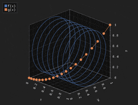

# QIm：把 ImGui 的渲染能力搬进 Qt 生态

> **作者**：[czt1988](https://github.com/czyt1988)　|　**项目地址**：[github.com/czyt1988/QIm](https://github.com/czyt1988/QIm)

在 Qt 里做数据可视化，选型向来有点尴尬。

`QCustomPlot` 和 `Qwt` 是老牌选手，该有的功能都有，文档也算齐全。但它们的底层走的是 `QPainter` 管线，数据量一上百万帧率就往下掉。`Qt Charts` 和 `KDChart` 就更不用说了，性能完全不在一个量级。

另一头，`Dear ImGui` 生态走了完全不同的路子——GPU 加速、即时模式渲染，帧率稳得像钉子。游戏引擎、调试工具、实时监控领域早就证明了这套东西能打。问题在于它的编程范式跟 Qt 开发者习惯的保留模式差了十万八千里。每帧都要重新构建 UI 结构，信号槽没有、属性系统没有、对象树也没有。

**QIm 做的事很简单：把 ImGui 生态里最能打的东西——ImPlot 和 ImPlot3D 的 GPU 渲染能力——用 Qt 开发者最熟悉的方式包装起来。**

具体来说，就是把 ImGui 的绘图组件映射为 Qt 对象树上的节点，ImGui 属性映射为 `Q_PROPERTY`，交互事件通过 Qt 信号槽传递。你不需要学 ImGui 那一套即时模式的写法，直接用你熟悉的 Qt 范式就能构建高性能的数据可视化应用。

## 从即时模式到保留模式

原生 ImGui 的写法是这样的——这段代码每帧都要完整跑一遍：

```cpp
if (ImGui::Begin("Window")) {
    if (ImPlot::BeginPlot("Plot")) {
        ImPlot::PlotLine("sin", x.data(), y.data(), n);
        ImPlot::EndPlot();
    }
    ImGui::End();
}
```

你会发现你没办法"持有"一个绘图对象。每次渲染都得重新声明，属性不能持久保存，也没有信号通知你数据变了。

QIm 把这套逻辑换成了面向对象加对象树的方式：

```cpp
auto window = new QImWidgetNode(root);
window->setWindowTitle("Window");

auto plot = new QImPlotNode(window);  // 自动成为 window 的子节点
plot->setTitle("Plot");

auto line = new QImPlotLineItemNode(plot);
line->setData(x, y);                  // 数据设一次就行
line->setColor(Qt::red);              // 属性随时改
```

这么一换，ImGui 的每帧声明变成了 Qt 开发者最熟悉的对象创建、属性设置、信号连接三板斧。对象树自动管理生命周期——父节点析构时子节点跟着销毁，不用你操心内存。

## 对象树是核心设计

QIm 里万物皆节点。每个图表元素都是一个 `QImAbstractNode` 的子类，通过父子关系组织成树：

```
QImFigureWidget (顶层 QWidget)
├── QImSubplotsNode (子图布局)
│   ├── QImPlotNode (2D 子图)
│   │   ├── QImPlotLineItemNode (折线)
│   │   ├── QImPlotScatterItemNode (散点)
│   │   ├── QImPlotAxisInfo (坐标轴)
│   │   └── QImPlotLegendNode (图例)
│   └── QImPlot3DNode (3D 子图)
│       ├── QImPlot3DSurfaceItemNode (曲面)
│       └── QImPlot3DAxisInfo (坐标轴)
```

这套结构带来的好处：

- 子节点顺序就是渲染顺序，控制 Z-Order 非常直接
- 想加自定义组件？继承 `QImAbstractNode`，实现 `beginDraw()` 和 `endDraw()` 就行
- 树遍历由基类搞定，你只关心自己的渲染逻辑

## 2D 绘图：12 种图表类型，6 条坐标轴

QIm 目前已经封装了 ImPlot 上你能用到的所有主流图型。折线图、散点图、阶梯图这些基础的不说了，柱状图（包括分组柱状）、饼图、热力图、二维直方图、填充区域、误差棒、茎叶图……你大概率需要的都有。

每种子图支持最多 6 条坐标轴（x1/y1/x2/y2/x3/y3），坐标轴范围约束有 `Always`（刚性锁定）和 `Once`（首次自适应）两种模式。轴标签、刻度、网格线、图例这些细节都能精细控制。

    

## 3D 绘图

三维这块封装了 ImPlot3D，支持曲线图、散点图、曲面图、曲面网格、三角剖分、四边形、图像贴图、文本标注。曲面图内置了 Viridis、Plasma、Inferno 等科学配色方案，做热力分布、地形高程这种场景很顺手。

交互方式和 ImPlot3D 原生一致：

- 左键拖拽平移视角
- 右键拖拽旋转视角
- 滚轮或中键缩放
- 右键双击重置旋转



## 大数据量的处理：降采样 + SIMD 加速

超过 50 万点的场景，不管哪个渲染引擎都得降采样。你的屏幕只有一千多个像素宽，但数据可能有上百万个点——绝大多数点都挤在同一个像素列里互相重叠，GPU 却在拼命渲染那些永远不可能被眼睛分辨的点。

QIm 内置了两套降采样算法：**LTTB** 和 **MinMaxLTTB**。

LTTB（Largest Triangle Three Buckets）是时序数据降采样里公认视觉保真最好的。它的思路很巧妙：把数据分成桶，对每个桶选一个点——选那个与前后桶构成"面积最大三角形"的点。面积越大意味着偏离直线插值越远，也就是视觉上最"醒目"的点——峰值、谷值、拐点都被优先保留。

MinMaxLTTB 是 LTTB 的加速版，思路是在每个桶里先用极值查找筛出一批候选点，再在这些候选点上做 LTTB 的面积选择。因为候选点通常只有原始点数的 1/2 到 1/4，面积计算量大幅减少，视觉质量和纯 LTTB 几乎没有区别。

不过 MinMaxLTTB 里面还有一个瓶颈——极值查找（argmin/argmax）本身是个标量循环：逐个比较，一次处理一个 double，只用了现代 CPU 计算能力的 1/4。

### SIMD 加速

QIm 为此专门实现了一个 SIMD 加速的极值查找模块 `QImSimdArgMinMax`，在一条遍历里同时找出最小值和最大值。核心思路是用 CPU 的 SIMD 寄存器一次处理多个 double（这是最新C++26才提供的std::simd的内容）：

| 执行路径 | SIMD 宽度 | 覆盖 CPU | 加速比 |
|---------|-----------|---------|--------|
| AVX2 | 4 doubles/条指令 | 2013年后的 x86（Haswell+） | 3-5x |
| SSE4.2 | 2 doubles/条指令 | 2010年后的 x86（几乎全部） | 2-3x |
| 标量 | 1 double/条指令 | 兜底 | 1x |

运行时通过 CPUID 检测当前 CPU 支持的指令集，用函数指针锁定最优路径。同一个 exe 在老 CPU 上走标量、在新 CPU 上走 AVX2，不需要分发多个版本。

加上栈数组替代 vector、消除 lambda 间接访问等几项微优化，MinMaxLTTB 的实测数据：

| 算法 | 100 万点降采样耗时 | 相比 LTTB |
|------|-------------------|-----------|
| 标准 LTTB | ~500ms | 基准 |
| MinMaxLTTB（标量） | ~60ms | 快 8x |
| MinMaxLTTB（SIMD） | ~20ms | **快 25x** |

每条折线可以单独设置降采样算法和阈值：

```cpp
line->setDownsampleAlgorithm(QIM::QImDownsampleAlgorithm::MinMaxLTTB);
line->setDownsampleThreshold(20000);  // 超过 2 万点自动触发
```

默认的 `Auto` 模式会根据数据量自动选择——小于 1 万点不降采样，1 万到 10 万用 LTTB，超过 10 万自动切到 MinMaxLTTB 走 SIMD 加速路径。

## 三种渲染模式

`QImWidget` 提供了三种渲染策略：

```cpp
widget->setRenderMode(QIM::QImWidget::RenderAdaptive);     // 默认：交互时高帧率，静止时低帧率
widget->setRenderMode(QIM::QImWidget::RenderContinuous);    // 持续 18 FPS，适合动画
widget->setRenderMode(QIM::QImWidget::RenderOnDemand);      // 仅在事件触发时刷新，最省资源
```

默认的 `RenderAdaptive` 在大多数场景下体验最好——你在拖拽、缩放的时候帧率拉满，停下来以后降到 1 FPS 省资源。

## Qt 生态集成

QIm 虽然底层是 ImGui，但对外暴露的接口完全是 Qt 风格的。每个节点的属性变更都通过 `Q_PROPERTY` 暴露，`NOTIFY` 信号会在值变化时自动发射：

```cpp
auto line = new QIM::QImPlotLineItemNode(plot);
line->setLabel("Channel A");

connect(line, &QIM::QImPlotLineItemNode::labelChanged, this, [](const QString& name) {
    qDebug() << "Label changed to:" << name;
});
```

如果你用过 Qt 的属性动画框架或者样式表，你会发现这套机制配合起来很自然——因为 QIm 的属性本身就是 Qt 的标准 `Q_PROPERTY`。

`QImFigureWidget` 是一站式的绘图窗口，继承自 `QOpenGLWidget`，开箱即用：

```cpp
auto figure = new QIM::QImFigureWidget(this);
figure->setSubplotGrid(2, 2);  // 2x2 子图布局

auto plot1 = figure->createPlotNode();    // 2D 子图
auto plot2 = figure->createPlot3DNode();  // 3D 子图
```

## 性能：跟 QCustomPlot 和 Qwt 比一比

拿 100 万数据点的折线图做基准，渲染 100 次取均值。分四种配置组合测下来，结果是这样的：

没开降采样也没开 OpenGL 的时候，QIm 跑 92.5ms（约 10.8 FPS），QCustomPlot 是 249.3ms，Qwt 是 144.1ms。QIm 的优势大概 1.5 到 2.7 倍，这主要来自 OpenGL 渲染管线的底子。

但一旦开了降采样，三家的差距就急剧缩小到 10% 以内——大家都 36-44ms 之间。这说明降采样才是大数据量渲染的瓶颈所在，选哪家的库差别不大。

内存方面 QIm 就老实承认吧——460MB（100万点），Qwt 和 QCustomPlot 只要 21MB。这是双缓冲加 GPU 资源的架构代价。如果你的应用跑在内存受限的嵌入式设备上，QIm 可能不是最佳选择。但桌面应用场景下，这点内存换来的渲染性能提升是值得的。

完整测试代码在 `benchmark/performance` 目录下。

## 快速上手

环境要求：CMake 3.15+，C++17，Qt 5.14+（需要 Core、Gui、Widgets、OpenGL）。Qt 6 的话额外加一个 `OpenGLWidgets`。

编译安装：

```bash
mkdir build && cd build
cmake .. -G "Visual Studio 17 2022" -A x64 \
         -DCMAKE_PREFIX_PATH="C:/Qt/6.5.0/msvc2019_64"
cmake --build . --config Release
cmake --install .
```

在你的项目里集成：

```cmake
find_package(QT NAMES Qt6 Qt5 COMPONENTS Core REQUIRED)
find_package(Qt${QT_VERSION_MAJOR} COMPONENTS Core Gui Widgets OpenGL REQUIRED)
if(${QT_VERSION_MAJOR} EQUAL 6)
    find_package(Qt${QT_VERSION_MAJOR} COMPONENTS OpenGLWidgets REQUIRED)
endif()
find_package(QIm REQUIRED)

target_link_libraries(your_app PRIVATE
    QIm::Core
    QIm::Widgets
)
```

30 行代码就能跑起来一个 2x1 子图的窗口：

```cpp
#include <QImFigureWidget.h>

class MainWindow : public QMainWindow {
    Q_OBJECT
public:
    MainWindow(QWidget* parent = nullptr) : QMainWindow(parent) {
        auto figure = new QIM::QImFigureWidget(this);
        setCentralWidget(figure);
        figure->setSubplotGrid(2, 1);

        // 子图 1：二次曲线
        auto plot1 = figure->createPlotNode();
        plot1->addLine({0, 1, 2, 3, 4}, {0, 1, 4, 9, 16}, "二次曲线");

        // 子图 2：正弦 + 余弦
        auto plot2 = figure->createPlotNode();
        plot2->setLegendEnabled(true);
        std::vector<double> x2 = {0, 1, 2, 3, 4};
        std::vector<double> sin_y, cos_y;
        for (double v : x2) {
            sin_y.push_back(std::sin(v));
            cos_y.push_back(std::cos(v));
        }
        plot2->addLine(x2, sin_y, "sin(x)")->setColor(Qt::red);
        plot2->addLine(x2, cos_y, "cos(x)")->setColor(Qt::blue);
    }
};
```

## 自定义节点

QIm 的节点体系是开放的。继承 `QImAbstractNode`，实现 `beginDraw()` 和 `endDraw()`，你就能创建一个自己的组件并融入对象树和渲染管线：

```cpp
class CustomPlotNode : public QIM::QImAbstractNode {
    Q_OBJECT
public:
    CustomPlotNode(QObject* parent = nullptr) : QIM::QImAbstractNode(parent) {}

protected:
    bool beginDraw() override {
        return ImGui::Begin("MyCustomWindow", nullptr, m_flags);
    }
    void endDraw() override {
        ImGui::End();
    }
private:
    ImGuiWindowFlags m_flags = 0;
};
```

这套设计意味着——任何 ImGui 生态里的现有组件，都能用这个模式封装成 QIm 节点。拓展潜力不在库本身，在它背后整个 ImGui 社区。

## 当前进展和已知限制

2D 方面目前 Line、Scatter、Stairs、Bars、BarGroups、Shaded、ErrorBars、Stems、InfLines、PieChart、Text、Dummy、Histogram、Heatmap、Histogram2D、Digital、Image 都已经完成。3D 方面 Line、Scatter、Surface、Mesh、Triangle、Quad、Image、Text 都已可用。

说白了，主流的图表类型基本都覆盖了，剩下的主要是些补充性的——分组/堆叠柱状图的增强、蜡烛图、QML 集成还在计划中。

已知的限制主要有三个：

- 字体不能随便用，需要先 `AddFontFromFileTTF` 加载字体文件
- 不支持虚线、点划线这样的线型
- 内存开销比 Qwt/QCustomPlot 大 5-15 倍（架构特性决定的）

反正在实际项目里用起来，前两个限制一般不影响，第三个就看你的场景了——桌面应用基本不用担心这点开销。

---

> **项目地址**：[github.com/czyt1988/QIm](https://github.com/czyt1988/QIm)
>
> 欢迎 Star、Issue、PR。如果你正在找一个高性能、Qt 原生的绘图方案，不妨试试。
