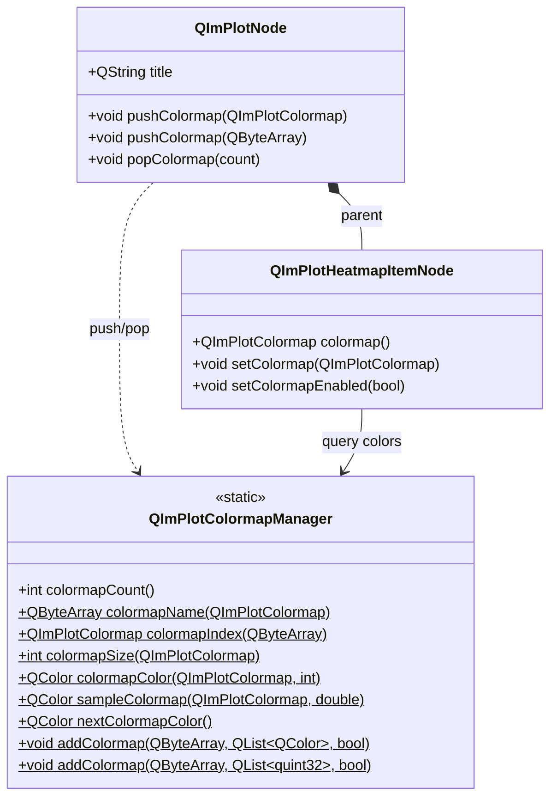

# 2D 颜色映射系统

QIm 的 2D 色彩映射系统由 `QImPlotColormap`（枚举）和 `QImPlotColormapManager`（静态工具类）两部分构成，配合 `QImPlotNode` 的 push/pop 栈操作实现色图切换。色彩映射主要用于 Heatmap、Histogram2D 等二维数据可视化场景，根据数据值映射颜色。系统提供 16 种内置色图，涵盖科学可视化常用的连续色图、定性色图和发散色图，同时支持自定义色图注册。

## 主要功能特性

**特性**

- ✅ **16 种内置色图**：Deep、Dark、Pastel、Viridis、Plasma、Hot、Cool、Pink、Jet、Twilight、RdBu、BrBG、PiYG、Spectral、Greys、Paired
- ✅ **三类色图分类**：连续色图（数值渐变映射）、发散色图（双向对比）、定性色图（离散类别区分）
- ✅ **色图栈管理**：push/pop 栈式色图切换，支持多绘图共享不同色图
- ✅ **色图查询**：通过名称查枚举、通过枚举查名称、获取色图颜色数量、按索引取颜色
- ✅ **色图采样**：`sampleColormap()` 在 0.0~1.0 范围内连续采样色图颜色
- ✅ **自动配色**：`nextColormapColor()` 获取下一个自动分配的色图颜色
- ✅ **自定义注册**：通过 `addColormap()` 注册自定义色图（支持 QColor 和 quint32 两种格式）
- ✅ **命名空间隔离**：2D 和 3D 色图系统使用独立的枚举和管理器，互不干扰

## 基本概念

### 组件关系总览



### 色图分类

QIm 将 16 种内置色图分为三类，适用于不同的数据可视化场景：

| 分类 | 典型色图 | 适用场景 | 特点 |
|------|---------|----------|------|
| **连续色图** | Deep, Dark, Pastel, Viridis, Plasma, Hot, Cool, Pink, Jet, Greys | 数值渐变映射（Heatmap、Histogram2D） | 颜色随数值连续变化 |
| **发散色图** | RdBu, BrBG, PiYG, Spectral | 双向对比（正负差异、偏离基准） | 中间值为中性色，两端分别为两种对比色 |
| **定性色图** | Paired, Twilight | 离散类别区分（多系列自动配色） | 相邻颜色区分度高，无严格数值顺序 |

### 2D 与 3D 色图系统的关系

2D 色图系统（`QImPlotColormap` / `QImPlotColormapManager`）与 3D 色图系统（`QImPlot3DColormap` / `QImPlot3DColormapManager`）使用**完全独立的枚举和管理器**。两者拥有相同的 16 种色图名称和语义，但底层实现分离——2D 色图操作映射到 ImPlot API，3D 色图操作映射到 ImPlot3D API。使用时需选择对应命名空间的枚举和管理器。

!!! info "3D 色图参考"
    如需了解 3D 色彩映射系统的用法，请参考 [3D 配置指南 — 色彩映射章节](plot3d/configuration.md#_10)。两者的 API 设计高度一致，学会 2D 后可无缝迁移到 3D。

## 内置色图（QImPlotColormap）

### 色图枚举与描述

| 枚举值 | ImPlot 对应值 | 分类 | 颜色特征 | 适用场景 |
|--------|---------------|------|---------|----------|
| `Deep` | `ImPlotColormap_Deep` | 连续 | 深蓝色→浅蓝色→黄色（默认色图） | 通用数值映射，视觉层次清晰 |
| `Dark` | `ImPlotColormap_Dark` | 连续 | 深蓝色→紫色→橙黄色 | 暗色背景下的数据可视化 |
| `Pastel` | `ImPlotColormap_Pastel` | 连续 | 整体柔和的粉彩渐变 | 打印友好、报告插图 |
| `Paired` | `ImPlotColormap_Paired` | 定性 | 12 种鲜明配对颜色 | 多类别数据区分，无顺序含义 |
| `Viridis` | `ImPlotColormap_Viridis` | 连续 | 蓝紫→绿→黄（感知均匀） | 科学可视化推荐，色盲友好 |
| `Plasma` | `ImPlotColormap_Plasma` | 连续 | 深紫→粉→黄（感知均匀） | 高对比度连续数据，色盲友好 |
| `Hot` | `ImPlotColormap_Hot` | 连续 | 黑→红→橙→黄→白 | 热力图、温度分布、强度显示 |
| `Cool` | `ImPlotColormap_Cool` | 连续 | 青→蓝→紫冷色渐变 | 低温分布、水下数据 |
| `Pink` | `ImPlotColormap_Pink` | 连续 | 黑→粉→白 | 医用影像、特定领域 |
| `Jet` | `ImPlotColormap_Jet` | 连续 | 蓝→青→绿→黄→红（彩虹色） | 经典彩虹色图，但感知非均匀 |
| `Twilight` | `ImPlotColormap_Twilight` | 定性/循环 | 蓝→粉→橙→绿（循环色图） | 周期性数据、角度数据 |
| `RdBu` | `ImPlotColormap_RdBu` | 发散 | 红→白→蓝 | 正负差异、政治地图、偏离分析 |
| `BrBG` | `ImPlotColormap_BrBG` | 发散 | 棕→白→蓝绿 | 地质数据、收支对比 |
| `PiYG` | `ImPlotColormap_PiYG` | 发散 | 粉→白→黄绿 | 分类对比、基因表达 |
| `Spectral` | `ImPlotColormap_Spectral` | 发散 | 红→橙→黄→绿→蓝 | 多级分类数据、光谱分析 |
| `Greys` | `ImPlotColormap_Greys` | 连续 | 黑→灰→白 | 灰度打印、单色输出 |

!!! tip "色图选择建议"
    - **科学可视化**：优先使用 `Viridis` 或 `Plasma`——它们是感知均匀（perceptually uniform）的色图，对色盲友好，灰度打印也不会丢失信息。
    - **热力图/温度图**：使用 `Hot` 或 `Cool`，直觉上符合人们对温度的认知。
    - **对比分析**：使用 `RdBu`（红蓝发散），直观表达正负偏离。
    - **避免**：`Jet` 色图虽然色彩丰富但在科学可视化中已被广泛批评——不均匀的感知亮度会扭曲数据解读。

### 色图分类对比表

| 特性 | 连续色图 | 发散色图 | 定性色图 |
|------|---------|---------|---------|
| 颜色过渡 | 平滑渐变 | 中间性→两端对比 | 无平滑过渡 |
| 数值含义 | 有顺序（低→高） | 有顺序（负→零→正） | 无顺序 |
| 典型长度 | 可任意采样 | 可任意采样 | 固定颜色数 |
| 色觉障碍友好 | Viridis/Plasma 优秀 | RdBu 可通过灰度区分 | 依赖亮度差异 |
| 灰度打印 | 保留信息（除 Jet） | 中间值可区分 | 可能丢失区分度 |

## 使用方法

### 1. 基本色图设置

通过 `QImPlotNode::pushColormap()` 为当前绘图区域设置色图：

```cpp
#include "QImFigureWidget.h"
#include "plot/QImPlotNode.h"
#include "plot/QImPlotHeatmapItemNode.h"
#include "plot/QImPlot.h"

// 创建绘图窗口
QIM::QImFigureWidget* figure = new QIM::QImFigureWidget(this);

// 创建绘图节点
QIM::QImPlotNode* plot = figure->createPlotNode();
plot->setTitle("热力图 - Viridis 色图");

// 压入 Viridis 色图
plot->pushColormap(QIM::QImPlotColormap::Viridis);

// 创建 Heatmap 绘图元素（使用当前色图）
auto* heatmap = new QIM::QImPlotHeatmapItemNode(plot);
heatmap->setData(data, rows, cols);
heatmap->setColormap(QIM::QImPlotColormap::Viridis);

// 弹出色图（恢复默认）
plot->popColormap(1);
```

### 2. 色图栈管理：push/pop

push/pop 栈机制允许多个绘图元素在同一 ImPlot 上下文中使用不同色图：

```cpp
// 方案1：通过枚举值压入色图
plot->pushColormap(QIM::QImPlotColormap::Hot);
// ... 绘制使用 Hot 色图的元素 ...
plot->popColormap(1);  // 弹出 1 层

// 方案2：通过名称压入色图
plot->pushColormap(QByteArray("Viridis"));
// ... 绘制使用 Viridis 色图的元素 ...
plot->popColormap(1);  // 弹出 1 层

// 批量弹出多层
plot->pushColormap(QIM::QImPlotColormap::Hot);
plot->pushColormap(QIM::QImPlotColormap::Cool);
plot->pushColormap(QIM::QImPlotColormap::Viridis);
// ... 最上层使用 Viridis，中间使用 Cool，底层使用 Hot ...
plot->popColormap(3);  // 一次性弹出 3 层，恢复到初始色图
```

!!! warning "push/pop 必须配对"
    `pushColormap()` 和 `popColormap()` 必须严格配对使用。栈不平衡会导致后续渲染使用错误的色图。push 入栈在 `beginDraw()` 中生效，pop 出栈在 `endDraw()` 中生效。

### 3. 色图查询与采样

通过 `QImPlotColormapManager` 静态方法查询色图信息：

```cpp
#include "plot/QImPlotColormapManager.h"

// 获取可用的色图总数
int count = QIM::QImPlotColormapManager::colormapCount();

// 获取色图名称（枚举 → 名称）
QByteArray name = QIM::QImPlotColormapManager::colormapName(
    QIM::QImPlotColormap::Viridis);  // 返回 "Viridis"

// 通过名称查找色图枚举值（名称 → 枚举）
QIM::QImPlotColormap cmap = QIM::QImPlotColormapManager::colormapIndex(
    QByteArray("Viridis"));  // 返回 QImPlotColormap::Viridis

// 获取色图包含的颜色数量
int size = QIM::QImPlotColormapManager::colormapSize(
    QIM::QImPlotColormap::Viridis);

// 按索引获取色图颜色（index 从 0 开始）
QColor firstColor = QIM::QImPlotColormapManager::colormapColor(
    QIM::QImPlotColormap::Viridis, 0);   // Viridis 的第一个颜色
QColor midColor = QIM::QImPlotColormapManager::colormapColor(
    QIM::QImPlotColormap::Viridis, size / 2);  // Viridis 的中间颜色

// 在 0.0~1.0 范围内连续采样（t = 0.0 为起始颜色，t = 1.0 为终止颜色）
QColor sampled = QIM::QImPlotColormapManager::sampleColormap(
    QIM::QImPlotColormap::RdBu, 0.5);  // RdBu 色图的中间颜色（白色）
QColor low = QIM::QImPlotColormapManager::sampleColormap(
    QIM::QImPlotColormap::RdBu, 0.0);  // 红色（负值端）
QColor high = QIM::QImPlotColormapManager::sampleColormap(
    QIM::QImPlotColormap::RdBu, 1.0);  // 蓝色（正值端）
```

### 4. 自动配色

`nextColormapColor()` 为多系列绘图提供自动颜色分配：

```cpp
// 创建多条曲线，每条使用不同的自动配色
for (int i = 0; i < numSeries; ++i) {
    QColor autoColor = QIM::QImPlotColormapManager::nextColormapColor();

    auto* line = new QIM::QImPlotLineItemNode(plot);
    line->setData(xSeries[i], ySeries[i]);
    line->setColor(autoColor);  // 自动分配的色图颜色
    line->setLabel(QString("系列 %1").arg(i));
}
```

`nextColormapColor()` 基于默认的 `Paired` 定性色图循环分配颜色，确保相邻系列颜色区分度高。

### 5. 注册自定义色图

通过 `addColormap()` 注册自定义色图，支持两种颜色输入格式：

```cpp
// 方式1：通过 QColor 列表注册
QList<QColor> colors = {
    QColor(  0,   0,   0),   // 黑色（最小值）
    QColor(  0,   0, 255),   // 蓝色
    QColor(  0, 255,   0),   // 绿色
    QColor(255, 255,   0),   // 黄色
    QColor(255,   0,   0),   // 红色（最大值）
};
QIM::QImPlotColormapManager::addColormap(
    QByteArray("CustomRainbow"), colors, false);  // qualitative = false：连续色图

// 方式2：通过 quint32 列表注册（RGBA 打包格式）
QList<quint32> packedColors = {
    0xFF000000,   // 黑 (A=255,R=0,G=0,B=0)
    0xFF0000FF,   // 蓝
    0xFF00FF00,   // 绿
    0xFFFFFF00,   // 黄
    0xFFFF0000,   // 红
};
QIM::QImPlotColormapManager::addColormap(
    QByteArray("CustomRainbowPacked"), packedColors, false);

// 注册定性色图（用于类别区分）
QList<QColor> qualColors = {
    QColor(230,  25,  75),   // 红
    QColor( 60, 180,  75),   // 绿
    QColor(255, 225,  25),   // 黄
    QColor(  0, 130, 200),   // 蓝
    QColor(245, 130,  48),   // 橙
    QColor(145,  30, 180),   // 紫
};
QIM::QImPlotColormapManager::addColormap(
    QByteArray("SixCategories"), qualColors, true);  // qualitative = true：定性色图
```

!!! info "qualitative 参数"
    `addColormap()` 的 `qualitative` 参数默认为 `false`：
    - `qualitative = false`：**连续色图**，颜色之间有平滑插值过渡，适用于数值渐变映射。
    - `qualitative = true`：**定性色图**，颜色之间无平滑过渡，相邻颜色区分度高，适用于离散类别区分。

### 6. 综合使用示例

以下示例展示色图查询、栈管理和采样操作的综合用法：

```cpp
#include "QImFigureWidget.h"
#include "plot/QImPlotNode.h"
#include "plot/QImPlotHeatmapItemNode.h"
#include "plot/QImPlotHistogram2DItemNode.h"
#include "plot/QImPlotColormapManager.h"

// 创建绘图窗口
QIM::QImFigureWidget* figure = new QIM::QImFigureWidget(this);
figure->setSubplotGrid(1, 2);

// === 子图 1：Hot 色图 Heatmap ===
if (QIM::QImPlotNode* plot = figure->createPlotNode()) {
    plot->setTitle("温度分布");

    // 查询色图信息
    QByteArray cmapName = QIM::QImPlotColormapManager::colormapName(
        QIM::QImPlotColormap::Hot);
    int cmapSize = QIM::QImPlotColormapManager::colormapSize(
        QIM::QImPlotColormap::Hot);

    // 压入 Hot 色图
    plot->pushColormap(QIM::QImPlotColormap::Hot);

    auto* heatmap = new QIM::QImPlotHeatmapItemNode(plot);
    heatmap->setLabel("传感器数据");
    heatmap->setData(temperatureData, rows, cols);
    heatmap->setColormap(QIM::QImPlotColormap::Hot);

    plot->popColormap(1);
}

// === 子图 2：RdBu 色图 Histogram2D ===
if (QIM::QImPlotNode* plot = figure->createPlotNode()) {
    plot->setTitle("相关性分析");

    // 采样 RdBu 色图中间颜色用于自定义标注
    QColor midColor = QIM::QImPlotColormapManager::sampleColormap(
        QIM::QImPlotColormap::RdBu, 0.5);

    plot->pushColormap(QIM::QImPlotColormap::RdBu);

    auto* hist2D = new QIM::QImPlotHistogram2DItemNode(plot);
    hist2D->setLabel("二维分布");
    hist2D->setData(xData, yData, xBins, yBins);
    hist2D->setColormap(QIM::QImPlotColormap::RdBu);

    plot->popColormap(1);
}
```

## 色图管理器方法参考

`QImPlotColormapManager` 是纯静态工具类（非 QObject），构造函数被删除，不可实例化。所有方法均为静态方法，可直接通过类名调用。

| 方法 | 返回类型 | 说明 |
|------|----------|------|
| `colormapCount()` | `int` | 返回可用色图总数（含 16 个内置色图和所有已注册的自定义色图） |
| `colormapName(QImPlotColormap)` | `QByteArray` | 返回指定色图的名称（如 `Viridis` → `"Viridis"`） |
| `colormapIndex(const QByteArray&)` | `QImPlotColormap` | 通过名称查找色图枚举值（如 `"Viridis"` → `QImPlotColormap::Viridis`） |
| `colormapSize(QImPlotColormap)` | `int` | 返回指定色图中包含的颜色数量 |
| `colormapColor(QImPlotColormap, int)` | `QColor` | 返回色图中指定索引位置的 `QColor` 颜色值 |
| `sampleColormap(QImPlotColormap, double)` | `QColor` | 在 0.0~1.0 范围内线性插值采样色图颜色 |
| `nextColormapColor()` | `QColor` | 基于默认定性色图循环返回下一个自动配色颜色 |
| `addColormap(QByteArray, QList<QColor>, bool)` | `void` | 通过 QColor 列表注册自定义色图 |
| `addColormap(QByteArray, QList<quint32>, bool)` | `void` | 通过 quint32 列表（RGBA 打包格式）注册自定义色图 |

## 注意事项

!!! warning "push/pop 配对"
    `pushColormap()` 和 `popColormap()` 必须严格配对，每次 push 入栈的色图都必须通过 pop 弹出。栈不平衡会导致后续渲染使用错误的色图，且不会报错。

!!! warning "色图命名空间隔离"
    2D 色图枚举（`QIM::QImPlotColormap`）和 3D 色图枚举（`QIM::QImPlot3DColormap`）是两个完全独立的类型，不能混用。2D 色图管理器只能操作 2D 色图枚举，3D 同理。将 2D 色图枚举传给 3D 色图管理器会编译错误。

!!! warning "自定义色图名称唯一性"
    `addColormap()` 注册的自定义色图名称必须在全局范围内唯一。如果注册的名称与已有色图（内置或之前注册的）重复，将覆盖已有的色图。

!!! info "色图生效时机"
    `pushColormap()` 的色图存储在 QImPlotNode 内部的栈中，实际生效是在 `beginDraw()` 调用时将栈顶色图应用到 ImPlot 上下文。`popColormap()` 则在 `endDraw()` 执行。因此，色图设置应在创建绘图元素之前完成。

!!! info "静态工具类生命周期"
    `QImPlotColormapManager` 是纯静态类，无构造函数，不需要创建实例。所有方法均为静态方法，随进程生命周期一直可用。自定义注册的色图在进程结束前一直有效。

!!! info "采样范围"
    `sampleColormap()` 的 `t` 参数范围为 0.0~1.0。超出此范围的颜色值由底层 ImPlot 的插值行为决定，不保证结果可预期。建议始终在 [0.0, 1.0] 范围内采样。

!!! info "定性色图采样行为"
    对定性色图（如 `Paired`）使用 `sampleColormap()` 进行连续采样时，行为取决于底层 ImPlot 实现。定性色图本质上是离散颜色集合，连续采样不会产生平滑渐变。建议定性色图只使用 `colormapColor()` 按索引取色。

## 参考

- 3D 色彩映射系统：[3D 配置指南 — 色彩映射章节](plot3d/configuration.md#_10)
- 2D 绘图容器：[QImPlotNode 使用指南](plot2d/plot-node.md)
- 热力图图表：[2D 特殊图表](plot2d/plot-special-charts.md)
- 渲染节点概念：[渲染节点](render-node.md)
- 示例代码：`examples/qimfigure-test`
- API 参考：`src/core/plot/QImPlot.h`、`src/core/plot/QImPlotColormapManager.h`、`src/core/plot/QImPlotNode.h`
- ImPlot 官方文档：<https://github.com/epezent/implot>