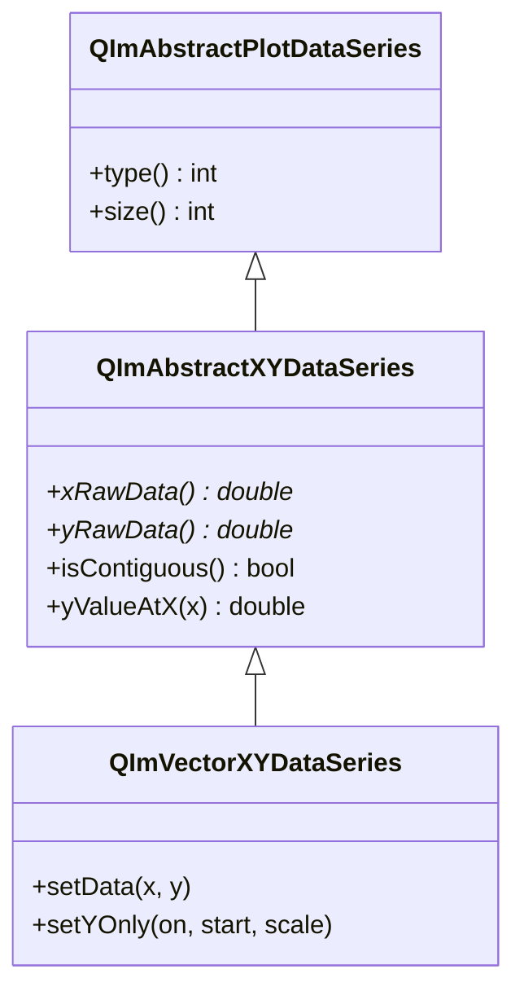

# 数据系列使用指南

QIm通过`QImAbstractXYDataSeries`抽象类封装XY数据，实现零拷贝数据传递。

## 主要功能特性

**特性**

- ✅ **零拷贝渲染**：直接使用原始数据指针，避免数据复制
- ✅ **多容器支持**：支持std::vector、QVector等连续内存容器
- ✅ **Y-only模式**：支持仅提供Y数据，X由公式计算
- ✅ **二分查找**：提供高效的X值查找接口

## 基本概念

### 类继承关系



## 使用方法

### 1. 直接使用容器

```cpp
// 使用std::vector - addLine自动创建数据系列
std::vector<double> x = {0, 1, 2, 3, 4};
std::vector<double> y = {0, 1, 4, 9, 16};
plot->addLine(x, y, "曲线");
```

### 2. Y-only模式

仅提供Y数据，X=索引*scale + start：

```cpp
std::vector<double> y(1000);
for (int i = 0; i < 1000; ++i) {
    y[i] = std::sin(i * 0.01);
}

// 创建数据系列并设置Y-only
auto* series = new QIM::QImVectorXYDataSeries<std::vector<double>, std::vector<double>>({}, y);
series->setYOnly(true, 0.0, 0.01);  // xStart=0, xScale=0.01

auto* line = new QIM::QImPlotLineItemNode();
line->setData(series);
plot->addPlotItem(line);
```

### 3. 数据访问

```cpp
// 获取数据系列
auto* series = line->data();

// 数据大小
int count = series->size();

// 获取指定索引的值
double x = series->xValue(10);
double y = series->yValue(10);

// 二分查找：给定X值查找对应Y
double yVal = series->yValueAtX(2.5, &index, &exact);
```

## API参考

| 方法 | 说明 |
|------|------|
| `size()` | 数据点数量 |
| `xRawData()` | X数据指针（Y-only返回nullptr） |
| `yRawData()` | Y数据指针 |
| `xValue(index)` | 获取指定索引X值 |
| `yValue(index)` | 获取指定索引Y值 |
| `yValueAtX(x, index, exact)` | 给定X查找对应Y |
| `setYOnly(on, start, scale)` | 设置Y-only模式 |

!!! warning "注意事项"
    - 数据容器必须存储`double`类型
    - Y-only模式适合时序数据
    - `yValueAtX`要求X数据单调递增

## 参考

- 相关文档：[线条图](plot-line.md)、[降采样器](downsampling.md)
- API参考：`src/core/plot/QImPlotDataSeries.h`