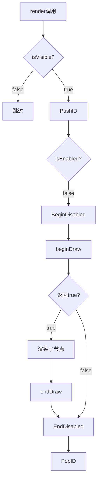

# 自定义节点开发指南

QIm允许继承`QImAbstractNode`创建自定义渲染节点，
封装任意的ImGui/ImPlot渲染逻辑。

## 主要功能特性

**特性**

- ✅ **灵活继承**：继承QImAbstractNode实现任意ImGui区域
- ✅ **对象树集成**：自动融入对象树管理机制
- ✅ **信号槽支持**：可定义自定义信号响应事件
- ✅ **自动ID管理**：渲染时自动推入/弹出ID栈

## 核心机制

### 渲染流程



### 必须实现的方法

| 方法 | 说明 |
|------|------|
| `beginDraw()` | 对应ImGui的Begin类调用，返回是否打开区域 |
| `endDraw()` | 对应ImGui的End类调用 |

## 开发示例

### 1. 自定义窗口节点

```cpp
// CustomWindowNode.h
#include <QImAbstractNode.h>

class CustomWindowNode : public QIM::QImAbstractNode
{
    Q_OBJECT
public:
    explicit CustomWindowNode(QObject* parent = nullptr);
    
    void setTitle(const QString& title);
    
protected:
    bool beginDraw() override;
    void endDraw() override;
    
private:
    QString m_title;
};

// CustomWindowNode.cpp
#include <imgui.h>

bool CustomWindowNode::beginDraw() {
    return ImGui::Begin(m_title.toUtf8().constData(), nullptr, m_flags);
}

void CustomWindowNode::endDraw() {
    ImGui::End();
}
```

### 2. 自定义绘图节点

```cpp
class CustomPlotNode : public QIM::QImAbstractNode
{
protected:
    bool beginDraw() override {
        return ImPlot::BeginPlot("CustomPlot");
    }
    
    void endDraw() override {
        ImPlot::EndPlot();
    }
};
```

### 3. 使用PIMPL模式

```cpp
class AdvancedNode : public QIM::QImAbstractNode
{
    Q_OBJECT
    QIM_DECLARE_PRIVATE(AdvancedNode)
    
public:
    explicit AdvancedNode(QObject* parent = nullptr);
    
protected:
    bool beginDraw() override;
};

// cpp
class AdvancedNode::PrivateData {
    QIM_DECLARE_PUBLIC(AdvancedNode)
public:
    QString m_title;
    ImGuiWindowFlags m_flags = 0;
};
```

!!! warning "注意事项"
    - `beginDraw`返回false时，子节点不会被渲染
    - 不要在beginDraw/endDraw中修改对象树结构
    - 使用PIMPL模式存储状态成员变量

!!! tip "最佳实践"
    - 状态存储使用PIMPL模式封装
    - 复杂节点拆分为多个子节点
    - 提供信号通知外部状态变化

## 参考

- 相关文档：[渲染节点](../render-node.md)、[PIMPL模式](../pimpl-pattern.md)
- ImGui文档：https://github.com/ocornut/imgui