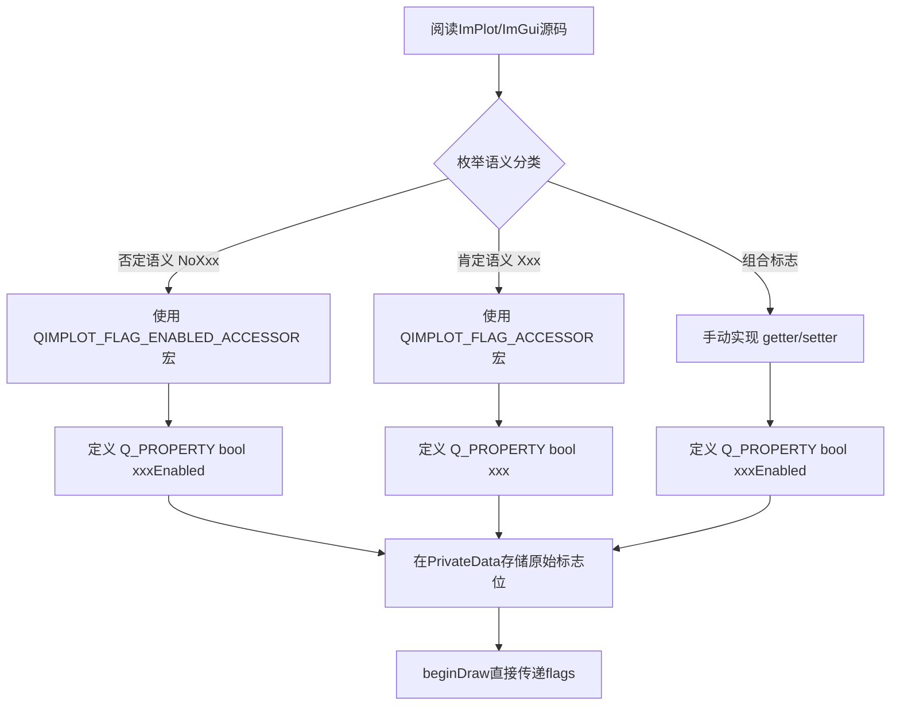

# 枚举语义转换规范

QIm 的核心目标是让 Qt 开发者无需了解 ImPlot/ImGui 的 API 和枚举即可使用。本规范详细说明如何将 ImPlot/ImGui 的位标志（bit flags）枚举转换为 Qt 风格的 Q_PROPERTY 属性，包括否定→肯定语义转换规则和实现宏的使用方法。

## 为什么需要这个规范

ImPlot/ImGui 通过位标志控制功能，大量使用**否定语义**（如 `NoTitle` 表示"禁用标题"），这在 Qt 属性系统中不自然。Qt 开发者期望用 `setTitleEnabled(true)` 来启用标题，而非 `setNoTitle(false)` 来"不禁用标题"。因此需要统一的语义转换规范。

## 主要功能特性

**特性**

- ✅ **头文件不暴露原生类型**：用户只看到Qt风格属性和方法
- ✅ **否定→肯定语义转换**：NoXxx → xxxEnabled，符合Qt习惯
- ✅ **肯定语义直接映射**：Xxx → xxx，逻辑不变
- ✅ **组合标志转换**：多标志组合 → 单一肯定属性
- ✅ **实现宏简化开发**：QIMPLOT_FLAG_ACCESSOR 和 QIMPLOT_FLAG_ENABLED_ACCESSOR
- ✅ **原始标志接口保留**：高级用户可直接操作底层标志位

## 设计原则与动机

1. **头文件不暴露ImPlot/ImGui类型**：用户看到的只有Qt风格的属性和方法，不应出现 `ImPlotFlags`、`ImAxis` 等ImPlot原生类型
2. **枚举转换为Qt属性**：ImPlot/ImGui通过位标志（bit flags）控制功能，QIm将这些标志拆解为独立的 `Q_PROPERTY` 布尔属性，每个属性对应一个功能开关
3. **保留原始标志访问接口**：同时提供一个 `imPlotFlags()`/`setImPlotFlags()` 方法，供高级用户直接操作底层标志位，但常规用户无需关注

## 否定→肯定语义转换

### 转换规则

ImPlot/ImGui的枚举大量使用**否定语义**（`NoXxx`），QIm将其转换为Qt肯定的**肯定语义**属性：

| ImPlot 否定语义枚举 | QIm 肯定语义属性 | 逻辑关系 |
| --- | --- | --- |
| `ImPlotFlags_NoTitle` | `titleEnabled` | `enabled = (flags & NoTitle) == 0` |
| `ImPlotFlags_NoLegend` | `legendEnabled` | `enabled = (flags & NoLegend) == 0` |
| `ImPlotFlags_NoMouseText` | `mouseTextEnabled` | `enabled = (flags & NoMouseText) == 0` |
| `ImPlotFlags_NoInputs` | `inputsEnabled` | `enabled = (flags & NoInputs) == 0` |
| `ImPlotFlags_NoMenus` | `menusEnabled` | `enabled = (flags & NoMenus) == 0` |
| `ImPlotFlags_NoBoxSelect` | `boxSelectEnabled` | `enabled = (flags & NoBoxSelect) == 0` |
| `ImPlotFlags_NoFrame` | `frameEnabled` | `enabled = (flags & NoFrame) == 0` |

!!! info "语义转换逻辑"
    否定→肯定转换的核心逻辑是**反转判断**：
    - getter: `enabled = (flags & NoXxx) == 0` — 标志未设置 = 功能启用
    - setter: `enabled ? flags &= ~NoXxx : flags |= NoXxx` — 启用时清除标志，禁用时设置标志

## 肯定语义直接映射

对于ImPlot原生就是**肯定语义**的枚举，直接映射即可：

| ImPlot 肯定语义枚举 | QIm 肯定语义属性 | 逻辑关系 |
| --- | --- | --- |
| `ImPlotFlags_Equal` | `equal` | `on = (flags & Equal) != 0` |
| `ImPlotFlags_Crosshairs` | `crosshairs` | `on = (flags & Crosshairs) != 0` |

## 组合标志转换

对于**组合标志**（由多个否定标志组合而成），也转换为肯定语义：

| ImPlot 组合枚举 | QIm 肯定语义属性 | 逻辑关系 |
| --- | --- | --- |
| `ImPlotFlags_CanvasOnly` (= NoTitle\|NoLegend\|NoMenus\|NoBoxSelect\|NoMouseText) | `canvasEnabled` | `enabled = (flags & CanvasOnly) == 0` |

组合标志无法使用宏，需要手动实现 getter/setter，因为 setter 需要同时设置/清除多个子标志。

## Q_PROPERTY封装模式

每个标志对应一个Qt属性，使用 `Q_PROPERTY` 暴露：

```cpp
// 否定语义转换后的属性（大多数情况）
Q_PROPERTY(bool titleEnabled READ isTitleEnabled WRITE setTitleEnabled NOTIFY plotFlagChanged)
Q_PROPERTY(bool legendEnabled READ isLegendEnabled WRITE setLegendEnabled NOTIFY plotFlagChanged)
Q_PROPERTY(bool menusEnabled READ isMenusEnabled WRITE setMenusEnabled NOTIFY plotFlagChanged)

// 肯定语义直接映射的属性
Q_PROPERTY(bool equal READ isEqual WRITE setEqual NOTIFY plotFlagChanged)
Q_PROPERTY(bool crosshairs READ isCrosshairs WRITE setCrosshairs NOTIFY plotFlagChanged)
```

### 命名规范

- **getter**: `isXxxEnabled()` 或 `isXxx()`（肯定语义）
- **setter**: `setXxxEnabled(bool enabled)` 或 `setXxx(bool on)`（肯定语义）
- **signal**: 同一节点多个标志属性可共享一个信号（如 `plotFlagChanged()`），因为标志位是统一存储的，任何标志变化都影响同一个 `ImPlotFlags` 值

## 实现宏

QIm提供了两个辅助宏来简化标志属性的 getter/setter 实现，定义在 `src/core/plot/QImPlot.h` 中。

### QIMPLOT_FLAG_ACCESSOR — 肯定语义标志（直接映射）

用于ImPlot原生就是肯定语义的标志：

```cpp
// 宏用法：QIMPLOT_FLAG_ACCESSOR(ClassName, FlagName, FlagEnum, emitFunName)
// 生成 isFlagName() 和 setFlagName(bool on)
//
// getter逻辑: return (flags & FlagEnum) != 0
// setter逻辑: on ? flags |= FlagEnum : flags &= ~FlagEnum

QIMPLOT_FLAG_ACCESSOR(QImPlotNode, Equal, ImPlotFlags_Equal, plotFlagChanged)
QIMPLOT_FLAG_ACCESSOR(QImPlotNode, Crosshairs, ImPlotFlags_Crosshairs, plotFlagChanged)
```

### QIMPLOT_FLAG_ENABLED_ACCESSOR — 否定→肯定语义转换（反转映射）

用于ImPlot否定语义标志，转换为Qt肯定语义属性：

```cpp
// 宏用法：QIMPLOT_FLAG_ENABLED_ACCESSOR(ClassName, PropName, FlagEnum, emitFunName)
// 生成 isPropName() 和 setPropName(bool enabled)
//
// getter逻辑: return (flags & FlagEnum) == 0   ← 关键：反转判断
// setter逻辑: enabled ? flags &= ~FlagEnum : flags |= FlagEnum  ← 关键：反转设置

QIMPLOT_FLAG_ENABLED_ACCESSOR(QImPlotNode, TitleEnabled, ImPlotFlags_NoTitle, plotFlagChanged)
QIMPLOT_FLAG_ENABLED_ACCESSOR(QImPlotNode, LegendEnabled, ImPlotFlags_NoLegend, plotFlagChanged)
QIMPLOT_FLAG_ENABLED_ACCESSOR(QImPlotNode, MenusEnabled, ImPlotFlags_NoMenus, plotFlagChanged)
```

### 组合标志的特殊处理

组合标志无法使用宏，需要手动实现：

```cpp
// getter — 仍然是否定→肯定反转
bool QImPlotNode::isCanvasEnabled() const
{
    QIM_DC(d);
    return (d->plotFlags & ImPlotFlags_CanvasOnly) == 0;
}

// setter — enabled时清除所有子标志，disabled时设置所有子标志
void QImPlotNode::setCanvasEnabled(bool enabled)
{
    QIM_D(d);
    const ImPlotFlags oldFlags = d->plotFlags;
    if (enabled) {
        d->plotFlags &= ~ImPlotFlags_CanvasOnly;  // 清除所有5个No子标志
    } else {
        d->plotFlags |= ImPlotFlags_CanvasOnly;   // 设置所有5个No子标志
    }
    if (d->plotFlags != oldFlags) {
        Q_EMIT plotFlagChanged();
    }
}
```

## beginDraw()中的标志使用

在 `beginDraw()` 中，标志位已经通过属性 setter 组装完毕，直接传递给 ImPlot API 即可：

```cpp
bool QImPlotNode::beginDraw()
{
    QIM_D(d);
    // d->plotFlags 已由各属性setter维护好，无需重新组装
    d->beginPlotSuccess = ImPlot::BeginPlot(title, d->size, d->plotFlags);
    // ...
}
```

!!! warning "关键要点"
    `beginDraw()`中不做标志位的逻辑组装，所有组装工作在setter中完成。`d->plotFlags`是一个统一的 `ImPlotFlags` 整型变量，各属性的setter通过位操作（`|=`, `&= ~`）修改这个变量，`beginDraw()`只需直接传递。

## 属性默认值

属性默认值应与ImPlot默认行为一致。ImPlot的 `ImPlotFlags_None = 0` 表示所有否定标志都未设置（即所有功能默认启用），因此：

```cpp
// PrivateData中初始化
ImPlotFlags plotFlags { ImPlotFlags_None };  // 默认0，所有No*标志未设置

// 对应的QIm属性默认值：
// titleEnabled   → true  (因为 NoTitle 未设置)
// legendEnabled  → true  (因为 NoLegend 未设置)
// menusEnabled   → true  (因为 NoMenus 未设置)
// equal          → false (因为 Equal 未设置)
// crosshairs     → false (因为 Crosshairs 未设置)
```

## 标志转换决策流程



## 参考

- 相关规范：[Qt集成规范](qt-integration.md)、[新节点开发指南](new-node-guide.md)
- 核心概念：[属性系统](../property-system.md)