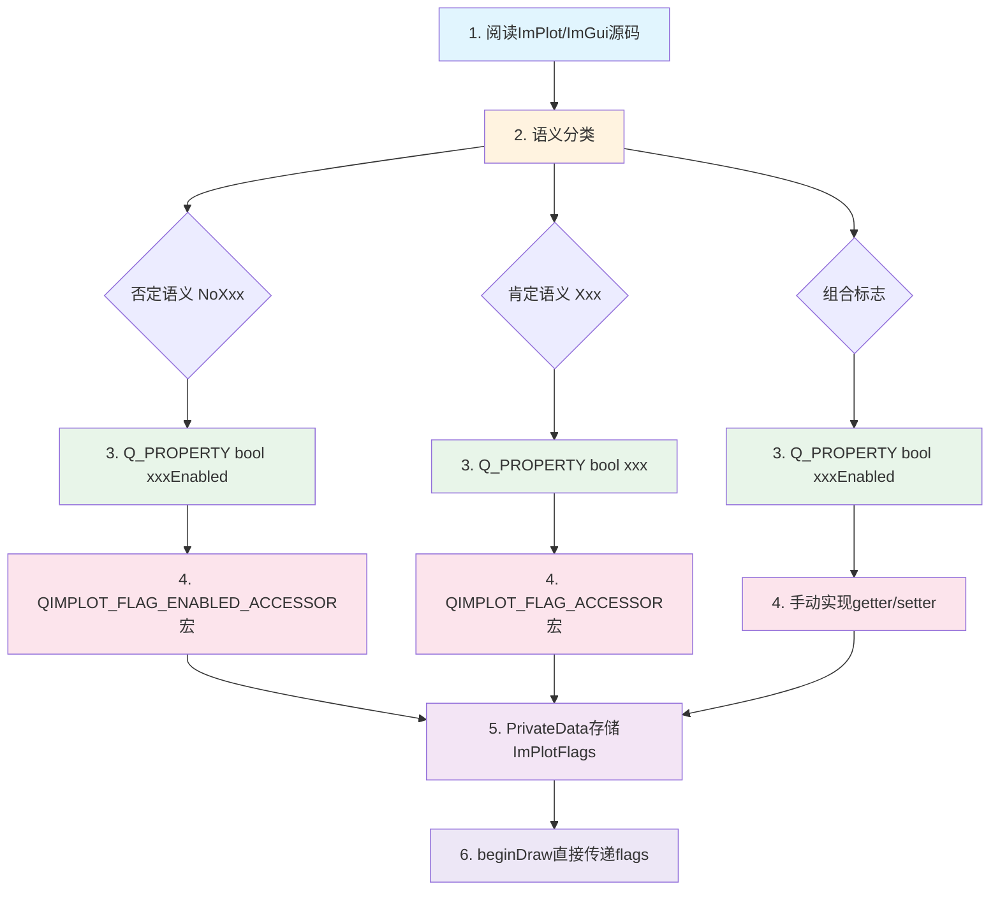

# 新节点开发指南

当开发一个新节点，如果其渲染函数涉及 ImPlot/ImGui 的枚举标志，需要按以下步骤进行。本指南提供完整的操作流程，确保新节点遵循 QIm 的设计规范。

## 主要功能特性

**特性**

- ✅ **5步开发流程**：从阅读源码到完成实现的标准化步骤
- ✅ **语义分类先行**：枚举标志分类后再选择实现方式
- ✅ **Q_PROPERTY规范定义**：每个标志对应一个布尔属性
- ✅ **标志位统一存储**：PrivateData中维护原始标志位变量
- ✅ **beginDraw直接传递**：渲染函数不做额外组装逻辑

## 开发流程

### 步骤1：阅读ImPlot/ImGui源码

理解所有相关枚举的含义、默认值和组合关系。这是所有后续步骤的基础。

!!! tip "技巧"
    重点关注：
    - 枚举值的默认值（通常是 `None = 0`）
    - 否定语义标志（`NoXxx`）的含义
    - 组合标志（多个标志的组合）的组成
    - 各标志之间的依赖关系

### 步骤2：语义分类

将枚举分为三类：

| 类型 | 特征 | 示例 |
|------|------|------|
| **否定语义** | `NoXxx` 前缀，表示"禁用/关闭" | `ImPlotFlags_NoTitle`、`ImPlotFlags_NoMenus` |
| **肯定语义** | 无否定前缀，表示"启用/开启" | `ImPlotFlags_Equal`、`ImPlotFlags_Crosshairs` |
| **组合标志** | 多个标志的组合 | `ImPlotFlags_CanvasOnly` |

### 步骤3：定义Q_PROPERTY

为每个标志创建 `Q_PROPERTY` 布尔属性，使用肯定语义命名：

```cpp
// 否定语义 → xxxEnabled 命名
Q_PROPERTY(bool titleEnabled READ isTitleEnabled WRITE setTitleEnabled NOTIFY plotFlagChanged)
Q_PROPERTY(bool legendEnabled READ isLegendEnabled WRITE setLegendEnabled NOTIFY plotFlagChanged)

// 肯定语义 → xxx 命名
Q_PROPERTY(bool equal READ isEqual WRITE setEqual NOTIFY plotFlagChanged)
Q_PROPERTY(bool crosshairs READ isCrosshairs WRITE setCrosshairs NOTIFY plotFlagChanged)

// 组合标志 → xxxEnabled 命名
Q_PROPERTY(bool canvasEnabled READ isCanvasEnabled WRITE setCanvasEnabled NOTIFY plotFlagChanged)
```

### 步骤4：选择实现方式

根据语义分类选择对应的实现方式：

| 语义类型 | 实现方式 | 说明 |
|----------|----------|------|
| 否定→肯定 | `QIMPLOT_FLAG_ENABLED_ACCESSOR` 宏 | 反转判断和设置逻辑 |
| 肯定→肯定 | `QIMPLOT_FLAG_ACCESSOR` 宏 | 直接映射逻辑 |
| 组合标志 | 手动实现 getter/setter | 需同时设置/清除多个子标志 |

详细宏用法请参考 [枚举语义转换规范](flag-mapping.md)。

### 步骤5：在PrivateData中存储原始标志位

使用 `ImPlotFlags`/`ImGuiFlags` 等原始类型存储，各属性setter通过位操作维护：

```cpp
class QImPlotNode::PrivateData
{
    QIM_DECLARE_PUBLIC(QImPlotNode)
    
public:
    ImPlotFlags plotFlags { ImPlotFlags_None };  // 统一存储所有标志位
    // 各属性setter通过 |= 和 &= ~ 操作修改此变量
};
```

### 步骤6：在beginDraw()中直接传递

将 `d->flags` 直接传给 ImPlot/ImGui API，不做额外组装逻辑：

```cpp
bool QImPlotNode::beginDraw()
{
    QIM_D(d);
    // d->plotFlags 已由各属性setter维护好，无需重新组装
    d->beginPlotSuccess = ImPlot::BeginPlot(d->titleUtf8.constData(), d->size, d->plotFlags);
    return d->beginPlotSuccess;
}
```

## 完整开发流程图



## 新节点开发检查清单

在完成新节点开发后，对照以下清单检查：

- [ ] 所有枚举标志已按语义分类
- [ ] 每个标志对应一个 `Q_PROPERTY` 布尔属性
- [ ] getter/setter 使用正确的实现方式（宏或手动）
- [ ] `PrivateData` 中使用原始类型存储标志位
- [ ] 属性默认值与 ImPlot/ImGui 默认行为一致
- [ ] `beginDraw()` 直接传递标志位，不做额外组装
- [ ] 头文件不暴露 ImPlot/ImGui 原生类型
- [ ] 字符串属性使用 UTF8-only 存储规范
- [ ] 信号使用 `Q_SIGNALS` 和 `Q_EMIT` 大写宏

!!! warning "常见错误"
    - ❌ 在 `beginDraw()` 中组装标志位逻辑
    - ❌ 同时存储 QString 和 QByteArray
    - ❌ 头文件暴露 `ImPlotFlags` 类型
    - ❌ 使用小写 `emit`/`signals`/`slots` 宏

## 参考

- 相关规范：[枚举语义转换规范](flag-mapping.md)、[渲染性能规范](render-guidelines.md)、[PIMPL开发规范](pimpl-dev-guide.md)
- 使用指南：[自定义节点](custom-node.md)