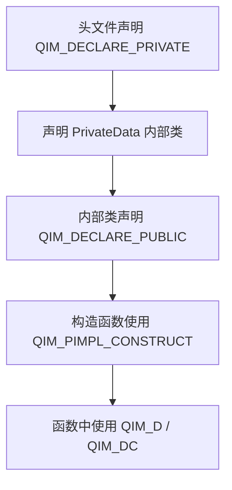

# PIMPL开发规范

QIm使用PIMPL（Private Implementation）模式，将实现细节封装在 `private` 成员中，对外提供接口在 `public` 成员中。本文档详细说明 QIm 的 PIMPL 宏使用方式和代码规范。

## 为什么需要这个规范

PIMPL模式是 Qt 项目的常见实践，它可以：

- **隐藏实现细节**：减少头文件编译依赖，加快编译速度
- **保持ABI稳定**：修改私有成员不影响二进制兼容性
- **封装内部数据**：公开接口清晰，私有实现自由变更

## 主要功能特性

**特性**

- ✅ **QIM_DECLARE_PRIVATE**：在类中声明PIMPL私有成员和内部类
- ✅ **QIM_DECLARE_PUBLIC**：在内部类中声明反向指针
- ✅ **QIM_PIMPL_CONSTRUCT**：构造函数初始化快捷宏
- ✅ **QIM_D / QIM_DC**：便捷获取d_ptr指针

## PIMPL宏说明

QIm的PIMPL模式所需的宏位于 `src/QImAPI.h`，主要涉及以下宏：

### QIM_DECLARE_PRIVATE

在类中声明PIMPL的私有成员，它会生成：

- `private` 成员变量 `d_ptr`
- 内部类 `PrivateData` 的声明框架
- 互为友元的声明

```cpp
class QImPlotNode : public QImAbstractNode
{
    QIM_DECLARE_PRIVATE(QImPlotNode)  // 生成 d_ptr 和 PrivateData 内部类
    // ...
};
```

### QIM_DECLARE_PUBLIC

在内部类 `PrivateData` 中声明PIMPL的公有成员，它会生成：

- `public` 成员变量 `q_ptr`，指向属主类
- 互为友元的声明

```cpp
class QImPlotNode::PrivateData
{
    QIM_DECLARE_PUBLIC(QImPlotNode)  // 生成 q_ptr 反向指针
    // 私有实现数据...
};
```

### QIM_PIMPL_CONSTRUCT

在构造函数中初始化PIMPL私有成员变量的快捷操作宏：

```cpp
QImPlotNode::QImPlotNode(QObject* parent)
    : QImAbstractNode(parent)
    , QIM_PIMPL_CONSTRUCT  // 初始化 d_ptr
{
}
```

### QIM_D 和 QIM_DC

用于获取 `d_ptr` 指针的便捷宏：

- **QIM_D**：在非const函数中获取 `PrivateData*`
- **QIM_DC**：在const函数中获取 `const PrivateData*`

```cpp
void MyClass::foo1() {
    QIM_D(d);  // 扩展为 PrivateData* d = d_func()
    d->xx();   // 直接访问私有成员
}

void MyClass::foo2() const {
    QIM_DC(d);  // 扩展为 const PrivateData* d = d_func()
    d->xxc();   // 只读访问私有成员
}
```

## 使用方法

### 完整PIMPL类结构

以下是 QIm 中使用 PIMPL 模式的完整类结构示例：

**头文件 (.h)：**

```cpp
class QImPlotNode : public QImAbstractNode
{
    Q_OBJECT
    QIM_DECLARE_PRIVATE(QImPlotNode)  // PIMPL声明
    
    // Q_PROPERTY声明...
    
public:
    // Constructor for QImPlotNode
    QImPlotNode(QObject* parent = nullptr);
    
    // Get the plot title
    QString title() const;
    
    // Set the plot title
    void setTitle(const QString& title);
    
Q_SIGNALS:
    void titleChanged(const QString& title);
};

// PrivateData内部类声明
class QImPlotNode::PrivateData
{
    QIM_DECLARE_PUBLIC(QImPlotNode)  // 反向指针声明
    
public:
    QByteArray titleUtf8;  // UTF8格式存储
    ImPlotFlags plotFlags { ImPlotFlags_None };
};
```

**源文件 (.cpp)：**

```cpp
QImPlotNode::QImPlotNode(QObject* parent)
    : QImAbstractNode(parent)
    , QIM_PIMPL_CONSTRUCT  // PIMPL初始化
{
}

QString QImPlotNode::title() const
{
    QIM_DC(d);  // const函数使用 QIM_DC
    return QString::fromUtf8(d->titleUtf8);
}

void QImPlotNode::setTitle(const QString& title)
{
    QIM_D(d);  // 非const函数使用 QIM_D
    QByteArray utf8 = title.toUtf8();
    if (d->titleUtf8 != utf8) {
        d->titleUtf8 = utf8;
        Q_EMIT titleChanged(title);
    }
}
```

### PIMPL使用流程



!!! warning "注意事项"
    - `QIM_D` 用于非const函数，`QIM_DC` 用于const函数，不可混用
    - `PrivateData` 类中不应暴露 `ImPlot`/`ImGui` 原生类型给头文件，所有原生类型仅在 `.cpp` 中使用
    - 变量名使用 `d` 是惯例，不要使用其他名称

**如果这个类使用了PIMPL，不要在类的头文件中出现私有成员变量的定义，私有成员变量都应该在`PrivateData`类**

## 参考

- 核心概念：[PIMPL模式](../pimpl-pattern.md)（用户视角文档）
- 相关规范：[Qt集成规范](qt-integration.md)、[渲染性能规范](render-guidelines.md)
