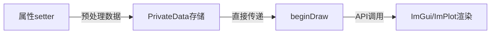

# 渲染性能规范

ImGui 的节点是实时渲染，每帧都会执行 `beginDraw()`/`endDraw()` 函数。因此，渲染函数中不应进行过多的复杂逻辑，所有数据准备工作应在属性设置（setter）过程中完成。本规范规定了节点渲染的代码编写要求，确保渲染性能最优。

## 主要功能特性

**特性**

- ✅ **beginDraw最小化原则**：渲染函数只做最简单的API调用
- ✅ **UTF8-only存储规范**：节点内部只存储UTF8格式数据，避免运行时转换
- ✅ **setter预处理原则**：所有数据转换、计算在setter中完成
- ✅ **避免运行时数据准备**：beginDraw中不做条件判断后的数据准备

## beginDraw最小化原则

### 核心规则

`beginDraw()` 函数应该只做最简单的数据传递给 ImGui/ImPlot API：

- **直接传递**已准备好的数据
- **不做**数据转换（如 `toUtf8()`）
- **不做**条件判断后的数据准备
- **不做**复杂的计算逻辑



### 正确模式

```cpp
bool QImPlotNode::beginDraw()
{
    QIM_D(d);
    // d->plotFlags 已由各属性setter维护好，无需重新组装
    d->beginPlotSuccess = ImPlot::BeginPlot(d->titleUtf8.constData(), d->size, d->plotFlags);
    return d->beginPlotSuccess;
}
```

### 错误模式（禁止）

```cpp
bool QImPlotNode::beginDraw()
{
    // ❌ 错误：在beginDraw中组装标志
    ImPlotFlags flags = ImPlotFlags_None;
    if (!d->showTitle) flags |= ImPlotFlags_NoTitle;
    if (!d->showLegend) flags |= ImPlotFlags_NoLegend;
    
    // ❌ 错误：在beginDraw中转换字符串
    QByteArray titleUtf8 = d->title.toUtf8();
    
    ImPlot::BeginPlot(titleUtf8.constData(), d->size, flags);
}
```

## 字符串存储规范（重要）

### 原则：节点只存储UTF8格式数据，不存储QString

属性接口接受 `QString` 参数（符合Qt习惯），但 ImGui 接口只接受 `char*`，节点内部变量应该**只存储 `QByteArray`（UTF8格式）**，避免在 `beginDraw` 函数中进行 `toUtf8()` 转换，也避免同时存储 QString 和 QByteArray 造成内存浪费。

### 正确模式

```cpp
// PrivateData - 只存储QByteArray
class QImPlotAnnotationNode::PrivateData
{
    QByteArray textUtf8;  ///< 文本内容(UTF8格式，直接供ImGui使用)
    // 不要存储 QString text;
};

// getter - 从UTF8转换回QString
QString QImPlotAnnotationNode::text() const
{
    return QString::fromUtf8(d_ptr->textUtf8);
}

// setter - 转换后只存储UTF8
void QImPlotAnnotationNode::setText(const QString& text)
{
    QIM_D(d);
    QByteArray utf8 = text.toUtf8();
    if (d->textUtf8 != utf8) {
        d->textUtf8 = utf8;
        Q_EMIT textChanged(text);
    }
}

// beginDraw - 直接使用UTF8数据，无需转换
bool QImPlotAnnotationNode::beginDraw()
{
    QIM_D(d);
    if (d->textUtf8.isEmpty()) {
        // 无文本的情况
    } else {
        // 直接使用UTF8数据
        ImPlot::Annotation(..., "%s", d->textUtf8.constData());
    }
}
```

### 错误模式（禁止）

```cpp
// ❌ 错误：存储QString和QByteArray两份数据
QString text;          // 多余存储
QByteArray textUtf8;   // 冗余

// ❌ 错误：在beginDraw中进行转换
bool beginDraw() {
    QByteArray utf8 = d->text.toUtf8();  // 性能损失！
    ImPlot::Annotation(..., "%s", utf8.constData());
}
```

!!! warning "强制规范"
    - 节点只存储 `QByteArray`（UTF8格式），**不存储QString**
    - getter 函数从 UTF8 转换回 QString 返回给用户
    - setter 函数接收 QString 后立即转为 UTF8 存储
    - beginDraw 函数直接使用 `constData()` 传递给 ImGui/ImPlot API

## 其他性能注意事项

### 所有数据转换在setter中完成

```cpp
void QImPlotLineNode::setColor(const QColor& color)
{
    QIM_D(d);
    // 在setter中完成QColor到ImVec4的转换
    d->imVec4Color = ImVec4(color.redF(), color.greenF(), color.blueF(), color.alphaF());
    if (d->qColor != color) {
        d->qColor = color;
        Q_EMIT colorChanged(color);
    }
}

bool QImPlotLineNode::beginDraw()
{
    QIM_D(d);
    // 直接使用已转换的ImVec4，无需运行时转换
    ImPlot::SetNextLineStyle(d->imVec4Color);
    ImPlot::PlotLine(d->labelUtf8.constData(), d->xData, d->yData, d->count);
}
```

### 避免beginDraw中的条件数据准备

```cpp
// ❌ 错误：条件判断后的数据准备
bool beginDraw() {
    QIM_D(d);
    if (d->style == StyleA) {
        prepareStyleAData();  // 不应在渲染时准备数据
    } else {
        prepareStyleBData();  // 不应在渲染时准备数据
    }
}

// ✅ 正确：在setter中完成准备
void setStyle(Style style) {
    QIM_D(d);
    d->style = style;
    if (style == StyleA) {
        prepareStyleAData();  // 在setter中准备
    } else {
        prepareStyleBData();  // 在setter中准备
    }
}
```

### 使用isEmpty()检查QByteArray

```cpp
bool beginDraw() {
    QIM_D(d);
    // ✅ 正确：使用isEmpty()检查QByteArray
    if (d->textUtf8.isEmpty()) {
        // 无文本
    }
    
    // ❌ 禁止：不应该存储QString来检查
    // if (d->text.isEmpty()) { ... }
}
```

## 性能规范总结

| 规范 | 位置 | 说明 |
|------|------|------|
| 数据转换 | setter | 所有QColor→ImVec4、QString→QByteArray转换在setter完成 |
| 数据存储 | PrivateData | 只存储ImGui可直接使用的格式（UTF8、ImVec4等） |
| beginDraw | 渲染函数 | 只做API调用，直接传递已准备好的数据 |
| 字符串检查 | beginDraw | 使用 `QByteArray::isEmpty()` 而非QString |

## 参考

- 相关规范：[PIMPL开发规范](pimpl-dev-guide.md)、[枚举语义转换规范](flag-mapping.md)
- 核心概念：[渲染节点](../render-node.md)、[渲染模式](../render-mode.md)