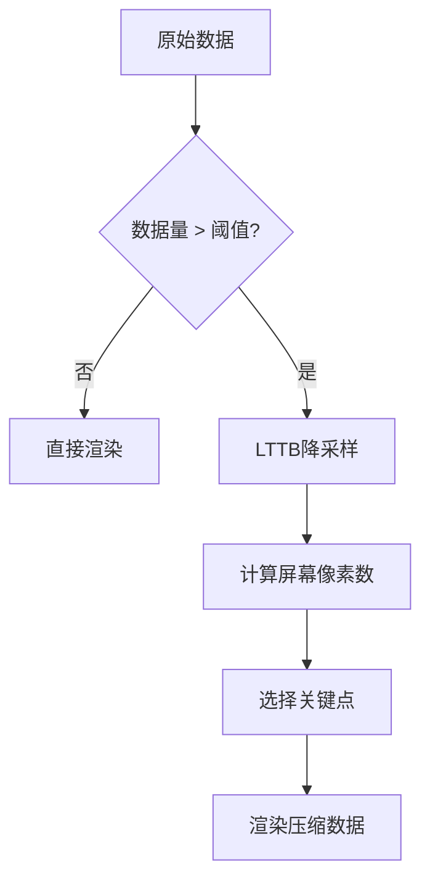

# 降采样器使用指南

QIm内置基于LTTB（Largest-Triangle-Three-Buckets）算法的降采样器，
用于大数据量渲染时保持视觉效果的同时提高性能。

## 主要功能特性

**特性**

- ✅ **LTTB算法**：保留视觉特征的数据压缩算法
- ✅ **自适应采样**：根据屏幕像素自动计算采样点数
- ✅ **实时处理**：渲染时动态降采样，无需预处理
- ✅ **可配置阈值**：可设置触发降采样的数据量阈值

## 基本概念

### 为什么需要降采样

渲染百万级数据点时：
- GPU渲染压力极大，帧率下降
- 屏幕像素有限，大量数据点重叠显示
- 用户无法区分密集数据细节

LTTB算法智能保留视觉关键点，在保持曲线形状的同时大幅减少渲染数据量。

### 工作原理



## 使用方法

### 1. 默认配置（已启用）

`QImPlotLineItemNode`默认启用自适应降采样：

```cpp
// 默认已启用，无需配置
auto* line = plot->addLine(x, y, "曲线");
// line->isAdaptiveSampling() == true
```

### 2. 关闭降采样

对于小数据量或需要精确渲染时：

```cpp
line->setAdaptivesSampling(false);
```

### 3. 配置阈值

设置触发降采样的最小数据量：

```cpp
// QImLTTBDownsampler相关配置（内部处理）
// 默认阈值约为屏幕像素数的3倍
```

## 效果对比

| 数据量 | 无降采样FPS | 有降采样FPS |
|--------|-------------|-------------|
| 10万 | ~60 | ~60 |
| 100万 | ~10 | ~25 |
| 500万 | ~2 | ~4 |

!!! info "说明"
    - 降采样后数据点数 ≈ 屏幕像素宽度 × 3
    - 保留曲线峰值、谷值等关键特征
    - 不影响数据交互（鼠标悬停仍显示原始值）

!!! tip "最佳实践"
    - 10万点以下：可关闭降采样获得精确渲染
    - 10万-100万点：保持启用，性能与精度平衡
    - 100万点以上：必须启用，否则帧率过低

## 参考

- 相关文档：[性能对比](performance.md)
- API参考：`src/core/plot/QImLTTBDownsampler.h`