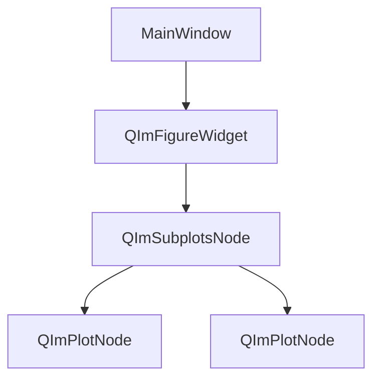
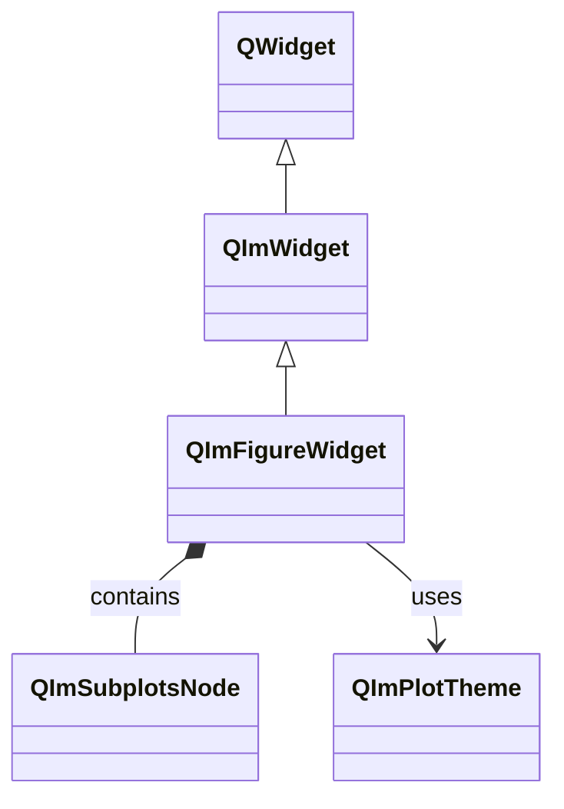
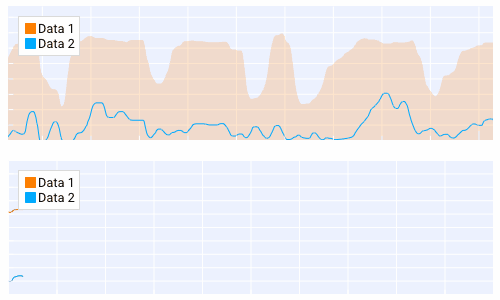

# QImFigureWidget 使用指南

`QImFigureWidget`是QIm的核心绘图窗口控件，继承自`QWidget`，
内部封装了ImGui渲染上下文和子图布局管理器。

## 主要功能特性

**特性**

- ✅ **子图布局**：支持多行多列的子图网格布局，可自定义比例
- ✅ **自动节点管理**：通过`createPlotNode()`自动创建并管理绘图节点
- ✅ **主题配置**：支持通过`QImPlotTheme`配置绘图样式
- ✅ **Qt集成**：作为标准QWidget嵌入Qt窗口系统
- ✅ **信号通知**：提供绘图节点添加/移除信号

## 基本概念

### 组件定位

QImFigureWidget在对象树中的位置：



### 类继承关系



## 使用方法

示例代码位于:`examples/qimfigure-test`，效果截图如下：



### 1. 基本使用

创建单图绘图窗口：

```cpp
#include <QImFigureWidget.h>

// 在MainWindow中创建绘图窗口
QIM::QImFigureWidget* figure = new QIM::QImFigureWidget(this);
setCentralWidget(figure);  // 作为中央部件

// 创建单个绘图（默认1x1布局）
QIM::QImPlotNode* plot = figure->createPlotNode();
plot->setTitle("示例图表");

// 添加曲线
QVector<double> x = {0, 1, 2, 3, 4};
QVector<double> y = {0, 1, 4, 9, 16};
plot->addLine(x, y, "二次曲线");
```

效果：显示一个包含单条曲线的绘图窗口。

### 2. 多子图布局

配置多行多列的子图网格：

```cpp
// 创建绘图窗口
QIM::QImFigureWidget* figure = new QIM::QImFigureWidget(this);

// 配置2行1列的子图布局
figure->setSubplotGrid(2, 1);

// 创建第一个子图
QIM::QImPlotNode* plot1 = figure->createPlotNode();
plot1->setTitle("时域波形");
plot1->x1Axis()->setLabel("时间 (s)");
plot1->y1Axis()->setLabel("幅度");

// 创建第二个子图
QIM::QImPlotNode* plot2 = figure->createPlotNode();
plot2->setTitle("频域分析");
plot2->x1Axis()->setLabel("频率 (Hz)");
plot2->y1Axis()->setLabel("功率");

// 注意：createPlotNode按顺序填充子图格子
```

### 3. 自定义子图比例

设置不同行/列的显示比例：

```cpp
// 配置2行2列，第一行占70%高度
figure->setSubplotGrid(2, 2, 
    std::vector<float>{0.7f, 0.3f},  // 行比例
    std::vector<float>{0.5f, 0.5f}   // 列比例
);
```

### 4. 绘图节点管理

手动管理绘图节点的添加和移除：

```cpp
// 获取所有绘图节点
QList<QIM::QImPlotNode*> plots = figure->plotNodes();

// 绘图数量
int count = figure->plotCount();

// 插入绘图到指定位置
QIM::QImPlotNode* newPlot = new QIM::QImPlotNode();
figure->insertPlotNode(0, newPlot);  // 插入到最前面

// 移除绘图（保留所有权）
figure->takePlotNode(plot);  // plot不会被删除

// 移除绘图（销毁）
figure->removePlotNode(plot);  // plot会被删除
```

### 5. 主题配置

通过QImPlotTheme配置绘图样式：

```cpp
QIM::QImPlotTheme theme;
theme.backgroundColor = QColor(30, 30, 30);
theme.axisColor = QColor(200, 200, 200);
theme.gridColor = QColor(100, 100, 100);

figure->setPlotTheme(theme);
```

## API参考

| 属性/方法 | 参数类型 | 说明 |
|-----------|----------|------|
| `setSubplotGrid(rows, cols)` | int, int | 设置子图网格 |
| `setSubplotGrid(rows, cols, rowRatios, colRatios)` | int, int, vector, vector | 带比例的网格设置 |
| `subplotGridRows()` | - | 获取子图行数 |
| `subplotGridColumns()` | - | 获取子图列数 |
| `createPlotNode()` | - | 创建绘图节点 |
| `plotNodes()` | - | 获取所有绘图节点 |
| `plotCount()` | - | 获取绘图数量 |
| `addPlotNode(plot)` | QImPlotNode* | 添加绘图节点 |
| `insertPlotNode(index, plot)` | int, QImPlotNode* | 插入绘图节点 |
| `takePlotNode(plot)` | QImPlotNode* | 取出绘图节点（保留所有权） |
| `removePlotNode(plot)` | QImPlotNode* | 移除绘图节点（销毁） |
| `setPlotTheme(theme)` | QImPlotTheme | 设置绘图主题 |
| `plotTheme()` | - | 获取当前主题 |
| `subplotNode()` | - | 获取子图布局节点 |

!!! warning "注意事项"
    - `createPlotNode()`返回nullptr表示子图格子已满
    - 绘图节点删除会触发`plotNodeAttached(false)`信号
    - 子图数量超过网格容量时，新绘图不可见

## 信号槽连接

| 信号 | 参数 | 触发时机 |
|------|------|----------|
| `plotNodeAttached(plot, attach)` | QImPlotNode*, bool | 绘图节点添加或移除时 |

```cpp
// 监控绘图节点的添加
connect(figure, &QIM::QImFigureWidget::plotNodeAttached,
        this, &MyClass::onPlotChanged);

void MyClass::onPlotChanged(QIM::QImPlotNode* plot, bool attach) {
    if (attach) {
        qDebug() << "新绘图已添加";
    } else {
        qDebug() << "绘图已移除";
    }
}
```

## 参考

- 相关文档：[QImPlotNode](plot-node.md)、[渲染节点](render-node.md)
- 示例代码：`examples/qimfigure-test`
- API参考：`src/widgets/QImFigureWidget.h`