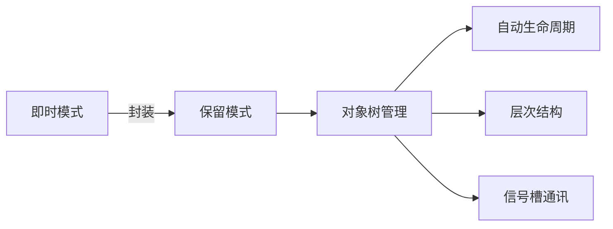
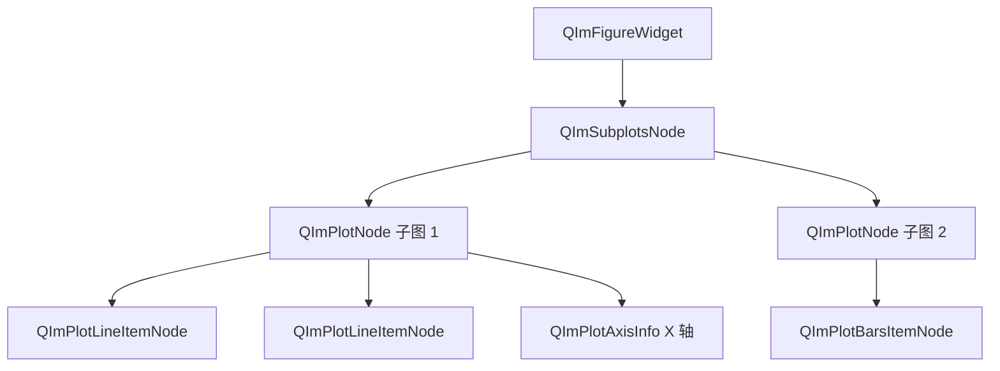
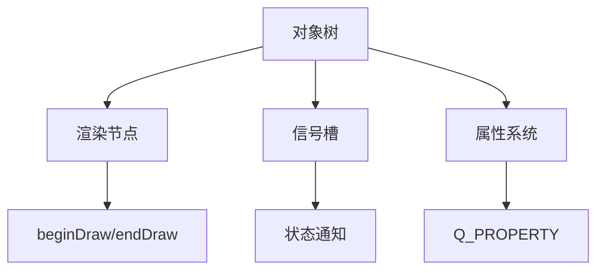

# 对象树管理

QIm 采用 Qt 风格的**对象树（Object Tree）**机制管理 UI 组件的生命周期和层次结构，
让熟悉 Qt 的开发者无需学习新的管理模式即可快速上手。

## 为什么需要对象树

ImGui 原生采用即时模式，UI 结构在每帧渲染时重建，不存在持久化的组件对象。
这种设计带来了几个问题：

1. **代码结构混乱**：嵌套的 Begin/End 调用形成"缩进地狱"
2. **状态管理困难**：窗口位置、折叠状态等需要手动保存
3. **代码复用性差**：重复的模板代码难以抽象

QIm 通过对象树封装解决了这些问题：



## 核心原理

### 设计思想

QIm 将 ImGui 的每个 UI 区域（Window、Plot、Child 等）映射为一个**节点对象**：
- 每个节点对应一个 `QObject` 派生类实例
- 父子关系通过 Qt 的对象树自动管理
- 节点销毁时自动清理所有子节点

### 对象树结构

典型的 QIm 绘图对象树结构如下：



文本表示：

```text
QImFigureWidget (根节点 - QWidget)
├── QImSubplotsNode (子图布局管理器)
│   ├── QImPlotNode (子图 1)
│   │   ├── QImPlotLineItemNode (曲线 A)
│   │   ├── QImPlotLineItemNode (曲线 B)
│   │   ├── QImPlotAxisInfo (X1 轴)
│   │   └── QImPlotAxisInfo (Y1 轴)
│   └── QImPlotNode (子图 2)
│       ├── QImPlotBarsItemNode (柱状图)
│       └── QImPlotLegendNode (图例)
└── [其它顶层节点...]
```

### 父子关系建立

节点创建时通过构造函数的 `parent` 参数自动建立父子关系：

```cpp
// 创建绘图窗口作为根节点
QIM::QImFigureWidget* figure = new QIM::QImFigureWidget(this);  // figure 作为 MainWindow 的子对象

// 创建子图节点，以 figure 为父节点
QIM::QImPlotNode* plot = figure->createPlotNode();  // plot 自动成为 figure->subplotNode() 的子节点

// 创建曲线节点，以 plot 为父节点
QIM::QImPlotLineItemNode* line = new QIM::QImPlotLineItemNode(plot);  // line 自动成为 plot 的子节点
```

!!! info "说明"
    QImAbstractNode 同时维护两套父子关系：
    - **QObject 父子关系**：标准的 Qt 对象树，控制内存生命周期
    - **逻辑父子关系**：渲染时的层次关系，控制绘制顺序

## 如何应用

### 节点生命周期管理

得益于 Qt 对象树，节点销毁时会自动清理所有子节点：

```cpp
// 销毁绘图节点时，其下所有曲线、坐标轴等子节点自动销毁
QIM::QImPlotNode* plot = figure->createPlotNode();
// ... 添加多个子节点 ...
delete plot;  // 所有子节点自动销毁，无需手动清理
```

### 手动管理子节点

QImAbstractNode 提供子节点管理 API：

| 方法 | 说明 |
|------|------|
| `addChildNode(child)` | 添加子节点 |
| `removeChildNode(child)` | 移除子节点（销毁） |
| `takeChildNode(child)` | 取出子节点（保留所有权） |
| `clearChildrenNodes()` | 清空所有子节点 |
| `childrenNodes()` | 获取子节点列表 |
| `parentNode()` | 获取父节点 |

### Z-Order 控制

子节点按 Z-Order 值排序渲染，可控制绘制顺序：

```cpp
// 设置 Z-Order 值，数值大的后绘制（覆盖在上层）
backgroundNode->setZOrder(0);
foregroundNode->setZOrder(100);
```

## 与相关概念的关系



!!! tip "最佳实践"
    - 始终通过 parent 参数创建节点，让对象树管理生命周期
    - 避免手动 delete 子节点，除非需要提前销毁
    - 使用 takeChildNode() 而非 removeChildNode() 保留节点所有权

## 参考

- 相关文档：[渲染节点](render-node.md)
- API 参考：`QImAbstractNode` 类文档（Doxygen 生成）
