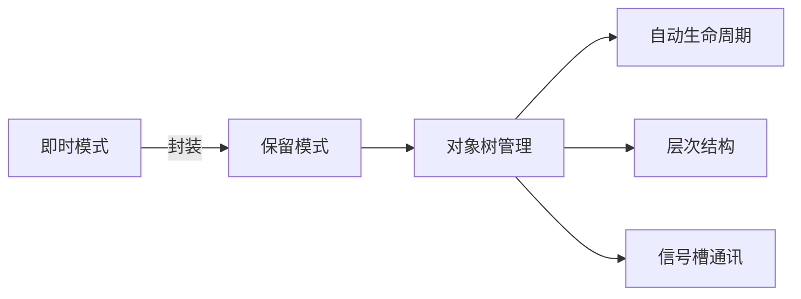
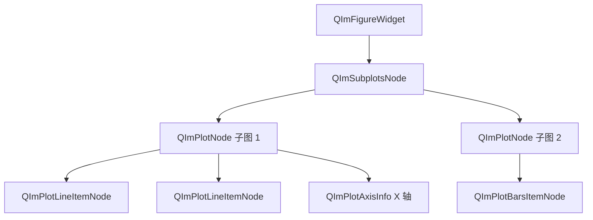
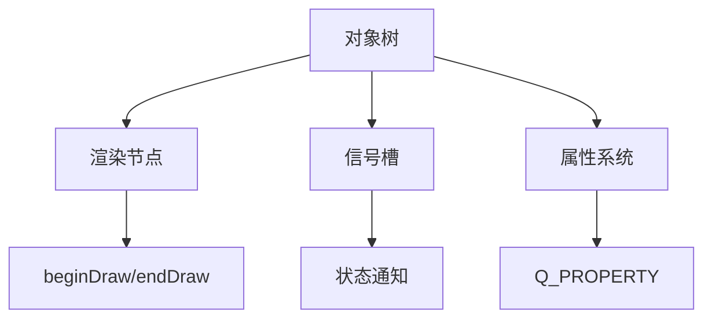

# 对象树管理

QIm 采用 Qt 风格的**对象树（Object Tree）**机制管理 UI 组件的生命周期和层次结构，
让熟悉 Qt 的开发者无需学习新的管理模式即可快速上手。

## 为什么需要对象树

ImGui 原生采用即时模式，UI 结构在每帧渲染时重建，不存在持久化的组件对象。
这种设计带来了几个问题：

1. **代码结构混乱**：嵌套的 Begin/End 调用形成"缩进地狱"
2. **状态管理困难**：窗口位置、折叠状态等需要手动保存
3. **代码复用性差**：重复的模板代码难以抽象

QIm 通过对象树封装解决了这些问题：


```mermaid
graph LR
    A[即时模式] -->|封装 | B[保留模式]
    B --> C[对象树管理]
    C --> D[自动生命周期]
    C --> E[层次结构]
    C --> F[信号槽通讯]
```

## 核心原理

### 设计思想

QIm 将 ImGui 的每个 UI 区域（Window、Plot、Child 等）映射为一个**节点对象**：
- 每个节点对应一个 `QObject` 派生类实例
- 父子关系通过 Qt 的对象树自动管理
- 节点销毁时自动清理所有子节点

### 对象树结构

典型的 QIm 绘图对象树结构如下：


```mermaid
graph TD
    Root[QImFigureWidget] --> Subplot[QImSubplotsNode]
    Subplot --> Plot1[QImPlotNode 子图 1]
    Subplot --> Plot2[QImPlotNode 子图 2]
    Plot1 --> Line1[QImPlotLineItemNode]
    Plot1 --> Line2[QImPlotLineItemNode]
    Plot1 --> Axis1[QImPlotAxisInfo X 轴]
    Plot2 --> Bar1[QImPlotBarsItemNode]
```

文本表示：

```text
QImFigureWidget (根节点 - QWidget)
├── QImSubplotsNode (子图布局管理器)
│   ├── QImPlotNode (子图 1)
│   │   ├── QImPlotLineItemNode (曲线 A)
│   │   ├── QImPlotLineItemNode (曲线 B)
│   │   ├── QImPlotAxisInfo (X1 轴)
│   │   └── QImPlotAxisInfo (Y1 轴)
│   └── QImPlotNode (子图 2)
│       ├── QImPlotBarsItemNode (柱状图)
│       └── QImPlotLegendNode (图例)
└── [其它顶层节点...]
```

### 父子关系建立

节点创建时通过构造函数的 `parent` 参数自动建立父子关系：

```cpp
// 创建绘图窗口作为根节点
QIM::QImFigureWidget* figure = new QIM::QImFigureWidget(this);  // figure 作为 MainWindow 的子对象

// 创建子图节点，以 figure 为父节点
QIM::QImPlotNode* plot = figure->createPlotNode();  // plot 自动成为 figure->subplotNode() 的子节点

// 创建曲线节点，以 plot 为父节点
QIM::QImPlotLineItemNode* line = new QIM::QImPlotLineItemNode(plot);  // line 自动成为 plot 的子节点
```

!!! info "说明"
    QImAbstractNode 同时维护两套父子关系：
    - **QObject 父子关系**：标准的 Qt 对象树，控制内存生命周期
    - **逻辑父子关系**：渲染时的层次关系，控制绘制顺序

## 完整类层次

本章节列出 QIm 项目中所有节点类的完整继承关系，包括 2D/3D 绘图项、交互工具、容器节点和辅助类。

### 节点继承树

```text
QImAbstractNode (抽象基类 ─ QObject 派生)
├── QImWidgetNode (ImGui 窗口封装)
│
├── QImGridNode (通用网格布局 ─ 可混合放置 2D/3D 子图)
│   ├── QImGridNode::CellNode (内嵌单元格节点)
│   └── QImSubplots3DNode (3D 绘图网格)
│
├── QImSubplotsNode (2D 子图网格布局)
│
├── QImPlotNode (2D 绘图区域 ─ BeginPlot/EndPlot 作用域)
│
├── QImPlotItemNode (2D 绘图项基类 ─ type() 基值: 10)
│   │
│   │  ═══ 2D 绘图项 ═══
│   ├── QImPlotLineItemNode       (type=11  折线图)
│   ├── QImPlotScatterItemNode    (type=12  散点图)
│   ├── QImPlotStairsItemNode     (type=13  阶梯图)
│   ├── QImPlotBarsItemNode       (type=14  柱状图)
│   ├── QImPlotShadedItemNode     (type=15  阴影填充区域)
│   ├── QImPlotErrorBarsItemNode  (type=16  误差棒)
│   ├── QImPlotStemsItemNode      (type=17  茎叶图)
│   ├── QImPlotInfLinesItemNode   (type=18  无限水平/垂直线)
│   ├── QImPlotDigitalItemNode    (type=18  数字信号)
│   ├── QImPlotTextItemNode       (type=19  文本标注)
│   ├── QImPlotDummyItemNode      (type=19  占位/彩色矩块)
│   ├── QImPlotBarGroupsItemNode  (type=19  分组柱状图)
│   ├── QImPlotPieChartItemNode   (type=20  饼图)
│   ├── QImPlotHeatmapItemNode    (type=20  热力图)
│   ├── QImPlotHistogramItemNode  (type=21  直方图)
│   ├── QImPlotHistogram2DItemNode(type=22  2D 直方图)
│   ├── QImPlotImageItemNode      (type=23  图像)
│   │
│   │  ═══ 2D 交互工具 ═══
│   ├── QImPlotDragPointNode      (type=30  拖拽点)
│   ├── QImPlotDragLineXNode      (type=31  拖拽竖直线)
│   ├── QImPlotDragLineYNode      (type=32  拖拽水平线)
│   ├── QImPlotDragRectNode       (type=33  拖拽矩形区域)
│   ├── QImPlotAnnotationNode     (type=34  浮动标注)
│   ├── QImPlotTagXNode           (type=35  X 轴标签)
│   └── QImPlotTagYNode           (type=36  Y 轴标签)
│
├── QImPlotValueTrackerNode (值追踪器 ─ 直接继承 QImAbstractNode，非 QImPlotItemNode)
│
├── QImPlotLegendNode (图例节点)
│
├── QImPlot3DNode (3D 绘图区域 ─ BeginPlot/EndPlot 作用域)
│
└── QImPlot3DItemNode (3D 绘图项基类 ─ type() 基值: 1000)
    ├── QImPlot3DScatterItemNode   (type=1001  3D 散点图)
    ├── QImPlot3DLineItemNode      (type=1002  3D 折线图)
    ├── QImPlot3DSurfaceItemNode   (type=1003  3D 曲面图)
    ├── QImPlot3DMeshItemNode      (type=1004  3D 网格图)
    ├── QImPlot3DTriangleItemNode  (type=1005  3D 三角形)
    ├── QImPlot3DQuadItemNode      (type=1006  3D 四边形)
    ├── QImPlot3DImageItemNode     (type=1007  3D 图像)
    ├── QImPlot3DTextItemNode      (type=1008  3D 文本)
    └── QImPlot3DDummyItemNode     (type=1009  3D 占位图元)
```

### Mermaid 类继承图


```mermaid
classDiagram
    QObject <|-- QImAbstractNode

    QImAbstractNode <|-- QImWidgetNode
    QImAbstractNode <|-- QImGridNode
    QImAbstractNode <|-- QImSubplotsNode
    QImAbstractNode <|-- QImPlotNode
    QImAbstractNode <|-- QImPlotItemNode
    QImAbstractNode <|-- QImPlotValueTrackerNode
    QImAbstractNode <|-- QImPlotLegendNode
    QImAbstractNode <|-- QImPlot3DNode
    QImAbstractNode <|-- QImPlot3DItemNode

    QImGridNode <|-- QImSubplots3DNode

    QImPlotItemNode <|-- QImPlotLineItemNode
    QImPlotItemNode <|-- QImPlotScatterItemNode
    QImPlotItemNode <|-- QImPlotStairsItemNode
    QImPlotItemNode <|-- QImPlotBarsItemNode
    QImPlotItemNode <|-- QImPlotShadedItemNode
    QImPlotItemNode <|-- QImPlotErrorBarsItemNode
    QImPlotItemNode <|-- QImPlotStemsItemNode
    QImPlotItemNode <|-- QImPlotInfLinesItemNode
    QImPlotItemNode <|-- QImPlotDigitalItemNode
    QImPlotItemNode <|-- QImPlotTextItemNode
    QImPlotItemNode <|-- QImPlotDummyItemNode
    QImPlotItemNode <|-- QImPlotBarGroupsItemNode
    QImPlotItemNode <|-- QImPlotPieChartItemNode
    QImPlotItemNode <|-- QImPlotHeatmapItemNode
    QImPlotItemNode <|-- QImPlotHistogramItemNode
    QImPlotItemNode <|-- QImPlotHistogram2DItemNode
    QImPlotItemNode <|-- QImPlotImageItemNode
    QImPlotItemNode <|-- QImPlotDragPointNode
    QImPlotItemNode <|-- QImPlotDragLineXNode
    QImPlotItemNode <|-- QImPlotDragLineYNode
    QImPlotItemNode <|-- QImPlotDragRectNode
    QImPlotItemNode <|-- QImPlotAnnotationNode
    QImPlotItemNode <|-- QImPlotTagXNode
    QImPlotItemNode <|-- QImPlotTagYNode

    QImPlot3DItemNode <|-- QImPlot3DLineItemNode
    QImPlot3DItemNode <|-- QImPlot3DScatterItemNode
    QImPlot3DItemNode <|-- QImPlot3DSurfaceItemNode
    QImPlot3DItemNode <|-- QImPlot3DMeshItemNode
    QImPlot3DItemNode <|-- QImPlot3DTriangleItemNode
    QImPlot3DItemNode <|-- QImPlot3DQuadItemNode
    QImPlot3DItemNode <|-- QImPlot3DImageItemNode
    QImPlot3DItemNode <|-- QImPlot3DTextItemNode
    QImPlot3DItemNode <|-- QImPlot3DDummyItemNode
```

### 非节点辅助类

以下类不继承自 `QImAbstractNode`，也不参与渲染树遍历。它们以不同方式支持节点系统：

```text
QObject 派生辅助类:
├── QImPlotAxisInfo             (2D 坐标轴属性 ─ axis label, range, flags, scale type 等)
├── QImPlot3DAxisInfo           (3D 坐标轴属性 ─ X/Y/Z 三轴)
├── QImPlot3DStyleNode          (3D 样式属性 ─ 色彩、线宽、标记大小等 ImPlot3DStyle 字段)
└── QImPlotValueTrackerNodeGroup (值追踪器群组 ─ 多子图联动追踪)

非 QObject 工具类:
├── QImPlotColormapManager      (2D 颜色映射查询与注册 ─ 静态方法，无继承)
├── QImPlot3DColormapManager    (3D 颜色映射查询与注册 ─ 静态方法，无继承)
└── QImPlotTheme                (2D 主题管理器 ─ 普通 C++ 类，使用 PIMPL 模式)
```

!!! info "type() 值的含义"
    - **2D 绘图项** 的 `type()` 从 `QImPlotItemNode::InnerType = 10` 起始，各子类在此基础上偏移。
    - **2D 交互工具** 从 `type = 30` 起始，以区分普通绘图项。
    - **3D 绘图项** 的 `type()` 从 `QImPlot3DItemNode::InnerType3D = 1000` 起始，避免与 2D 类型冲突。
    - `type()` 方法用于快速运行时类型识别，避免 `qobject_cast`/`dynamic_cast` 开销。

## 如何应用

### 节点生命周期管理

得益于 Qt 对象树，节点销毁时会自动清理所有子节点：

```cpp
// 销毁绘图节点时，其下所有曲线、坐标轴等子节点自动销毁
QIM::QImPlotNode* plot = figure->createPlotNode();
// ... 添加多个子节点 ...
delete plot;  // 所有子节点自动销毁，无需手动清理
```

### 手动管理子节点

QImAbstractNode 提供子节点管理 API：

| 方法 | 说明 |
|------|------|
| `addChildNode(child)` | 添加子节点 |
| `removeChildNode(child)` | 移除子节点（销毁） |
| `takeChildNode(child)` | 取出子节点（保留所有权） |
| `clearChildrenNodes()` | 清空所有子节点 |
| `childrenNodes()` | 获取子节点列表 |
| `parentNode()` | 获取父节点 |

### Z-Order 控制

子节点按 Z-Order 值排序渲染，可控制绘制顺序：

```cpp
// 设置 Z-Order 值，数值大的后绘制（覆盖在上层）
backgroundNode->setZOrder(0);
foregroundNode->setZOrder(100);
```

## 与相关概念的关系


```mermaid
graph TD
    A[对象树] --> B[渲染节点]
    A --> C[信号槽]
    A --> D[属性系统]
    B --> E[beginDraw/endDraw]
    C --> F[状态通知]
    D --> G[Q_PROPERTY]
```

!!! tip "最佳实践"
    - 始终通过 parent 参数创建节点，让对象树管理生命周期
    - 避免手动 delete 子节点，除非需要提前销毁
    - 使用 takeChildNode() 而非 removeChildNode() 保留节点所有权

## 参考

- 相关文档：[渲染节点](render-node.md)
- API 参考：`QImAbstractNode` 类文档（Doxygen 生成）
