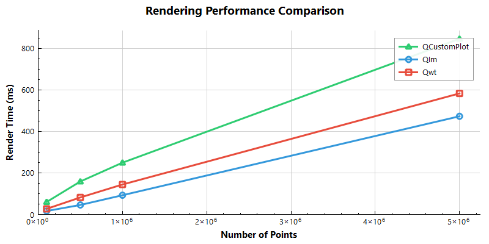
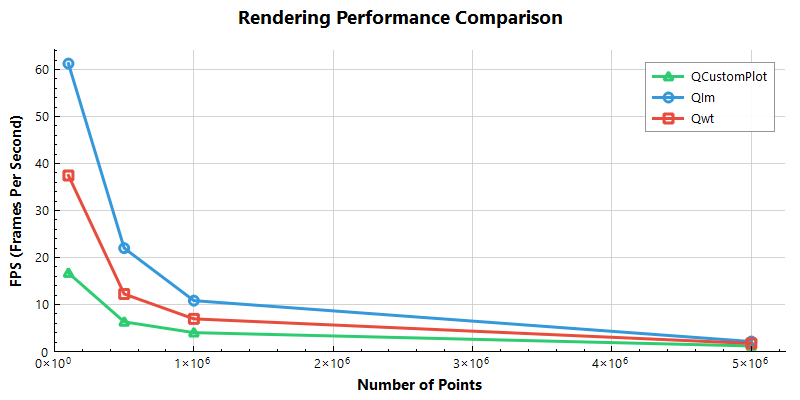
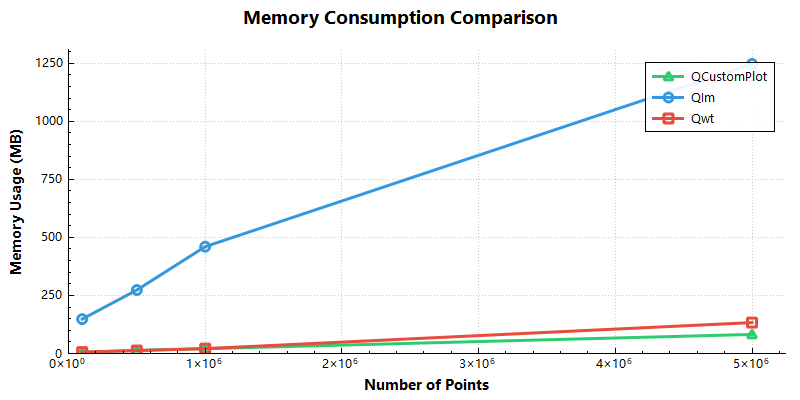
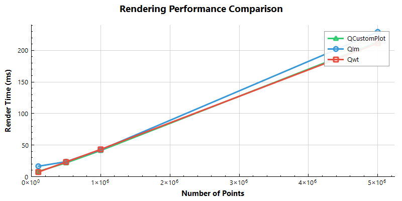
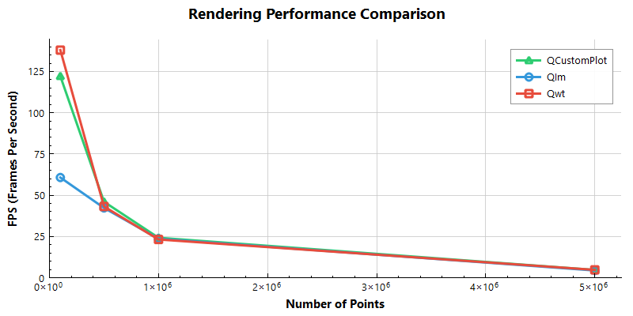
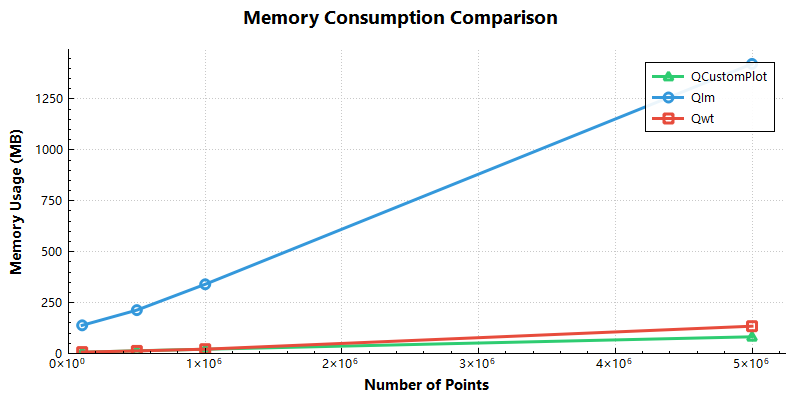
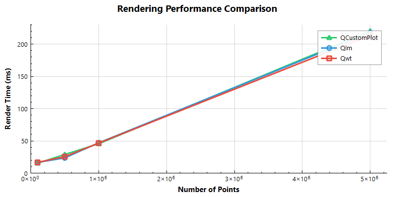
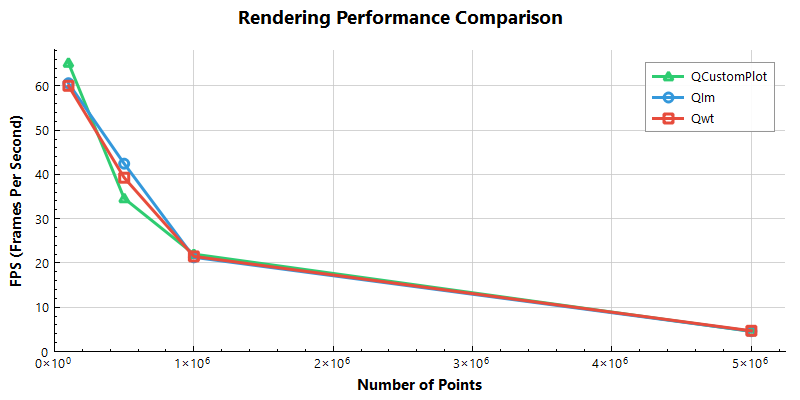
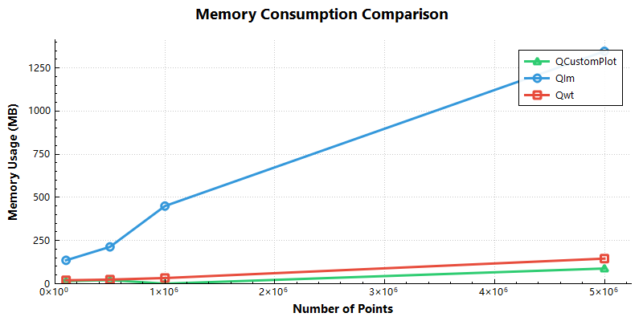

# Qt主流高性能绘图库性能对比测试

Qt 生态里能画图的库不多，主流的为`QCustomPlot`、`Qwt`、`Qt Charts`和`KDChart`，Qt6.8之后把原来的 `Qt Charts`（2D） 与 Qt DataVisualization（3D） 合并为统一的`Qt Graphs`模块（注意不是Qt Graphics），底层全部基于 Qt Quick Scene Graph（QSG）+ Qt Quick 3D，彻底放弃了老旧的 Graphics-View/QPainter 管线，不过Qt Graphs 须通过 QQuickWidget 或 QQuickWindow 嵌入，必须带 QML runtime，C++支持不足，[论坛吐槽不少](https://forum.qt.io/topic/159224/qt-graphs-building-2d-plot-using-c-only),虽然Qt Graphs 是 Qt 官方“大一统”的未来，但这个未来可能3年内不会到来，且不支持win7等老系统，对嵌入式也不友好，因此，`QCustomPlot`、`Qwt`、`Qt Charts`和`KDChart`还会是最近几年绘图控件的选项。

Qt中商业友好的高性能绘图选择，还有`ImPlot`+`qtimgui`的组合，它是基于`ImGui`实现的`OpengGL`绘图库，为了更好的在Qt环境下使用，我把它们封装成为一个更偏向Qt环境的库，名为QIm([QIm-GitHub地址](https://github.com/czyt1988/QIm),[QIm-Gitee地址](https://gitee.com/czyt1988/qim)),`QIm`是一个将 `Dear ImGui`、`ImPlot`、`ImPlot3D` 等`ImGui`生态集成到Qt框架中的开源库，让Qt开发者能够使用熟悉的Qt编程范式，它支持2D和3D绘图，在实现`QIm`库过程中，对比了基于`ImPlot`、`Qwt`、`QCustomplot`这三个库的大规模渲染能力

!!! info "信息"
    对比的源码位于`benchmark/performance`

## 测试方法

### 1. 测试核心原则

测试围绕**公平性、可重复性、真实性**三大核心原则设计，确保不同绘图库的性能对比结果具备参考价值：
- **公平性**：所有测试库使用完全相同的测试数据集、渲染尺寸、测试流程和性能指标维度；
- **可重复性**：固定随机数种子生成测试数据，统一预热次数、测试帧数等配置，消除环境“抖动”；
- **真实性**：模拟真实业务场景的动态数据更新，同时测量内存、渲染耗时等核心性能指标，而非仅测理论性能。

### 2. 测试环境与配置

- 渲染画布尺寸：固定为 800×600 像素（所有库一致）；
- 预热帧数：默认10帧（消除“冷启动”效应，如首次渲染的资源加载、Shader编译等）；
- 测试帧数：默认100帧（取平均值降低单次渲染波动影响）；
- 数据点配置：默认测试点数为 10000/50000/100000/500000/1000000 五个梯度，可配置不同点数组合；
- 可选特性开关：支持控制是否启用OpenGL加速、是否启用数据降采样（Downsampling）。

### 3. 测试数据生成规则

为保证不同库测试数据完全一致，测试前预先生成统一的时序数据：
- 数据总量：基于配置的最大测试点数，生成1.3倍的冗余数据（例如最大测试点数为100万时，生成130万数据点）；
- 数据特征：由正弦曲线叠加多层高频噪声构成（模拟真实传感器/时序数据），公式为：
  ```
  y = sin(x) + 0.2*sin(10x) + 0.05*sin(50x) + 随机噪声(-0.1~0.1)
  ```
- 随机数种子：固定为12345，确保每次测试生成的数据完全一致。

### 4. 测试流程（单库单点数）

#### 步骤1：初始化与基准测量

- 创建对应库的绘图控件实例（如QImFigureWidget/QwtPlot/QCustomPlot/QChartView）；
- 显示控件（确保窗口系统完成初始化，避免离线渲染导致的性能偏差）；
- 初始化内存监控器，记录测试开始前的基准内存（消除控件创建前的内存干扰）。

#### 步骤2：首次数据加载耗时测量

- 向绘图控件加载第一批测试点数的数据；
- 记录“首次数据设置+初始化渲染”的耗时（setupTime）。

#### 步骤3：预热阶段

- 模拟动态数据更新：从预生成的1.3倍数据池中，按固定步长平移截取测试点数的数据段；
- 每次更新后执行：数据替换 → 坐标轴自适应缩放 → 强制渲染 → 事件循环处理；
- 实时更新峰值内存（捕获预热阶段的内存波动）；
- 共执行10次预热渲染，不记录性能数据（仅消除冷启动影响）。

#### 步骤4：正式性能测试

- 重复“数据平移更新 → 渲染 → 事件处理”流程，共执行100次；
- 记录100次渲染的总耗时，计算单帧平均渲染耗时（renderTime = 总耗时/100）；
- 推导帧率（fps = 1000 / renderTime）；
- 实时更新峰值内存，最终计算测试期间的内存增量（峰值内存 - 基准内存）。

#### 步骤5：资源清理与结果输出

- 销毁绘图控件实例（避免内存泄漏影响后续测试）；
- 记录该点数下的核心指标：渲染耗时(renderTime)、fps、内存使用(memoryUsage)。

### 5. 批量测试逻辑

- 遍历所有测试点数（1万/5万/10万/50万/100万,或用户自定义点数组合）；
- 对每个点数，依次测试QIm、Qwt（可选）、QCustomPlot（可选）、Qt Charts（可选）的测试；
- 每个库的测试独立执行（控件创建→测试→销毁），避免跨库资源干扰；
- 实时输出测试进度（当前完成测试数/总测试数），最终汇总所有测试结果。

## 测试结果

**注**：测试设备

CPU：i7-1260P 12核心 / 16线程
GPU：Intel® Iris® Xe Graphics 集成显卡（非独立显卡）128 MB (专用)

### 测试1：降采样关闭 + OpenGL关闭

100K（10万） 数据点测试结果

|Library|Render Time (ms)|FPS|Memory (MB)|OpenGL|Downsampling|
|:------:|:------:|:------:|:------:|:------:|:------:|
|QIm|16.33|61.237|148.07|✓ Yes|× No|
|Qwt|26.71|37.4392|6.02734|× No|× No|
|QCustomPlot|59.89|16.6973|5.39063|× No|× No|

500K（50万） 数据点测试结果

|Library|Render Time (ms)|FPS|Memory (MB)|OpenGL|Downsampling|
|:------:|:------:|:------:|:------:|:------:|:------:|
|QIm|45.49|21.9829|273.25|✓ Yes|× No|
|Qwt|81.76|12.2309|12.7266|× No|× No|
|QCustomPlot|158.65|6.30318|13.2891|× No|× No|

1M（100万） 数据点测试结果

|Library|Render Time (ms)|FPS|Memory (MB)|OpenGL|Downsampling|
|:------:|:------:|:------:|:------:|:------:|:------:|
|QIm|92.45|10.8167|459.98|✓ Yes|× No|
|Qwt|144.1|6.93963|20.9414|× No|× No|
|QCustomPlot|249.3|4.01123|20.8008|× No|× No|

5M（500万） 数据点测试结果

|Library|Render Time (ms)|FPS|Memory (MB)|OpenGL|Downsampling|
|:------:|:------:|:------:|:------:|:------:|:------:|
|QIm|472.9|2.11461|1246.91|✓ Yes|× No|
|Qwt|583.1|1.71497|133.074|× No|× No|
|QCustomPlot|846.34|1.18156|82.0234|× No|× No|

渲染耗时对比如下图所示



折算FPS对比如下图所示



内存占用对比如下图所示：



### 测试2：降采样开启 + OpenGL关闭

100K（10万） 数据点测试结果

|Library|Render Time (ms)|FPS|Memory (MB)|OpenGL|Downsampling|
|:------:|:------:|:------:|:------:|:------:|:------:|
|QIm|16.47|60.7165|138.305|✓ Yes|✓ Yes|
|Qwt|7.25|137.931|6.94141|× No|✓ Yes|
|QCustomPlot|8.19|122.1|5.99609|× No|✓ Yes|

500K（50万） 数据点测试结果

|Library|Render Time (ms)|FPS|Memory (MB)|OpenGL|Downsampling|
|:------:|:------:|:------:|:------:|:------:|:------:|
|QIm|23.65|42.2833|212.996|✓ Yes|✓ Yes|
|Qwt|23.17|43.1593|12.6406|× No|✓ Yes|
|QCustomPlot|21.73|46.0193|13.3477|× No|✓ Yes|

1M（100万） 数据点测试结果

|Library|Render Time (ms)|FPS|Memory (MB)|OpenGL|Downsampling|
|:------:|:------:|:------:|:------:|:------:|:------:|
|QIm|42.39|23.5905|339.844|✓ Yes|✓ Yes|
|Qwt|43.17|23.1642|21.2031|× No|✓ Yes|
|QCustomPlot|41.33|24.1955|20.8359|× No|✓ Yes|

5M（500万） 数据点测试结果

|Library|Render Time (ms)|FPS|Memory (MB)|OpenGL|Downsampling|
|:------:|:------:|:------:|:------:|:------:|:------:|
|QIm|229.3|4.3611|1422.03|✓ Yes|✓ Yes|
|Qwt|211.26|4.7335|134.023|× No|✓ Yes|
|QCustomPlot|213.28|4.68867|81.9883|× No|✓ Yes|

渲染耗时对比如下图所示



折算FPS对比如下图所示



内存占用对比如下图所示：



### 测试3：降采样开启 + OpenGL开启

100K（10万） 数据点测试结果

|Library|Render Time (ms)|FPS|Memory (MB)|OpenGL|Downsampling|
|:------:|:------:|:------:|:------:|:------:|:------:|
|QIm|16.5|60.6061|135.336|✓ Yes|✓ Yes|
|Qwt|16.66|60.024|19.7422|✓ Yes|✓ Yes|
|QCustomPlot|15.34|65.189|14.8555|✓ Yes|✓ Yes|

500K（50万） 数据点测试结果

|Library|Render Time (ms)|FPS|Memory (MB)|OpenGL|Downsampling|
|:------:|:------:|:------:|:------:|:------:|:------:|
|QIm|23.57|42.4268|213.297|✓ Yes|✓ Yes|
|Qwt|25.47|39.2619|23.7852|✓ Yes|✓ Yes|
|QCustomPlot|28.91|34.5901|20.6641|✓ Yes|✓ Yes|


1M（100万） 数据点测试结果

|Library|Render Time (ms)|FPS|Memory (MB)|OpenGL|Downsampling|
|:------:|:------:|:------:|:------:|:------:|:------:|
|QIm|46.99|21.2811|449.746|✓ Yes|✓ Yes|
|Qwt|46.55|21.4823|32.6602|✓ Yes|✓ Yes|
|QCustomPlot|45.46|21.9974|0|✓ Yes|✓ Yes|


5M（500万） 数据点测试结果

|Library|Render Time (ms)|FPS|Memory (MB)|OpenGL|Downsampling|
|:------:|:------:|:------:|:------:|:------:|:------:|
|QIm|217.95|4.58821|1346.09|✓ Yes|✓ Yes|
|Qwt|213.77|4.67792|145.316|✓ Yes|✓ Yes|
|QCustomPlot|220.5|4.53515|87.8828|✓ Yes|✓ Yes|

渲染耗时对比如下图所示



折算FPS对比如下图所示



内存占用对比如下图所示：



## 结论

| 场景 | 性能排序 | 关键特征 |
|------|----------|----------|
| **无降采样 + 无OpenGL** | **QIm ≫ Qwt > QCustomPlot** | QIm 凭借 OpenGL 渲染管线优势，在百万级数据下性能领先 1.5~2 倍 |
| **开启降采样（LTTB）** | **三者性能趋同** | 降采样成为性能瓶颈，库间差异缩小至 10% 以内 |
| **内存占用** | **Qwt ≈ QCustomPlot ≪ QIm** | QIm 内存开销约为其他库的 5~15 倍（架构特性决定） |

### 1. 降采样是大数据量渲染的决定性因素

- **10万点以下**：原生渲染性能差异显著（QIm 优势明显）
- **50万点以上**：开启降采样后，三者渲染耗时差距缩小至 5% 以内
- **结论**：>10万点场景**必须启用降采样**，此时选择库应优先考虑功能与易用性，而非纯渲染性能

### 2. OpenGL 加速的实际收益有限

对于Qwt,QCustomPlot等库
- 在**已开启降采样**的前提下，启用 OpenGL 对 FPS 提升 <5%
- 仅在**无降采样 + 超大数据量**场景下，OpenGL 能带来 30%+ 性能增益（但此时帧率仍低于 10 FPS，实用性低）
- **建议**：优先启用降采样，OpenGL 作为辅助优化手段

### 3. 内存占用呈现明显差异

| 库 | 100万点内存 | 500万点内存 | 特点 |
|----|-------------|-------------|------|
| QIm | ~460 MB | ~1.4 GB | ImGui 架构需维护双缓冲+GPU资源，内存开销大 |
| Qwt | ~21 MB | ~134 MB | 内存效率高 |
| QCustomPlot | ~21 MB | ~82 MB | 内存控制优秀，500万点时反超Qwt |

**注：**测试中的内存检测是检测整个测试过程的峰值内存差值，可能会存在偏差

上述测试在我的集成显卡电脑上测试，ImPlot的性能无法完全发挥，也是验证在低配GPU设备的性能