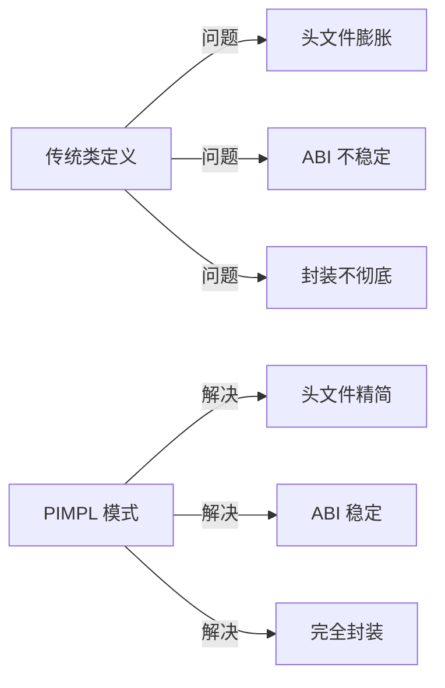
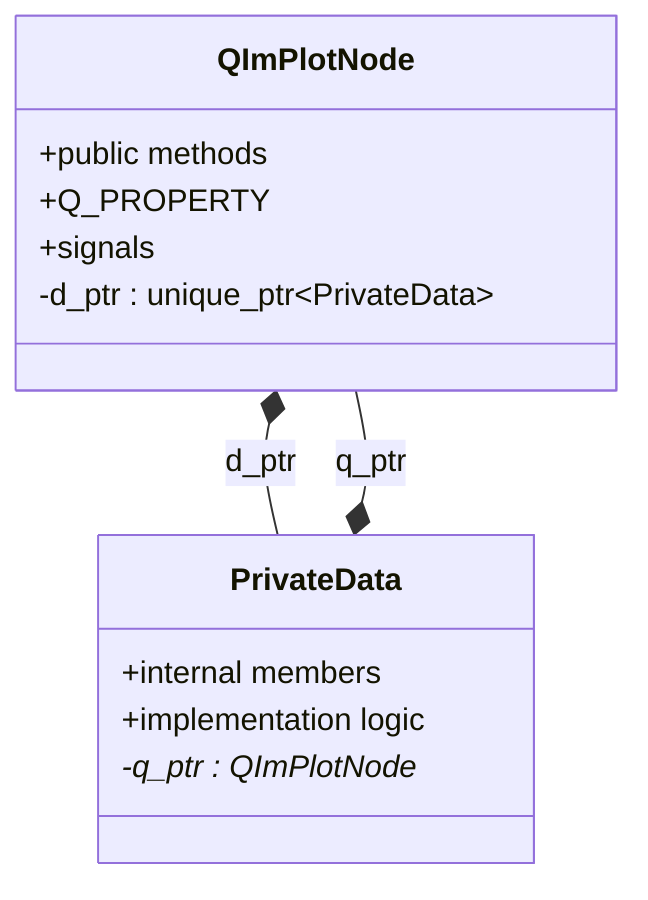

# PIMPL 模式

QIm 采用**PIMPL（Pointer to Implementation）**模式封装类的内部实现细节，
这是 Qt 框架中广泛使用的设计模式，让公共接口与私有实现分离。

## 为什么需要 PIMPL

传统 C++ 类定义存在几个问题：

1. **头文件膨胀**：私有成员暴露在头文件中，增加编译依赖
2. **ABI 不稳定**：私有成员变更导致二进制兼容性破坏
3. **封装不彻底**：用户可以看到但不应该访问的成员

PIMPL 模式解决了这些问题：



## 核心原理

### 设计思想

PIMPL 模式将类分为两部分：
- **公共类**：头文件中声明，提供用户接口
- **私有实现类**：cpp 文件中定义，封装实现细节



### QIm 的 PIMPL 宏

QIm 提供便捷宏简化 PIMPL 模式实现（定义于 `QImAPI.h`）：

| 宏 | 用途 | 说明 |
|-----|------|------|
| `QIM_DECLARE_PRIVATE(Class)` | 头文件声明 | 声明 PrivateData 内部类和 d_ptr 成员 |
| `QIM_DECLARE_PUBLIC(Class)` | cpp 文件声明 | 在 PrivateData 中声明 q_ptr 成员 |
| `QIM_PIMPL_CONSTRUCT` | 构造函数使用 | 初始化 d_ptr |
| `QIM_D(name)` | 方法中使用 | 获取 PrivateData 指针 |
| `QIM_DC(name)` | const 方法中使用 | 获取 const PrivateData 指针 |

### 使用示例

头文件声明：

```cpp
class QImPlotNode : public QImAbstractNode
{
    Q_OBJECT
    QIM_DECLARE_PRIVATE(QImPlotNode)  // 声明 PIMPL 结构
    
    Q_PROPERTY(QString title READ title WRITE setTitle NOTIFY titleChanged)
public:
    QString title() const;
    void setTitle(const QString& title);
    // ...
};
```

cpp 文件实现：

```cpp
// 私有实现类定义
class QImPlotNode::PrivateData
{
    QIM_DECLARE_PUBLIC(QImPlotNode)  // 声明 q_ptr
    
public:
    PrivateData(QImPlotNode* p) : q_ptr(p) {}
    
    QString m_title;  // 私有成员
    QSizeF m_size;
    // 其他实现细节...
};

// 构造函数
QImPlotNode::QImPlotNode(QObject* parent) 
    : QImAbstractNode(parent)
    , QIM_PIMPL_CONSTRUCT  // 初始化 d_ptr
{
}

// 方法实现中使用 QIM_D 访问私有成员
QString QImPlotNode::title() const
{
    QIM_DC(d);  // 获取 const PrivateData 指针
    return d->m_title;
}

void QImPlotNode::setTitle(const QString& title)
{
    QIM_D(d);  // 获取 PrivateData 指针
    if (d->m_title != title) {
        d->m_title = title;
        emit titleChanged(title);
    }
}
```

## 如何应用

### 在自定义节点中使用 PIMPL

继承 QImAbstractNode 创建自定义节点时，建议使用 PIMPL 模式：

```cpp
// CustomNode.h
class CustomNode : public QImAbstractNode
{
    Q_OBJECT
    QIM_DECLARE_PRIVATE(CustomNode)
    
public:
    explicit CustomNode(QObject* parent = nullptr);
    
    void setCustomProperty(int value);
    int customProperty() const;
    
protected:
    bool beginDraw() override;
    void endDraw() override;
};

// CustomNode.cpp
class CustomNode::PrivateData
{
    QIM_DECLARE_PUBLIC(CustomNode)
public:
    PrivateData(CustomNode* p) : q_ptr(p) {}
    
    int m_customValue = 0;
    ImGuiWindowFlags m_flags = 0;
};

CustomNode::CustomNode(QObject* parent)
    : QImAbstractNode(parent)
    , QIM_PIMPL_CONSTRUCT
{
}

bool CustomNode::beginDraw()
{
    QIM_D(d);
    return ImGui::Begin("CustomWindow", nullptr, d->m_flags);
}

void CustomNode::endDraw()
{
    ImGui::End();
}
```

!!! tip "最佳实践"
    - 所有存储状态的成员变量放入 PrivateData 类
    - 公共方法通过 QIM_D/QIM_DC 访问私有成员
    - 信号发射在公共方法中处理，PrivateData 不应直接 emit

## 参考

- 相关文档：[渲染节点](render-node.md)
- API 参考：`QImAPI.h` 中的宏定义
