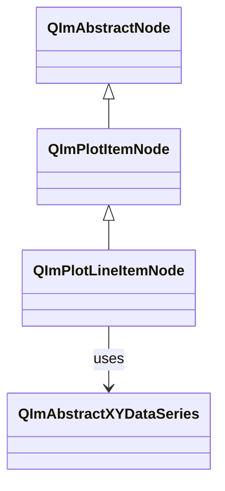
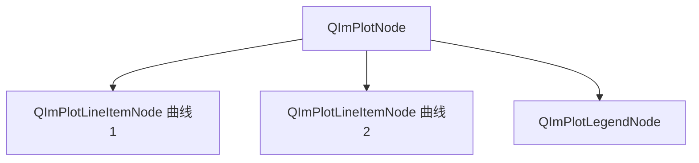

# 线条图使用指南

`QImPlotLineItemNode`是QIm中最常用的绘图组件，用于绘制折线图和曲线图。

## 主要功能特性

**特性**

- ✅ **高效渲染**：支持大数据量（百万级点）的高效渲染
- ✅ **自适应采样**：内置LTTB降采样算法，自动优化渲染性能
- ✅ **样式配置**：支持颜色、线宽、填充等样式设置
- ✅ **Qt属性集成**：通过Q_PROPERTY暴露所有可配置属性

## 基本概念

### 类继承关系



### 组件定位

线条节点是`QImPlotNode`的子节点，通过`addLine()`方法创建：



## 使用方法

### 1. 基本使用

通过`QImPlotNode::addLine()`快速创建线条：

```cpp
// 创建绘图节点
QIM::QImPlotNode* plot = figure->createPlotNode();
plot->setTitle("示例图表");

// 方式1：直接传入数据数组
QVector<double> x = {0, 1, 2, 3, 4};
QVector<double> y = {0, 1, 4, 9, 16};
plot->addLine(x, y, "二次曲线");

// 方式2：使用std::vector
std::vector<double> x2 = {0, 1, 2, 3, 4};
std::vector<double> y2 = {0, 2, 4, 6, 8};
plot->addLine(x2, y2, "线性曲线");
```

### 2. 手动创建节点

更灵活的控制方式：

```cpp
// 手动创建线条节点
QIM::QImPlotLineItemNode* line = new QIM::QImPlotLineItemNode(plot);
line->setLabel("自定义曲线");
line->setData(x, y);
line->setColor(QColor(255, 0, 0));  // 红色

// 添加到绘图
plot->addPlotItem(line);
```

### 3. 设置样式

```cpp
// 设置颜色
line->setColor(QColor(0, 100, 200));

// 启用阴影填充
line->setShaded(true);

// 启用循环模式（首尾相连）
line->setLoop(true);

// 跳过NaN值
line->setSkipNaN(true);
```

## 属性列表

| 属性 | 类型 | Getter | Setter | 说明 |
|------|------|--------|--------|------|
| label | QString | `label()` | `setLabel()` | 图例标签 |
| segments | bool | `isSegments()` | `setSegments()` | 分段绘制 |
| loop | bool | `isLoop()` | `setLoop()` | 循环模式 |
| skipNaN | bool | `isSkipNaN()` | `setSkipNaN()` | 跳过NaN |
| shaded | bool | `isShaded()` | `setShaded()` | 阴影填充 |
| adaptiveSampling | bool | `isAdaptiveSampling()` | `setAdaptivesSampling()` | 自适应采样 |
| color | QColor | `color()` | `setColor()` | 线条颜色 |

!!! tip "自适应采样"
    默认启用LTTB自适应采样，大数据量时自动降采样保持流畅渲染。
    对于小数据量（<10万点），可关闭以获得精确渲染：`line->setAdaptivesSampling(false)`

## 参考

- 相关文档：[数据系列](data-series.md)、[降采样器](downsampling.md)
- API参考：`src/core/plot/QImPlotLineItemNode.h`